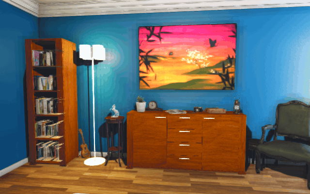
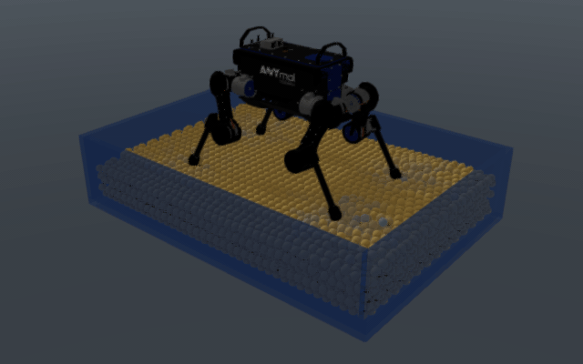
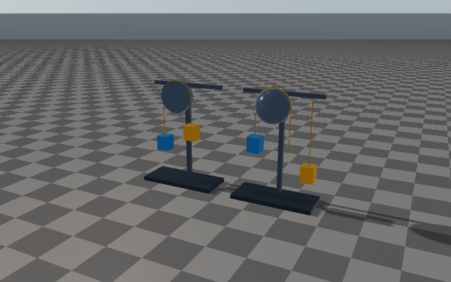
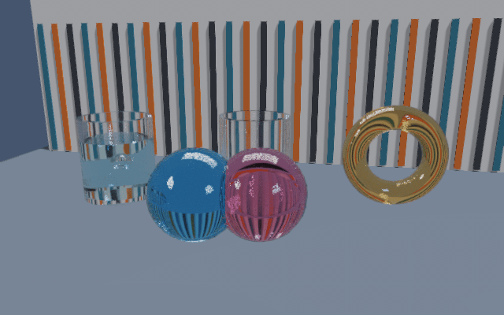
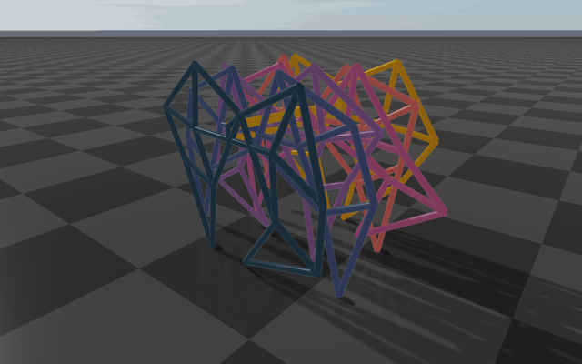
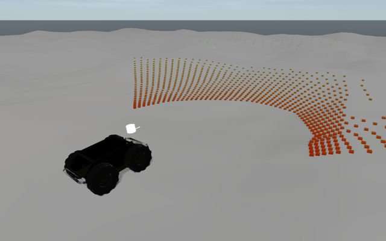

# RaiSim2

<p align="center">
  
  
  <br />
  
  
  <br />
  
  
  <br />
  
  
  <br />
  
  
</p>

For full documentation, see the [RaiSim documentation](https://raisim.com).

RaiSim is a physics engine for robotics and artificial intelligence research. The public distribution is provided as binary packages with headers, libraries, examples, rayrai viewer sources, and documentation.

Source assets live under [`rsc`](rsc), including example models, viewer icons, and documentation images in [`rsc/docs/image`](rsc/docs/image).

## Install

Download the binary package for your platform and unpack it to an install location such as `$HOME/raisim2Lib` on Linux/macOS or `C:\raisim` on Windows. Current macOS packages use `macos-arm64-<version>.zip` for Apple Silicon and `macos-x86_64-<version>.zip` for Intel. Keep the package directories together; examples and source-built rayrai tools expect the bundled assets to remain with the package.

Set up the runtime environment before running examples or applications. From the unpacked package root:

```bash
cd $HOME/raisim2Lib
source ./raisim_env.sh
export RAISIM_LOCAL_INSTALL_ROOT=$PWD
```

`raisim_env.sh` must be sourced, not executed. It sets `RAISIM_DIR` and `RAISIM_OS`, then prepends `raisim/lib` and `rayrai/lib` to `LD_LIBRARY_PATH` on Linux or `DYLD_LIBRARY_PATH` on macOS.

On Windows, run one of the provided environment scripts from the package root:

```powershell
.\raisim_env.ps1
```

or:

```bat
raisim_env.bat
```

The Windows scripts prepend the installed RaiSim and rayrai `bin` and `lib` directories to `Path`.

## Build Examples With CMake

`RAISIM_EXAMPLE` is enabled by default, but the flag is shown explicitly in the commands below. CMake downloads `RAISIM_VERSION` when the package in this checkout is missing or has a different version.

### Linux build instructions

From the repository root, source the environment script, configure, and build the C++ examples:

```bash
cd $HOME/raisim2Lib
source ./raisim_env.sh
export RAISIM_LOCAL_INSTALL_ROOT=$PWD
cmake -S . -B build-examples -DCMAKE_BUILD_TYPE=Release -DRAISIM_EXAMPLE=ON
cmake --build build-examples --parallel 10
```

The source-built example executables are written to `build-examples/examples`:

```bash
./build-examples/examples/rayrai_tcp_viewer
./build-examples/examples/primitive_grid
```

Install headers, libraries, and CMake package files to a local prefix with:

```bash
cmake --install build-examples --prefix "$HOME/.local"
```

The install target does not install source-built example executables; run those from the build tree. Downstream projects using this CMake-installed layout should pass `-DCMAKE_PREFIX_PATH=$HOME/.local`.

### macOS build instructions

From the repository root, source the environment script, configure, and build the C++ examples:

```bash
cd $HOME/raisim2Lib
source ./raisim_env.sh
export RAISIM_LOCAL_INSTALL_ROOT=$PWD
cmake -S . -B build-examples -DCMAKE_BUILD_TYPE=Release -DRAISIM_EXAMPLE=ON
cmake --build build-examples --parallel 10
```

The source-built example executables are written to `build-examples/examples`:

```bash
./build-examples/examples/rayrai_tcp_viewer
./build-examples/examples/primitive_grid
```

If `raisim/` or `rayrai/` is missing from the checkout, CMake downloads the matching macOS release asset automatically. You can also update an unpacked tree explicitly:

```bash
./raisim_upgrade.sh -y
```

Apple Silicon hosts select the `macos-arm64` package, even when CMake or the shell is running under Rosetta, and compile with the Apple M-series tuning flags used by the examples. Intel Macs select `macos-x86_64` when that release asset is available.

Install headers, libraries, and CMake package files to a local prefix with:

```bash
cmake --install build-examples --prefix "$HOME/.local"
```

The install target does not install source-built example executables; run those from the build tree. Downstream projects using this CMake-installed layout should pass `-DCMAKE_PREFIX_PATH=$HOME/.local`.

### Windows build instructions

From the repository root, run one of the Windows environment scripts, configure, and build the C++ examples:

```powershell
cd C:\raisim2Lib
.\raisim_env.ps1
cmake -S . -B build-examples -DRAISIM_EXAMPLE=ON
cmake --build build-examples --config Release --parallel
```

Visual Studio and MSBuild are multi-config generators, so `CMAKE_BUILD_TYPE=Release` does not select the build configuration on Windows. Use exactly `--config Release` for the release runtime DLLs. If `rayrai_tcp_viewer.exe` reports a missing `SDL2d.dll`, the executable in `build-examples\bin` was built from a debug-flavored configuration and should be rebuilt with the command above.

The source-built example executables are written to `build-examples\bin`:

```powershell
.\build-examples\bin\rayrai_tcp_viewer.exe
.\build-examples\bin\primitive_grid.exe
```

Install headers, libraries, and CMake package files to a local prefix with:

```powershell
cmake --install build-examples --config Release --prefix C:\raisim-local
```

The install target does not install source-built example executables; run those from the build tree. Downstream projects using this CMake-installed layout should pass `-DCMAKE_PREFIX_PATH=C:\raisim-local`.

## Activation

Please go to [raisim.com](https://raisim.com) to get your raisim license.
Rename the activation key received by email to `activation.raisim` and place it in the default location:

```text
Linux/macOS: $HOME/.raisim/activation.raisim
Windows:     C:\Users\<YOUR-USERNAME>\.raisim\activation.raisim
```

You can also set the activation key explicitly in your application with `raisim::World::setActivationKey()`.

## Run Examples

Server-based examples publish a `raisim::World` through `RaisimServer`. Build the examples as shown above, then start the source-built rayrai TCP viewer before running an example:

```bash
./build-examples/examples/rayrai_tcp_viewer
./build-examples/examples/primitive_grid
```

In-process rayrai examples open their own renderer window and do not need the TCP viewer:

```bash
$RAISIM_LOCAL_INSTALL_ROOT/bin/example_rayrai_pbr_asset_inspector
$RAISIM_LOCAL_INSTALL_ROOT/bin/example_polyhaven_blue_wall --fast-load
```

## Use RaiSim From C++

RaiSim is installed as a CMake package. Point `CMAKE_PREFIX_PATH` at the installed package prefix from your downstream project:

```bash
cmake -S . -B build -DCMAKE_PREFIX_PATH=$RAISIM_LOCAL_INSTALL_ROOT/raisim
```

Minimal downstream `CMakeLists.txt`:

```cmake
cmake_minimum_required(VERSION 3.16)
project(my_raisim_app LANGUAGES CXX)

find_package(raisim CONFIG REQUIRED)
find_package(Eigen3 REQUIRED)

add_executable(app main.cpp)
target_link_libraries(app PRIVATE raisim::raisim)
if (UNIX)
  target_link_libraries(app PRIVATE pthread)
endif()
```

## Visualization

Use the source-built `rayrai_tcp_viewer` for applications that publish through `raisim::RaisimServer`. Use in-process rayrai APIs when your application needs its own renderer window, offscreen rendering, RGB/depth sensors, or screenshots.

### Rayrai TCP viewer


`rayrai_tcp_viewer` is the recommended visualizer for `RaisimServer` simulations. It is built from the viewer sources in this repository and connects to a running server over TCP. The viewer renders the world with the full rayrai PBR pipeline (procedural sky, IBL, directional shadows, reflective ground, weather, tone mapping). The overlay surfaces:

* **Pause / Step / Step 10** — interactive simulation control over the wire (`PROTOCOL_FEATURE_SIM_CONTROL`); pause and step a remote server from the viewer without changing simulation code.
* **Force / pose / generalized-coordinate authoring** — drag-poke objects, retarget single-body poses, or override an articulated system's joint angles directly from the inspector.
* **Render tab** — switch render-quality presets, tone mapping, weather, bloom, SSAO, and DoF at runtime.
* **Drag-drop joint inspector** — drop a URDF or MJCF file on the disconnected viewer to inspect joints, limits, and mesh resolution kinematically.
* **Headless screenshots and session record/replay** — `--screenshot`, `--record-session`, and `--replay-session` for CI, doc image generation, and offline replays.

See the documentation page on the rayrai TCP viewer for the full panel walkthrough, the wire format, and a minimal custom-client example.

## Documentation

Open the installed documentation from the package, or visit the hosted RaiSim documentation for installation, activation, API, examples, and visualization workflows.
