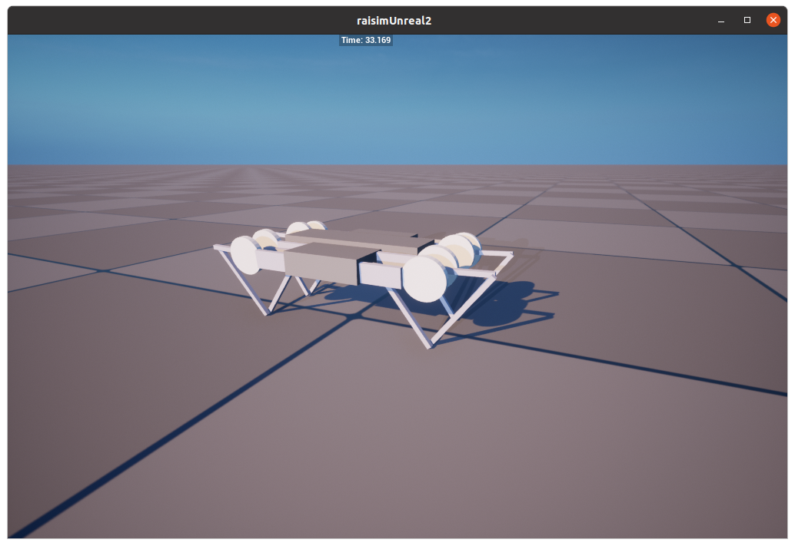
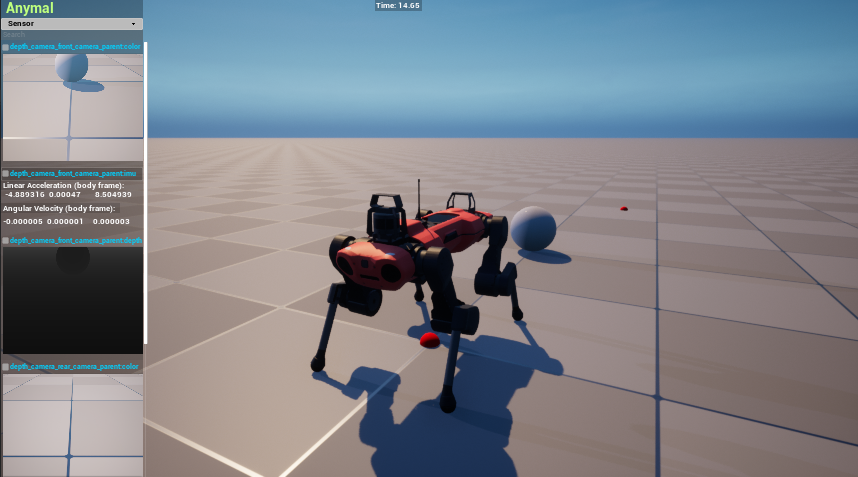
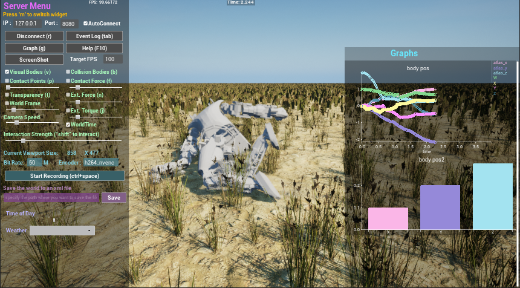
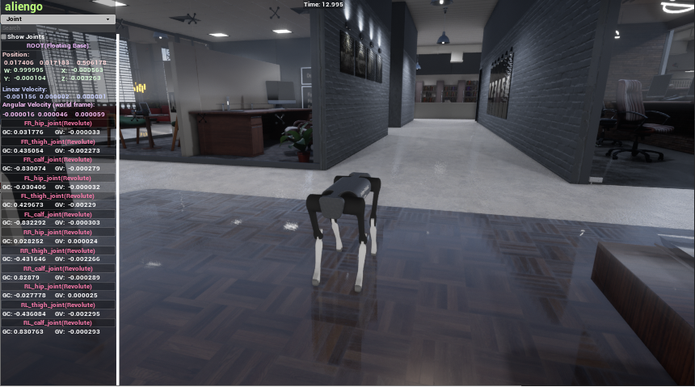
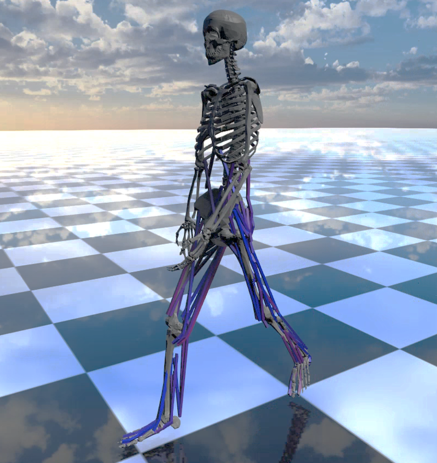

#############################
RaiSim v2.0.0
#############################

RaiSim is a cross-platform multi-body physics engine for robotics and AI.
It fully supports **Linux**, **macOS**, and **Windows**.
RaiSim is closed-source and distributed under a few different types of license. See the License section for details.

Examples
========

**RaiSim example** (closed-loop) `minitaur_pd.cpp <https://github.com/raisimTech/raisim2Lib/blob/master/examples/src/server/minitaur_pd.cpp>`_

**RaiSim example** `sensor_suite.cpp <https://github.com/raisimTech/raisim2Lib/blob/master/examples/src/server/sensor_suite.cpp>`_

**RaiSim example** `map_atlas_charts.cpp <https://github.com/raisimTech/raisim2Lib/blob/master/examples/src/maps/map_atlas_charts.cpp>`_

**RaiSim example** `map_office1_scene.cpp <https://github.com/raisimTech/raisim2Lib/blob/master/examples/src/maps/map_office1_scene.cpp>`_

.. image:: image/demo_robots.gif
  :alt: RaiSimPy demo (robots.py)
  :width: 600

**RaisimPy example** `robot.py <https://github.com/raisimTech/raisim2Lib/blob/master/raisimPy/examples/robots.py>`_

**Biomechanical simulation**, created by Young-Jun Koo, PhD and Seungbum Koo, PhD at Musculoskeletal BioDynamics Lab, KAIST.

The geometric model is created using the Full-body musculoskeletal model in Rajagopal et al. (2016).

The KAIST team provided this image, but the model is not included in this repository.

.. image:: image/huskyScan.gif
  :alt: husky
  :width: 600

**RaiSim example** `ray_scan_lidar.cpp <https://github.com/raisimTech/raisim2Lib/blob/master/examples/src/server/ray_scan_lidar.cpp>`_

.. image:: image/anymals.png
  :alt: anymals
  :width: 600

**RaiSim example** `map_anymal_graphs.cpp <https://github.com/raisimTech/raisim2Lib/blob/master/examples/src/maps/map_anymal_graphs.cpp>`_

.. image:: image/trackedRobot.gif
  :alt: trackedRobot
  :width: 600

**RaiSim example** `templated_tracked_robot.cpp <https://github.com/raisimTech/raisim2Lib/blob/master/examples/src/server/templated_tracked_robot.cpp>`_

.. toctree::
   :maxdepth: 1
   :caption: Get started

   sections/License
   sections/Acknowledgement
   sections/Support
   sections/Performance

.. toctree::
   :maxdepth: 1
   :caption: RaiSim C++

   sections/Introduction
   sections/Installation
   sections/Visualizers
   sections/Examples
   sections/ConventionsAndNotations
   sections/Determinism
   sections/Math
   sections/LoggingSystem
   sections/WorldSystem
   sections/WorldConfigurationFile
   sections/RaisimServer
   sections/Object
   sections/Contact
   sections/CollisionDetection
   sections/MaterialSystem
   sections/HeightMap
   sections/Constraints
   sections/RayTest
   sections/Sensors

.. toctree::
   :maxdepth: 1
   :caption: Related Software

   sections/RaisimGymTorch
   sections/RaiSimPy
   sections/Rayrai
   sections/RaisimUnity
   sections/RaisimUnreal
   sections/RaiSimMatlab
