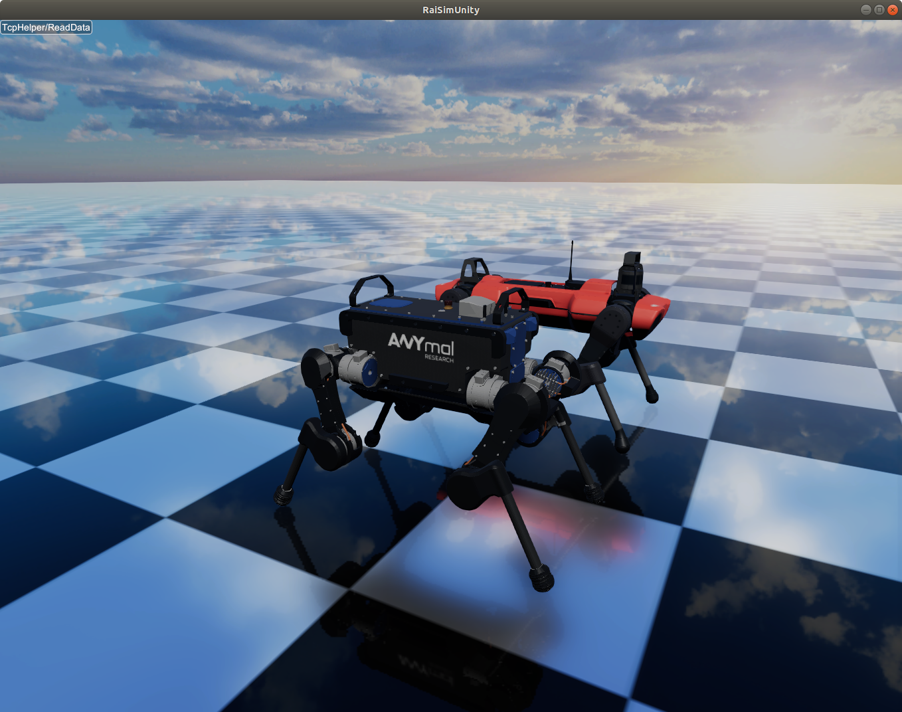
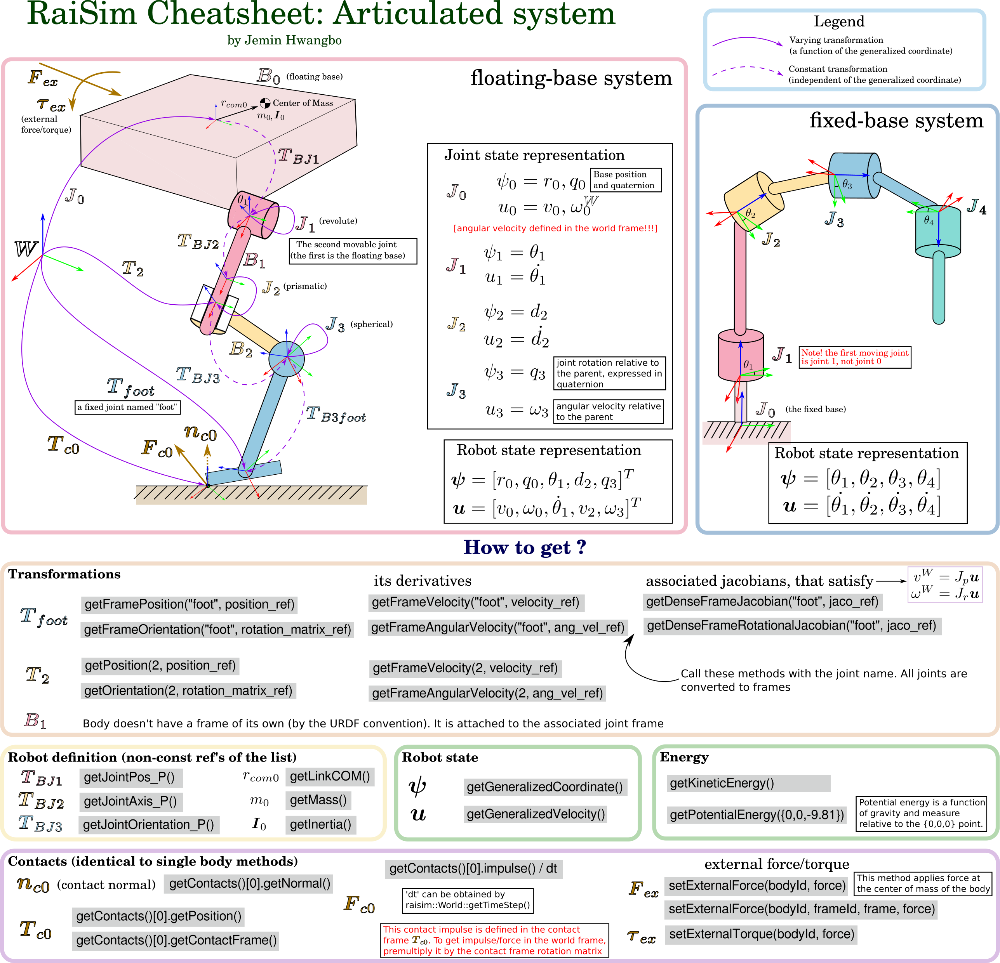

#############################
Articulated Systems
#############################

ANYmal robots (B and C versions) simulated in RaiSim.

TL;DR
=============================

Click the image for vector graphics

  
Introduction
=============================

An articulated system comprises multiple bodies interconnected via joints.
There exist two primary configurations of an articulated system: Kinematic trees and closed-loop systems.
Kinematic trees are characterized by their absence of loops, ensuring that each body has only one parent joint.
Consequently, the number of joints in a kinematic tree equals the number of bodies, with the provision of a floating joint on the root body for floating systems.

A closed-loop system has one or more loops.
A loop means that there are multiple routes from the link to the ROOT.
RaiSim's algorithmic backbone, the Articulated Body Algorithm, cannot solve the dynamics of a closed system.
However, we can simulate a closed-loop system using RaiSim's contact solver.
This section focuses on kinematic trees.
An example of a closed-loop system is mentioned in **Closed-loop system** at the bottom of this page.

In kinematic trees, **since each body has only one joint, the index of a body always matches that of its parent joint**.
Here, a "body" denotes a rigid body composed of one or more "links", each of which is rigidly connected to others within the same body via fixed joints.

Creating an instance
=============================
Like any other object, an articulated system is created by the world instance using the :code:`addArticulatedSystem` method.
There are four ways to specify an articulated system.

1. by providing the path to the URDF file (recommended)
2. by providing the path to the URDF template file (`example <https://github.com/raisimTech/raisim2Lib/blob/master/examples/src/server/templated_tracked_robot.cpp>`_)
3. by providing a :code:`std::string` containing the URDF text (useful when working with Xacro)
4. by providing a :code:`raisim::Child` instance (advanced; not recommended for beginners)

**Note that option 1 and 3 use the same method.**
**You can provide either the path string or the contents string and the class will identify which one is provided.**

To use option 4, you have to provide all details of the robot in C++ code.
Child is a tree node that contains ``fixedBodies`` and ``child``.
It also contains ``joint``, ``body``, and ``name``.
All properties should be filled.
Make sure that all inertial properties are defined so that the resulting system is physically feasible.

URDF modules (optional attachments)
====================================
Articulated systems can be created from a base URDF plus one or more *modules*.
A module is a URDF fragment (e.g., additional links/joints/sensors) that is
inserted into the base URDF before the closing ``</robot>`` tag. This is useful
for optional payloads or sensor packs without duplicating the entire URDF.

Use the constructor that takes a list of module filenames:

.. code-block:: cpp

  std::vector<std::string> modules = {"d455.xml", "livox.xml"};
  auto* robot = world.addArticulatedSystem(urdfPath, modules, resDir);

Module path resolution follows this order (first match wins):

* absolute path to the module file
* ``[baseDir]/<module>``
* ``[baseDir]/modules/<module>``
* ``[baseDir]/../modules/<module>``
* ``[baseDir]/module/<module>``
* ``[baseDir]/../module/<module>``

``baseDir`` is the URDF directory unless you pass ``resDir`` explicitly.
RaiSim writes a generated URDF named
``generated_<urdf_stem>_<module_stem>[_<module_stem>...].urdf`` into ``baseDir``
and loads that file.

URDF loader details
=============================
The URDF loader used by :code:`ArticulatedSystem` has a few behaviors worth noting:

* **Base type:** If the root link is named ``world``, RaiSim treats the system as
  fixed-base; otherwise it is floating-base.
* **Sensors:** ``<link sensor="...">`` loads a sensor set XML and instantiates
  sensors of type ``rgb``, ``depth``, ``imu``, or ``spinning_lidar``. The
  ``update_rate`` attribute in the sensor XML is applied to each sensor. IMU
  sensors enable inverse dynamics internally.
* **Constraints:** A ``<constraints>`` block with ``<pin>`` entries and a
  ``nominal_config`` attribute is parsed and passed to the constraint system.

State Representation
=============================
The state of an articulated system can be represented by a **generalized state** :math:`\boldsymbol{S}`, which is composed of a **generalized coordinate** :math:`\boldsymbol{q}` and a **generalized velocity** :math:`\boldsymbol{u}`.
Since we are not constraining their parameterization, in general, 

.. math::

  \begin{equation}
    \boldsymbol{u}\neq\dot{\boldsymbol{q}}.
  \end{equation}

A generalized coordinate fully represents the configuration of the articulated system and a generalized velocity fully represents the velocity state of the articulated system.
They are independently defined in general.

Every joint has a corresponding generalized coordinate and generalized velocity.
The concatenation of all joint generalized coordinates and velocities forms the generalized coordinates and velocities of the articulated system, respectively.
The order of this concatenation is called **joint order**.
The joint order can be accessed through :code:`getMovableJointNames()`.
Note the keyword "movable".
The fixed joints contribute to neither the generalized coordinate nor the generalized velocity.
Only movable joints do.

The joint order starts with the **root body** which is the first body of the articulated system. 
For floating-base systems, the root body is the floating base.
For fixed-base systems, the root body is the one rigidly attached to the world.
Even though the fixed base cannot move physically, users can move it using :code:`setBaseOrientation` and :code:`setBasePosition`.
So :code:`getMovableJointNames()` method will return the fixed base name and the fixed base joint is a part of the joint order.

To set the state of the system, the following methods can be used

* :code:`setGeneralizedCoordinate`
* :code:`setGeneralizedVelocity`
* :code:`setState`

To obtain the state of the system, the following methods can be used

* :code:`getGeneralizedCoordinate`
* :code:`getGeneralizedVelocity`
* :code:`getState`

The dimensions of each vector can be obtained respectively by

* :code:`getGeneralizedCoordinateDim`
* :code:`getDOF` or :code:`getGeneralizedVelocityDim`. 

These two methods are identical

.. _articulated_systems:

Joints
=============================

Here are the available joints in RaiSim.

.. list-table:: Joint Properties (:math:`|\cdot|` is a symbol for dimension size (i.e., cardinality))
   :widths: 14 14 15 14 14 14
   :header-rows: 1

   * -
     - Fixed
     - Floating
     - Revolute
     - Prismatic
     - Spherical
   * - :math:`|\boldsymbol{u}|`
     - 0
     - 6
     - 1
     - 1
     - 3
   * - :math:`|\boldsymbol{q}|`
     - 0
     - 7
     - 1
     - 1
     - 4
   * - Velocity
     -
     - :math:`m/s`, :math:`rad/s`
     - :math:`rad/s`
     - :math:`m/s`
     - :math:`rad/s`
   * - Position
     -
     - :math:`m`, :math:`rad`
     - :math:`rad`
     - :math:`m`
     - :math:`rad`
   * - Force
     -
     - :math:`N`, :math:`Nm`
     - :math:`Nm`
     - :math:`N`
     - :math:`Nm`

The generalized coordinates/velocities of a joint are expressed in the **joint frame** and with respect to the **parent body**.
Joint frame is the frame attached to every joint and fixed to the parent body.
Parent body is the one closer to the root body among the two bodies connected via the joint.
Note that the angular velocity of a floating base is also expressed in the parent frame (which is the **world frame**).
Other libraries (e.g., RBDL) might have a different convention, so special care is required during conversion.

URDF convention
=============================
RaiSim uses a modified URDF protocol to define an articulated system.
URDF files following the original convention can be read by RaiSim.
However, since RaiSim offers more features, a RaiSim URDF might not be read by other libraries following the original URDF convention.

The modifications are as follows:

* Capsule geometry is available for both collision objects and visual objects (with the keyword "capsule"). The geometry is defined by the "height" and "radius" keywords. The height represents the distance between the centers of the two spheres.

* A <joint>/<dynamics> tag can have three more attributes: *rotor_inertia*, *spring_mount* and *stiffness*.

Here is an example joint with the RaiSim tags:

.. code-block:: xml

    <joint name="link1Tolink2" type="spherical">
        <parent link="link1"/>
        <child link="link2"/>
        <origin xyz="0 0 -0.24"/>
        <axis xyz="0 1 0"/>
        <dynamics rotor_inertia="0.0001" spring_mount="0.70710678118 0 0.70710678118 0" stiffness="500.0" damping="3."/>
    </joint>

**Rotor_inertia** in RaiSim approximately simulates the rotor inertia of the motor (but omits the resulting gyroscopic effect, which is often negligible).

It is added to the diagonal elements of the mass matrix.
It is a common way to include the inertial effect of the rotor.
You can also override it in C++ using :code:`setRotorInertia()`.
Since RaiSim does not know the gear ratio, you have to multiply the rotor inertia by the square of the gear ratio yourself.
In other words, the value is the reflected rotor inertia observed at the joint.

Two preprocessor features (also available in the RaiSim world configuration file) are available for the URDF template.

* You can specify a variable in a form of "@@Robot_Height". The value of this variable can be specified at runtime using ``std::unordered_map`` and the corresponding factory method in ``raisim::World``.

* You can specify an equation instead of a variable. For example, {@@Robot_Height*@@Robot_Width*2}.

The preprocessor example can be found in ``examples/src/server/templated_tracked_robot.cpp`` and the corresponding URDF template in ``rsc/templatedTrackedRobot/trackedTemplate.urdf``.

In RaiSim, each body of an articulated system has a set of collision bodies and visual objects.
Collision bodies contain a collision object of one of the following shapes: *mesh*, *sphere*, *box*, *cylinder*, *capsule*.
Visual objects store specifications for visualization; the actual visualization happens in a visualizer.
For details, check the `URDF protocol <http://wiki.ros.org/urdf/XML>`_.

Mesh collision mode for URDF
*******************************
URDF does not provide a tag to choose the mesh collision mode. In RaiSim, the mode is selected at load time via
``ArticulatedSystemOption::convexifyCollisionMeshes``:

.. code-block:: cpp

  raisim::ArticulatedSystemOption options;
  options.convexifyCollisionMeshes = true;  // convex hull per collision mesh
  auto* robot = world.addArticulatedSystem(urdfPath, "", {}, 1, -1, options);

Set it to ``false`` to use the original triangle mesh for collision.
Convex split is not available for URDF collision meshes. If you need a
decomposed collision shape, pre-decompose the geometry into multiple convex
meshes and reference them as separate ``<collision>`` elements in the URDF.

Templated URDF
*******************************
You can template a URDF and create different robots by providing different parameters in C++.
An example can be found `here <https://github.com/raisimTech/raisim2Lib/tree/master/rsc/templatedTrackedRobot>`__.

In the URDF template, variables should be marked with ``@@``.
Just like in a world configuration template, you can write math expressions inside ``{}``.
Only basic functions (i.e., sin, cos, log, exp) are available.

Template parameters should be provided at runtime in ``raisim::World::addArticulatedSystem``.
One of the overloaded methods takes ``const std::unordered_map<std::string, std::string>& params`` as input.
The first one in the pair is the name and the second one is the parameter as a string.

Kinematics
=============================

Frames
****************************

The position and velocity of a specific point on a body of an articulated system can be obtained by attaching a **frame**.
**Frames** are rigidly attached to a body of the system and have a constant position and orientation (w.r.t. parent frame).
This is the recommended way to get kinematics information for a point of an articulated system in RaiSim.

All joints have a frame attached and their names are the same as the joint name.
To create a custom frame, define a fixed frame at the point of interest.
A dummy link with zero inertia and zero mass must be added on one side of the fixed joint to complete the kinematic tree.

A frame can be stored locally as an index in user code. For example:

.. code-block:: cpp

  #include "raisim/World.hpp"

  int main() {
    raisim::World world;
    auto anymal = world.addArticulatedSystem(PATH_TO_URDF);
    auto footFrameIndex = anymal->getFrameIdxByName("foot_joint"); // the URDF has a joint named "foot_joint"
    raisim::Vec<3> footPosition, footVelocity, footAngularVelocity;
    raisim::Mat<3,3> footOrientation;
    anymal->getFramePosition(footFrameIndex, footPosition);
    anymal->getFrameOrientation(footFrameIndex, footOrientation);
    anymal->getFrameVelocity(footFrameIndex, footVelocity);
    anymal->getFrameAngularVelocity(footFrameIndex, footAngularVelocity);
  }

You can also store a Frame reference.
For example, you can replace :code:`getFrameIdxByName` with :code:`getFrameByName` in the example above.
In this way, you can access internal variables and modify them.
Modifying frames does not affect the joints.
Frames are instantiated during initialization of the articulated system instance and affect neither kinematics nor dynamics, even if you change them.

Joint limits
************************
Joint limits can be defined in a URDF file **per joint** as follows:

.. code-block:: xml

   <limit effort="80" lower="-6.28" upper="6.28" velocity="15"/>

The ``lower`` and ``upper`` are joint position limits and the ``velocity`` is the joint velocity limit.
The joint limits are implemented as if there is a hard stop at the limits.
This means that there is a hard collision (with a restitution coefficient of 0) when the joint hits a limit.

You can modify the joint position limits in C++ using ``raisim::ArticulatedSystem::setJointLimits()``.
Currently, you cannot modify the velocity joint limits in code.

During simulation, you can get information on joint limit violations using ``raisim::ArticulatedSystem::getJointLimitViolations``.
Even though joint limits are collisions (and thus handled by a contact solver), they are not listed in ``raisim::Object::getContacts()``.

Jacobians
****************************
Jacobians of a point in RaiSim satisfy the following equation:

.. math::

  \begin{equation}
    \boldsymbol{J}\boldsymbol{u} = \boldsymbol{v}
  \end{equation}

where :math:`\boldsymbol{v}` represents the linear velocity of the associated point.
If a rotational Jacobian is used, the right-hand side changes to a rotational velocity expressed in the world frame.

To get the Jacobians associated with the linear velocity, the following methods are used

* :code:`getSparseJacobian`
* :code:`getDenseJacobian` -- this method only fills non-zero values. The matrix should be initialized to a zero matrix of an appropriate size.

To get the rotational Jacobians, the following methods are used

* :code:`getSparseRotationalJacobian`
* :code:`getDenseRotationalJacobian` -- this method only fills non-zero values. The matrix should be initialized to a zero matrix of an appropriate size.

The main Jacobian class in RaiSim is :code:`raisim::SparseJacobian`. 
RaiSim uses only sparse Jacobians because it is more memory-efficient.
Note that only the joints between the child body and the root body affect the motion of the point.

The class :code:`raisim::SparseJacobian` has a member :code:`idx` which stores the indices of columns whose values are non-zero.
The member :code:`v` stores the Jacobian except the zero columns.
In other words, ith column of :code:`v` corresponds to :code:`idx[i]` generalized velocity dimension.

Dynamics
=============================
All force and torque acting on the system can be represented as a single vector in the generalized velocity space.
This representation is called **generalized force** :math:`\boldsymbol{\tau}`.
Just like in a Cartesian coordinate (i.e., x, y, z axes), the power exerted by an articulated system is computed as a dot product of generalized force and generalized velocity (i.e., :math:`\boldsymbol{u}\cdot\boldsymbol{\tau}`).

We can also combine the mass and inertia of the whole articulated system and represent them in a single matrix.
This matrix is called **mass matrix** or **inertia matrix** and denoted by :math:`\boldsymbol{M}`. 
A mass matrix represents how much the articulated system resists change in generalized velocities.
Naively speaking, a large mass matrix means that the articulated system experiences a low velocity change for a given generalized force.

The total kinetic energy of the system is computed as :math:`\frac{1}{2}\boldsymbol{u}^T\boldsymbol{M}\boldsymbol{u}`.
This quantity can be obtained by :code:`getKineticEnergy()`.

The total potential energy due to the gravity is a sum of :math:`mgh` for all bodies.
This quantity can be obtained by :code:`getPotentialEnergy()`.
Note that gravity must be specified since only the world stores the gravity vector.

The equation of motion of an articulated system is shown below:

.. math::

  \begin{equation}
     \boldsymbol{\tau} = \boldsymbol{M}(\boldsymbol{q})\dot{\boldsymbol{u}} + \boldsymbol{h}(\boldsymbol{q}, \boldsymbol{u}).
  \end{equation}

Here :math:`\boldsymbol{h}` is called a **non-linear term**. 
There are three sources of force that contribute to the non-linear term: gravity, Coriolis, and centrifugal force.
It is rarely useful to compute the gravity contribution to the nonlinear term alone.
However, if it is needed, the most direct way is to make the same robot in another world with zero velocity.
If the generalized velocity is zero, the coriolis and centrifugal contributions are zero.

The following methods are used to obtain dynamic quantities

* :code:`getMassMatrix()`
* :code:`getNonlinearities()`
* :code:`getInverseMassMatrix()`

Inverse Dynamics
==================
RaiSim can compute inverse dynamics using the recursive Newton-Euler algorithm.
It is the only option for computing the force and torque acting at joints.
Joint force/torque are the sum of the constraint joint force/torque and actuation force/torque.
For example, a revolute joint constrains motions in 5 degrees of freedom, which means that there are 5-dimensional constraint forces/torque and 1-dimensional joint actuation torque acting at a revolute joint.

In minimal coordinate simulation (such as RaiSim), these constraint forces/torques are not computed in the simulation loop.
These forces/torques can be computed after a simulation loop using the inverse dynamics pipeline.

To enable inverse dynamics, call ``raisim::ArticulatedSystem::setComputeInverseDynamics(true)``.
**This flag is set automatically if the robot has an IMU sensor**.
Note that the inverse dynamics pipeline will slow down the simulation by about 10\%.

After a simulation loop, you can call ``raisim::ArticulatedSystem::getForceAtJointInWorldFrame()`` and ``raisim::ArticulatedSystem::getTorqueAtJointInWorldFrame()`` to get forces and torques acting at the specified joint.

Assuming that there are no joint position/velocity limit forces acting at the joint, you can compute the joint actuation as a dot product of the joint axis and the joint torque.
An example can be found in ``examples/server/inverse_dynamics.cpp``.

PD Controller
=============================
When naively implemented, a PD controller can often make a robot unstable.
However, this is often less problematic for robotics since this instability is also present in real systems (discrete-time control systems).

For other applications like animation and graphics, it is often desirable to have a stable PD controller when a user wants to keep the time step small.
Therefore, this PD controller exploits a more stable integration scheme and can use a much smaller time step than a naive implementation.

**This PD controller does not respect the actuation limits of the robot**.
It uses an implicit integration scheme and we do not even compute the actual torque that is applied to the joints.

To use this PD controller, set the desired control gains first:

.. code-block:: cpp

  Eigen::VectorXd pGain(robot->getDOF()), dGain(robot->getDOF());
  pGain<< ...; // set your proportional gain values here
  dGain<< ...; // set your differential gain values here
  robot->setPdGains(pGain, dGain);

Note that **the dimension of the pGain vector is the same as that of the generalized velocity NOT that of the coordinate**.

Finally, the target position and the velocity can be set as follows:

.. code-block:: cpp

  Eigen::VectorXd pTarget(robot->getGeneralizedCoordinateDim()), vTarget(robot->getDOF());
  pTarget<< ...; // set your position target
  vTarget<< ...; // set your velocity target
  robot->setPdTarget(pTarget, vTarget);

Here, **the dimension of the pTarget vector is the same as that of the generalized coordinate NOT that of the velocity**.
This can be confusing and may seem inconsistent.
However, this is a valid convention.
The only reason the two dimensions differ is the quaternion representation.
The quaternion target is represented by a quaternion whereas the virtual spring stiffness between the two orientations can be represented by a 3D vector, which is composed of motions in each angular velocity components.

A feedforward force term can be added by :code:`setGeneralizedForce()` if desired.
This term is set to zero by default.
Note that this value is stored in the class instance and does not change unless the user specifies it so.
If this feedforward force should be applied for a single time step, set it to zero in the subsequent control loop (after the :code:`integrate()` call of the world).

The theory of the implemented PD controller can be found in chapter 1.2 of this `article <https://www.overleaf.com/read/dbqbgcnhzykq>`_.
This document is intended for advanced users and is not required to use RaiSim.

Integration Steps
=============================
Integration of an articulated system is performed in two stages: :code:`integrate1` and :code:`integrate2`.

The following steps are performed in :code:`integrate1`

1. If the time step is changed, update the damping of the mass matrix (which reflects effective inertial increase due to springs, dampers and PD gains)
2. Update positions of the collision bodies
3. Detect collisions (called by the world instance)
4. The world assigns contacts on each object and computes the contact normal
5. Compute the mass matrix, nonlinear term, and inverse inertia matrix
6. Compute (Sparse) Jacobians of contacts

After this step, all kinematic/dynamic properties are computed.
Users can access them if they are necessary for the controller.
Next, :code:`integrate2` computes the rest of the simulation.

7. Compute contact properties
8. Compute PD controller (if used), add it to the feedforward force and bound it by the limits
9. Compute generalized forces due to springs and external forces/torques
10. Contact solver (called by the world instance)
11. Integrate the velocity
12. Integrate the position (in a semi-implicit way)

Get and Modify Robot Description in Code
============================================
RaiSim allows users to modify most of the robot parameters freely in code.
This allows users to create randomized robot models, which might be useful for AI applications (i.e., **dynamic randomization**).
Note that a random model might be kinematically and dynamically unrealistic.
For example, joints can be locked by collision bodies.
In such cases, simulation cannot be performed reliably and it is advised to carefully check randomly generated robot models.

Here is a list of modifiable kinematic/dynamic parameters.

* **Joint Position (relative to the parent joint) Expressed in the Parent Frame**

:code:`getJointPos_P` method returns (a non-const reference to) a :code:`std::vector` of position vectors from the parent joint to the child joint expressed in the respective parent joint frames.
This should be changed with care since it can result in unrealistic collision geometry.
**This method does not change the position of the end-effector with respect to its parent** as the position of the last link is defined by the collision body position, not by the joint position.
The elements are ordered by the joint indices.

* **Joint Axis in the Parent Frame**

:code:`getJointAxis_P` method returns (a non-const reference to) a :code:`std::vector` of joint axes expressed in the respective parent joint frame.
This method should also be changed with care.
The elements are ordered by the joint indices.

* **Mass of the Links**

:code:`getMass` method returns (a non-const reference to) a :code:`std::vector` of link masses.
**IMPORTANT! You must call :code:`updateMassInfo`** after changing mass values.
The elements are ordered by the body indices (which is the same as the joint indices in RaiSim).

* **Center of Mass Position**

:code:`getBodyCOM_B` method returns (a non-const reference to) a :code:`std::vector` of the COM of the bodies.
The elements are ordered by the body indices.

* **Link Inertia**

:code:`getInertia` method returns (a non-const reference to) a :code:`std::vector` of link inertia.
The elements are ordered by the body indices.

* **Collision Bodies**

:code:`getCollisionBodies` method returns (a non-const reference to) a :code:`std::vector` of the collision bodies.
This vector contains all collision bodies associated with the articulated system.

:code:`getCollisionBody` method returns a specific collision body instead.
All collision bodies are named "LINK_NAME" + "/INDEX". 
For example, the 2nd collision body of a link named "FOOT" is named "FOOT/1" (1 because the index starts from 0).

The collision body is a class that contains the position/orientation offset from the parent joint frame, name, parent body index, and the ODE collision pointer (:code:`dGeomID`, retrieved using :code:`getCollisionObject`).
The collision geom can be modified using ODE methods (`ODE manual <http://ode.org/wiki/index.php?title=Manual>`_).
Users can also modify the material of the collision body.
This material affects the contact dynamics.

Apply External Forces/Torques
=============================
The following two methods are used to apply external force and torque respectively

* :code:`setExternalForce`
* :code:`setExternalTorque`

You will find above methods in the API section on this page.

Collision
==============================
Apart from the collision mask and collision group set in the world, users can also disable a collision between a certain pair of links with :code:`ignoreCollisionBetween`.

Types of Indices
=============================
The ArticulatedSystem class contains multiple types of indices. To query a specific quantity, you have to provide an index of the right type. The types of indices in Articulated Systems are:

* **Body/Joint Index**: All fixed bodies are combined to a single movable body. Each movable body has a unique body index. Because there is a movable joint associated with a movable body, there is a 1-to-1 mapping between the joints and the bodies and they share the same index. For a fixed-base system, the first body rigidly fixed to the world is body-0. For a floating-base system, the floating base is body-0.
* **Generalized Velocity (DOF) Index**: All joints are mapped to a specific set of generalized velocity indices.
* **Generalized Coordinate Index**:
* **Frame Index**:

Conversions Between Indices
*****************************
* A body index to a generalized velocity index: :code:`ArticulatedSystem::getMappingFromBodyIndexToGeneralizedVelocityIndex()`
* A body index to a generalized coordinate index: :code:`ArticulatedSystem::getMappingFromBodyIndexToGeneralizedCoordinateIndex()`

Closed-loop system
=============================
Before modeling a closed-loop system, it is necessary to model a corresponding spanning tree.
A spanning tree is a kinematic tree that can be constructed by removing a minimum number of joints from a closed-loop system.
Imagine a chain necklace. By disconnecting one of the joints, a kinematic tree will form.
Only one joint should be removed because, otherwise, two separate kinematic trees will form.
Note that there are multiple ways to form a kinematic tree because any of the joints can be removed.

To model a closed-loop system in RaiSim, a corresponding spanning tree should be modeled in a URDF format first.
To convert the spanning tree into a closed-loop system, add pin constraints in the URDF.
A pin constraint is an equality constraint that enforces two points on different bodies to occupy the same world position.
Each pin is defined by:

* ``body1`` and ``body2``: link names to be constrained.
* ``anchor``: the point in the *link frame of ``body1``*.
* ``nominal_config``: a full generalized coordinate vector used once at
  initialization to compute the matching anchor on ``body2``.

``nominal_config`` must match the generalized coordinate order used by
:code:`getGeneralizedCoordinate()` (equivalently, the joint order returned by
:code:`getMovableJointNames()`). For floating-base systems, include the base
position and base quaternion first, followed by joint coordinates.

Example (minitaur) constraints block:

.. code-block:: xml

    <constraints nominal_config="0 0 0.35 0 0 1 0 -1.5708 -2.2 -1.5708 -2.2 -1.5708 -2.2 -1.5708 -2.2 -1.5708 -2.2 -1.5708 -2.2 -1.5708 -2.2 -1.5708 -2.2">
        <pin body1="lower_leg_front_rightR_link" body2="lower_leg_front_rightL_link" anchor="0.0 0.0 0.2"/>
        <pin body1="lower_leg_front_leftR_link" body2="lower_leg_front_leftL_link" anchor="0.0 0.0 0.2"/>
        <pin body1="lower_leg_back_rightR_link" body2="lower_leg_back_rightL_link" anchor="0.0 0.0 0.2"/>
        <pin body1="lower_leg_back_leftR_link" body2="lower_leg_back_leftL_link" anchor="0.0 0.0 0.2"/>
    </constraints>

At initialization, RaiSim sets the system to ``nominal_config``, computes the
world position of ``anchor`` on ``body1``, and derives the corresponding anchor
on ``body2``. After that, the constraint is enforced every step by the contact
solver.

Contact solver handling
************************
Closed-loop pin constraints are injected into the same contact solver that
handles collisions. Internally, pin constraints are treated as special
contact problems (rank-1/2/3 pin constraints) and are solved with impulse
updates each iteration. A small ERP term corrects residual position error
at every step. The contact solver itself uses a bisection-based method for
frictional contacts; pin constraints bypass friction handling and are solved
as equality constraints inside the same loop. This makes closed-loop systems
numerically robust in RaiSim, because the loop constraints are enforced
through the same stabilized contact solver that resolves impacts and friction.

An example of a closed-loop system can be found `here <https://github.com/raisimTech/raisim2Lib/blob/master/examples/src/server/minitaur_pd.cpp>`__.
An example of a closed-loop system URDF can be found `here <https://github.com/raisimTech/raisim2Lib/blob/master/rsc/minitaur/minitaur.urdf>`__.

API
====

.. doxygenclass:: raisim::ArticulatedSystem
   :members:
