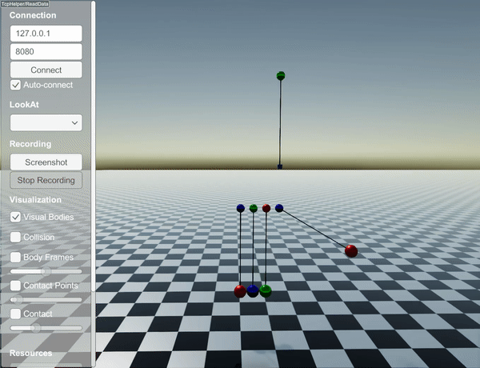

#############################
Constraints
#############################

Length constraints
==================

RaiSim currently has three types of length constraints:

.. toctree::
   :maxdepth: 1

   StiffLengthConstraint
   CompliantLengthConstraint
   CustomLengthConstraint

All length constraints offer three stretch types: ``STRETCH_RESISTANT_ONLY``,
``COMPRESSION_RESISTANT_ONLY``, ``BOTH``. The first two are unilateral constraints
(i.e., acting only in one direction) and ``BOTH`` is a bilateral constraint
(i.e., acting in both directions). The stretch types are explained in
`StiffLengthConstraint <http://raisim.com/sections/StiffLengthConstraint.html>`_.

You can find a short example in
`examples/src/server/length_constraints_newtons_cradle.cpp <https://github.com/raisimTech/raisimlib/blob/master/examples/src/server/length_constraints_newtons_cradle.cpp>`_.
This code simulates the following behavior:

How constraints are solved
--------------------------
RaiSim supports two different enforcement paths for constraints:

* **StiffLengthConstraint (hard)**: converted into a contact problem and solved
  by the contact solver as an impulse constraint. This behaves like a hard
  constraint and is handled alongside collisions.
* **CompliantLengthConstraint / CustomLengthConstraint (soft)**: applied as
  explicit forces each step (spring or user-defined tension). These do not go
  through the contact solver and therefore behave more like soft constraints.

Pin constraints for closed-loop systems are also solved by the contact solver
(as equality constraints), but they are specified in the URDF under
``<constraints>`` rather than through the length-constraint API.

API
----

LengthConstraint
^^^^^^^^^^^^^^^^

.. doxygenclass:: raisim::LengthConstraint
   :members:

