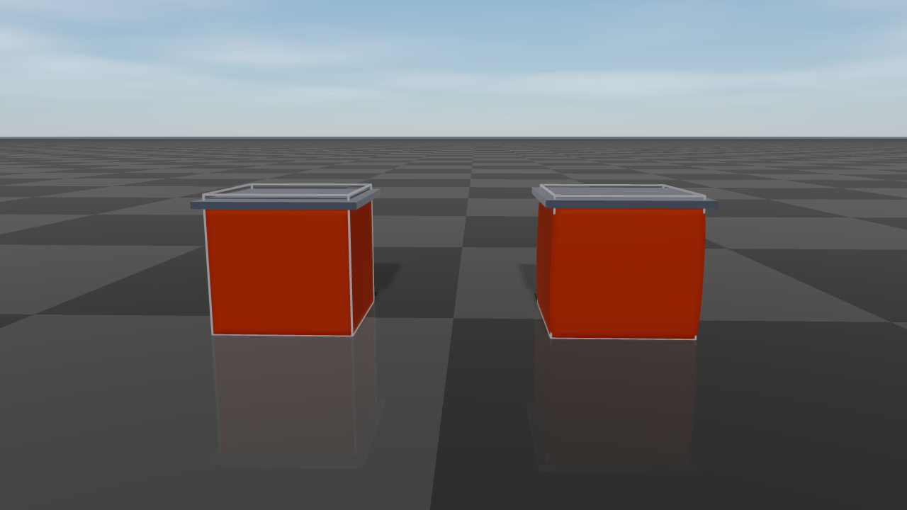

#############################
Deformable Objects
#############################

``raisim::DeformableObject`` is RaiSim's XPBD/PBD deformable-body object.
It is intended for fast simulation and data-generation workloads that need
cloth, soft shells, or soft solids without leaving RaiSim's single-threaded
stepping model.

The object is a set of particles connected by elastic distance constraints
(the mesh edges plus optional extra edges) and, optionally, by bending
constraints between adjacent triangles. With a Young's modulus, a triangle mesh
is instead a continuous elastic membrane and a tetrahedral mesh a continuous
elastic solid (see `Elastic Modulus`_ and `Elastic Solids`_). Each particle
collides as a sphere.
Collision is handled by one aggregate deformable object in the broad phase, with
the particle spheres used internally for contact generation. This keeps
deformable objects cheap to register in the world while still allowing
particle-level contacts against the ground, rigid bodies, articulated systems,
and other deformable objects. Contacts are resolved together with the elastic
forces in every substep (see `Contacts`_), so a body resting on a cloth is
carried by the cloth's tension, and the elastic response cannot pull particles
through a body. The
``deformable_objects`` example (:doc:`examples/server/deformable_objects`)
drapes a cloth over a sphere and stacks mesh-based soft cubes.

API Surface
===========

The public constructors are exposed through ``raisim::World``:

* ``World::addDeformableCloth(vertices, triangles, pinnedVertices, material, contactMaterial, collisionGroup, collisionMask)``
  creates a deformable cloth or shell directly from world-space particle
  positions and triangle indices.
* ``World::addDeformableCloth(meshFileInObjFormat, scale, pinnedVertices, material, contactMaterial, collisionGroup, collisionMask)``
  loads an OBJ mesh as a surface cloth/shell and uses its vertices directly as
  particles.
* ``World::addDeformableObject(meshFileInObjFormat, material, options, pinnedVertices, contactMaterial, collisionGroup, collisionMask)``
  loads an OBJ mesh with ``MeshBuildOptions`` for resampled surface particles,
  filled particles, and optional internal struts.
* ``World::addDeformableVolume(vertices, tetrahedra, pinnedVertices, material, contactMaterial, collisionGroup, collisionMask)``
  creates a solid from world-space particle positions and tetrahedron indices
  (see `Elastic Solids`_).

Trailing arguments have defaults: scale ``1``, no pinned vertices, a
default-constructed ``Material``, contact material ``"default"``, collision
group ``1``, and a collision mask that accepts every group.
``addDeformableObject`` always requires its material and build options. All
creation paths register one ``DeformableObject`` in the world.
Particle-level operations use local particle indices. Pinned particles report
``BodyType::STATIC`` through ``getBodyType(localIdx)``; all other particles
report ``BodyType::DYNAMIC``.

Data Model
==========

The simulated state is particle based:

* ``getNumParticles()`` returns the number of particles.
* ``getPositions()`` and ``getVelocities()`` return world-space particle
  positions and velocities.
* ``getMass(idx)`` returns a particle's mass (infinite for a pinned particle).
  ``totalMass`` is lumped onto the particles by area: each particle carries one
  third of the area of every triangle it belongs to, so a densely sampled
  region does not become heavier than a coarse one. A particle on no triangle
  receives the average share; an object without triangles splits the mass
  evenly; a filled mesh or a tetrahedral volume lumps it by volume.
* ``getTriangles()`` returns the visual/surface triangle topology.
* ``getTetrahedra()`` returns the tetrahedra of a volume (empty for a surface).
* ``getVisualPosition(idx)`` returns the particle position plus its visual
  offset. For a closed triangle mesh, construction moves each surface particle
  inward so that its sphere lies exactly ``collisionRadius`` behind every face
  it belongs to, including along edges and at corners; the collision envelope
  then matches the input surface, and the visual offset undoes the shift. For an
  open mesh the offset is zero.
* ``getDistanceConstraintCount()`` and ``getBendingConstraintCount()`` expose
  the generated constraint counts for diagnostics.
* ``getCollisionBodyCount()`` is normally ``1`` because one aggregate collision
  body represents the deformable object in the broad phase.
* ``setPositionOffset(offset)`` translates all particles, including the
  positions that pinned particles are held at.
  ``applyRigidTransform(translation, rotation)`` rotates all particles about the
  world origin and then translates them; velocities and pending forces are
  rotated as well.

The collision proxy radius is not the visual mesh thickness. It controls the
spherical particle contacts used by the solver. If visual geometry appears to
touch but contacts are weak or delayed, check ``collisionRadius`` and particle
spacing before increasing stiffness.

Creating A Deformable Object
============================

Explicit vertices
-----------------

Use ``World::addDeformableCloth`` when you already have particle positions and
surface triangle indices. The vertices are in world coordinates.

.. code-block:: cpp

    std::vector<raisim::Vec<3>> vertices = {
        {-0.5, -0.5, 1.0},
        { 0.5, -0.5, 1.0},
        { 0.5,  0.5, 1.0},
        {-0.5,  0.5, 1.0}};

    std::vector<raisim::DeformableObject::Triangle> triangles = {
        {0, 1, 2},
        {0, 2, 3}};

    raisim::DeformableObject::Material material;
    material.totalMass = 1.0;
    material.distanceCompliance = 1.0e-5;
    material.bendCompliance = 1.0e4;   // bending modulus 1e-4 N m, a light fabric
    material.damping = 0.001;          // s
    material.airDrag = 0.5;            // 1/s
    material.collisionRadius = 0.01;
    material.iterations = 6;

    auto* cloth = world.addDeformableCloth(vertices, triangles, {}, material);

Mesh surface particles
----------------------

Use ``World::addDeformableObject`` with ``MeshParticleOptions::Mode::Surface``
to resample an OBJ surface. Every triangle is subdivided so that none of its
edges is longer than ``spacing`` (default 0.05 m), and the resulting vertices
become the particles; triangles that are already finer keep their original
vertices. To use the OBJ vertices directly without resampling, call
``World::addDeformableCloth(meshFile, scale, ...)`` instead.

.. code-block:: cpp

    raisim::DeformableObject::MeshBuildOptions build;
    build.particles.mode = raisim::DeformableObject::MeshParticleOptions::Mode::Surface;
    build.particles.scale = 1.0;

    auto* shell = world.addDeformableObject("soft_shell.obj", material, build);
    shell->setPositionOffset({0.0, 0.0, 1.0});

OBJ polygon faces are triangulated as a fan. Texture and normal indices are
ignored. This mode is suitable for cloth and shell meshes.

``addDeformableObject`` raises ``Material::collisionRadius`` to at least
``0.58 * spacing`` in both Surface and Filled modes so that neighboring
particle spheres overlap. Pinned-vertex indices passed to
``addDeformableObject`` refer to the generated particle list, not to the
original OBJ vertex numbering.

Filled mesh particles
---------------------

Use ``MeshParticleOptions::Mode::Filled`` for a closed OBJ triangle mesh that
should receive interior particles. RaiSim resamples the surface as in Surface
mode and fills the inside. With a positive ``youngsModulus`` the object becomes
an elastic solid: interior particles are placed on a body-centered cubic
lattice with the particle density of a ``spacing`` grid, and all particles are
cut into tetrahedra that fill the volume (see `Elastic Solids`_).

Without ``youngsModulus``, the interior particles lie on a regular grid with the
same ``spacing``, and every interior particle is connected by distance
constraints to all particles within :math:`\sqrt{3}` spacings: its lattice
neighbors, including the face, edge, and corner diagonals, and the surface
particles around it. The mass is lumped by volume, one lattice cell per interior
particle and a half-cell layer under the surface share of each surface particle.
Such a lattice of springs has no well-defined elastic modulus and no Poisson
effect; use an elastic solid when the material response matters.

.. code-block:: cpp

    raisim::DeformableObject::MeshBuildOptions build;
    build.particles.mode = raisim::DeformableObject::MeshParticleOptions::Mode::Filled;
    build.particles.scale = 1.0;
    build.particles.spacing = 0.05;
    build.particles.maxFillParticles = 50000;

    auto* softBody = world.addDeformableObject("closed_cube.obj", material, build);
    softBody->setPositionOffset({0.0, 0.0, 1.0});

Filled mode requires a closed (watertight) triangle mesh with a meaningful
inside/outside volume: interior particles are selected by inside/outside tests
against that surface, which are not meaningful for an open mesh.

When using filled mode, tune ``spacing`` and ``maxFillParticles`` (default
50000) together. Smaller spacing increases particle count and usually improves
shape support, but it also increases contact and constraint cost.
``maxFillParticles`` limits the number of interior particles; if the requested
spacing would exceed it, use a larger spacing or a simpler mesh rather than
raising the limit for an unexpectedly large model.

Internal struts
---------------

Internal struts are additional distance constraints used to preserve a rest
shape and provide bounce/recovery for soft shells or filled objects.
``PairsWithinRadius`` connects every particle pair whose rest distance is at
most ``radius``; pairs that already share a constraint are skipped. A large
radius creates many constraints that each cost solver time.

.. code-block:: cpp

    raisim::DeformableObject::MeshBuildOptions build;
    build.particles.mode = raisim::DeformableObject::MeshParticleOptions::Mode::Filled;
    build.particles.spacing = 0.05;
    build.internalStruts.mode =
        raisim::DeformableObject::InternalStrutOptions::Mode::PairsWithinRadius;
    build.internalStruts.radius = 0.09;

    auto* softBody = world.addDeformableObject("closed_cube.obj", material, build);

You can also add constraints after construction:

.. code-block:: cpp

    softBody->addDistanceConstraint(0, 7);
    softBody->addDistanceConstraints({{0, 6}, {1, 7}});
    softBody->addInternalStruts(build.internalStruts);

Manual constraints are useful for adding diagonal support to coarse shells.
Their rest length is the current distance between the two particles, so add them
immediately after construction or after intentionally placing the object in its
desired rest pose. ``addDistanceConstraints`` skips pairs that already have a
constraint; ``addDistanceConstraint`` does not check for duplicates.

Material Parameters
===================

``DeformableObject::Material`` controls mass, solver behavior, collision proxy
size, and elastic response. Defaults are shown in parentheses:

* ``totalMass`` (1 kg): total mass, lumped onto the particles by area (see
  `Data Model`_).
* ``distanceCompliance`` (-1): XPBD distance compliance. ``0`` is rigid; larger
  values are softer. Negative values preserve legacy behavior by using
  ``1 / distanceStiffness``, so the default compliance is ``1e-4``.
* ``distanceStiffness`` (1e4): legacy stiffness parameter. Prefer
  ``distanceCompliance`` for new code.
* ``bendCompliance`` (-1): inverse of the bending modulus :math:`D`, in
  1/(N m) (see `Bending`_). ``0`` is rigid; larger values fold more easily.
  Negative values use ``1 / bendStiffness`` when ``bendStiffness`` is positive
  and otherwise disable bending, so bending is off by default.
* ``bendStiffness`` (0): the bending modulus :math:`D` in N m, used when
  ``bendCompliance`` is negative.
* ``youngsModulus`` (-1, unused): Young's modulus :math:`E` in Pa. If positive,
  the triangles form an elastic membrane (see `Elastic Modulus`_), or the
  tetrahedra of a volume an elastic solid (see `Elastic Solids`_), and
  ``distanceCompliance`` no longer applies to the mesh edges.
* ``poissonRatio`` (0.3): Poisson's ratio :math:`\nu` of the membrane or solid,
  between -1 and 0.5.
* ``thickness`` (0.01 m): membrane thickness :math:`t`.
* ``crossSectionArea`` (-1, unused): cross-sectional area of the extra distance
  constraints (struts and manual constraints) when ``youngsModulus`` is
  positive; ``thickness * L`` when unset.
* ``damping`` (0 s): stiffness-proportional damping time (see `Damping`_).
* ``airDrag`` (0 1/s): air-drag rate, which damps the absolute particle
  velocities (see `Damping`_).
* ``selfCollision`` (false): collide the object's particles with each other
  (see `Contacts`_).
* ``collisionRadius`` (0.01 m): radius of each internal particle collision
  proxy.
* ``iterations`` (6): number of constraint projection iterations per substep.
* ``substeps`` (1): number of deformable substeps per RaiSim world step.
  Deformables whose particles touch step together with the largest value
  among them.
* ``solverMode`` (``XPBD``): ``XPBD`` or ``PBD``. ``PBD`` projects every
  constraint rigidly and ignores the compliance magnitudes, so its effective
  stiffness depends on ``iterations`` and the time step. Whether bending
  constraints exist is still decided by ``bendCompliance``/``bendStiffness``.

Elastic Modulus
===============

For engineering-style material input, set ``youngsModulus`` instead of
``distanceCompliance``:

.. code-block:: cpp

    raisim::DeformableObject::Material material;
    material.totalMass = 1.0;
    material.youngsModulus = 5.0e4;
    material.poissonRatio = 0.3;
    material.thickness = 0.02;
    material.collisionRadius = 0.01;

When ``youngsModulus > 0``, each triangle of the mesh is an element of a thin,
isotropic elastic sheet in plane stress. Its in-plane strain
:math:`\boldsymbol{\varepsilon} = (\varepsilon_{xx}, \varepsilon_{yy}, \gamma_{xy})`
is measured after removing the triangle's rotation, so rigid motion does not
strain it, and it stores the energy

.. math::

    E_m = \frac{A t}{2} \boldsymbol{\varepsilon}^\top \boldsymbol{C} \boldsymbol{\varepsilon},
    \qquad
    \boldsymbol{C} = \frac{E}{1 - \nu^2}
    \begin{bmatrix} 1 & \nu & 0 \\ \nu & 1 & 0 \\ 0 & 0 & \frac{1 - \nu}{2} \end{bmatrix},

where :math:`A` is the rest area of the triangle. A strip of width :math:`W`
pulled with a force :math:`F` along its length therefore stretches by the strain
:math:`F / (E t W)` and narrows by :math:`\nu` times that, independently of
how the mesh is triangulated. The mesh edges are not separate springs in this
mode. Extra distance constraints (struts, ``addDistanceConstraint``) remain
springs of compliance :math:`L / (E A_s)`, with the rest length :math:`L` and
the area :math:`A_s` = ``crossSectionArea``, or ``thickness * L`` when it is
unset.

Without ``youngsModulus``, the mesh edges are springs with
``distanceCompliance``. Such a spring network has no Poisson effect, and its
stiffness depends on the triangulation.

Elastic Solids
==============

An object made of tetrahedra is an elastic solid when ``youngsModulus`` is
positive. Such an object comes from a filled mesh (see
`Filled mesh particles`_) or from a tetrahedral mesh of your own, for example
one generated by a meshing tool:

.. code-block:: cpp

    std::vector<raisim::Vec<3>> vertices = {
        {0.0, 0.0, 0.5}, {0.2, 0.0, 0.5}, {0.0, 0.2, 0.5}, {0.0, 0.0, 0.7}};
    std::vector<raisim::DeformableObject::Tetrahedron> tetrahedra = {{0, 1, 2, 3}};

    raisim::DeformableObject::Material material;
    material.totalMass = 0.5;
    material.youngsModulus = 2.0e5;   // a soft rubber
    material.poissonRatio = 0.45;
    material.collisionRadius = 0.005;

    auto* solid = world.addDeformableVolume(vertices, tetrahedra, {}, material);

Each tetrahedron is an element of an isotropic elastic solid. Its strain
:math:`\boldsymbol{\varepsilon} = (\varepsilon_{xx}, \varepsilon_{yy}, \varepsilon_{zz}, \gamma_{xy}, \gamma_{yz}, \gamma_{zx})`
is measured after removing the element's rotation, so rigid motion does not
strain it, and it stores the energy

.. math::

    E_s = \frac{V}{2} \boldsymbol{\varepsilon}^\top \boldsymbol{C} \boldsymbol{\varepsilon},
    \qquad
    \boldsymbol{C} =
    \begin{bmatrix}
    \lambda + 2\mu & \lambda & \lambda & & & \\
    \lambda & \lambda + 2\mu & \lambda & & & \\
    \lambda & \lambda & \lambda + 2\mu & & & \\
    & & & \mu & & \\
    & & & & \mu & \\
    & & & & & \mu
    \end{bmatrix},

where :math:`V` is the rest volume of the element and
:math:`\mu = E / (2 (1 + \nu))` and :math:`\lambda = E \nu / ((1 + \nu)(1 - 2\nu))`
are the Lamé parameters. A bar of cross section :math:`A` pulled with a force
:math:`F` therefore stretches by the strain :math:`F / (E A)` and narrows by
:math:`\nu` times that, however its volume is cut into tetrahedra; close to
:math:`\nu = 0.5` the solid is nearly incompressible.

   Two filled cubes of soft rubber (:math:`E` = 20 kPa) under the same 15 kg
   plate; the wire frames show their rest shape. With :math:`\nu = 0` (left) the
   cube only shortens. With :math:`\nu = 0.45` (right) it bulges sideways as it
   shortens, keeping its volume.

A spinning solid keeps its shape, and a solid crushed until some elements turn
inside out recovers its rest shape once released. Each particle carries a
quarter of the volume of every tetrahedron it belongs to.

The solid has the shape of its mesh. Its surface particles sit
``collisionRadius`` inside the surface, like those of any closed mesh, so that
their collision spheres reproduce it, but the elastic body is the full volume of
the mesh: a cube of side :math:`L` resting on the ground shortens under its own
weight by :math:`\rho g L^2 / (2E)`, whatever its particle spacing and collision
radius. Volume changes are resisted over the neighborhood of every particle
rather than tetrahedron by tetrahedron, so a nearly incompressible solid still
bends: a rubber beam with :math:`\nu = 0.49` deflects about as far as one with
:math:`\nu = 0.3`. A coarse mesh of tetrahedra is still stiffer in bending than
the material it approximates; with two elements across a beam it deflects about
two thirds of the beam-theory value, with four about nine tenths, so use several
elements across thin parts. The faces that belong to a single tetrahedron are the
surface that ``getTriangles()`` returns for a volume created with
``addDeformableVolume``. Without ``youngsModulus``, the edges of the tetrahedra
are distance constraints with ``distanceCompliance``.

Bending
=======

With bending enabled, every pair of triangles sharing an edge resists the change
of its curvature from the rest shape. Summed over the surface, the bending
energy approximates that of a thin plate,

.. math::

    E_b = \frac{D}{2} \int (2H - 2H_0)^2 \, dA,

where :math:`H` is the mean curvature, :math:`H_0` its rest value, and
:math:`D` the bending modulus set by ``bendCompliance`` :math:`= 1/D`. The
energy is quadratic in the curvature change, so the bending moment is linear in
it: a cantilevered strip under eight times the load sags eight times as far
while the deflection stays small. For an isotropic sheet of thickness
:math:`t`,

.. math::

    D = \frac{E t^3}{12 (1 - \nu^2)}.

Woven cloth bends far more easily than this formula predicts from its in-plane
stiffness, because its fibers slide against each other, so cloth is usually
given a much smaller :math:`D`. The rest curvature :math:`H_0` comes from the
mesh as it is created, so closed shells and curved panels keep their shape;
only a flat rest mesh is flat at rest.

Damping
=======

Two damping terms are available. Together they form Rayleigh damping:

* ``airDrag`` :math:`c` (1/s) acts on the absolute velocity of every particle,
  like a linear air drag. A free particle under gravity approaches the terminal
  speed :math:`\|\boldsymbol{g}\| / c`, and the decay
  :math:`e^{-c t}` is independent of ``Δt`` and ``substeps``. It damps rigid
  motion too, for example a cloth swinging from its pins.
* ``damping`` :math:`\beta` (s) acts on the deformation only. Every distance
  and bending constraint, and every strain of a membrane or solid element,
  resists its rate of change with a viscous force equal
  to :math:`\beta` times its elastic stiffness, so a vibration mode of angular
  frequency :math:`\omega` decays with the damping ratio
  :math:`\zeta = \beta \omega / 2`: stiff, fast modes are damped strongly and
  slow, large-scale motion only weakly. Translation and rotation of the whole
  object are not damped. A rigid constraint (zero compliance) loses its whole
  rate of change. ``damping`` has no effect in the ``PBD`` solver mode.

Both default to zero; the remaining dissipation comes from the implicit time
integration and from contact friction.

.. note::

   Earlier versions interpreted ``damping`` as the fraction of every particle's
   velocity removed per world step, which slowed rigid motion as well and
   changed with the time step (it capped free fall at about 0.5 m/s at
   ``Δt = 1`` ms with the old default of 0.02). To reproduce a former value
   :math:`d` used at time step :math:`\Delta t`, set
   ``airDrag`` :math:`= -\ln(1 - d) / \Delta t` and ``damping`` to zero.

Contacts
========

A deformable particle collides as a sphere of radius ``collisionRadius``.
Contacts with rigid bodies, articulated systems, and terrain are resolved in
every substep together with the elastic constraints, as one-sided contacts
between the particle and the body surface:

* The contact force acts on the body as well, through its apparent inertia at
  the contact point, so momentum is exchanged in both directions and a body
  resting on a cloth is carried by the cloth's tension.
* The elastic response cannot push or pull a particle through a body.
* Contacts are inelastic and use Coulomb friction with the friction coefficient
  of the contact materials.
* With ``selfCollision`` enabled, the particles of one object collide with each
  other too, so that a folded cloth rests on itself. Particle pairs that already
  overlap in the rest shape (neighbors of a coarse surface) are left to the
  elastic constraints. The friction coefficient is that of the object's contact
  material with itself.
* Contacts that a particle can reach within the step are created in advance, so
  a fast particle stops at the surface in the step it arrives instead of
  penetrating. These contacts report a positive ``Contact::getDepth()`` (a gap)
  and zero impulse until the particle touches the body. A pinned particle only
  takes part in contacts once it touches.

Contacts between particles of different deformable objects are resolved the
same way, in a substep loop that the touching objects share, so stacked soft
bodies support each other. Touching deformables step with the largest
``substeps`` among them.

``Contact::getImpulse()`` reports the full impulse exchanged in the step, on
both sides of the contact. Contacts between particles of the same object
(``selfCollision``) are not listed in ``getContacts()``.

A heavy object on a light cloth, such as a 2 kg ball on a 0.2 kg cloth, needs
enough ``iterations`` and ``substeps`` for the cloth to carry the load: with too
few, the cloth stretches far beyond its compliance under the load, and a stretch
large enough to open the gaps between the particle spheres lets the object
through.

Sleeping
========

With sleeping enabled, a deformable object sleeps only when every particle has
been slower than the linear sleep threshold for the required number of steps.
Applying a force, moving or transforming the object, pinning or unpinning a
particle, or adding constraints wakes it up.

Pinned Vertices And Forces
==========================

Pinned vertices are fixed in world coordinates, have infinite mass, and are
exposed to collision as static proxies. They can be specified at construction
time or changed later; ``pinVertex`` holds the particle at its current
position:

.. code-block:: cpp

    cloth->pinVertex(0);
    cloth->unpinVertex(0, 0.01);

``unpinVertex(idx, mass)`` restores a finite, positive mass for that particle.
Use a mass consistent with the surrounding particles (``getMass()`` of a
neighbor). Constraint corrections are distributed in proportion to
inverse mass: a much lighter particle absorbs most of each correction and
reacts strongly to forces, while a much heavier one barely moves and drags its
neighbors as if it were nearly pinned.

External forces can be applied per particle with the standard ``Object``
interface. They act on the next step only, and calls on pinned particles are
ignored. Particles have no rotational state, so ``setExternalTorque`` has no
effect:

.. code-block:: cpp

    softBody->setExternalForce(3, {0.0, 0.0, 2.0});
    softBody->clearExternalForcesAndTorques();

Solver Tuning
=============

Start with the largest stable time step your application needs, then tune in
this order:

1. Choose a particle spacing that resolves the shape at the level your task
   actually observes.
2. Set ``collisionRadius`` so neighboring particle proxies cover the surface
   without making the visual mesh appear inflated.
3. Increase ``iterations`` until distance constraints converge enough for the
   task.
4. Increase ``substeps`` when heavy objects stretch the material too much or
   contacts are jittery. Several substeps with few iterations each usually
   converge better than one substep with many iterations.
5. Reduce ``distanceCompliance`` or increase ``youngsModulus`` only after the
   discretization and solver budget are reasonable.

``XPBD`` is the recommended default because its compliance gives a material
stiffness that depends far less on the iteration count and time step than
``PBD``, where stiffness is only a by-product of how many rigid projections are
performed. Use ``PBD`` mainly for backward-compatible behavior or controlled
comparisons.

Common failure modes:

* Exploding or jittering contacts usually mean the time step is too large for
  the stiffness/contact radius combination.
* A cloth that stretches too much needs lower ``distanceCompliance`` or more
  iterations.
* A cloth that folds too easily needs bending constraints (a nonnegative
  ``bendCompliance``; bending is off by default) and then a lower
  ``bendCompliance``.
* A cloth that keeps flapping or swinging needs ``airDrag``; vibrations of a
  stiff material need ``damping``.
* Filled objects that collapse need a ``youngsModulus`` (an elastic solid), or
  more internal struts, smaller spacing, or higher stiffness.

Rayrai Visualization
====================

A local ``RayraiWindow`` draws deformable objects in its world automatically.
``RaisimServer`` serializes them as dynamic ``Shape::Mesh`` visuals for the
Rayrai TCP viewer. The first visualizer packet sends the object name, triangle
topology, and current vertex positions. Later packets stream updated vertex
positions and resend the triangle list only if the topology changes. Rayrai
rebuilds the custom OpenGL mesh, recomputes normals from the triangle list, and
renders the deformable surface in world coordinates. Both paths draw the
vertices at ``getVisualPosition()``.

The particle collision proxies are an internal physics representation and are
not rendered as one sphere per vertex. For an open cloth, the drawn surface
passes through the particle centers, so the collision envelope extends about
``collisionRadius`` to either side of it. For a closed mesh, the inward particle
shift and the visual offset make the drawn surface approximately coincide with
the collision envelope; the offsets turn with the object's overall rotation, so
the drawn surface stays outside the particles of a tumbling soft body. For stacked soft cubes or other closed shapes, choose
particle spacing and ``collisionRadius`` together: neighboring particle spheres
should cover the surface without leaving gaps, but the radius should stay small
relative to the object's features.

World XML
=========

``World::exportToXml`` writes each deformable object as a ``<deformable>``
object with its material, contact material, collision group and mask, every
particle's position, rest position, velocity, visual offset, inverse mass, and
pinned flag, the triangle list, the tetrahedra of a volume, and the distance
constraints. Loading the file with ``raisim::World(path)`` recreates the object;
bending constraints, membrane and solid elements are rebuilt from the triangles,
tetrahedra, rest positions, and material, and a solid continues in the pose it
was saved in. The element layout is intended for
this export/import round trip; the loader requires the attributes that the
exporter writes.

Limitations
===========

This is still an experimental implementation. It does not include topology
changes such as tearing or cutting.
Granular systems do not collide with deformable objects. A rigid edge or corner
can still pass between particle spheres when ``collisionRadius`` is small
compared with the particle spacing.

API Reference
=============

.. doxygenclass:: raisim::DeformableObject
   :members:
