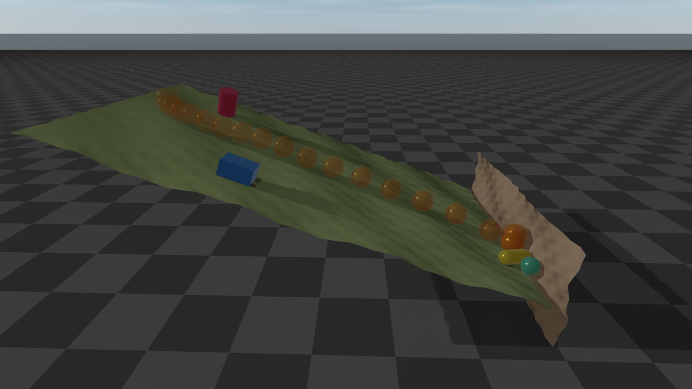

#############################
Height Map
#############################

A height map is a grid of points that are triangulated to form a surface.
Because the surface over any point is found directly from the grid, collision checking is very
efficient, and it is the recommended way to create terrain.
A height map is always a static object. Height samples are stored row by row:
the sample at grid index ``(x, y)`` is ``height[y * xSamples + x]``.

Position and orientation
========================

The grid lives in the height map's own frame: the center of the grid is the
origin and the heights rise along the local z axis. ``setPosition(x, y, z)``
moves the center to ``(x, y)`` and offsets all heights by ``z``.
``setOrientation(...)`` rotates the map about its center: with the center
:math:`\boldsymbol{c}` and the rotation :math:`\boldsymbol{R}`, the point
:math:`\boldsymbol{p}` of the unrotated (translated) map lies at
:math:`\boldsymbol{c} + \boldsymbol{R}(\boldsymbol{p} - \boldsymbol{c})` in the world.
Any rotation is allowed: a tilted map is a slope, a map rotated 90 degrees about x is a wall,
and one rotated 180 degrees is a ceiling. A world XML file sets the orientation with the
``quat`` attribute of the height map.

Two rotated height maps: a slope tilted 20 degrees and a wall at its foot. The
box and the cylinder rest on the slope, held by friction, while the ball (its
descent shown light to dark), the capsule and the small sphere roll and slide
down and stop against the wall.

Everything that touches the surface follows the orientation: contacts with
every shape, ray tests and the sensors built on them, swept CCD, granular
particles, and rendering in rayrai and the TCP viewer. A scene on a rotated map
moves like the same scene on the unrotated map, with every body and gravity
rotated along with it; the two agree to rounding error. A height map is one-sided whatever its
orientation: everything below the surface, along the local -z axis, is inside
the terrain, and a body that ends up there is pushed back out through the
surface. The ``rotated_blocky_heightmap_drop`` example (see :doc:`Examples`) tilts a map by
15 degrees.

Querying the surface
====================

You can query the surface at a world-frame ``(x, y)`` position:

* height: :code:`getHeight(x, y)` (visual height) and
  :code:`getContactHeight(x, y)` (collision surface; the two differ only after
  a visual-only update)
* normal vector: :code:`getNormal(x, y, normal)` (collision surface, written to
  the output argument)
* color: :code:`getColor(x, y)`

These queries ignore the orientation by design: they read the height field as if only the
translation were applied, so ``(x, y)`` addresses the grid directly whether or not the map is
rotated. To evaluate a rotated map, query its unrotated coordinates and rotate the result:

* the surface point above ``(x, y)`` of the unrotated map is
  :math:`\boldsymbol{c} + \boldsymbol{R}\,((x, y, h) - \boldsymbol{c})` with
  :math:`h` = :code:`getHeight(x, y)`, and its normal is :math:`\boldsymbol{R}` times the
  result of :code:`getNormal(x, y, normal)`;
* a world point :math:`\boldsymbol{w}` has the unrotated coordinates
  :math:`\boldsymbol{c} + \boldsymbol{R}^T(\boldsymbol{w} - \boldsymbol{c})`; it is above
  the surface if their z exceeds :code:`getHeight` at their x and y.

.. code-block:: cpp

    // the point 0.5 m above the rotated surface at the unrotated map's (x, y)
    const Eigen::Vector3d c = heightMap->getPosition();
    const Eigen::Matrix3d R = heightMap->getRotationMatrix();
    raisim::Vec<3> normal;
    heightMap->getNormal(x, y, normal);
    const Eigen::Vector3d surface = c + R * (Eigen::Vector3d(x, y, heightMap->getHeight(x, y)) - c);
    const Eigen::Vector3d above = surface + 0.5 * R * normal.e();

Runtime updates
===============

``update(...)`` changes the visual and collision height data; it cannot change
the number of samples. The supplied height vector must contain exactly
``getXSamples() * getYSamples()`` finite entries; invalid input is ignored with
a warning and leaves the existing map unchanged.

For visualization-only streaming, ``updateVisualHeight(...)`` replaces the
full visual height array and ``updateVisualHeightPatch(...)`` updates an
inclusive rectangular sample range without rebuilding collision. Both require
the center and size arguments to match the current ones. The patch method
receives the full row-major height array and copies only the requested range. Per-vertex colors use ``setColor(...)``; after a full color map has been
initialized, ``setColorPatch(...)`` updates a tightly packed rectangular color
range.

Example
=============================

.. toctree::
   :maxdepth: 2

   HeightMap_example_png
   HeightMap_example_raw_values
   HeightMap_example_terrain_generator
   HeightMap_example_txt

API
====

HeightMap
**********

.. doxygenclass:: raisim::HeightMap
   :members:

Terrain properties
******************

.. doxygenstruct:: raisim::TerrainProperties
   :members:
