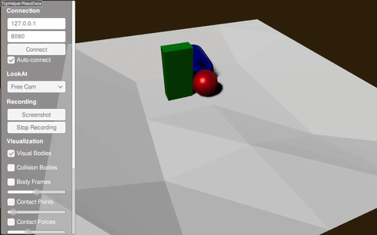

#########################################
Height Map Using the Terrain Generator
#########################################

XML approach
-----------------------------

Run the example with:

.. code-block:: bash

    ./xmlReader <PATH_TO_RAISIMLIB>/rsc/xmlScripts/heightMaps/heightMapUsingTerrainGenerator.xml

The XML file is constructed as follows:

.. code-block:: xml

    <?xml version="1.0" ?>
    <raisim version="2.0.0">
        <timeStep value="0.001"/>
        <objects>
            <sphere name="sphere" mass="1">
                <dim radius="0.5" />
                <inertia xx="0.1" xy="0" xz="0" yy="0.1" yz="0" zz="0.1" />
                <state pos="0 0 5" quat="1 0 0 0" linVel="0 0 0" angVel="0 0 0" />
            </sphere>
            <capsule name="capsule" mass="1">
                <dim radius="0.5" height="1" />
                <inertia xx="0.1" xy="0" xz="0" yy="0.1" yz="0" zz="0.1" />
                <state pos="1 0 5" quat="1 0 0 0" linVel="0 0 0" angVel="0 0 0" />
            </capsule>
            <box name="box" mass="1">
                <dim x="0.5" y="1" z="2"/>
                <inertia xx="0.1" xy="0" xz="0" yy="0.1" yz="0" zz="0.1" />
                <state pos="1 1 5" quat="1 0 0 0" linVel="0 0 0" angVel="0 0 0" />
            </box>
            <heightmap name="terrain" xSample="50" ySample="50" xSize="20" ySize="20" centerX="0" centerY="0">
                <terrainProperties frequency="0.2" zScale="3.0" fractalOctaves="3" fractalLacunarity="2.0" fractalGain="0.25" stepSize="0" heightOffset="0" seed="0"/>
            </heightmap>
        </objects>
    </raisim>

Perlin parameters can be nontrivial to tune. Adjust them to achieve the shape you want.

C++ approach
-----------------------------

.. code-block:: cpp

  raisim::TerrainProperties terrainProperties;
  terrainProperties.frequency = 0.2;
  terrainProperties.zScale = 3.0;
  terrainProperties.xSize = 20.0;
  terrainProperties.ySize = 20.0;
  terrainProperties.xSamples = 50;
  terrainProperties.ySamples = 50;
  terrainProperties.fractalOctaves = 3;
  terrainProperties.fractalLacunarity = 2.0;
  terrainProperties.fractalGain = 0.25;

  auto hm = world.addHeightMap(0.0, 0.0, terrainProperties);

