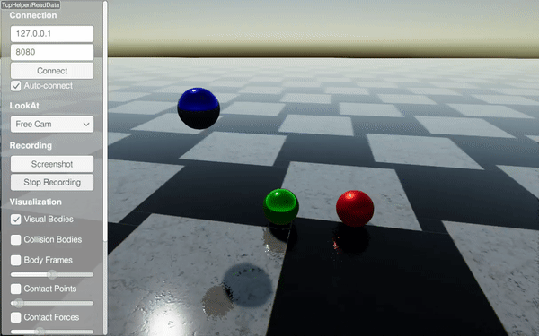

#############################
Material System
#############################

**In RaiSim, material properties are defined per material pair.**

RaiSim currently utilizes five material properties:

* **Coefficient of friction** (:math:`\mu\ge 0`): Defines the frictional force applied between two contacting materials.
* **Coefficient of restitution** (:math:`c_r\ge 0`): Determines the elasticity of the material pair.
* **Restitution threshold** (:math:`r_{th}\ge 0`): Objects will not rebound if the impact velocity falls below this threshold.
* **Coefficient of static friction** (:math:`\mu_{s}\ge \mu`): When specified, this defines the frictional force applied during near-zero relative velocity between contact points. By default, it equals the coefficient of friction.
* **Velocity threshold for static friction** (:math:`v_s \ge 0`): Required when the coefficient of static friction is defined. If the relative velocity exceeds this value, static friction is disregarded. Otherwise, the effective coefficient of friction is interpolated between the static and dynamic coefficients.

The bounce velocity is computed as :math:`c_{th}(v_i-c_{th})`, where :math:`v_i` represents the impact velocity.
The following graphs illustrate the effects of these material properties.

Examples are available in the `restitution example <https://github.com/raisimTech/raisimLib/blob/master/examples/src/server/material_restitution.cpp>`_ and the `static friction example <https://github.com/raisimTech/raisimLib/blob/master/examples/src/server/material_static_friction.cpp>`_.

A material name is assigned upon creation.
For instance:

.. code-block:: cpp

  auto ball = world.addSphere(1, 1, "steel");

The ``World`` instance maintains a ``MaterialManager`` that stores all material pair properties.
Undefined material pairs utilize **default material properties**, which can be configured via :code:`raisim::World::setDefaultMaterial`.
If default properties are not explicitly set, they default to {:math:`\mu=0.8`, :math:`c_r=0`, :math:`c_{th}=0`}.

Material properties for a specific pair can be defined as follows:

.. code-block:: cpp

  world.setMaterialPairProp("steel", "glass", 0.7, 0.1, 0.15);

The first two arguments specify the material names, followed by the coefficient of friction, coefficient of restitution, and restitution threshold.
The order of the material names is interchangeable.

Example - Single Bodies
=============================

XML Approach
-----------------------------

.. code-block:: xml

    <?xml version="1.0" ?>
    <raisim version="1.0">
        <timeStep value="0.001"/>
        <objects>
            <ground name="ground" material="steel"/>
            <sphere name="sphere_steel" mass="1" material="steel">
                <dim radius="0.5"/>
                <state pos="-2 0 5" quat="1 0 0 0" linVel="0 0 0" angVel="0 0 0"/>
            </sphere>
            <sphere name="sphere_rubber" mass="1" material="rubber">
                <dim radius="0.5"/>
                <state pos="0 0 5" quat="1 0 0 0" linVel="0 0 0" angVel="0 0 0"/>
            </sphere>
            <sphere name="sphere_copper" mass="1" material="copper">
                <dim radius="0.5"/>
                <state pos="2 0 5" quat="1 0 0 0" linVel="0 0 0" angVel="0 0 0"/>
            </sphere>
        </objects>
        <material>
            <default friction="0.8" restitution="0" restitution_threshold="0"/>
            <pair_prop name1="steel" name2="steel" friction="0.8" restitution="0.95" restitution_threshold="0.001"/>
            <pair_prop name1="steel" name2="rubber" friction="0.8" restitution="0.15" restitution_threshold="0.001"/>
            <pair_prop name1="steel" name2="copper" friction="0.8" restitution="0.65" restitution_threshold="0.001"/>
        </material>
        <camera follow="anymal" x="1" y="1" z="1"/>
    </raisim>

C++ Approach (Single Bodies)
----------------------------

.. code-block:: cpp

    #include "raisim/RaisimServer.hpp"
    #include "raisim/World.hpp"

    int main(int argc, char* argv[]) {
      auto binaryPath = raisim::Path::setFromArgv(argv[0]);
      raisim::World::setActivationKey(binaryPath.getDirectory() + "\\rsc\\activation.raisim");

      /// Create RaiSim world
      raisim::World world;
      world.setTimeStep(0.001);

      /// Create objects
      world.addGround(0, "steel");
      auto sphere1 = world.addSphere(0.5, 1.0, "steel");
      auto sphere2 = world.addSphere(0.5, 1.0, "rubber");
      auto sphere3 = world.addSphere(0.5, 1.0, "copper");

      sphere1->setPosition(-2,0,5);
      sphere2->setPosition(0,0,5);
      sphere3->setPosition(2,0,5);

      world.setMaterialPairProp("steel", "steel", 0.8, 0.95, 0.001);
      world.setMaterialPairProp("steel", "rubber", 0.8, 0.15, 0.001);
      world.setMaterialPairProp("steel", "copper", 0.8, 0.65, 0.001);

      /// Launch RaiSim server
      raisim::RaisimServer server(&world);
      server.launchServer();

      for (int i = 0; i < 10000000; i++) {
        raisim::MSLEEP(1);
        server.integrateWorldThreadSafe();
      }

      server.killServer();
    }

Example - Articulated Systems
==============================

URDF Approach
-----------------------------

Material properties can be specified within the URDF file as follows:

.. code-block:: xml

    <!-- Foot link -->
    <link name="LF_FOOT">
        <collision>
            <origin xyz="0 0 0.02325"/>
            <geometry>
                <sphere radius="0.035"/>
            </geometry>
            <material name="">
                <contact name="ice"/>
            </material>
        </collision>
    </link>

C++ Approach (Articulated Systems)
----------------------------------

Alternatively, materials can be assigned dynamically:

.. code-block:: cpp

    anymal->getCollisionBody("LF_FOOT/0").setMaterial("ice");

Here, "LF_FOOT/0" refers to the first collision body of the "LF_FOOT" link.

To retrieve the name of an assigned material:

.. code-block:: cpp

    ANYmal->getCollisionBody("LF_FOOT/0").getMaterial();

To obtain contact properties for a collision between two materials:

.. code-block:: cpp

    world.getMaterialPairProp(ANYmal->getCollisionBody("LF_FOOT/0").getMaterial(),
                              ground->getCollisionObject().getMaterial());

API
====

Material Pair Properties
------------------------

.. doxygenstruct:: raisim::MaterialPairProperties
   :members:

Material Manager
----------------

.. doxygenclass:: raisim::MaterialManager
   :members:

