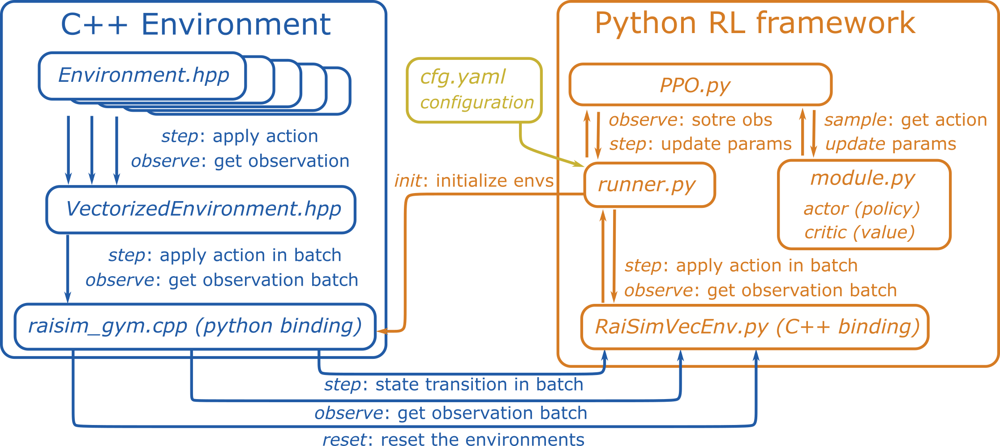

#############################
RaisimGymTorch
#############################

What is RaisimGymTorch?
===========================

RaisimGymTorch is a gym environment example for RaiSim.
A lightweight PyTorch-based RL framework is provided, but it should work with other RL frameworks.
Instead of using RaisimPy, nanobind wraps a vectorized environment in C++ so that the parallelization happens in C++.
This improves performance significantly.

Why RaisimGymTorch?
============================

RaisimGymTorch is designed to collect **tens of billions of state transitions** with a single desktop machine.
Such a number of state transitions can be necessary for challenging tasks. An example of a trained policy is shown below.

.. image:: ../image/raisimGymTorch_trainedPolicy1.gif
  :alt: trained policy 1

.. image:: ../image/raisimGymTorch_trainedPolicy2.gif
  :alt: trained policy 2

Approximately **160 billion time steps** were used to train the above controller.
RaisimGymTorch can process about 500k time steps per second in the above environment (with 3950x) with an actuator network whose cost matches the physics simulation.

Dependencies
============
Assuming that you have installed RaiSim:

* Anaconda
* PyTorch (https://pytorch.org/)
* To use the GPU, install CUDA as well. Use the version recommended by PyTorch.
* Other dependencies are installed when you build a RaisimGymTorch environment for the first time.

How to run the example
=============================
We provide an ANYmal locomotion example.
From the ``raisimGymTorch`` directory:

.. code-block:: bash

    pip install numpy tensorboard ruamel.yaml
    python setup.py develop
    python raisimGymTorch/env/envs/rsg_anymal/runner.py

To visualize the policy, run RaisimUnity as well.
It records the policy performance every 200 iterations.
All recorded videos can be found in ``raisim2Lib/raisimUnity/<OS>/screenshots``.

How to debug
=============================
A nanobind package (e.g., your environment) can be difficult to debug because it is written in C++ but not run as a normal executable.
We provide a debug app that wraps your environment and creates an executable.
To build the debug app, build your environment with

.. code-block:: bash

    python setup.py develop --Debug

Then, the debug executable is created next to your pybind11 package (``raisimGymTorch/raisimGymTorch/env/bin``).
If you use CLion (recommended), open the raisimGymTorch directory in CLion.
It will automatically add the debug app executable.
It provides a convenient GUI for debugging.

You can run the debug app as:

.. code-block:: bash

    ./debug_app_<environment name> <full path to rsc directory> <full path to the cfg file>

or add the arguments to the CLion run configuration.

**On Windows**, make sure that you are linking against the debug-build raisim.
Visual Studio compiled executables will not work if it links against a library built with different compile flags.

How does it work?
=============================
RaisimGymTorch wraps a C++ environment (i.e., ENVIRONMENT.hpp) as a Python library using pybind11.
When you call ``python3 setup.py develop``, all environments under ``raisimGymTorch/raisimGymTorch/env/envs`` are compiled.
The compiled libraries are stored in ``raisimGymTorch/raisimGymTorch/env/bin``.

Everything else happens in Python.
You can import your environment from your Python code.
For example, the ANYmal locomotion environment can be imported as ``from raisimGymTorch.env.bin import rsg_anymal``.
Your launch file (e.g., ``runner.py``) can be customized as needed.

How to add a custom environment?
===================================
You can copy ``raisimGymTorch/raisimGymTorch`` to another location.
Delete the temporary directories ``build`` and ``raisim_gym_torch.egg-info`` (created when you run ``python setup.py develop``).
To build in another directory, point CMake to RaiSim:

.. code-block:: bash

    python setup.py develop --CMAKE_PREFIX_PATH <WHERE-YOU-HAVE-RAISIM>/raisim/<OS>

Everything will work without further steps.
However, if you want to keep multiple environments, you may want to rename a few items.

 * Package name: You can find it in ``setup.py`` (``name='raisim_gym_torch'``). This is the name you will find in ``site_packages`` directory of your anaconda environment.
 * Directory name: This is the directory name that you will find in the top ``raisimGymTorch`` directory. The default name is ``raisimGymTorch``. Modify it if necessary, and update the directories in the header of ``runner.py`` and the ``CMakeLists.txt``.
 * Binary name: This is the name of the directory of your environment. The default name is ``rsg_anymal``. If you change the directory name, update ``rsg_anymal`` in ``runner.py``.
 * Environment name: This is the name of the binary that will be built from your ``Environment.hpp`` file. The default name is ``RaisimGymVecEnv``. You can find it in ``raisim_gym.cpp``. If you change it, update the name in ``runner.py``.

 You can also create another conda environment to avoid name conflicts.

Code structure (if you are curious)
======================================
The ``ENVIRONMENT`` class defines the dynamics, reward, termination condition, and so on.
This class inherits from ``RaisimGymEnv``, which adds basic functionality such as ``setSimulationTimeStep``, ``setControlTimeStep``, and ``getObDim``.
If ``RaisimGymEnv`` is not general enough for you, you can also make ``ENVIRONMENT`` independent of ``RaisimGymEnv``.

``RaisimGymEnv`` is wrapped by ``VectorizedEnvironment``, which parallelizes the environment using OpenMP.
You can consider it similar to ``VectorEnv`` in OpenAI Baselines, but RaisimGym parallelization happens in C++, which makes it orders of magnitude faster.

``raisim_gym.cpp`` is a pybind11 wrapper for ``VectorizedEnvironment``.
It defines the interface functions.

Finally, ``RaisimGymVecEnv`` is a Python class that wraps a Python library created from ``raisim_gym.cpp``.

Common issues and solutions
================================
* If Python scripts complain about missing "libcudnn.so": conda install -c nvidia cudnn

