#############################
RaisimUnreal
#############################

Introduction
=====================
RaisimUnreal is a visualization client, similar to RaisimUnity.
The simulation process should launch (``raisim::RaisimServer::launchServer``) a RaisimServer to
communicate with RaisimUnreal.
Once the server is running, RaisimUnreal can connect to it and obtain visualization information.

You can download RaisimUnreal from the `GitHub releases page <https://github.com/raisimTech/raisim2Lib/releases>`_.
Here are a few example screenshots from RaisimUnreal.

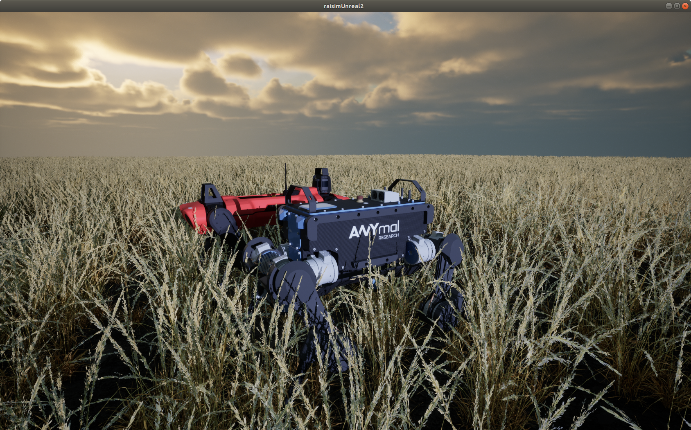

.. image:: ../image/raisimUnreal2.png
  :alt: raisimUnreal2
  :width: 800

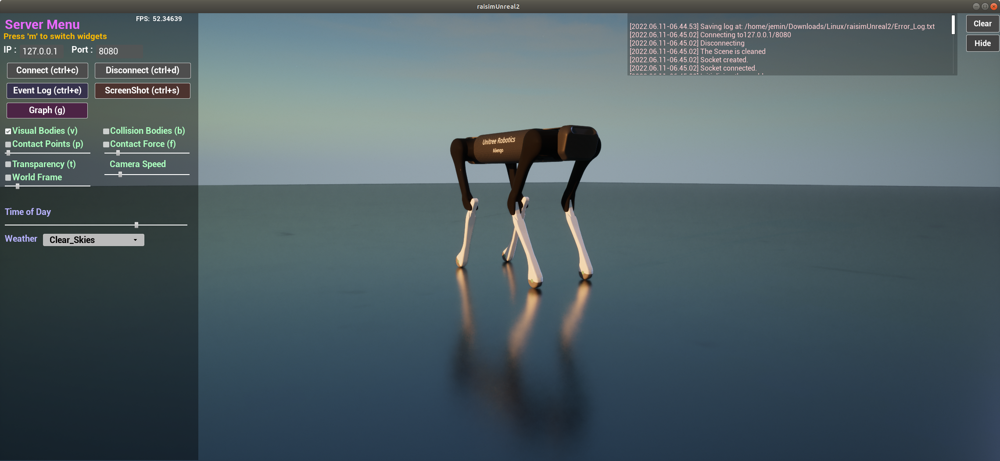

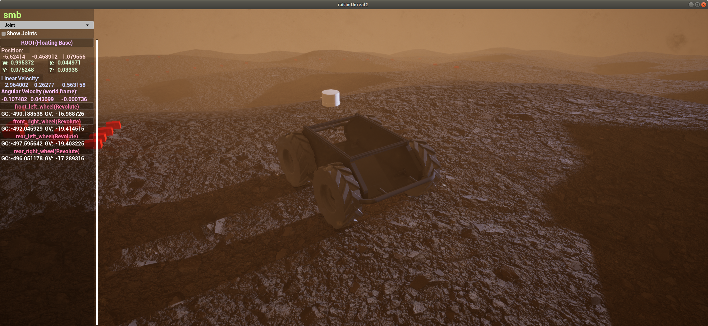

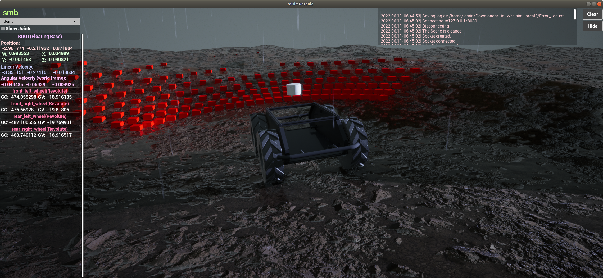

Compared to other visualizers, RaisimUnreal offers the highest visual fidelity.
It is graphics-intensive and requires a capable GPU for high FPS.
On Windows, Unreal Engine is highly optimized and can reach high frame rates.
On Linux, performance is generally lower.

Avoid using it during training, as it can slow training significantly.
It can utilize most of your GPU to maximize frame rate.
It is best suited for visualizing final policies after training.

To use RaisimUnreal, you do not need to modify server-side code.
From the server side, integration is the same as RaisimUnity.
Create the server instance (``raisim::RaisimServer``) and launch it (see the examples in
``examples/server``).

Why choose RaisimUnreal?
=============================================

The following features are only available in RaisimUnreal.

1. Add/remove objects dynamically in the visualizer (object spawner menu and ``del``)
2. Measure distance (``alt``)
3. Apply external force in the visualizer (``shift``)
4. Visualize maps (``raisim::RaisimServer::setMap``)

Detailed descriptions of these features appear below.
RaisimUnreal also provides the highest visual fidelity among the available options.

Prerequisites
========================

* Make sure you have a Vulkan-capable GPU
* On Linux, install Vulkan libraries: https://linuxconfig.org/install-and-test-vulkan-on-linux
* On Windows, a dialog guides dependency installation the first time you run the app.
* **Update your GPU driver. Use the version recommended by PyTorch or the latest available**

Grant permission to run the app
====================================
Your OS may flag this app because it is not notarized.
You can allow the OS to run the app as follows.

On Linux
***********
Open a terminal, go to the ``RaisimUnreal/linux`` directory, and run:

.. code-block:: bash

    chmod +x ./raisimUnreal.x86_64

On Windows
**************
Double-click the app and select "Run anyway."

Requirements
==========================

Windows
*********************
If you run the RaisimUnreal app, it will guide you through dependency installation.

Linux
*********************
* Ubuntu 20.04 or later (18.04 can work but requires careful dependency management)
* Vulkan: Follow the instructions at https://linuxconfig.org/install-and-test-vulkan-on-linux
* Latest graphics driver. If you use PyTorch, use the driver version installed with CUDA
  (following the PyTorch installation instructions). Otherwise, use the latest version.

User Interface
==========================
There are three top-level menu panels: the main menu, object list menu, and object spawner menu.
You can press ``m`` to cycle the panels or hide them.

The **main menu** contains connection, visualization, and interaction widgets.
Most items have a corresponding keyboard binding.

The **object list menu** lists all objects in the world.
You can click the object button to focus on the object.
You can also type in the search bar to find an object with a specific name (set via ``raisim::Object::setName``).

The **object spawner menu** allows you to spawn new objects into the map.
You can set the initial state of the object as well.

There are also a few sub-menus that can be created as needed.

The **object menu** is created when an object is focused.
You can focus on an object by clicking it in the scene or by selecting it in the object list menu.
You can also focus on an object from the server side using ``raisim::RaisimServer::focusOn``.
Once the object is focused, you can read about states of the object, frames associated with the object, and joints of the object.

The **event menu** is created when you press ``tab``.
It lists events that occurred during execution.
It can be useful for debugging.

The **graph menu** is created when you press ``g``.
It lists all graphs specified by the server (see the ``map_atlas_charts.cpp`` example for details).

Interaction
=================

Object deletion
*********************
Press ``del`` to delete the focused object.
You can focus on an object by left-clicking it or selecting it in the object list menu.

Object spawning
*********************
You can find the object spawner menu by pressing ``m`` a few times.
There are eight object types available.
Click on the object you want to spawn and fill in the other parameters that are activated in the object spawner menu.
Press ``enter`` or click the button to spawn the object.

Apply force
*********************
You can apply external forces by pressing ``shift`` and dragging the object.
The force model is spring-based, so the applied force scales with the drag distance.
Release the left mouse button to stop applying the force.

Measure position or distance
************************************
You can press ``alt`` and ``left-click`` on an object to specify a *point of interest*.
If there is one *point of interest*, the ruler will measure a position.
If there are two, the ruler will measure the displacement.

Time-series graphs and bar charts
======================================
You can add time-series graphs and bar charts.

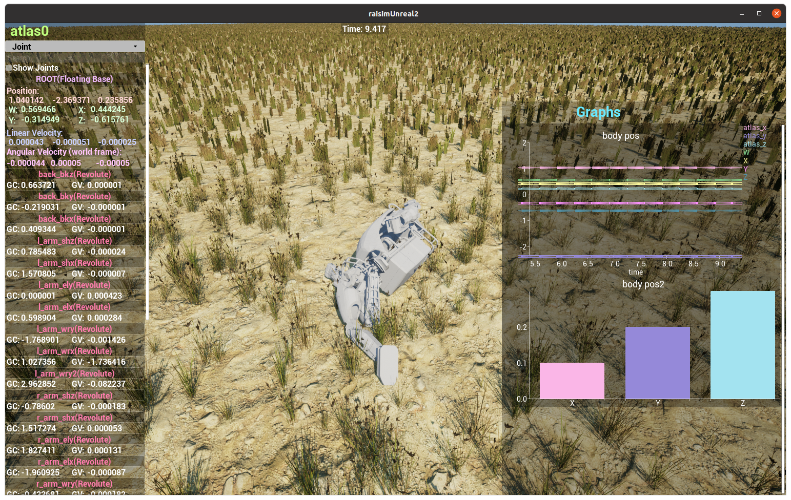

You can find an example `here <https://github.com/raisimTech/raisim2Lib/blob/master/examples/src/maps/map_atlas_charts.cpp>`__.

Maps
================================
You can use pre-configured maps in RaisimUnreal with ``RaisimServer::setMap``.
These maps are visually rich, but each map requires about 1 GB of storage.
This contributes to the large download size.

You should read the examples in ``examples/src/maps`` to understand how to use them.
Note that some objects have appearance "hidden".
This ensures they only appear in the simulation world, not in the visualization world.

Currently, the following maps are available.

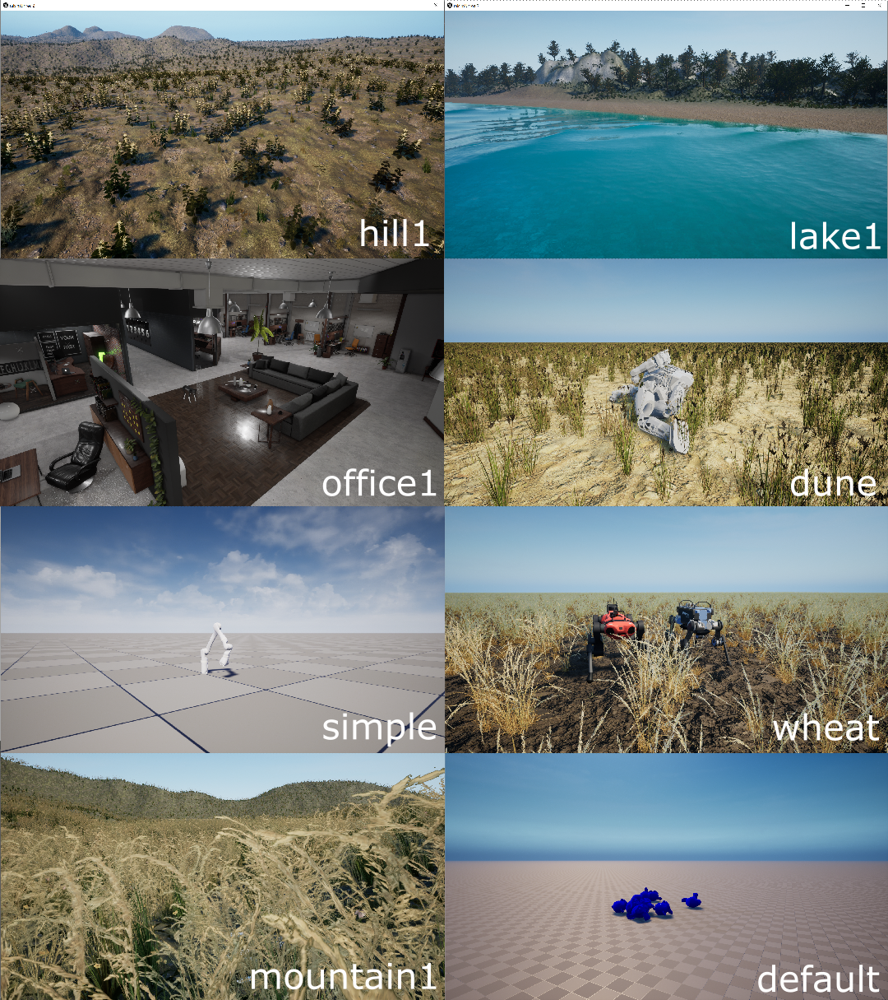

You can purchase a custom map.
Send a site description and reference images to receive a quote.
Note that the map can be as good as the data you provide.

Weather
====================
If you see a dropdown menu for weather on the main menu panel, that means that map supports dynamic weather.
If it does not support dynamic weather, it will support dynamic lighting so that you can move the light source around.
Weather-related computation and visualization are costly. Use a simpler map such as "simple" to reduce compute load.

Here is an example of weather changes

.. image:: ../image/rsu_weather.gif
  :alt: rsu_weather
  :width: 854

If the map supports dynamic weather, it also supports the "timeOfDay" option. You can drag the scroll bar to set the current time.

.. image:: ../image/rsu_timeOfDay.gif
  :alt: rsu_tod
  :width: 854

Video recording
=============================
RaisimUnreal uses ``ffmpeg`` to record your screen in Linux and Windows.
Install ffmpeg before using the screen recording feature.
On Windows, make sure that the directory containing the ffmpeg executable is added to your ``PATH`` environment variable.
This is the standard mechanism Windows uses to locate executables.

The options in the menu panel are passed to ffmpeg.
If you are unfamiliar with ffmpeg, review its options before modifying this feature.

Materials
==================================

A ``SingleBodyObject`` has an appearance attribute which can be set using ``setAppearance()``.
You can use the basic colors described `here <https://raisim.com>`__.
**If you want to hide the object, you can set the appearance to "hidden".**

RaisimUnreal also provides the additional appearances shown below

**marble1**

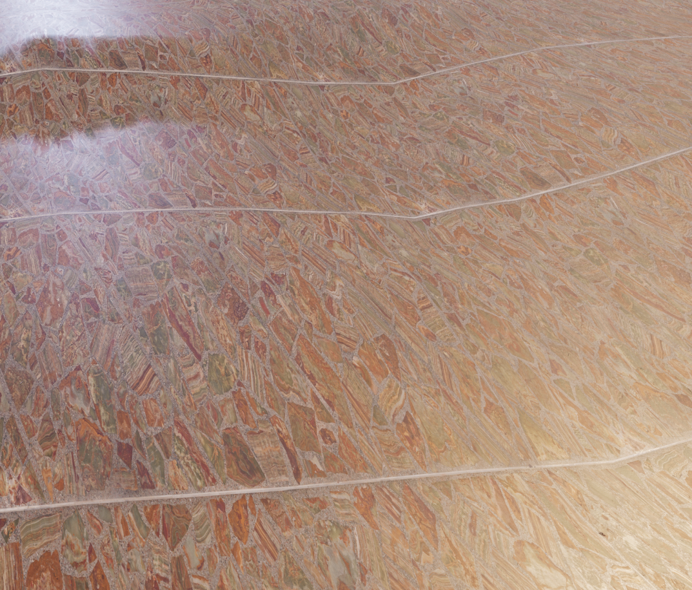

**marble2**

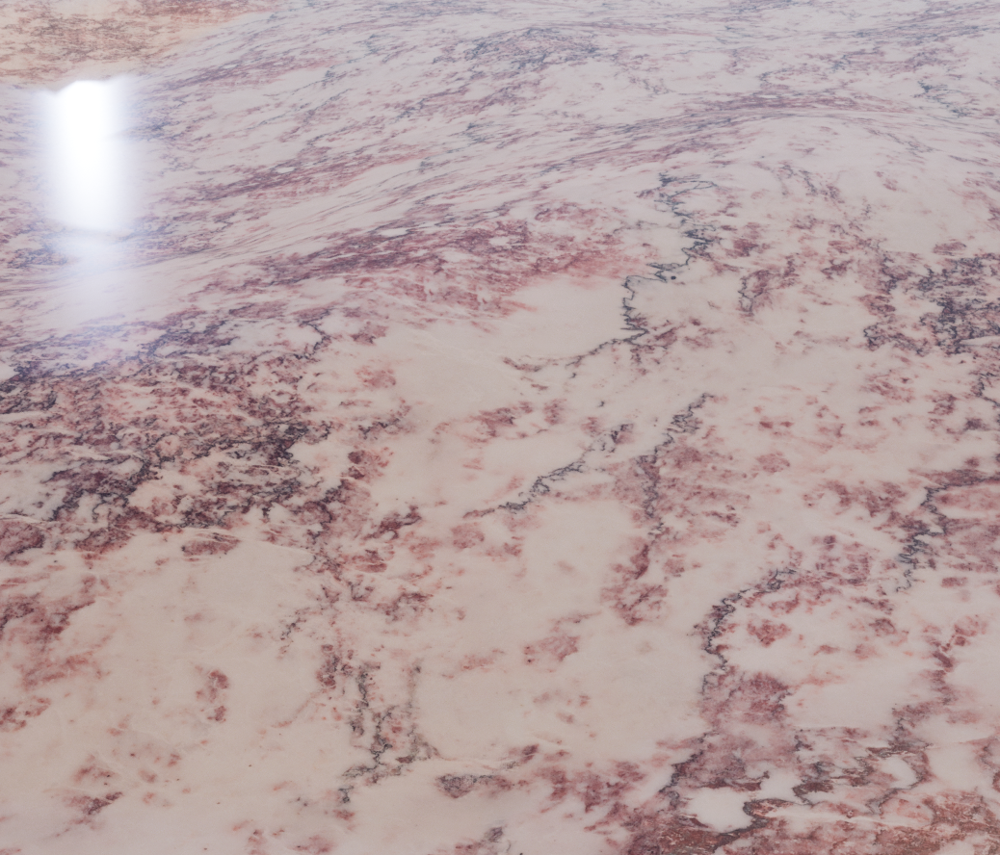

**marble3**

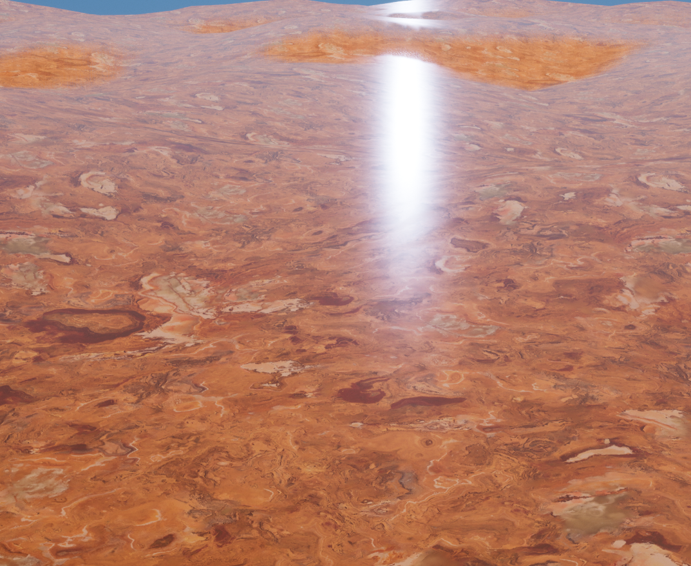

**marble4**

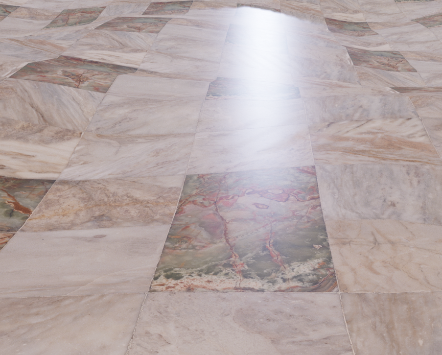

**soil1**

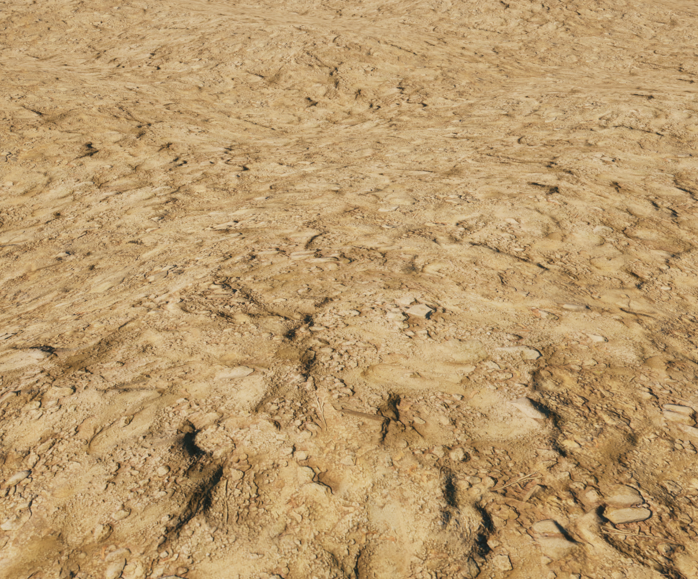

**soil2**

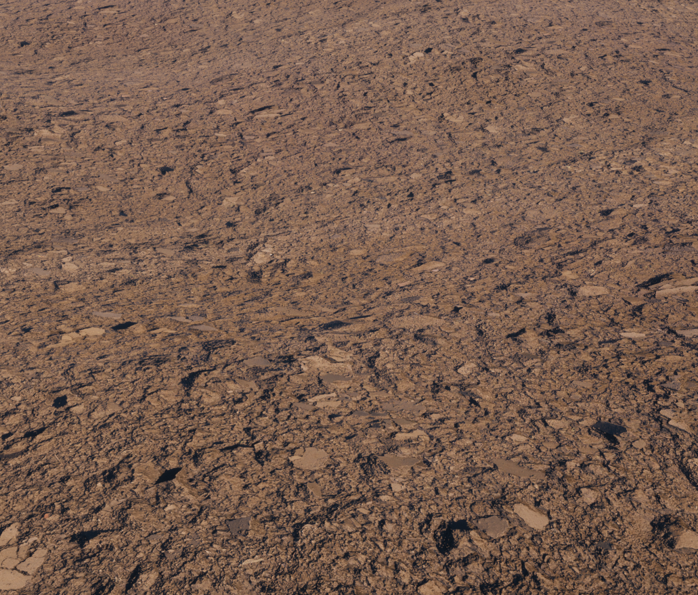

**wood1**

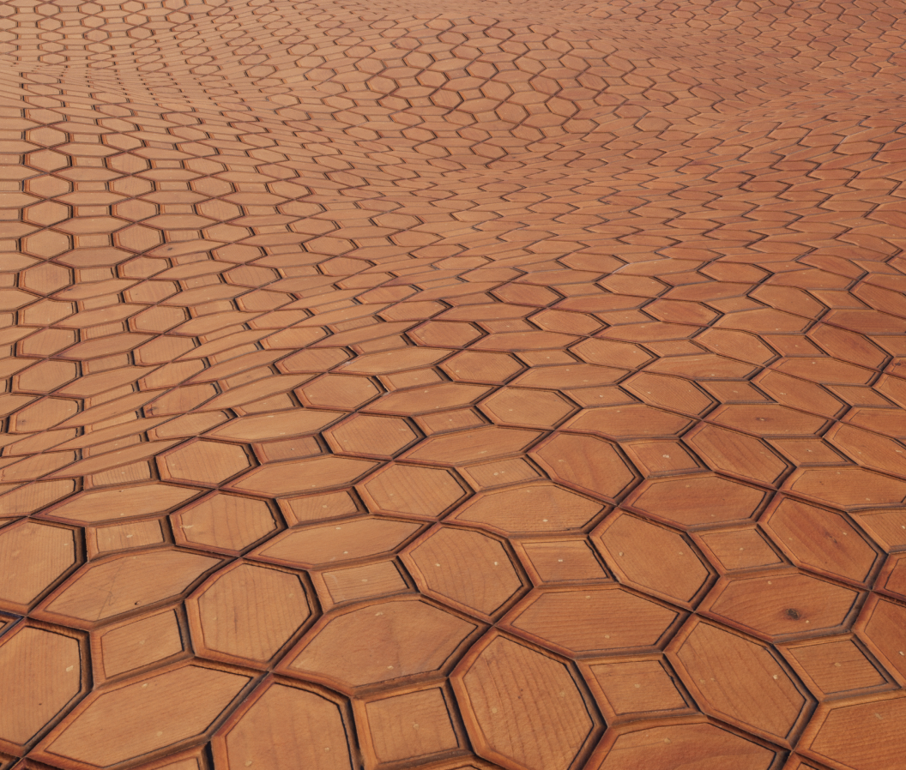

**wood2**

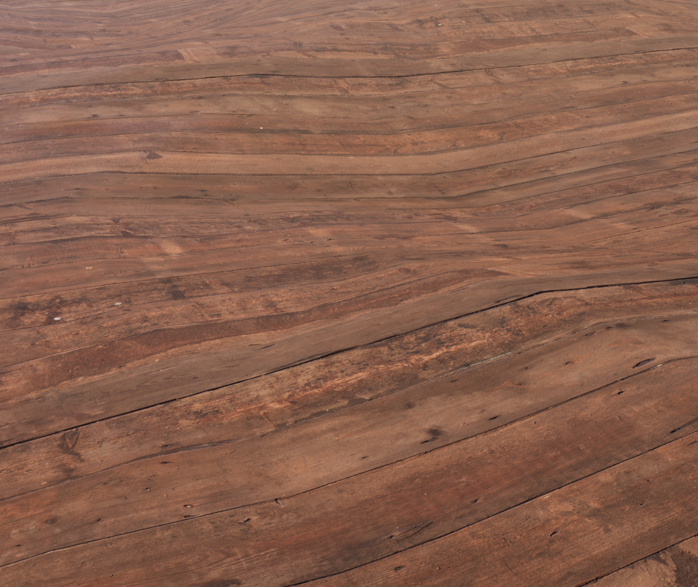

**steel**

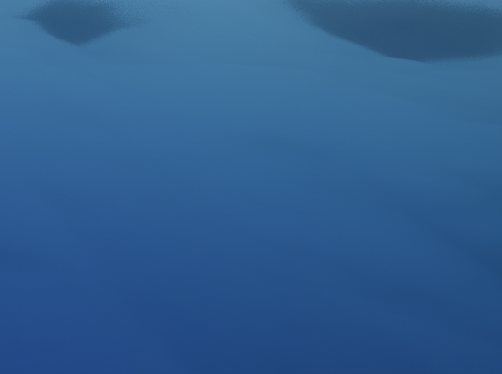

Troubleshooting and bug reporting
==================================

RaisimUnreal creates a log file ``Error_Log.txt`` inside the raisimUnreal2 folder.
If RaisimUnreal is not working properly, please read the log first.
If you cannot figure it out yourself, you can post an issue with the log file.
