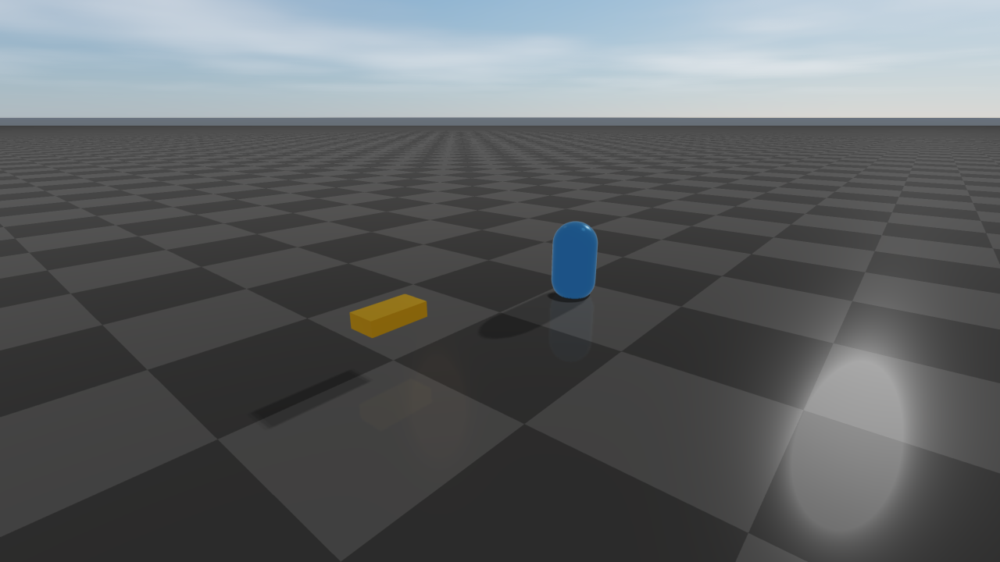

#############################
rayrai Visualizer
#############################

Overview
========
rayrai is an in-process C++ renderer for RaiSim. It renders into an offscreen OpenGL
texture and is designed to embed in custom UIs (ImGui, Qt, etc.) or headless pipelines.
RaisimUnity and RaisimUnreal are no longer supported; rayrai is the supported
visualization path. It runs inside the simulation process and exposes direct
access to render targets, picking, and custom visuals.

Key characteristics:

* In-process rendering with direct OpenGL texture access, plus the standalone TCP viewer for ``RaisimServer`` scenes
* ``Fast``/``Balanced``/``High``/``Ultra`` quality presets with explicit settings for shadows, post-process, render scale, and texture filtering
* glTF/GLB visual-scene import with PBR materials, normal maps, authored lights, HDR image-based lighting, reflection probes, and planar reflections
* Glass materials (``Material::glass``) with screen-space refraction or opt-in geometry-traced refraction, optionally accelerated by Vulkan hardware ray queries on Linux and Windows
* Dense instanced foliage with automatic mesh LOD, wind, shadow LOD, and asynchronous loading with reusable LOD cache files
* Weather and scene effects: time-of-day sky, fog/local fog, rain, snow, lightning diagnostics, wet/snow material response, projected decals, and irradiance volumes
* Capture and diagnostics helpers for screenshots, debug passes, GPU pass timings, exposure/luminance analysis, and JSON reports
* Support for RGB/depth sensor alignment, GPU LiDAR slices, point clouds, coordinate frames, camera frustums, and picking
* Automatic spatial tendon rendering with wrapped routes and independent pulley branches; see :doc:`tendons/Examples`
* Direct ImGui/SDL2 integration patterns and headless/offscreen workflows

The public API lives in the ``raisin`` namespace (note the spelling). The primary entry
point is ``raisin::RayraiWindow``.

.. toctree::
   :maxdepth: 1
   :caption: rayrai topics

   rayrai/RenderQuality
   rayrai/Lighting
   rayrai/Materials
   rayrai/Visuals
   rayrai/Foliage
   rayrai/PostProcess
   rayrai/Weather
   rayrai/Capture
   rayrai/Sensors
   rayrai/Examples
   rayrai/Performance

Dependencies
============
rayrai depends on RaiSim, SDL2, OpenGL, glbinding, glm, assimp, stb, imgui, and
Eigen. The flat ``rayrai`` prefix ships the headers, libraries, and CMake
configuration for glbinding, glm, imgui, and stb. assimp ships in the ``raisim``
prefix, so downstream projects need both prefixes. SDL2 and Eigen come from the
system package manager, or from vcpkg on Windows.

Vulkan is optional. A rayrai build with Vulkan support (Linux and Windows only)
loads the Vulkan runtime the first time geometry-traced glass renders and falls
back to OpenGL tracing when hardware ray queries are unavailable.
For source-build prerequisites and driver checks, see
:ref:`rayrai-vulkan-ray-query-troubleshooting`.

.. _rayrai-platform-support:

Platform support
================
The rayrai context helpers (``ExampleApp`` in ``rayrai/example_common.hpp`` and
``RayraiWindow::createOffscreenGlContext``) request an OpenGL 4.3 core-profile
context and fall back to 3.3 core. When the application creates the context
itself, use a core profile of version 3.3 or newer. Features that need more than
the base context fall back automatically:

* GPU instance culling needs compute shaders (OpenGL 4.3), and
  multi-draw-indirect submission needs OpenGL 4.3 or
  ``GL_ARB_multi_draw_indirect``. Without them rayrai culls on the CPU and
  issues one draw per mesh. Hi-Z occlusion culling builds its depth pyramid
  with compute where available and by rasterization otherwise.
* Geometry-traced glass uses Vulkan hardware ray queries when they are
  available and the portable OpenGL tracer otherwise.

macOS provides OpenGL 4.1 with 16 fragment texture units, so rayrai uses its
limited material tier and the common post-process program there (see the GPU
capability tiers in :doc:`rayrai/Materials`). The same applies to any GPU that
reports 16 or fewer fragment texture units. The common program applies depth
of field, FXAA, bloom, SSAO, TAA, white balance, and saturation. Effects that
need the full post-process program have no effect on these platforms:
screen-space reflections, screen-space indirect lighting, volumetric fog and
lighting, local fog volumes, projected decals, light shafts, lens flares,
contact shadows, motion and zoom blur, aerial perspective, color grading,
vignette, chromatic aberration, film grain, and the stylized filters.
Vulkan ray queries are not available on macOS.

Source-built TCP viewer (recommended)
=====================================
For most users, the easiest way to use rayrai is the source-built TCP viewer
at ``build-examples/examples/rayrai_tcp_viewer``. It connects to a
running ``RaisimServer`` and provides full PBR rendering, scene inspection,
interactive pause / step / force application, screenshots, and session
recording.

.. code-block:: bash

    ./build-examples/examples/rayrai_tcp_viewer

See :doc:`RayraiTcpViewer` for the full UI tour, command-line options,
the sim-control workflow, authentication setup, and the wire-format
reference for writing custom clients.

Build and link
==============
rayrai installs a CMake package under ``rayrai``. Add it to
``CMAKE_PREFIX_PATH`` and link the ``rayrai`` target.

.. code-block:: cmake

    find_package(rayrai CONFIG REQUIRED)

    add_executable(my_app main.cpp)
    target_link_libraries(my_app PRIVATE rayrai)

In practice, you will also set the Raisim prefix (for example, ``-DCMAKE_PREFIX_PATH``)
to include both ``raisim`` and ``rayrai``.

Minimal usage
=============
The typical workflow is:

1. Make an OpenGL context current (your UI's, or a hidden one from
   ``RayraiWindow::createOffscreenGlContext``).
2. Create a RaiSim world.
3. Construct a ``raisin::RayraiWindow`` for that world.
4. Update the renderer each frame and consume the output texture.

.. code-block:: cpp

    #include <memory>

    #include <raisim/World.hpp>
    #include <rayrai/RayraiWindow.hpp>

    int main() {
      // rayrai issues OpenGL calls, so a context must be current first.
      SDL_Window* window = nullptr;
      SDL_GLContext context = nullptr;
      raisin::RayraiWindow::createOffscreenGlContext(window, context);

      auto world = std::make_shared<raisim::World>();
      world->addGround();
      raisin::RayraiWindow viewer(world, 1280, 720);

      // glm::vec4 colour overload (preferred in new code).
      auto sphere = viewer.addVisualSphere("goal", 0.2, glm::vec4(0.9f, 0.2f, 0.2f, 1.0f));
      sphere->setPosition(0.0, 0.0, 1.0);

      while (true) {
        world->integrate();
        viewer.update(1280, 720, false, 0, 0, false);
        unsigned int tex = viewer.getImageTexture();
        (void)tex; // use the texture in your UI or pipeline
      }
    }

.. image:: ../../rsc/docs/image/rayrai/rayrai_minimal_usage.png
   :alt: Minimal usage output — a red sphere above a ground plane
   :width: 100%

If you are integrating with an existing OpenGL context, see :doc:`rayrai/Capture` for
``RayraiWindow::createOffscreenGlContext`` / ``makeOffscreenContextCurrent`` and a
full headless capture-to-PNG example.

Threading contract
==================
``RayraiWindow`` is single-threaded by default. Construct it with the default
``RayraiWindow::ThreadingMode::SingleThread`` when the simulation and renderer
live on one thread, which is the normal RaiSim workflow.

``ThreadingMode::MultiThread`` is an explicit opt-in for batch/offscreen render
setups that create one ``RayraiWindow`` per worker thread, each with its own
OpenGL context. Each renderer belongs to its worker: construct, render, read
back, edit, and destroy it on that thread with its context current, and do not
step or edit its world on another thread while it renders. Create and destroy
SDL windows on the main thread. A context created there with
``createOffscreenGlContext`` is current on the main thread; release it with
``RayraiWindow::detachOffscreenGlContext`` before a worker adopts it with
``makeOffscreenContextCurrent``. Contexts in one share group share immutable
untextured mesh geometry; textures and textured models are uploaded separately
for each context.

Do not mix threading modes inside one process; all renderers, including shader
prewarmers, must use the same mode. A threading-mode mismatch at construction
is reported through RaiSim's fatal handler (``RSFATAL``), which exits the
process unless the application installs another handler with
``raisim::RaiSimMsg::setFatalCallback``.

Several renderers in one process read the same SDL keyboard state. Call
``setKeyboardInputEnabled(false)`` and ``setKeyboardShortcutsEnabled(false)`` on
renderers without focus so that one key press does not move every camera or
trigger every shortcut.

Lifetime and error model
========================
``RayraiWindow`` has two world constructors. The
``std::shared_ptr<raisim::World>`` overload keeps a reference to the world, so
the world stays alive at least as long as the window. The ``raisim::World&``
overload does not own the world; that world must outlive the window.
``swapWorld`` switches the renderer to another shared world.

Named entities are strict. ``addVisual*``, ``importVisualScene``,
``addInstancedVisuals``, ``addPointCloud``, and ``addCoordinateFrame`` abort
through RaiSim's fatal handler (``RSFATAL``) when the name is already in use,
and ``getVisualObject``, ``getInstancedVisuals``, ``removeVisualObject``,
``removeInstancedVisuals``, ``removePointCloud``, and ``removeCoordinateFrame``
abort when it does not exist. Use ``findVisualObject`` or
``findInstancedVisuals`` for a lookup that returns ``nullptr`` instead.
Clear-all calls such as ``clearAdditionalLights`` and ``clearLocalFogVolumes``
are safe to call when there is nothing to clear.

Texture and environment creators signal failure with a zero GL handle or an
``isComplete() == false`` ``PbrEnvironment`` and log an error to stderr:
``loadColorTextureWithTiling``, ``loadDataTextureWithTiling``,
``loadHdrEquirectangularCubemap``, ``createHdrIrradianceCubemap``,
``createHdrPrefilteredEnvironmentCubemap``, ``createSplitSumBrdfLut``, and
``PbrEnvironment::loadFromHdrFile``. ``addVisualMesh`` and
``importVisualScene`` always return a visual; when the file cannot be imported
they log an error to stderr and the visual draws nothing.

Newer APIs report invalid input with exceptions. ``setSkyVisibilityGrid`` and
``setBakedIrradianceGrid`` throw ``std::invalid_argument`` for an invalid grid,
strength, or edge fade, or a grid larger than the GPU texture limit, and
``std::runtime_error`` when no GL context is current or no texture unit is
free. With ``RenderQualitySettings::geometryRefraction`` enabled, render
calls throw ``std::runtime_error`` when the scene cannot be traced: a fisheye
camera, glass with a visibility-range fade, unsupported glass material settings
such as overlays, deformable boundaries, or inconsistent IOR within one volume,
more than 16 media containing the camera, scenes beyond the tracer's capacity,
or an explicitly requested ``GeometryRefractionBackend::VulkanRayQuery`` that is
unavailable. See the geometry-aware refraction section of
:doc:`rayrai/Materials`. ``createOffscreenGlContext`` reports window or context
creation failure through ``RSFATAL``.

Built-in shader programs are registered during construction and compiled
lazily on first use. ``shaderWarmupDiagnostics`` reports the measured
compile/link cost and linked program count so both startup stalls and
first-use stalls (when an effect is enabled for the first time) can be
tracked.

Example: custom visuals + background color
==========================================
This example adds a custom box, renders an RGB texture each frame, and reads the
image texture handle for UI integration. New code should prefer explicit color-range
APIs such as ``setBackgroundColorRgb255`` or ``setBackgroundColorLinear``. The
background colour shows only where no sky is drawn, so the example turns off the
procedural sky, which is on by default. ``setRenderQualitySettings`` also
replaces the background colour with ``backgroundColorRgb255``, so set the
colour after it.

.. code-block:: cpp

    #include <memory>

    #include <raisim/World.hpp>
    #include <rayrai/RayraiWindow.hpp>

    int main() {
      SDL_Window* window = nullptr;
      SDL_GLContext context = nullptr;
      raisin::RayraiWindow::createOffscreenGlContext(window, context);

      auto world = std::make_shared<raisim::World>();
      world->addGround();

      raisin::RayraiWindow viewer(world, 1280, 720);
      auto quality = viewer.getRenderQualitySettings();
      quality.proceduralSkyBackgroundEnabled = false;  // show the clear colour
      viewer.setRenderQualitySettings(quality);
      viewer.setBackgroundColorRgb255({40, 45, 55, 255});

      auto box = viewer.addVisualBox("marker", 0.4, 0.2, 0.1,
        glm::vec4(0.9f, 0.6f, 0.1f, 1.0f));
      box->setPosition(1.0, 0.0, 0.3);

      while (true) {
        world->integrate();
        viewer.update(1280, 720, false, 0, 0, false);
        unsigned int colorTex = viewer.getImageTexture();
        (void)colorTex; // feed into your UI or pipeline
      }
    }

Where to go next
================
* Choose a render preset and tone curve — :doc:`rayrai/RenderQuality`
* Light the scene and set up HDR/IBL reflections — :doc:`rayrai/Lighting`
* Apply PBR materials and authored asset imports — :doc:`rayrai/Materials`
* Add visual primitives, instanced visuals, and overlays — :doc:`rayrai/Visuals`
* Render dense vegetation with wind, leaf lighting, and LOD — :doc:`rayrai/Foliage`
* Enable cinematic post-process / SSR / SSAO / DoF — :doc:`rayrai/PostProcess`
* Drive weather and atmospherics — :doc:`rayrai/Weather`
* Run headlessly, capture screenshots, and run diagnostics — :doc:`rayrai/Capture`
* Align to RGB/depth/LiDAR sensors and pick objects — :doc:`rayrai/Sensors`
* Write a custom TCP client — :doc:`RayraiTcpViewer`
* List of shipped example targets — :doc:`rayrai/Examples`
* Check OpenGL requirements and macOS limits — :ref:`rayrai-platform-support`
* Performance notes and the full C++ API reference — :doc:`rayrai/Performance`
