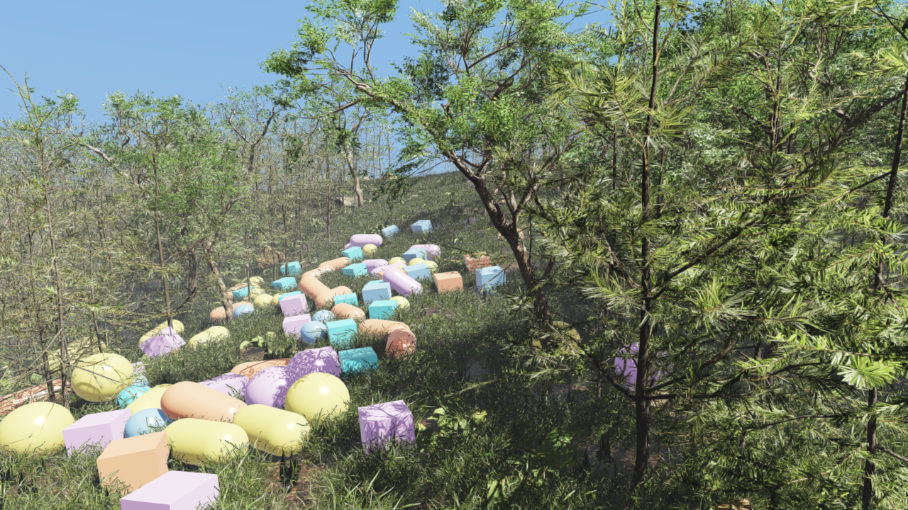

#################
Rayrai TCP Viewer
#################

``rayrai_tcp_viewer`` is the recommended visualizer for ``RaisimServer``
simulations. It connects to a running server over TCP, renders the world with
the full rayrai pipeline (PBR, image-based lighting and post-processing), and
lets you pause, step, push and reposition objects without touching the
simulation code.

This page covers the viewer application (panels, controls, command-line
options) and the wire format for writing custom clients. Applications that
embed the renderer with ``raisin::RayraiWindow`` do not use this binary; see
:doc:`Rayrai` for that in-process path. For the server-side API the viewer
talks to, see :doc:`RaisimServer`.

The binary packages ship the rayrai library but not the viewer executable. The
viewer's sources live in this repository under ``examples/src/rayrai/tools``,
and the examples CMake project builds the ``rayrai_tcp_viewer`` target from
them. Each checkout pins one RaiSim release, and its viewer sources match that
release's rayrai library (see :doc:`Installation`). After updating the
checkout, configure it again, which downloads the pinned packages, and rebuild
``rayrai_tcp_viewer``.

.. figure:: ../../rsc/docs/image/rayrai/tcp_viewer/tcp_viewer_data_flow.svg
   :width: 100%
   :alt: TCP viewer connection, scene update, sensor, and control data flow

   One TCP connection carries scene updates, interactive control requests, and
   RGB/depth sensor requests. UDP beacons are only used to discover compatible
   servers; a direct host and port always works without discovery.

.. figure:: ../../rsc/docs/image/rayrai/tcp_viewer/tcp_viewer_primitives.png
   :width: 100%
   :alt: rayrai TCP viewer connected to primitive_grid

   The viewer connected to the ``primitive_grid`` example. It uses the same
   rayrai PBR pipeline as the in-process ``RayraiWindow``: procedural sky,
   directional shadows, and the reflective checker ground of the Balanced,
   High and Ultra presets.

.. contents::
   :local:
   :depth: 2

Quick start
===========
1. Start any ``RaisimServer`` example. The server listens on ``127.0.0.1:8080``
   by default.
2. Launch the viewer:

   .. code-block:: bash

       ./build-examples/examples/rayrai_tcp_viewer

3. On first launch the viewer connects to ``127.0.0.1:8080``. Later launches
   reconnect each pane to the endpoint it last used (see `Persistence`_)
   unless ``--host``, ``--port`` or ``--connect host:port`` names another. To
   change the endpoint, edit the host and port fields in the endpoint popup of
   the **Connection** tab, or click a server in the table of a pane that has
   no session.

To run a RaiSim world file without writing a server program, drop the world XML
onto the viewer or pass ``--simulate world.xml``; see `Local world simulation`_.

Run ``./build-examples/examples/rayrai_tcp_viewer --help`` for the full option
list. On Windows the executable is ``.\build-examples\bin\rayrai_tcp_viewer.exe``.
The TCP client and server discovery work the same on Windows, Linux and macOS.

Desktop launcher (Linux)
========================
``scripts/install_rayrai_viewer_launcher.sh`` registers the viewer as a regular
desktop application, so it can be started from the Activities overview or pinned
to the GNOME / Ubuntu dock instead of a terminal:

.. code-block:: bash

   scripts/install_rayrai_viewer_launcher.sh              # install and pin
   scripts/install_rayrai_viewer_launcher.sh --no-pin     # install only
   scripts/install_rayrai_viewer_launcher.sh --uninstall  # remove everything

It writes three things, all under the invoking user's ``~/.local`` (no root, no
system-wide state). Re-running it is safe:

.. list-table::
   :header-rows: 1
   :widths: 42 58

   * - Path
     - Purpose
   * - ``~/.local/bin/rayrai-tcp-viewer``
     - Wrapper that sources ``raisim_env.sh`` before exec'ing the viewer. The
       dock launches applications with a bare environment, so without it
       ``raisim/lib`` and ``rayrai/lib`` are missing from ``LD_LIBRARY_PATH``
       and the viewer exits immediately.
   * - ``~/.local/share/applications/rayrai-tcp-viewer.desktop``
     - The desktop entry. Its ``StartupWMClass`` matches the ``WM_CLASS`` the
       wrapper sets, so a running viewer groups under the pinned icon rather
       than appearing as a second dock entry.
   * - ``~/.local/share/icons/hicolor/<size>/apps/rayrai-tcp-viewer.png``
     - The RaiSim logo, centered on a rounded light-grey plate and rendered at
       each icon size (icon themes expect a PNG whose size matches its
       directory). Without the plate, the logo's transparent lower third
       leaves the mark sitting high, and its dark wordmark disappears against
       a dark dock. Without ImageMagick the script falls back to an absolute
       ``Icon=`` path that points at the unmodified logo.

Useful options:

.. list-table::
   :header-rows: 1
   :widths: 28 72

   * - Option
     - Effect
   * - ``--viewer PATH``
     - Executable to launch. Defaults to
       ``<repo>/build-examples/examples/rayrai_tcp_viewer``.
   * - ``--repo PATH``
     - Repository root, used to find ``raisim_env.sh`` and the logo.
   * - ``--config CFG``
     - Do nothing unless ``CFG`` is ``Release``. Used by the CMake hook below;
       without the option the script always installs.
   * - ``--icon-shape SHAPE``
     - Plate shape behind the logo: ``rounded`` (default), ``circle`` or
       ``square``.
   * - ``--icon-background COLOR``
     - Plate fill, as any color ImageMagick accepts. Defaults to ``#dedede``;
       pure white reads as a hard slab in the dock and gives the logo's own
       white ribbon nothing to separate from.
   * - ``--pin`` / ``--no-pin``
     - Add the launcher to the dock favorites (the default), or install it
       without touching them.
   * - ``--quiet``
     - Only report failures.
   * - ``--uninstall``
     - Remove the wrapper, desktop entry, icons and dock entry.

The desktop entry also sets ``Path=`` to the directory holding the executable,
and the wrapper leaves any working directory that contains a ``.raisim``
directory. Both avoid the same startup crash: the activation key is read from
the relative path ``.raisim`` rather than ``$HOME/.raisim``. A dock launch
starts in ``$HOME``, where ``.raisim`` is a directory, so the viewer would try
to read that directory as a key file and abort before its window appears.

The launcher points at the build-tree executable, so re-run the script if the
repository moves or the build directory is deleted.

Installing it from the build
----------------------------
Configuring the examples with ``RAISIM_EXAMPLE_DESKTOP_LAUNCHER`` adds a
post-build step that runs the script after every Release build of the
``rayrai_tcp_viewer`` target, keeping the launcher pointed at the current
executable:

.. code-block:: bash

   cmake -S . -B build-examples -DCMAKE_BUILD_TYPE=Release \
     -DRAISIM_EXAMPLE_DESKTOP_LAUNCHER=ON

The option is cached, so it stays enabled for that build tree until it is set
back to ``OFF``. It defaults to ``OFF`` so that building the examples does not
rearrange anyone's dock. The post-build step never fails a build: it exits
quietly on non-Linux hosts, on non-Release configurations and on machines with
no graphical session, so continuous integration is unaffected.

Server discovery
================
While running, ``RaisimServer`` sends a UDP discovery beacon once per second to
port ``59312``. With the default loopback bind, the beacon is sent to
``127.0.0.1``. After ``server.setBindLoopbackOnly(false)``, the beacon is
broadcast on the local network.

The viewer listens on the same UDP port (one listener serves every pane) and
drops a server about eight seconds after its last beacon. A beacon is
compatible when its protocol version equals the viewer's own
(``kProtocolVersion``); other beacons are hidden, and the endpoint popup says
which version it lists. Compatible servers appear in the server table of a pane
that has no session, and in the endpoint popup of the **Connection** tab once
the pane has one. Both lists refresh at least every two seconds, so there is no
rescan button. Discovery only fills these lists: ``--connect host:port`` and
typed endpoints work even when UDP broadcast is blocked.

The beacon carries the server's executable name (on Linux; other platforms
report ``RaisimServer``), host name, bind mode, and whether its single client
seat is taken. These fill the table's **Name**, **Computer** and
**Availability** columns.

For cross-machine connections on Windows, allow both the TCP server port
(default ``8080``) and UDP discovery port ``59312`` through the firewall.

Local world simulation
======================
Drop a RaiSim world XML (root element ``<raisim>``) onto a pane, or start the
viewer with ``--simulate world.xml``, and the viewer runs that world itself:

- **Child process.** The world is loaded and stepped in a child process (the
  viewer executable itself, started in an internal worker mode). A long model
  import does not block the UI, and a world that fails does not take the viewer
  down.
- **Connection.** The child serves the world with a ``RaisimServer`` bound to
  ``127.0.0.1`` only, on port ``20000 + (process id mod 20000)`` or the next
  free port, and the pane connects to it automatically. From then on the pane
  behaves like any other connection: simulation control, sensors and recording
  all work.
- **Timing.**

  - The world stays at its initial state until the viewer first connects.
  - It then steps in real time at the XML's own time step.
  - If it falls more than 100 ms behind, it drops the backlog instead of
    fast-forwarding.

- **Mesh paths.** Meshes resolve from the XML's folder and its ``assets``
  subfolder, in addition to the resource directories.
- **Stopping.**

  - The Connection tab shows ``Local world: <file>`` next to a
    **Stop simulation** button.
  - Stopping, disconnecting, dropping another file, closing the pane or
    quitting the viewer ends the child. On Linux and macOS it gets
    ``SIGTERM``, then ``SIGKILL`` after 200 ms; on Windows it is terminated
    if it has not exited after 200 ms.
  - The child also exits on its own when the viewer's end of their pipe
    closes, so it does not outlive a crashed viewer. On Windows a job object
    ensures the same.

- **Activation key.** ``--activation-key`` is passed on to the child.
- **Failures.** If the world does not load, the status line reads
  ``Simulation stopped:`` followed by RaiSim's error and the end of the
  child's log. Startup gives up after five minutes. The log and the endpoint
  file live in a temporary ``rayrai-simulation-*`` folder that is removed when
  the simulation stops.

Dropping another world replaces the running one, and dropping a world on a pane
that is connected to an external server disconnects it first. Dropping a URDF
(``<robot>``) or MJCF (``<mujoco>``) file opens the model inspector instead
(see `Articulated-system inspector mode`_) and stops a local world; a model drop
on a pane connected to an external server is refused, so disconnect first.

Command-line options
====================
.. list-table::
   :header-rows: 1
   :widths: 28 72

   * - Option
     - Effect
   * - ``--host HOST`` / ``--port PORT``
     - Set the host and the port separately. Defaults are ``127.0.0.1`` and
       ``8080``.
   * - ``--connect HOST:PORT``
     - Set host and port together; IPv6 addresses use ``[addr]:port``. An
       endpoint given on the command line replaces only the first pane's saved
       endpoint.
   * - ``--auto-connect`` / ``--no-auto-connect``
     - Whether to dial the server on launch and keep retrying while
       disconnected. This also applies to panes restored from the saved layout.
       The environment variable ``RAYRAI_TCP_VIEWER_AUTO_CONNECT`` sets the
       default.
   * - ``--simulate FILE``
     - Run a RaiSim world XML in a simulation process owned by the viewer and
       connect to it (see `Local world simulation`_). The viewer exits with code
       1 if the file is not a world or the simulation stops before the first
       connection.
   * - ``--activation-key FILE``
     - RaiSim activation key for the viewer and any local simulation it starts.
   * - ``--no-save-settings``
     - Do not write ``settings.yaml`` during this session, so layout and
       preference changes are discarded at exit.
   * - ``--inspect FILE``
     - Open a URDF or MJCF file in the articulated-system inspector at launch
       (see `Articulated-system inspector mode`_). Disables auto-connect.
   * - ``--no-pre-warm``
     - Skip the shader pre-warm pass. Startup is faster, but the first frame
       with content may stall while shaders compile.
   * - ``--warm-at-startup``
     - Also run the heavier renderer warm-up for the first content frame at
       startup, so that the first loaded model (for example a dropped URDF)
       appears immediately. Useful for demos.
   * - ``--resource-dir PATH``
     - Add a mesh/resource search directory. Repeat the option for multiple
       directories. The directories are also added to the saved
       **Resource directories** list.
   * - ``--window-size WxH`` / ``--fullscreen``
     - Set the initial window size (``WxH`` or ``W,H``, from 320x240 to
       16384x16384), or start in desktop fullscreen.
   * - ``--minimize-panels``
     - Start with both side panels collapsed, leaving the scene unobstructed.
       Also set by ``RAYRAI_TCP_VIEWER_MINIMIZE_PANELS``.
   * - ``--keep-overlay-open``
     - Disable auto-collapse of the left overlay. Useful for documentation
       screenshots and recorded demos.
   * - ``--auto-frame``
     - Frame the scene after the first state update.
   * - ``--camera-lookat px,py,pz,tx,ty,tz``
     - Set an explicit camera position and target.
   * - ``--camera-offset x,y,z``
     - Set the follow-camera offset from its target.
   * - ``--force-camera-lookat``
     - Reapply ``--camera-lookat`` every frame instead of only at startup.
   * - ``--screenshot PATH``
     - Save the rendered scene texture to ``PATH`` after the first valid scene
       frame, then exit. The PNG excludes ImGui panels and window decorations.
   * - ``--screenshot-dir PATH``
     - Initial **Output folder** of the **Record** tab: screenshots (F12), PNG
       sequences, videos, session logs, signal CSV exports and recordings
       requested by the server. Defaults to the working directory.
   * - ``--record-session PATH.rrtcs``
     - Record the raw TCP stream to a session file for later replay.
   * - ``--update-rate HZ``
     - Target TCP scene-update request rate, 15-120 Hz (default 60 Hz). The
       value is saved as ``tcp_update_rate_hz``. Values outside that range are
       rejected and the viewer exits with code 2.
   * - ``--replay-session PATH.rrtcs``
     - Replay a recorded session instead of opening a TCP connection.
       Disables auto-connect.
   * - ``--replay-speed N``
     - Playback rate multiplier (1.0 = real time), greater than 0 and at most
       100.
   * - ``--replay-loop``
     - Loop the recorded session when replay reaches the end.
   * - ``--export-scene PATH.json``
     - Write the parsed scene graph as JSON once the first scene with objects
       arrives. The viewer keeps running; combine with ``--exit-after`` for
       batch use.
   * - ``--trajectory-csv PATH``
     - Log object poses to CSV while updates arrive.
   * - ``--server-list PATH``
     - Load additional ``host:port`` endpoints from a text file.
   * - ``--wait-for-server SECONDS``
     - For batch runs: exit if the first connection has not succeeded within
       this wall-clock time.
   * - ``--exit-after SECONDS``
     - Exit after the given wall-clock duration.
   * - ``--help`` / ``-h``
     - Print the authoritative option list for this build.

Environment variables
---------------------
.. list-table::
   :header-rows: 1
   :widths: 40 60

   * - Variable
     - Effect
   * - ``RAYRAI_TCP_VIEWER_AUTO_CONNECT``
     - Boolean; ``0``, ``false``, ``off`` or ``no`` turn auto-connect off.
   * - ``RAYRAI_TCP_VIEWER_MINIMIZE_PANELS``
     - Same as ``--minimize-panels``. Only its presence is checked, so any
       value, including ``0``, enables it.
   * - ``RAYRAI_TCP_VIEWER_AUTO_FRAME``
     - Same as ``--auto-frame`` (presence only).
   * - ``RAYRAI_TCP_VIEWER_FORCE_CAMERA_LOOKAT``
     - Same as ``--force-camera-lookat`` (presence only).
   * - ``RAYRAI_TCP_VIEWER_CAMERA_LOOKAT``
     - ``px,py,pz,tx,ty,tz``, as ``--camera-lookat``.
   * - ``RAYRAI_TCP_VIEWER_CAMERA_OFFSET_FROM_TARGET``
     - ``x,y,z``, as ``--camera-offset``.
   * - ``RAYRAI_TCP_VIEWER_FONT``
     - Path to a TrueType font for the UI.
   * - ``RAYRAI_TCP_VIEWER_FONT_DENSITY``
     - Font rasterization density, 1.0-3.0 (default 1.75).
   * - ``RAYRAI_TCP_VIEWER_SHOW_COM_MARKERS``
     - Boolean; start with **Show COM Markers** on.
   * - ``RAYRAI_TCP_VIEWER_LOG_EXIT_FPS``
     - Boolean; print the average frame rate on exit.
   * - ``RAYRAI_FFMPEG``
     - Path to the ``ffmpeg`` executable used for video recording. When set,
       no other location is searched (see `Record tab`_).

.. _split-panes:

Split panes
===========
The viewer window can be divided into independent panes, the way the Terminator
terminal emulator splits its window. Each pane is a complete viewer session with
its own renderer, camera, TCP connection and control panels, so one window can
watch several simulations at once.

.. figure:: ../../rsc/docs/image/rayrai/tcp_viewer/tcp_viewer_split_panes.png
   :width: 100%
   :alt: the viewer split into two panes, one attached to a server and one idle

   A vertical split. The left pane is attached to a server running an ANYmal
   example (its executable, ``example_anymal_contacts``, is listed in the right
   pane's server table) and shows the usual tabbed overlay. The right pane has
   no session yet, so it shows only the connect prompt. The blue outline marks
   the focused pane. The server row is amber and reads ``in use`` because the
   left pane holds that server's single client seat.

Right-click a pane's 3D view to open the pane menu:

.. list-table::
   :header-rows: 1
   :widths: 26 22 52

   * - Action
     - Shortcut
     - Result
   * - **Split Horizontally**
     - ``Ctrl+Shift+O``
     - Horizontal divider; the new pane goes below
   * - **Split Vertically**
     - ``Ctrl+Shift+E``
     - Vertical divider; the new pane goes to the right
   * - **Close Pane**
     - ``Ctrl+Shift+W``
     - Closes that pane's connection and gives its space to the neighbor

The menu header names the pane by its endpoint and status, so two panes are
easy to tell apart. The menu opens only over the rendered image; over a panel,
a right-click keeps that panel's own behavior. The last remaining pane cannot
be closed.

Drag a divider to change the split. A divider stops at 5 % of its region, so a
pane never becomes too narrow to grab back. The divider is drawn as a 2 px line,
but it can be grabbed a little to either side.

Per pane and shared
-------------------
.. list-table::
   :header-rows: 1
   :widths: 30 70

   * - Per pane
     - Shared by every pane
   * - Host and port, auto-connect, the connection itself
     - Render quality, lighting, sky and weather, background, post-processing
   * - Camera, selection, object list
     - UI scale
   * - Measuring, force, wire-drag and pose tools
     - The recent-connection list and saved endpoints
   * - Articulated-system inspector
     - Resource search directories
   * - Screenshots, video, session record and replay
     - Server discovery (one UDP listener serves all panes)

A render setting changed in any pane's panel takes effect in every pane on the
next frame, including panes created later.

A new pane starts disconnected, with auto-connect off and the camera of the pane
it was split from. Splitting never opens a second connection to the server you
were already watching; choose a server from the new pane's own connect prompt.

Focus
-----
Clicking or scrolling in a pane focuses it. The focused pane is outlined, and it
is the one that keyboard shortcuts (``F``, ``C``, ``R``, ``M``, ``G``, ``F12``,
``Esc``), keyboard camera movement (``WASD``, ``Space``) and a dropped file act
on. Mouse input always goes to the pane under the pointer, so you can rotate a
pane's camera or pick in it without clicking it first.

Resolution and cost
-------------------
A pane renders into its own texture at its own size, so a four-way split renders
four quarter-sized frames rather than four full-sized ones. Mesh data is shared
process-wide: two panes showing the same robot upload its geometry to the GPU
once. Each pane keeps its own render targets and shadow maps, which are the
main per-pane memory cost, and each runs its own TCP session at the configured
update rate.

The panels are sized for a full window, so in a pane narrower than about 900
points they compete for space. The object inspector gives way to the left
overlay rather than overlapping it, and is hidden when even its minimized width
no longer fits. It comes back when the left overlay collapses, 3.5 s after the
pointer leaves it.

Persistence
-----------
The split arrangement, the divider positions and each pane's last endpoint are
written to the settings file (see `Settings file`_) as ``pane_layout`` and
``pane_endpoint`` keys, and restored on the next launch:

.. code-block:: yaml

   pane_layout: V0.5000(L1,H0.5000(L2,L3))
   pane_endpoint: 1 127.0.0.1:8080
   pane_endpoint: 2 10.0.0.7:8080
   pane_endpoint: 3 10.0.0.9:8080

``pane_layout`` is a binary tree. ``L<id>`` is a pane; ``V<ratio>(a,b)`` is a
vertical divider with ``a`` on the left and ``b`` on the right, and
``H<ratio>(a,b)`` a horizontal divider with ``a`` above ``b``. The example is
pane 1 on the left and panes 2 and 3 stacked on the right. With
``--no-save-settings`` the layout, like every other preference, is not saved. A
settings file written before split panes existed has no layout and opens a
single pane; an unreadable layout is reported on stderr and ignored.

Each restored pane reconnects to its saved endpoint on its own, retrying until
the server appears; ``--no-auto-connect`` or ``RAYRAI_TCP_VIEWER_AUTO_CONNECT=0``
turns that off. Command-line options that name a session (``--connect``,
``--simulate``, ``--screenshot``, ``--replay-session``, ``--record-session``,
``--trajectory-csv``, ``--inspect``) apply to the first pane only, and an
endpoint given on the command line replaces only the first pane's saved
endpoint.

Settings file
-------------
Preferences are stored in ``$HOME/.rayrai/settings.yaml``. On Windows, where
``HOME`` is often unset, the viewer falls back to
``%APPDATA%\rayrai\settings.yaml``, then to
``%USERPROFILE%\.rayrai\settings.yaml``; with none of these variables set it
uses ``.rayrai/settings.yaml`` in the working directory. The file has one
``key: value`` per line, ``#`` starts a comment, and ``recent_connection``,
``pane_endpoint`` and ``resource_dir`` may repeat. Values are clamped to their
valid ranges when read. The viewer writes the file 750 ms after a change and at
exit; ``--no-save-settings`` disables every write.

Every key is shared by all panes except ``pane_endpoint``. The keys cover render
quality and lighting (``render_quality``, ``light_strength``, ``light_yaw_deg``,
…), camera (``camera_speed``, ``camera_fov_deg``, ``camera_near``,
``camera_far``), shadows (``shadow_*``, ``shadowed_light_budget``, …),
post-processing (``color_mode``, ``bloom_*``, ``screen_space_ao_*``,
``depth_of_field_*``, …), PBR (``high_fidelity_pbr``, ``pbr_exposure``, …), sky
and weather (``sky_*``), ground (``reflective_ground*``), the UI (``ui_scale``,
``show_collapsed_logo``), ``tcp_update_rate_hz``, and the lists above.
``color_mode`` accepts ``fast_linear``, ``aces_approx``, ``unreal_preview``,
``filmic_approx`` and ``agx_approx`` (or ``0``-``4``).

Until you change a render setting yourself (``render_quality_user_set`` is
false), the viewer picks a render preset for the GPU at every launch and logs
``INFO: Auto render quality selected …``. Software rasterizers get Fast; other
GPUs are scored by name, maximum texture size, MSAA samples and texture units.
**Reset Rendering Settings** on the **Render** tab returns to that automatic
choice.

The following are not saved: the Record tab's output folder and video settings,
camera bookmarks, debug toggles, contact marker sizes, the Objects tab filter and
sort, the spawn form, signal channel choices, force and wire settings, and the
window size.

UI layout
=========
.. figure:: ../../rsc/docs/image/rayrai/tcp_viewer/tcp_viewer_overview.png
   :width: 100%
   :alt: rayrai TCP viewer with the Connection tab expanded

   The viewer's left overlay opened on the **Connection** tab while attached to
   ``dynamic_heightmap``. The rest of the window is the rayrai-rendered scene;
   the overlay floats above it with a translucent background so the scene stays
   visible.

Every pane carries its own copy of this overlay, positioned inside that pane
(see :ref:`split-panes`). With a single pane, the default, the overlay sits in
the window as shown above.

The overlay has two compact panels:

* **Left panel**: seven icon tabs, named by their tooltips: **Connection**,
  **Options**, **Record**, **Render**, **Objects**, **Diagnostics** and
  **Help**. Every viewer setting lives here.
* **Right panel, the selected-object inspector**: appears when you click an
  object in the scene or in the **Objects** tab. It shows the object's streamed
  properties, live signal plots, joint angles for articulated systems, and its
  sensors and actuators (see `Right-side inspector`_). The controls that act on
  the selection are in the **Selected control** section of the **Objects**
  tab.

The left panel opens when the pointer is over it and collapses to the logo after
3.5 s without hover or interaction; ``--keep-overlay-open`` disables that. The
inspector has a ``-`` / ``+`` button that folds it to a narrow strip. Pass
``--minimize-panels`` to start with both panels minimized.

Connection tab — widget reference
---------------------------------
.. figure:: ../../rsc/docs/image/rayrai/tcp_viewer/tcp_viewer_control_panel.png
   :width: 60%
   :alt: detail of the Connection tab

   Detail of the Connection tab. The reference below follows the tab from top
   to bottom.

**Connection row.**

* **Endpoint dropdown**: the popup has host and port fields, **Save
  Endpoint**, and the saved and recent endpoints. While the pane has a session
  it also lists the compatible ``RaisimServer`` beacons with host, executable,
  bind mode and connection status; beacons of another protocol version are
  hidden, and the popup says which version it shows. A pane without a session
  lists the beacons in its server table instead (see
  `Connect prompt — a pane with no session`_). Saved endpoints persist in the
  settings file.
* **Connect / Disconnect** button: opens or closes the TCP connection.
  **Connect** is greyed out while the articulated-system inspector is open.
* **Auto-connect** checkbox: when on, the pane dials the server on launch and
  keeps retrying while disconnected (every 250 ms for a loopback host, every
  3 s otherwise). When off, the pane connects only when you click
  **Connect**, which suits offline scene inspection.

**Local world.** While the pane runs a world file (see
`Local world simulation`_), a ``Local world: <file>`` line and a
**Stop simulation** button appear here.

**Status block (read-only).** ``Status: <text>``, green while the TCP
connection is up and red otherwise, followed by:

* ``World <t> s``: the server's ``world.getWorldTime()`` from the most recent
  frame.
* ``Heightmap colors: server color map``: a fixed reminder that height maps are
  colored with the color map the server streams; the viewer has no override.
* ``FPS X | updates Y Hz``: renderer frame rate and incoming TCP update rate.
  If FPS drops while updates stay high, the renderer is the bottleneck (lower
  the quality preset on the **Render** tab). If updates drop while FPS is fine,
  the server or the network is the bottleneck.
* ``Objects N | visuals N | instanced N | point clouds N``: scene counts parsed
  from the latest frame. ``instanced`` counts streamed instanced visuals plus
  the batches the viewer builds for meshes repeated across articulated systems.
* ``Assets unresolved N | sensor requests N | session live|recording|replay``:
  ``unresolved`` is the number of mesh paths that could not be found; fix it
  with ``--resource-dir PATH`` or **Resource directories** below. The session
  marker shows whether the pane is recording a session log
  (``--record-session`` or the **Record** tab) or replaying one.

Framing uses the keyboard: ``F`` fits the scene and ``C`` the selected object.
Screenshots are taken from the **Record** tab or with ``F12``.

**Debug toggles.** A two-column grid of checkboxes:

* **Verbose parsing**: prints a line per received frame and per streamed object
  (type, tag, byte offset) to stdout, and missing meshes to stderr. Use it when
  chasing wire-format issues, then turn it off again; the output is heavy.
* **Show Collision Bodies**: draw the collision shapes the contact solver
  sees instead of the visual meshes, for example to tell an oversized visual
  mesh from a correct collision body.
* **X-ray (transparent)**: alpha-blend every opaque object so you can see
  through the scene, for example into nested articulated systems.
* **Show World Frame**: draw the X/Y/Z axes at the world origin.
* **Show Body Frames**: draw body-frame axes for the selectable streamed
  bodies.
* **Show COM Markers**: draw markers at the streamed center-of-mass positions.
* **Pose Grabber (drag axes)**: show a world-axis pose gizmo on the selected
  single body; the dragged pose is sent when the grabber is turned off or the
  selection changes (see `Force / pose application`_).
* **Show Contact Points**: draw a small sphere at every contact point the
  server streams (``world.getContacts()``).
* **Show Contact Forces**: draw an arrow for the force at every contact point.
  Use the **Contact Pt** and **Contact Force** sliders below to make the
  markers visible at the scene's scale.
* **Force Scale: Absolute**: arrow length is the force magnitude times the
  **Contact Force** slider (meters per newton). When off, the longest arrow of
  each frame is as long as the slider value and the others are scaled
  relative to it.

**Light and camera sliders.** Shortcuts to the main directional light and the
camera. They change the same settings as the **Camera** and **Light** sections
of the **Render** tab:

* **Camera Speed**: WASD movement speed.
* **Light Yaw / Light Pitch**: direction of the main directional light, in
  degrees. The default pitch is ``-30°``.
* **Light Strength**: multiplier on the main light's diffuse and specular
  colors, 0-2; 0 turns direct light off. While the weather model drives the
  sun (**Render** tab), it scales the weather-driven sun instead.
* **Ambient Strength**: multiplier on the main light's ambient color
  (``RenderQualitySettings::mainLightAmbient``), 0-2. Lowering it darkens the
  shaded sides without dimming the sun.
* **Contact Pt** / **Contact Force**: size of the contact spheres and arrows
  described above.

Light Yaw, Light Pitch and Ambient Strength have no effect while the weather
model drives the sun.

**Resource directories.** A dropdown lists the current directories, each with
an ``x`` button to remove it; **Add** opens a folder browser. An added
directory joins the mesh search path and is used from the next frame on. Use it
to fix ``Assets unresolved`` for URDFs whose mesh paths assume a workspace root
that is not on the default search list. ``--resource-dir PATH`` (repeatable)
adds directories from the command line. Every path field in the viewer uses the
same built-in file and folder browser on all platforms.

Connect prompt — a pane with no session
---------------------------------------
.. figure:: ../../rsc/docs/image/rayrai/tcp_viewer/tcp_viewer_connect_prompt.png
   :width: 80%
   :alt: the connect prompt listing one discovered RaiSim server

   A pane with no session shows the endpoint row and the live server table, and
   nothing else. Clicking a row connects that pane to that server.

Until a pane has a scene, it shows no tab bar, only the connection controls:

* **Endpoint row**: the ``host:port`` editor, **Connect** and
  **Auto-connect**, as described above.
* **Server table**: one row per compatible ``RaisimServer`` beacon, with the
  columns **Name** (the server executable), **Address**, **Port**,
  **Computer** (the server's host name) and **Availability**. Clicking
  anywhere on a row fills in the endpoint and connects.
* **Status line**: amber while a connection attempt is in progress, red when
  idle or after a failure.

Only servers that are sending beacons are listed. Saved endpoints stay in the
endpoint dropdown, because nothing guarantees that a server still listens on
them. The table refreshes itself (new beacons are read every frame and the
list is rebuilt at least every two seconds), so there is nothing to rescan.

A server whose client seat is already taken reads ``in use`` and is drawn in
amber. The row stays clickable, because a beacon can be a second or two old and
the seat may have been freed since. ``RaisimServer`` serves one client at a time
and only calls ``accept()`` while it has none, so a connection to a busy server
completes the TCP handshake in the kernel backlog and then gets no reply; at the
socket this looks exactly like a slow server. After five seconds without a first
reply the pane drops the connection and reports ``server already occupied`` if
the beacon says the seat is taken, and ``no reply from server`` otherwise. An
established session that receives no reply for five seconds is dropped the same
way.

The tabs and the other viewer controls appear as soon as the pane has a scene.
A replay (``--replay-session``) or a locally running world file also counts as
a session.

Options tab
-----------
The **Options** tab holds viewer-side preferences; nothing here is sent to the
server:

* **Interface**: the **UI Scale** slider (saved across runs) and **Show
  collapsed logo**, which shows the opaque RaiSim badge while the left panel is
  collapsed.
* **Camera**: **Reset Camera** (same as ``R``), orthographic views that snap to
  **Top** / **Bottom** / **Front** / **Back** / **Left** / **Right** projections
  of the current scene bounds, and **Perspective** to return.
* **Bookmarks**: four camera slots, each with a **Set** and a **Restore**
  button.
* **Window**: **Toggle Fullscreen**, same as ``F11``.

Record tab
----------
Everything that writes a file lives in the **Record** tab. Screenshots, PNG
sequences and the other exports go to the **Output folder**, which starts at
``--screenshot-dir`` (or the working directory) and has a **Browse** button.
The video and session-log path fields start with a timestamped file name in
that initial folder.

* **Screenshot**: writes ``rayrai_tcp_viewer_<YYYYmmdd_HHMMSS>.png``, same as
  ``F12``.
* **Video**: records the scene texture to MP4, MOV or MKV through ``ffmpeg``.
  Controls: a path field with **Browse**, **Frame rate (fps)** 1-240
  (default 30), **CRF (lower = better)** 0-51 (default 20),
  **Start Recording** / **Stop Recording**, and a live frame and size counter.
  Encoding uses libx264 and yuv420p at a constant frame rate, cropped to even
  dimensions. Resizing the window stops a recording. If ``$RAYRAI_FFMPEG`` is
  set, the viewer uses that executable only; otherwise it searches ``PATH``
  and, on Linux and macOS, ``/opt/homebrew/bin``, ``/usr/local/bin``,
  ``/usr/bin``, ``/bin`` and ``/snap/bin``. Without ffmpeg the video controls
  are disabled with an explanation.
* **PNG sequence**: **Save every rendered frame**, with an **Every N frames**
  stride (1-120), writes numbered PNGs; **Encode To Video** turns a finished
  sequence into a video.
* **Session Replay Log**: **Start Session Log** / **Stop Session Log** record
  the raw scene updates to a ``.rrtcs`` file for ``--replay-session``. This is
  not a video: a replay can be rendered again later at any quality preset.
* **Replay** (while replaying a session): **Pause Replay** / **Resume Replay**,
  **Step**, **Restart Replay**, **Replay speed** 0.05-8x, a **Timeline** slider
  that seeks (and pauses), and a frame counter.

Render tab
----------
The **Render** tab exposes the rayrai pipeline settings documented in
:doc:`rayrai/RenderQuality`, :doc:`rayrai/Lighting`, :doc:`rayrai/PostProcess`
and :doc:`rayrai/Weather`:

* **Quality**: a Fast / Balanced / High / Ultra / Custom slider. Picking a
  preset loads the defaults of ``RayraiWindow::defaultRenderQualitySettings()``;
  changing any other control on this tab switches to Custom. The viewer's Ultra
  also raises light strength to 1.6, sets exposure to 0.65 and uses the Unreal
  Preview color mode.
* **Background** and **Sky**: background color, the procedural sky (sun
  strength and size), and a **Weather model** checkbox (High, Ultra and Custom
  only) with a preset (Clear, Hazy, Overcast, Fog, Rain, Heavy Rain, Snow,
  Storm, Night Clear, Night Rain, Custom), a weather quality, and grouped
  controls: Time & Sun, Clouds, Atmosphere, Weather Effects (precipitation,
  snow, humidity, wetness accumulation, lightning, lens droplets) and Wind.
  Weather exists only in the viewer: the TCP protocol carries no weather.
* **Camera**: move speed, FOV, near and far clip.
* **Light**: key strength, yaw, pitch, ambient, the ambient, diffuse and
  specular colors, and **Fill/rim lights**. Yaw, pitch, ambient and the
  colors are disabled while the weather model drives the sun.
* **Shadows**: on/off, shadow map size, bias, strength, PCF radius, the
  orthographic box and center offset, update every frame, the shadowed-light
  budget, point-light shadows, resolution scales, and automatic selection of an
  imported shadow light.
* **Post**: fog, gamma, the **Color mode** curve (Fast Linear, ACES Approx,
  Unreal Preview, Filmic Approx, AgX Approx), FXAA, bloom (threshold, strength,
  radius, knee, quality), screen-space AO (radius, strength, bias), the opaque
  depth prepass, and depth of field (focus distance, focus range, maximum blur
  radius).
* **PBR**: high fidelity, **Tone mapping**, exposure, environment LOD,
  environment and key intensities.
* **Ground**: **Reflective checkerboard** with roughness and metallic. It is
  on in the Balanced, High and Ultra presets.
* **Advanced**: transparent instance sorting, additional lights per frame and
  the minimum light influence.
* **Reset Rendering Settings**: return to the automatically chosen preset
  (see `Settings file`_).

Objects tab
-----------
The **Objects** tab lists every selectable object the server has sent so
far, with:

* **Filter**: case-insensitive substring match on object name, type or tag.
* **Sort**: Name, Type, Tag or Index. Type is the default, with the name as
  tie-breaker.
* **Group by type**: split the list into one labeled section per type.
* **Hide collisions**: hide collision-only rows.
* **Rows**: each row has an icon for its shape or type; clicking a row selects
  the object, as clicking it in the scene does.
* **Ruler**: **Measure (M)**, **Set A** / **Set B** from the selection, and
  **Clear**; shows the distance between the two points.

**Simulation.** Icon buttons (tooltips *Pause simulation*, *Resume
simulation*, *Step 1 frame*, *Step 10 frames*) are enabled when the server
negotiated sim control; otherwise a note says why. A step button pauses a
running simulation first. State streaming continues while the simulation is
paused.

**Scene editing.** Works with any server of the same protocol version, whether
or not sim control was negotiated:

* **Add object**: spawn a Box, Sphere, Cylinder, Capsule, Mesh, Articulated
  system, Ground plane or Height map (PNG). Depending on the shape, the form
  takes a name, a file path (resolved **on the simulation host**) for meshes,
  robots and height maps, the dimensions, mass, body type (dynamic, kinematic
  or static), an appearance string, **Place at camera target** (on by
  default), and an optional initial state (velocities, and a quaternion in
  w, x, y, z order). The form validates the request before sending it and,
  when the server runs on this machine, reports ``file not found on this
  host`` for a missing file. This matters because the server closes the
  connection on a request it rejects (see `Writing a custom client`_).
* **Delete Selected**: remove the selected object.
* **Export world**: ask the server to write its world as XML to a path on the
  server (**Export World XML**). **Browse...** is offered only for a server on
  this machine.

**Selected control.** For the selected object: the body index of an
articulated system (**Body follows selection**), **Shift-drag force** with
**Mouse accel** (m/s² per pixel), a force and **Point offset** with
**Apply Force**, a torque with **Apply Torque**, the interaction wire
(**Ctrl-drag wire**, **Cmd-drag wire** on macOS) with **Wire stiffness**, the
pose editor (**Sync Pose** / **Set Pose**, single bodies) and the
generalized-coordinate editor (**Sync GC** / **Set GC**, articulated
systems). The sync buttons copy the streamed state into the editors. All
requests sent from this section need sim control.

Diagnostics tab
---------------
The **Diagnostics** tab is for debugging a connection rather than driving one:

* **Security**: a reminder that the TCP traffic is plain and unauthenticated;
  use an SSH tunnel, a VPN or a TLS proxy on untrusted networks.
* **Data Transfer**: recent receive bandwidth and the current, average,
  jitter and maximum request round-trip time. The display refreshes at most
  5 times per second so that diagnostics do not slow down rendering.
* **Target**: the TCP update request rate, 15-120 Hz; the runtime equivalent
  of ``--update-rate``.
* **Packets**: recent live or replayed frames with byte size, parse status,
  object and visual counts, pending sensor count and missing asset count.
* **Assets**: every streamed mesh, marked *resolved* with the path it was
  found at, or *missing* with the resource directory that was searched; the
  ``Assets unresolved`` count on the Connection tab summarizes this table.
  **Refresh Assets** rescans, and **Export Scene JSON** writes the scene and
  this table to the ``--export-scene`` path or to
  ``rayrai_tcp_viewer_scene_<YYYYmmdd_HHMMSS>.json`` in the output folder.
* **Server Metadata**: executable, host, bind mode and status from the
  compatible discovery beacons.

Help tab
--------
**Keyboard and mouse** lists the shortcuts: ``F`` frame the scene, ``C``
frame the selection, ``R`` reset the camera, ``M`` cycle the measure tool (off,
two-point ruler, three-point angle), ``G`` toggle the pose grabber, ``Esc``
cancel the measure tool or leave fullscreen, ``F11`` fullscreen, ``F12``
screenshot, ``Shift`` + left-drag apply a force, and ``Ctrl`` + left-drag
(``Cmd`` on macOS) pull a body with the interaction wire.

The camera uses the rayrai renderer's mouse and keyboard controls:

* Left-drag rotates the view. With an object selected, the camera orbits it;
  in an orthographic view, left-drag pans.
* A short left click selects the object under the pointer and makes it the
  orbit center; clicking empty space clears the selection.
* The scroll wheel moves the camera toward or away from the selected object
  (or forward and back when nothing is selected), and zooms an orthographic
  view.
* ``W``/``A``/``S``/``D`` move the camera and ``Space`` raises it while no
  object is selected. Only the focused pane's camera moves.

Right-side inspector
--------------------
The right-side panel only appears when an object is selected. Its **Object** tab
shows, top to bottom:

* **Name**, **Tag** (the server's visual tag), **Index**, **Body** (local body
  index), **Type**, **Mesh** (the mesh file name, when there is one), and the
  **Articulated** and **Collision** flags.
* **Pos** / **Quat** (w, x, y, z): the current streamed pose in world
  coordinates, plus **Size** and **Color**.
* **Lin vel**, **Speed** and **Angular**: estimated from successive frames once
  enough samples are available.
* **Resource**: the resource directory of the mesh, when available.
* **Live Signals**: plots of the channels picked under **Channels**:
  ``speed.linear``, ``speed.angular``, ``pos.x/y/z``, ``vel.x/y/z``,
  ``contacts``, ``speed.generalized``, and ``joint.<name>.q`` / ``.qd`` for
  articulated systems. Channels marked *selection only* stop when the object is
  deselected. **Keep recording when deselected** pins the object; its traces
  are labeled *(pinned)*. Each trace keeps the last 600 samples. **Export CSV**
  writes ``rayrai_signals_<name>_<YYYYmmdd_HHMMSS>.csv`` to the Record tab's
  output folder, with a ``time`` column and one column per channel. Contact
  counts need the contact-object-tags protocol feature.
* **Joints** (articulated systems only): read-only joint angles. To change
  them, use the generalized-coordinate editor of the **Objects** tab, which
  sends ``CR_SET_GC``.

A **Sensors (N)** tab lists RGB, depth, IMU and spinning-LiDAR metadata.
RGB/depth entries show render timing and the latest preview; camera entries have
**Frustum** and **Frame** checkboxes, and depth entries show their near~far
range (see `RGB/depth sensor round trip`_).

An **Actuators (N)** tab appears for an articulated system with actuators (see
:doc:`Actuators`) when the server negotiated the actuator-state protocol
feature. For each actuator it shows the velocity of its joint, the actuator
torque and the gear ratio, and plots its motor's operating region in the
torque-speed plane (green: EM-MOR; dashed: Box-MOR) with the motor's operating
points over the last second of simulation time. A summary line counts the
samples that fall outside the region; **Reset statistics** clears the counts.

Sim control workflow
====================
.. figure:: ../../rsc/docs/image/rayrai/tcp_viewer/tcp_viewer_anymal.png
   :width: 100%
   :alt: rayrai TCP viewer with sim_control_demo

   The viewer attached to the ``sim_control_demo`` example. Clicking
   *Pause simulation* in the Objects tab sends a ``CR_PAUSE`` request to the
   server, which then stops calling ``world_->integrate()`` while state
   streaming keeps running. *Step 1 frame* and *Step 10 frames* advance the
   world by one or ten time steps.

The Simulation buttons send ``CR_PAUSE``, ``CR_RESUME`` and ``CR_STEP_N``
requests with the regular update requests. The server acts on them in
``integrateWorldThreadSafe()``: while paused, ``world_->integrate()`` is
skipped, but state streaming and sensor requests keep working, so you can still
move the camera, take screenshots and inspect objects.

A step button pauses a running simulation first, then queues ``N`` single
steps. Each ``integrateWorldThreadSafe()`` call consumes one, so the simulation
advances one time step per call. Each click queues one batch; holding the
button does not repeat it. *Resume simulation* drops any steps still queued.

Any client that negotiates ``PROTOCOL_FEATURE_SIM_CONTROL`` can send the same
requests without the UI; see `Driving the simulation from a custom client`_.

Force / pose application
========================
Three gestures act on bodies in the 3D view. The force and wire gestures start
on the body under the pointer, which becomes the selection, or on the selected
body. The viewer offers all three only when the server negotiated sim control.

* **Shift + left-drag** sends ``CR_APPLY_FORCE`` for the duration of the drag.
  The force grows with the drag distance at **Mouse accel** (m/s² per pixel,
  0.01-5, default 0.10), and the server multiplies it by the body's mass, so a
  drag accelerates a light and a heavy body alike. The force is applied where
  the pointer hit the body; that point is kept in the body's local frame, so it
  follows the body as it moves. Clearing **Shift-drag force** disables the
  gesture.
* **Ctrl + left-drag** (``Cmd`` on macOS) attaches the interaction wire where
  you grabbed the body (``CR_ATTACH_WIRE``) and pulls that point toward the
  pointer with a spring (``CR_DRAG_OBJECT``). **Wire stiffness** is per
  kilogram, 1-600 N/m/kg (default 60), so it pulls a marble and a quadruped
  alike. The body is pulled rather than teleported, so joints and contacts stay
  consistent; releasing the button lets it go. With both modifiers held, Shift
  wins. Neither gesture starts while the ruler or angle tool is active.
* **Pose grabber** (``G`` or **Pose Grabber (drag axes)**) shows world-axis
  translation and rotation handles on a selected single body. While it is on,
  the body is drawn at the dragged pose; one ``CR_SET_POSE`` with the final pose
  is sent when the grabber is turned off (``G``, ``Esc``) or the selection
  changes.

The **Selected control** section of the Objects tab sends the same requests
explicitly: ``CR_APPLY_FORCE`` at the body position plus **Point offset**,
``CR_APPLY_TORQUE``, ``CR_SET_POSE`` from the pose editor (single bodies), and
``CR_SET_GC`` from the generalized-coordinate editor (articulated systems).
**Set GC** normalizes the spherical and floating-base quaternions, in
(w, x, y, z) order, before sending.

The server applies all of these in ``integrateWorldThreadSafe()``, under the
world mutex:

* Pose and generalized-coordinate edits are applied at the next call, also
  while the simulation is paused.
* A force or torque request starts or refreshes a client force that is held
  for 0.12 s of simulation time and applied on every integration step until it
  expires; a mouse drag refreshes its force with every update. While the
  simulation is paused, no step runs, so the force takes effect only once a
  step or resume lets the world integrate.
* The wire pulls only while the updates keep carrying ``CR_DRAG_OBJECT``.

A server program that integrates the world itself instead of calling
``integrateWorldThreadSafe()`` never applies pause, step, force, torque, pose
or generalized-coordinate requests.

RaiSim Engine scenes
====================
When the server's world was built from a ``.rscene`` file (:doc:`RsceneFile`),
the viewer shows the whole scene, as
:doc:`examples/rayrai/rayrai_forest_from_rscene` does in one process. The
server streams the physics bodies. The viewer applies the scene file with
``raisin::applyRscene`` for everything else: visual-only objects and the visual
meshes of ``.rasset`` objects, instanced visuals and terrain foliage, the
terrain textures on the streamed height maps, lights, local fog, reflection
probes, the sky or HDR background, the render quality settings and the first
saved camera. While the scene is applied, the main light, the weather and the
camera lens stay as the scene sets them. Changes in the **Render** tab still
apply. :doc:`examples/server/rscene_server` serves the forest scene.

   The forest scene served by ``rscene_server``. The server streams the
   bodies; the trees, grass, terrain textures, sky and camera come from the
   scene file.

Finding the scene's files
-------------------------
The server lists the scene file and every file it uses, with each file's size
and content hash (see :doc:`RaisimServer`). The viewer asks for consent on each
connection before inspecting server-chosen paths, including on the server's
computer. After **Download** is pressed, it looks for matching files in order at:

#. the server's own path. Matching files on the server's computer are copied
   into the private scene cache after consent;
#. its copy of this version of the scene in the download cache;
#. every resource directory (``--resource-dir`` or the **Options** tab),
   joined with each tail of the file's path below the scene's top directory.
   For ``assets/tree/model.gltf`` these are ``<dir>/assets/tree/model.gltf``,
   ``<dir>/tree/model.gltf`` and ``<dir>/model.gltf``;
#. the copies of other versions of scenes in the download cache.

A candidate counts only if its size and hash match the server's file. The
download cache is the ``scene_cache`` folder next to the viewer settings:
``~/.rayrai/scene_cache``, or ``%APPDATA%\rayrai\scene_cache`` on Windows when
``HOME`` is not set. Completed manifests are published atomically and reused on reconnect. Recent
unused versions are pruned, while versions retained by an active viewer remain
available.

Download prompt
---------------
A prompt at the top of the pane names the offered scene, its file count, size
and destination. Nothing is inspected or downloaded until **Download** is
pressed. Accepting checks local candidates and downloads only missing files. **Not now** keeps only the streamed
bodies and leaves a small bar with a **Download** button. Adding a resource
directory that holds the files checks again. During the download a progress
bar offers **Cancel**; files that are already complete are kept.

The viewer then assembles the scene in the cache, in the server's layout.
Files found in user resource directories or server paths are copied. Immutable
files already owned by the download cache may be hard-linked or copied.
Downloaded files are published after their hash is checked. Relative references, in the scene and inside meshes, therefore
resolve as they do on the server, and absolute references are pointed at the
copies. Mesh bodies that the server streams by their server path use the
copies too.

* The server addresses files by their index in its list, so the viewer receives
  only files the scene uses. The viewer refuses a file name that could leave
  the cache folder (``..``, an absolute path, a drive letter or a device name).
* A file that changes on the server during the download stops it with an
  error. Reconnect to start again.
* If applying the scene fails, for example on a record rayrai cannot
  reproduce, the error replaces the prompt and the streamed bodies stay.

Access control
==============
There is no authentication or per-client authorization. Once the TCP connection
is open, a client can issue any sim-control request negotiated by both ends, and
the scene-editing requests (spawn, remove, world export and the interaction
wire) need no negotiation at all. The bind address is the only access control:
``RaisimServer`` binds to ``127.0.0.1`` by default. Call
``server.setBindLoopbackOnly(false)`` only on trusted networks (see
:doc:`RaisimServer`). Files named in spawn and world-export requests are read
and written on the server host, with the server process's permissions. A
client can also read the files referenced by the server's ``.rscene`` scene
(see `RaiSim Engine scenes`_). Scenes are trusted input: absolute paths and
``..`` references may name files outside the scene directory, and image
extensions alone do not prove that a file is safe to share; ``server.setSceneFileSharing(false)``
turns that off.

.. _tcp-viewer-sensor-round-trip:

RGB/depth sensor round trip
===========================
The TCP viewer renders the images of ``MeasurementSource::MANUAL`` RGB and depth
cameras that belong to an articulated system. The server requests each image
and the viewer sends it back; the viewer does not just preview an image the
server already has:

.. figure:: ../../rsc/docs/image/rayrai/tcp_viewer/tcp_viewer_sensor_round_trip.svg
   :width: 100%
   :alt: RGB and depth camera request and response sequence

   ``RaisimServer`` requests a camera update when its update period elapses.
   The viewer renders the current streamed scene using that camera's pose,
   intrinsics, lens model, resolution, and clipping planes, then returns BGRA
   pixels or metric depth values. The server validates the entire response
   before atomically updating sensor buffers and timestamps.

The selected-object panel adds a **Sensors (N)** tab when the object declares
sensors. It reports source, resolution, clipping range, sample counts, render
time, and the latest RGB/depth preview. Depth previews map the clipping range
logarithmically from black (near) to white (far) and list the valid depth range
of the frame. Each camera entry has two checkboxes:

* **Frustum**: the camera frustum in the main view, cyan for RGB and orange for
  depth. It cannot be picked. The depth frustum extends to the configured far
  clip; the RGB frustum is always drawn 10 m deep for readability.
* **Frame**: a 0.3 m coordinate frame at the streamed camera pose.

Important details:

* The viewer renders and returns only manual RGB/depth cameras. IMU and
  spinning LiDAR measurements are computed by RaiSim on the server; only their
  metadata appears in the sensor tab.
* The render uses the camera's streamed lens model, including fisheye
  intrinsics. RGB returns four bytes per pixel in the server-compatible BGRA
  layout; depth returns one metric ``float`` per pixel.
* Streamed world geometry, including spatial tendons, appears in these renders;
  viewer-only helpers such as frustums and contact markers do not.
* The server checks parent tag, full sensor name, type, dimensions, payload
  size, and trailing bytes before changing any sensor state.
* Keep the viewer running while application code consumes manual sensor
  buffers. Until the first response arrives, those buffers do not contain a
  current rendered measurement. The sensor entry reads *Rendering the first
  frame...* while the first render is pending, or *Waiting for a server request*
  when the server has not asked for one.
* A message such as ``Refusing RGB sensor update without a complete render``
  indicates that the viewer source and rayrai package are out of sync. Rerun
  the platform install script, rebuild ``rayrai_tcp_viewer`` from
  ``build-examples``, and launch that build-tree executable.

Screenshots and recording
=========================
Captures are made from the **Record** tab (see `Record tab`_):

* **F12** or **Screenshot**: a PNG in the Record tab's output folder.
* **Video**: MP4, MOV or MKV through ``ffmpeg``.
* **PNG sequence**: numbered frames at a chosen stride; **Encode To Video**
  turns them into a video later.
* **Session Replay Log** or ``--record-session``: the raw scene updates.
  ``--replay-session`` plays them back, so a run can be rendered again later
  at any quality preset.

The server can request the same captures and move the camera (see
:doc:`RaisimServer`):

* ``server.requestSaveScreenshot()`` saves a screenshot, as ``F12`` does.
* ``server.startRecordingVideo("run.mp4")`` records ``run.mp4`` in the output
  folder; a name without an extension gets ``.mp4``. Without ``ffmpeg`` the
  viewer writes numbered PNGs to ``run_frames/`` in the output folder instead.
  ``server.stopRecordingVideo()`` ends either kind of recording. The request
  is ignored while a recording started in the viewer is running.
* ``server.setCameraPositionAndLookAt(pos, lookAt)`` places the camera at
  ``pos``, aimed at the point ``lookAt``; ``server.focusOn(object)`` frames that
  object and selects it.

Screenshot and recording requests stored in a session log are ignored when the
session is replayed.

F12, ``--screenshot``, PNG sequences and video capture the rayrai scene
texture. They intentionally exclude ImGui overlays and operating-system window
decorations. Capture the application window with a desktop capture tool when
documenting the viewer UI itself. Keyboard shortcuts are listed in the
**Help** tab (see `Help tab`_).

Articulated-system inspector mode
=================================
Drop a URDF (root element ``<robot>``) or MJCF (``<mujoco>``) file onto a pane,
or start the viewer with ``--inspect FILE``, to inspect a model without a
server. The model is loaded into a local world (MJCF through
``World::loadMjcfFile``, URDF through ``World::addArticulatedSystem``), and the
left overlay is replaced by the **Articulated System Inspector** panel. An MJCF
file may also add objects declared in its ``<worldbody>`` (ground plane, lights,
mocap bodies); they are removed together with the robot when you close the
inspector.

The panel shows the DoF, GC and joint counts, and:

* Per-joint sliders for revolute and prismatic joints (bounded by the URDF's
  ``<limit lower="..." upper="...">`` when present, free-form otherwise).
* Drag fields for spherical joints and floating bases.
* **Reset pose** sets all joint values to zero (identity quaternions).
* **Close inspector** removes the local robot and returns the pane to normal
  TCP-client mode.

The inspector is kinematic only: there is no integration, no contact and no
physics. It is meant for checking a URDF or MJCF model (joint axes, limits,
mesh paths) before using it in a running ``raisim::World``. While the pane is
connected to an external server, a model drop is refused with
``Disconnect before opening a robot inspector``, and **Connect** stays disabled
while the inspector is open. Opening a model stops a local world; a RaiSim world
XML is run rather than inspected (see `Local world simulation`_).

Objects and selection
=====================
Click any object in the scene or in the **Objects** tab list to select it; the
right-side inspector then shows its streamed properties, live signals, joints,
sensors and actuators (see `Right-side inspector`_). An object whose appearance
is ``"hidden"`` or ``"invisible"`` (case-insensitive) is not drawn, not listed
and not seen by viewer-rendered cameras.

Rendering settings
==================
The **Render** tab (see `Render tab`_) exposes the rayrai pipeline controls
covered in detail in :doc:`rayrai/RenderQuality`, :doc:`rayrai/Lighting`,
:doc:`rayrai/PostProcess` and :doc:`rayrai/Weather`. Render settings stay in
the viewer and are shared by all panes; nothing is sent to the server.

Diagnostics
===========
The **Diagnostics** tab (see `Diagnostics tab`_) shows receive-rate and
round-trip graphs, packet parse status, asset resolution, server beacon
metadata, and the adjustable update target. Use **Verbose parsing** in the
Connection tab when developing custom clients or chasing malformed frames.

Wire format
===========
The rayrai TCP viewer protocol is versioned, and both ends require an exact
version match. Every request starts with the protocol version and the client's
feature bits; ``RaisimServer`` logs a warning and closes the connection when
the version differs or a feature bit is unknown. The viewer likewise rejects a
server frame of another protocol version, or with feature bits it does not
know, instead of trying to parse an incompatible stream.

The feature bits cover the explicit header, deformable delta streaming, sim
control, contact object tags, actuator state and scene files. With deformable delta
streaming, deformable objects send their mesh topology only at initialization
or when it changes; ordinary update frames send vertex positions only. This
keeps cloth and soft-body streaming cheap without compressing the stream.

The protocol constants are declared in ``rayrai/TcpProtocolReader.hpp``, which
``rayrai/RaisimTcpCommon.hpp`` includes (namespace ``raisin::tcp_viewer``):

* ``kDefaultPort``: the default ``RaisimServer`` port, ``8080``.
* ``kProtocolVersion``: the current wire version; client and server must use
  the same one.
* ``kProtocolFeatureExplicitHeader``, ``kProtocolFeatureDeformableDelta``,
  ``kProtocolFeatureSimControl``, ``kProtocolFeatureContactObjectTags``,
  ``kProtocolFeatureActuatorState`` and ``kProtocolFeatureSceneFiles``: the
  feature bits.
  ``kProtocolSupportedFeatures`` is the OR of all bits this build understands.
* ``kMaxMessageBytes``: the largest message the client accepts (64 MiB by
  default). Very large scenes can raise it at build time with the
  ``RAISIM_TCP_VIEWER_MAX_MESSAGE_BYTES`` preprocessor definition.

The wire format is a native-endian binary stream. Each TCP frame begins with
an ``int32_t`` total frame size that includes the 4-byte size itself. Strings
in both directions (scene strings and sensor-response names alike) use an
``int32_t`` length prefix.

An update request carries, in order: the ``int32_t`` protocol version, the
``uint64_t`` feature bits, the ``int32_t`` message type (``REQUEST_UPDATE``,
``0``), a ``uint32_t`` object id, an ``int32_t`` request count (at most 4096),
and the encoded requests. Every reply streams the whole scene. The object id
is the visual tag of one object whose detailed state (generalized coordinates
and velocities, joints and, with actuator state negotiated, its actuators) is
appended; ``0`` asks for none. The reply starts with the server's protocol
version and the negotiated feature bits.

With scene files negotiated, every reply carries a scene-file block right after
the server's request list. Its layout is in ``raisim/server/SceneFileProtocol.hpp``,
and ``raisin::tcp_viewer::parseSceneFileBlock()`` reads it. The block holds the
state of the server's file list, its id, a status message and any answers to
the client's ``CR_SCENE_MANIFEST`` and ``CR_SCENE_FILE_CHUNK`` requests: the
list, file chunks and errors. ``raisin::tcp_viewer::SceneSync`` in
``rayrai/TcpSceneSync.hpp`` implements the viewer's side (`RaiSim Engine
scenes`_) for custom clients.

Automated scene screenshot recipe
=================================
With a working OpenGL display (a desktop session or a virtual display such as
Xvfb), ``--screenshot`` connects, waits for the first valid scene update,
captures one scene-only PNG, and exits. The viewer still creates its SDL/OpenGL
window and is not a display-free renderer:

.. code-block:: bash

    source ./raisim_env.sh

    # 1) Start any RaisimServer example in the background.
    ./build-examples/examples/primitive_grid &

    # 2) Capture a 1280x720 PNG framed on the scene, then exit.
    ./build-examples/examples/rayrai_tcp_viewer \
        --connect 127.0.0.1:8080 \
        --camera-lookat 14,-14,6,-1,-1,3 \
        --screenshot out.png \
        --window-size 1280x720 \
        --wait-for-server 8 \
        --exit-after 5

``--minimize-panels`` affects the live window but not the scene-only PNG.
Use an operating-system window capture when the UI itself is the subject.

Embedding the server in your application
========================================
On the simulation side, a server takes a few lines. The optional callback runs
under the world mutex on every tick:

.. code-block:: cpp

    #include "raisim/RaisimServer.hpp"
    #include "raisim/World.hpp"

    int main() {
      raisim::World world;
      world.setTimeStep(0.005);
      world.addGround();
      auto* ball = world.addSphere(0.1, 1.0);
      ball->setPosition(0, 0, 1.0);

      raisim::RaisimServer server(&world);
      // Default bind is 127.0.0.1. Only open the bind on trusted networks.
      // server.setBindLoopbackOnly(false);
      server.launchServer(8080);

      // Optional: do your own work inside the locked region, after client
      // requests are applied and before world.integrate(). The callback also
      // runs while the simulation is paused; then no integrate() follows.
      for (size_t i = 0;; ++i) {
        server.integrateWorldThreadSafe([&] {
          if (i % 600 == 0) ball->setLinearVelocity({0, 0, 4.0});
        });
      }
    }

The callback overload keeps all the pause, step, force and pose behavior of the
overload without arguments, so the viewer can still pause the simulation while
the program changes the world every tick. See ``examples/src/server/`` for
runnable examples; ``sim_control_demo`` is a scene for trying every
sim-control request from the viewer.

If port 8080 is taken, ``launchServer()`` binds the next free port, up to 63
ports higher, and logs a warning. ``server.getPort()`` returns the bound port as
soon as ``launchServer()`` returns, and the discovery beacon advertises it, so
the server still appears in the viewer's server list.

Writing a custom client
=======================
The header ``rayrai/RaisimTcpCommon.hpp`` exposes everything a custom client
needs: the ``TcpClient`` socket helper, ``BufferReader`` for parsing, the
``ClientRequest`` struct and ``ClientRequestType`` enum, and
``sendUpdateRequest()``, which sends an update request together with any
client requests. ``BufferReader`` is a view over a buffer you own; it cannot be
constructed from a temporary vector.

A minimal frame-pulling loop:

.. code-block:: cpp

    #include <chrono>
    #include <cstdio>
    #include <thread>
    #include "rayrai/RaisimTcpCommon.hpp"
    using namespace raisin::tcp_viewer;

    TcpClient client;
    if (!client.connectTo("127.0.0.1", 8080, /*verbose=*/true)) {
      std::fprintf(stderr, "connect failed: %s\n", client.lastError().c_str());
      return 1;
    }

    std::vector<char> payload;
    while (client.isConnected()) {
      // Ask for one fresh state frame. objectId 0: no per-object detail.
      if (!sendUpdateRequest(client, /*objectId=*/0, /*controlRequests=*/{})) break;
      // recvMessage() does not block: poll until the whole reply has arrived.
      bool received = false;
      while (!(received = client.recvMessage(payload)) && client.lastIoWouldBlock())
        std::this_thread::sleep_for(std::chrono::milliseconds(1));
      if (!received) break;
      BufferReader reader(payload);
      // Every server frame starts with the protocol version and the
      // negotiated feature bits (see kProtocolFeature*).
      const auto protocolVersion = reader.read<int32_t>();
      const auto featureBits = reader.read<uint64_t>();
      // ...decode the rest with read<T>(), readString() and readFloatVector(),
      // then check reader.ok.
    }

Each read advances ``reader.offset()`` and sets ``reader.ok = false`` if
there is not enough data left, so callers can decode an entire frame and
check ``ok`` at the end rather than after every field. The server does not
reply to a request whose protocol version or feature bits it does not accept;
it closes the connection instead.

Send the next update request only after the previous reply has arrived: the
server answers each request with exactly one reply. One exception concerns
camera renders. When the world has ``MeasurementSource::MANUAL`` RGB or depth
cameras, a reply can mark cameras as due for a render
(``RemoteScene::applyResponse()`` collects them as ``PendingSensorUpdate``
entries). The server then waits up to five seconds for a
``REQUEST_SENSOR_UPDATE`` frame, sent with ``sendSensorUpdate()`` (an empty
list is valid), and answers it with a short acknowledgement frame that holds
only the protocol version and feature bits. Any other frame in that slot closes
the connection.

Driving the simulation from a custom client
-------------------------------------------
Client requests travel in the update request frames. Each ``ClientRequest``
has a ``type``, and only the fields that type uses are encoded.
``ClientRequestType`` mirrors the server's values:

.. list-table::
   :header-rows: 1
   :widths: 36 64

   * - Request
     - Fields used
   * - ``CR_SPAWN_BOX``, ``CR_SPAWN_SPHERE``, ``CR_SPAWN_CYLINDER``,
       ``CR_SPAWN_CAPSULE``, ``CR_SPAWN_HEIGHT_MAP``, ``CR_SPAWN_MESH``,
       ``CR_SPAWN_PLANE``, ``CR_SPAWN_AS`` (0-7)
     - ``name``, ``appearance``, ``mass``, ``bodyType`` (``SpawnBodyType``),
       position ``vec3a``, ``linVel``, ``angVel``, ``quat``, ``size`` (box
       extents; sphere radius; cylinder or capsule radius and height; plane
       height; height-map center x/y, size x/y, height scale and offset), and
       ``file`` for meshes, URDF/XML robots and PNG height maps
   * - ``CR_ATTACH_WIRE`` (8)
     - ``visTag``, ``localBodyIdx``, world-space grab ``point``
   * - ``CR_DRAG_OBJECT`` (9)
     - ``stiffness`` (per kilogram) and target ``point``; resend it in every
       update or the wire goes slack
   * - ``CR_REMOVE_OBJECT`` (10)
     - ``visTag``
   * - ``CR_SAVE_THE_WORLD`` (11)
     - ``file``; must be the only request in its frame
   * - ``CR_PAUSE``, ``CR_RESUME`` (100, 101)
     - none; ``CR_RESUME`` also drops queued steps
   * - ``CR_STEP_N`` (102)
     - ``stepCount``, 1 to 1,000,000
   * - ``CR_APPLY_FORCE`` (103)
     - ``visTag``, ``localBodyIdx``, world-space point ``vec3a``, force command
       ``vec3b`` (the server multiplies it by the body's mass)
   * - ``CR_APPLY_TORQUE`` (104)
     - ``visTag``, ``localBodyIdx``, torque ``vec3a``
   * - ``CR_SET_POSE`` (105)
     - ``visTag``, position ``vec3a``, ``quat``; single bodies only
   * - ``CR_SET_GC`` (106)
     - ``visTag``, ``gc``; its size must match the articulated system

Requests 0-11 work with any server of the same protocol version; 100 and above
need ``PROTOCOL_FEATURE_SIM_CONTROL``, and sending one on a connection that did
not negotiate it closes the connection. ``quat`` is a ``glm::vec4`` holding
(w, x, y, z) in that order (``quat.x`` is w) and defaults to the identity
``(1, 0, 0, 0)``. Files are resolved on the server host.

The server applies spawn, remove, world-export, pause, resume and step requests
as soon as it has validated the frame. It applies force, torque, pose and
generalized-coordinate requests at its next ``integrateWorldThreadSafe()``
call (see `Force / pose application`_).

.. code-block:: cpp

    std::vector<ClientRequest> requests;

    // Pause the integrator on the server.
    requests.push_back({.type = ClientRequestType::CR_PAUSE});

    // Advance 10 ticks while paused.
    requests.push_back({.type = ClientRequestType::CR_STEP_N, .stepCount = 10});

    // Accelerate the body with visual tag 42 upward at 30 m/s^2: the server
    // multiplies the command by the body's mass. vec3a is a world-space point,
    // here the body's streamed position.
    const glm::vec3 bodyPosition(0.0f, 0.0f, 0.5f);
    ClientRequest force;
    force.type = ClientRequestType::CR_APPLY_FORCE;
    force.visTag = 42;
    force.localBodyIdx = 0;
    force.vec3a = bodyPosition;             // application point (world)
    force.vec3b = glm::vec3(0, 0, 30.0f);   // force per unit mass (world)
    requests.push_back(force);

    // Teleport a single-body object to a new pose.
    ClientRequest pose;
    pose.type = ClientRequestType::CR_SET_POSE;
    pose.visTag = 42;
    pose.vec3a = glm::vec3(1.0f, 0.5f, 0.8f);         // position
    pose.quat  = glm::vec4(1.0f, 0.0f, 0.0f, 0.0f);   // (w, x, y, z): identity
    requests.push_back(pose);

    // Set an articulated system's generalized coordinate.
    ClientRequest gc;
    gc.type = ClientRequestType::CR_SET_GC;
    gc.visTag = 99;
    gc.gc = {0, 0, 0.54f,  /*quat*/1, 0, 0, 0,
             0.03f, 0.4f, -0.8f, -0.03f, 0.4f, -0.8f,
             0.03f, -0.4f, 0.8f, -0.03f, -0.4f, 0.8f};
    requests.push_back(gc);

    sendUpdateRequest(client, /*objectId=*/0, requests);
    // After every sendUpdateRequest(), read the reply as in the loop above.
    // Pause and step take effect at once; the force and the pose/GC edits
    // are applied at the server's next integrateWorldThreadSafe() call.

    // Spawn a 0.4 m box one meter up.
    ClientRequest box;
    box.type = ClientRequestType::CR_SPAWN_BOX;
    box.name = "crate";
    box.mass = 2.0f;
    box.size = {0.4f, 0.4f, 0.4f};
    box.vec3a = glm::vec3(0.0f, 0.0f, 1.0f);
    sendUpdateRequest(client, /*objectId=*/0, {box});

    // A world export must be the only request in its frame.
    ClientRequest save;
    save.type = ClientRequestType::CR_SAVE_THE_WORLD;
    save.file = "exported_world.xml";  // written by the server process
    sendUpdateRequest(client, /*objectId=*/0, {save});

The server decodes and validates a whole frame before applying any of it. A
request with a non-finite value, a quaternion that is zero or not unit length,
a non-positive mass or dimension, a file missing on the server, an unknown
target or body index, or a size mismatch makes the server log
``Rejecting malformed client frame: <reason>`` and close the connection; see
:doc:`RaisimServer`.

The viewer's UI fills the same ``ClientRequest`` struct, so a custom client can
do everything the viewer does in simulation control, forces, poses and scene
editing. A client in another language, such as Python or C#, has to implement
the same binary encoding.

Feature negotiation
-------------------
A client advertises its feature bits in every request; ``sendUpdateRequest()``
sends ``kProtocolSupportedFeatures``. A client that writes its own frames may
advertise any subset, but never a bit the server does not know, since the
server closes the connection on an unknown bit. Every server frame carries the
negotiated bits, which change the frame layout, so decode each frame
according to them:

* ``kProtocolFeatureSimControl``: without it, disable the sim-control
  controls, as the viewer does with ``RemoteScene::serverSupportsSimControl()``.
* ``kProtocolFeatureContactObjectTags``: streamed contacts carry the tags of
  both participating objects
  (``RemoteScene::serverSupportsContactObjectTags()``).
* ``kProtocolFeatureActuatorState``: the detailed state of a selected
  articulated system also carries its actuators and motor states.

Scene-editing requests need no feature bit.

See also
========
* :doc:`Rayrai` — in-process rayrai renderer and visualization APIs.
* :doc:`RaisimServer` — server-side API including the sim-control surface.
* :doc:`rayrai/Capture` — programmatic screenshot / capture APIs from
  in-process rayrai.
* :doc:`rayrai/Examples` — rayrai example matrix.

API
===

.. doxygenstruct:: raisin::tcp_viewer::BufferReader
   :members:
