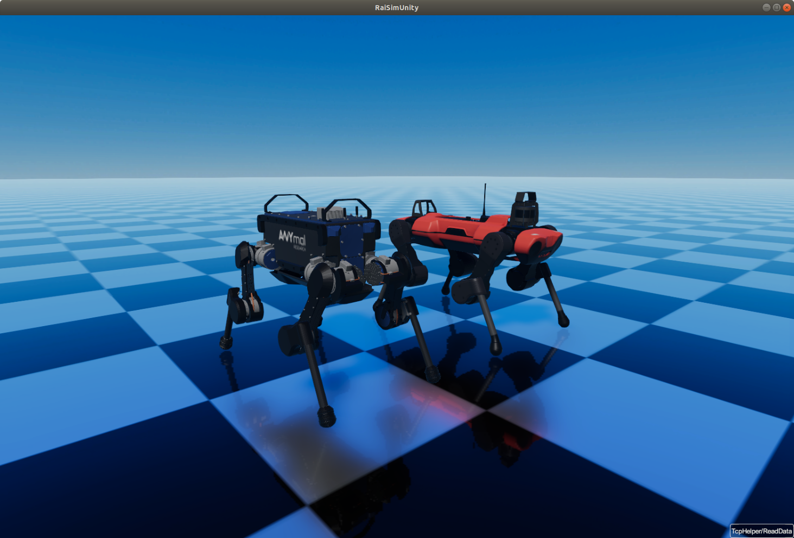

#############################
Visualizers
#############################

Several visualization options are available.
For in-process rendering, Rayrai is the recommended option and runs inside the
simulation process (no RaisimServer required). For server-based visualization,
RaisimUnity and RaisimUnreal provide external viewers. A server-based visualizer
is required to view simulations when using RaisimServer-based examples.
This site provides documentation for Rayrai, RaisimUnity, and RaisimUnreal.

Visualizer Selection Guide (Summary)
***********************************************

* For in-process/offscreen rendering or UI embedding: Rayrai.
* For a cross-platform, user-friendly solution: RaisimUnity.
* For integrated GPUs on Linux: RaisimUnityOpenGL.
* For maximum versatility, publication-quality visuals, or RL vision data: RaisimUnreal.

Visualizer Selection Guide (Detailed)
*********************************************

Rayrai (In-Process/Offscreen)
=============================

Rayrai is a lightweight C++ visualizer executing within the simulation process.
It renders to an OpenGL texture and is architected for integration with custom UIs (ImGui, Qt, etc.) or headless pipelines.

*  In-process rendering (no RaisimServer required).
*  Offscreen render targets via ``RayraiWindow``.
*  Supports custom visuals, point clouds, coordinate frames, and object picking.
*  Optimal for tooling, camera sensor simulation, and custom pipelines.
*  Not a full-featured server visualizer (lacks built-in maps or UI tooling).

Build instructions are available in the Installation section. Detailed usage and API coverage are provided in the Rayrai section.

RaisimUnity
======================

*  Binaries are included in the ``raisimUnity`` directory.
*  User-friendly.
*  Lower frame rate but reduced system resource consumption compared to RaisimUnreal.
*  Executes as an independent process (via RaisimServer).
*  Closed-source.
*  Compatible with Linux, macOS, and Windows.

RaisimUnreal (Beta)
=====================

.. image:: ../image/raisimUnreal1.png
  :alt: raisimUnity
  :width: 600

*  Binaries are provided via GitHub releases.
*  Currently available **only on Windows and Linux**.
*  The most feature-rich visualizer. Only RaisimUnreal supports maps (refer to the RaisimUnreal section).
*  Utilizes multithreading for performance; however, it may **impede RL training or simulation speed**.
*  User-friendly.
*  Supports graphs and bar charts (see ``examples/map_atlas_charts.cpp``).
*  Executes as an independent process (via RaisimServer).
*  Closed-source.

RaiSimUnity vs. RaiSimUnreal Comparison
======================================================

The following comparison highlights differences between RaisimUnity and RaisimUnreal.

*  **Graphics Quality**

   *  **RaisimUnity**: 7/10.
   *  **RaisimUnreal**: 10/10 (Quality may be lower on Linux due to driver discrepancies).

*  **Compatibility**

   *  **RaisimUnity**: Includes an OpenGL variant to ensure compatibility with legacy or integrated GPUs lacking Vulkan support on Linux.
   *  **RaisimUnreal**: Experimental support; reporting issues via GitHub is encouraged.

*  **GPU Utilization (based on reference system benchmarks)**

   *  **RaisimUnity**: 90%.
   *  **RaisimUnreal**: 98% (Performance is significantly higher on Windows; Linux performance can be impacted by driver behavior and weather presets).

*  **GPU Memory Usage (with RaiSim examples)**

   *  **RaisimUnity**: ~2 GB.
   *  **RaisimUnreal**: ~2 GB.

*  **Mesh Loading Time**

   *  **RaisimUnity**: Very fast.
   *  **RaisimUnreal**: Considerably slower due to the lack of mesh instancing, resulting in redundant asset loading.

*  **Support**

   *  **RaisimUnity**: Actively supported and maintained.
   *  **RaisimUnreal**: Development focus has shifted to RaisimUnreal.

*  **Graphs (Time Series and Bar Charts)**

   *  **RaisimUnity**: None.
   *  **RaisimUnreal**: Uses Kantan Chart to visualize server-provided graphs; see ``examples/map_atlas_charts.cpp``.

*  **Video Recording**

   *  **RaisimUnity**: Functional on Linux.
   *  **RaisimUnreal**: Functional on Linux and Windows.

*  **Object Interactions**

   * **RaisimUnity**: Unsupported.
   * **RaisimUnreal**: Supports force application, distance measurement, and object lifecycle management.
