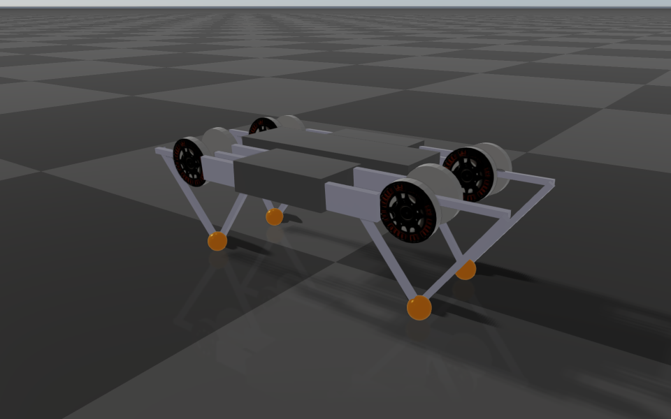
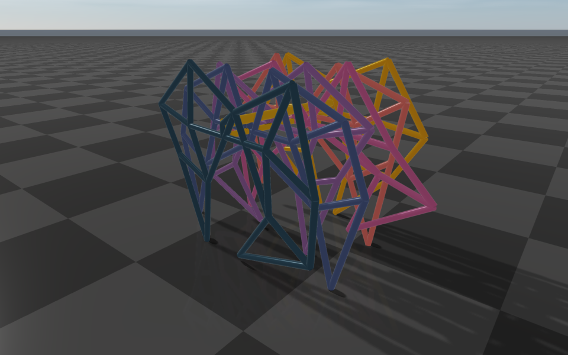

#############################
Closed-Loop Systems
#############################

RaiSim simulates an articulated system as a kinematic tree. A mechanism with closed loops (a
four-bar linkage, a five-bar leg, a parallel robot) is modeled as a *spanning tree* plus *loop
constraints* that close the loops again.

A spanning tree is the kinematic tree that remains after removing a minimum number of joints from
the closed-loop system. Imagine a chain necklace: disconnecting one of its joints forms a tree.
Only one joint should be removed per loop, because otherwise the system splits into separate
trees. Any joint of a loop can be the one removed, so a mechanism has several valid spanning
trees; prefer removing a passive (unactuated) joint, because a removed joint becomes a constraint
and cannot be driven.

   Minitaur. Each leg is a five-bar linkage: the tree ends in two lower legs, and a loop
   constraint joins them again at the toe (orange).

Constraint types
================

A loop constraint joins an *anchor* point on ``body1`` to the coincident point on ``body2``. Both
bodies belong to the same articulated system; one of them can be the fixed base of a fixed-base
system, which ties a point of the mechanism to the world. Let :math:`\boldsymbol{p}_1` and :math:`\boldsymbol{p}_2` be the
world positions of the anchor on the two bodies.

Pin constraint
--------------

A pin keeps the two points together in all three directions, :math:`\boldsymbol{p}_1 = \boldsymbol{p}_2`, like a ball joint:
the bodies can still turn freely relative to each other about the anchor.

Equality constraint
-------------------

An equality constraint keeps the two points together only along one or two *axes*. The axes are
fixed in ``body1``'s frame, so they turn with ``body1``; along the other directions the points
slide freely relative to each other. With unit axes :math:`\boldsymbol{a}_i` (in the world frame) it enforces

.. math::

    \boldsymbol{a}_i \cdot (\boldsymbol{p}_1 - \boldsymbol{p}_2) = 0 \quad \text{for each axis } i.

With **two axes**, the point on ``body2`` stays on the line through :math:`\boldsymbol{p}_1` normal
to both axes, like a slider on a rail fixed in ``body1``. With **one axis**, it stays on the plane
through :math:`\boldsymbol{p}_1` normal to the axis, free to glide anywhere on that plane. In both
cases the bodies still turn freely relative to each other.

A pin is therefore an equality constraint with three axes. Three axes are not accepted in an
``<equality>``; use ``<pin>``.

Describing loop constraints in URDF
===================================

Model the spanning tree as an ordinary URDF, then list the loop constraints in a
``<constraints>`` element under ``<robot>``:

.. code-block:: xml

    <constraints nominal_config="...">
        <pin body1="link_a" body2="link_b" anchor="0 0 0.2"/>
        <equality body1="link_c" body2="link_d" anchor="0.1 0 0">
            <axis xyz="1 0 0"/>
            <axis xyz="0 0 1"/>
        </equality>
    </constraints>

``nominal_config`` (attribute of ``<constraints>``)
    A full generalized coordinate vector in which every loop is closed. It must follow the order
    of :code:`getGeneralizedCoordinate()` (equivalently, the joint order of
    :code:`getMovableJointNames()`); for a floating-base system, the base position and base
    quaternion come first, followed by the joint coordinates. It must have exactly
    :code:`getGeneralizedCoordinateDim()` entries, or loading fails. It is used once, at
    initialization.

``body1``, ``body2``
    Names of the two links. A name may refer to a link attached by a fixed joint; its anchor and
    axes are then expressed in that link's frame.

``anchor``
    The constrained point on ``body1``, expressed in ``body1``'s link frame.

``<axis xyz="..."/>`` (equality constraints only)
    A constrained direction in ``body1``'s link frame. An equality constraint takes one or two
    axes; they must be non-zero, and two axes must not be parallel. Only the plane two axes span
    matters: a skewed pair such as ``1 0 0`` and ``1 0 0.0001`` constrains exactly the same
    directions as ``1 0 0`` and ``0 0 1``.

At initialization, RaiSim sets the system to ``nominal_config``, computes the world position of
``anchor`` on ``body1``, and attaches the coincident point to ``body2``. Every constraint is
therefore exactly satisfied at the nominal configuration, and a small mismatch in the authored
geometry does not leave an initial error.

Choosing between a pin and an equality constraint
-------------------------------------------------

* **Planar loops.** If all hinge axes of a loop are parallel (four-bar and five-bar linkages,
  most leg mechanisms), the hinges already keep the loop together across the plane of motion.
  Use an equality constraint with the two in-plane axes; it states the intent exactly. A pin
  gives the same motion: RaiSim finds that the hinges hold its out-of-plane direction (also when
  the hinge axes are parallel only up to modeling tolerance) and leaves that direction out.
* **Spatial loops through a ball joint.** Use a pin.
* **Loops closed by a hinge in a spatial mechanism.** Use two pins on the hinge axis, a few
  centimeters apart. Together they hold everything but the rotation about the hinge axis. RaiSim
  treats the pair as one hinge: the second pin adds only the two directions across the axis (none
  in a planar loop), so the closure costs as much as a dedicated hinge constraint.
* **A point that must stay on a plane or a line moving with** ``body1``. Use an equality
  constraint with the plane's normal (one axis) or with two axes normal to the line.

Example: Minitaur
-----------------

Each leg of Minitaur is a planar five-bar linkage whose two lower legs meet at the toe. The knee
hinges turn about the lower legs' y axes, so each leg moves in the x-z plane of its lower legs:

.. code-block:: xml

    <constraints nominal_config="0 0 0.35 0 0 1 0 -1.5708 -2.2 -1.5708 -2.2 -1.5708 -2.2 -1.5708 -2.2 -1.5708 -2.2 -1.5708 -2.2 -1.5708 -2.2 -1.5708 -2.2">
        <equality body1="lower_leg_front_rightR_link" body2="lower_leg_front_rightL_link" anchor="0.0 0.0 0.2">
            <axis xyz="1 0 0"/>
            <axis xyz="0 0 1"/>
        </equality>
        <!-- one equality constraint per leg -->
    </constraints>

The complete model is `rsc/minitaur/minitaur.urdf
<https://github.com/raisimTech/raisim2Lib/blob/master/rsc/minitaur/minitaur.urdf>`__.

Dynamics
========

Constraint forces
-----------------

A loop constraint acts on its two bodies with equal and opposite forces at the anchor: ``body1``
receives :math:`\boldsymbol{f}` and ``body2`` receives :math:`-\boldsymbol{f}`. A pin's force can point in any direction.
An equality constraint's force lies along its axes, :math:`\boldsymbol{f} = \sum_i \lambda_i \boldsymbol{a}_i`, so it never
pushes along the free directions: the points slide along them without resistance, and the
constraint does no work. (An equality constraint's force acts at ``body2``'s anchor point on both
bodies, which keeps that true while the points slide apart.) Torques about the joints follow from
the lever arms, and the joints of the tree carry them like any other load. The constraint applies
no net force or torque to the system as a whole, so it never changes the momentum of a floating
system.

The force is whatever keeps the loop closed. RaiSim computes it together with everything else
that acts in the step (gravity, joint torques and PD control, contacts, joint limits, joint
friction), so the constrained velocity holds at the end of every step. No other impulse can open
a loop: a contact or a joint limit pushes on the closed mechanism as a whole, as it would on a
real linkage. This does not depend on the contact solver's iteration limit or on how many loops
are coupled.

Position errors and drift
-------------------------

The constraints hold the *velocity* exactly in every step, but not the position directly. Two
things can leave the anchors apart:

* **Drift.** A loop whose anchors move on curved paths cannot be followed exactly by a velocity
  held constant over a step: each step leaves a small error of second order in the time step,
  about :math:`\delta \approx \Delta t^2 v^2 / L` for a speed :math:`v` and a link length
  :math:`L`. Linear relations, such as a mimic constraint, do not drift.
* **Initial errors.** A configuration set by hand with :code:`setGeneralizedCoordinate()` or
  :code:`setState()` need not close the loops.

RaiSim measures the actual error :math:`e` of every constrained direction at the beginning of each
step, from the positions of the anchors (or the joint coordinates, for a mimic constraint), and
feeds it back into the velocity the constraint holds:

.. math::

    \dot e = -\beta\, e, \qquad \beta = \mathrm{clamp}(0.2\,\mathrm{erp}, 0, 0.3)/\Delta t .

With the default ``erp = 1.5``, every step removes 30% of the error present at its beginning (see
``World::setERP``). An initial error therefore shrinks by a factor 0.7 per step: to a thousandth
within 20 steps. The drift does not accumulate either. Each step adds :math:`\delta` and removes 30%
of what is there, so the error settles at about :math:`\delta / 0.3 \approx 3.3\,\delta` and stays
bounded for as long as the simulation runs. In practice it is small: Minitaur's toes stay within
about 2 µm (root mean square) at 1 ms, and the 36 loops of the walking Strandbeest within 34 µm
(root mean square, 0.1 mm at worst) at 2 ms. It reaches millimeters only when a mechanism spins at
hundreds of radians per second. Halving the time step divides it by four.

The correction is a velocity along the constrained directions only. It moves the anchors back
toward each other without pushing along the free directions, and it is limited to 30% of the error
per step, so even a large initial error is closed smoothly rather than in one jump. Its kinetic
energy is proportional to the square of the correction speed, which is negligible for the
micrometer errors of normal drift. A smaller ``erp`` closes errors more slowly and softly; the
rate cannot exceed 30% per step.

RaiSim does not additionally project the positions back onto the constraints with a separate
nonlinear position solve after each step. Near singular poses of a loop that solve has no reliable
solution, while the velocity feedback keeps the error bounded without it.

Velocities set by hand
----------------------

A velocity set with :code:`setGeneralizedVelocity()` or :code:`setState()` need not satisfy the
constraints: in the next step, the constraint impulse removes the violating part and shares the
momentum along the mechanism, as a sudden rigid connection would. The positions stay on the
constraints as well: ``TRAPEZOID`` and ``EULER``, which also integrate the positions with the
previous velocity, use that velocity's admissible part. ``RUNGE_KUTTA_4`` is replaced by
``TRAPEZOID`` while the system has loop or mimic constraints, because its intermediate stages
would leave them.

.. _closed_loop_redundant:

Redundant constraints and singular poses
----------------------------------------

Constraints may repeat each other: a pin on a hinge axis, a second pin where one suffices, two
mechanisms that hold the same direction. A redundant constraint is detected, and the motion is
the same as without it. The constraint forces are then not unique (a statically
indeterminate structure has no unique load distribution); RaiSim puts the load on the constraints
that are not redundant.

Redundancy that comes from the model's structure is found once, when the model is loaded, by
examining its geometry at a number of poses: directions that the joints hold (below), the second
pin of a hinge along its axis, and a loop closed again through a link hinged at the closing
point. A constraint left with no direction of its own costs nothing in a step and reports a zero
force; the first pin of a hinge carries the load along the hinge axis. The examination is repeated
automatically after the joint placements change through :code:`getJointPos_P()`,
:code:`getJointOrientation_P()` or :code:`getJointAxis_P()`; if you keep the returned reference and
change the placements through it later, call :code:`updateMassInfo()` afterwards. A world
checkpoint restores the result together with the placements. Redundancy that depends on the pose,
such as a redundant bar of a parallelogram or a singular pose (below), is detected in every step.

A constraint's joints may also hold some of its directions by themselves. In a planar loop, the
parallel hinges hold the out-of-plane direction; a pin whose anchor lies on a joint's axis
cannot be moved apart in any direction. RaiSim decides this geometrically for every constraint,
from its own joints alone (masses and the rest of the robot do not enter): a direction in which
every joint can move the anchors apart only through a lever arm below 1/1000 of the joint's
distance from the anchors counts as held. This tolerance covers modeling precision, such as hinge
axes that are parallel only to a few digits. A constraint whose every direction is held is
redundant with its joints; RaiSim ignores it and warns once. A genuinely small lever, such as a
pin 10 µm from a hinge axis at 10 µm from the hinge, still holds.

Near a singular pose of a loop (for example, a four-bar at its toggle point), one of the
constrained directions becomes nearly redundant. It is then treated as redundant: the loop is
free to drift slightly in that direction until the pose leaves the singularity, and the drift is
then pulled out at the rate above. Holding it exactly would take impulses that grow without bound
toward the singular pose.

Joint limits, actuation and friction
------------------------------------

* Joint limits and velocity limits act on every joint, including joints moved only through a
  loop: a limit on one bar of a parallelogram stops the whole parallelogram. As for every joint
  in RaiSim, a limit takes part in a step when the joint violates it at the beginning of the step,
  after the constraints have moved the velocity. A velocity cap that only an impact within the
  step drives past (a contact impulse arriving through the loop) acts from the next step.
* A joint limit on a joint that the loops lock completely cannot act and is skipped.
* Drive the tree joints. A loop-closing joint has no coordinate of its own, so it cannot be
  actuated or limited.
* Joint friction and joint damping act on the tree joints as usual.

.. _closed_loop_reading_forces:

Reading constraint forces
=========================

Each loop constraint appears in :code:`World::getContactProblem()` as one row with rank
:code:`raisim::contact::rank::PROJECTED_PIN_CONSTRAINT`, appended by its articulated system in
constraint order (pins first, then equality constraints, each in the order of the URDF). After a
step, its ``imp_i`` is the impulse applied to ``body1``'s anchor in the world frame; ``body2``
receives the opposite impulse. Divide by the time step for the force. ``pinError_W`` holds the
anchor separation :math:`\boldsymbol{p}_1 - \boldsymbol{p}_2` at the beginning of the step.

The articulated system's :code:`getContacts()` also lists internal entries for each constraint
that has directions of its own (see `Redundant constraints and singular poses`_); their pair
object is the system itself. With :code:`setComputeInverseDynamics(true)`, the joint
forces and torques include the constraint forces, and a constraint to the fixed base puts its
reaction on the base.

Performance
===========

The cost of the loop constraints grows linearly with the number of joints for a fixed number of
constraints, and many coupled loops need no more contact-solver iterations than one. The
12-legged :doc:`../examples/server/strandbeest_closed_loops` (79 degrees of freedom, 36 coupled
loops, walking on its feet) takes about 75 µs per step on a desktop CPU (AMD Ryzen 9 3950X), 27
times faster than real time at its 2 ms time step. :doc:`../Benchmark` compares the same machine,
with its loops closed by 84 pins, against MuJoCo.

   The Strandbeest walks on one crank; its 36 loops are equality constraints.

Limitations
===========

* Loop constraints connect bodies of the same articulated system. Constraints between
  different objects need :doc:`../Constraints` (length constraints or tendons).
* A loop-closing joint cannot be actuated, and it has no limits; put drives and limits on tree
  joints.
* Tendon and wire responses are projected through the eliminated loop constraints. Their induced
  constraint impulses are included in the reported pin forces.

Other model formats
===================

* **MJCF:** ``<equality><connect body1 body2 anchor/></equality>`` becomes a pin constraint. An
  inactive one (``active="false"`` on the element, its class or the equality defaults) cannot be
  switched on in RaiSim and is not loaded, with a warning.
* **USD:** joints with ``physics:excludeFromArticulation = true``, and any additional joint into a
  body that already has its tree joint, close loops. A revolute loop joint becomes two pins on its
  axis, a spherical one a pin at its anchor, and a fixed one three pins; see :doc:`../OpenUSD`.

Mimic joint constraints (:doc:`MimicJoints`) couple two joints of the same system and are handled
together with the loop constraints.
