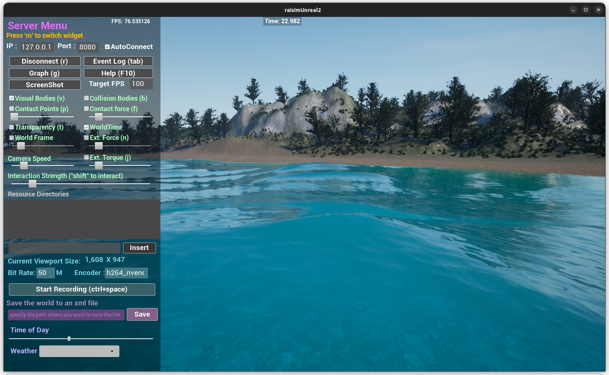

############################
Map Example: Lake1 Heightmap
############################

Overview
========
Uses the lake1 heightmap image and spawns Aliengo to walk on the terrain. This example shows how to configure heightmap scaling and map selection for a large outdoor scene.

Screenshot
==========

Binary
======
CMake target and executable name: ``map_lake1_heightmap``.

Run
====
Build and run from your build directory:

.. code-block:: bash

   cmake --build . --target map_lake1_heightmap
   ./map_lake1_heightmap

On Windows, run ``map_lake1_heightmap.exe`` instead.
This example uses RaisimServer. Start a visualizer client (RaisimUnity, RaisimUnreal, or the rayrai TCP viewer) and connect to port 8080.

Details
=======
- Loads the lake1 heightmap PNG with scale/offset.
- Spawns Aliengo with PD posture control at a low start height.
- Sets the Unreal map to ``lake1`` and focuses on the robot.

Source
======
.. literalinclude:: ../../../../examples/src/maps/map_lake1_heightmap.cpp
   :language: cpp
