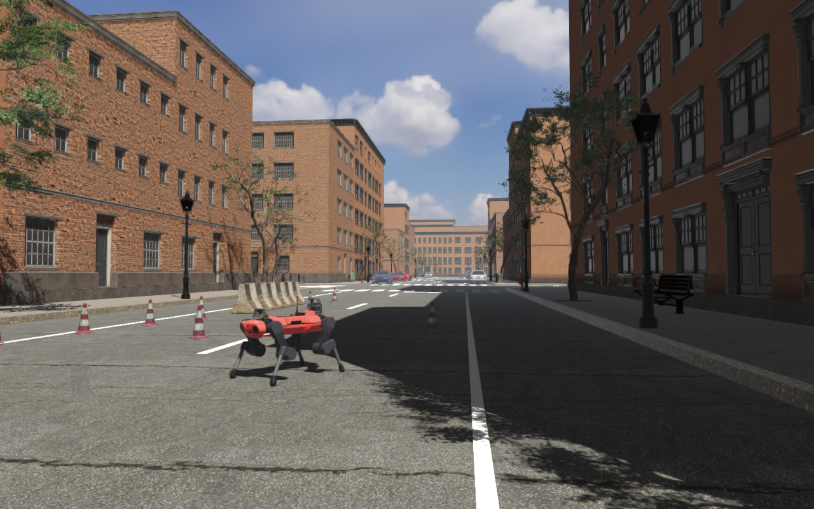
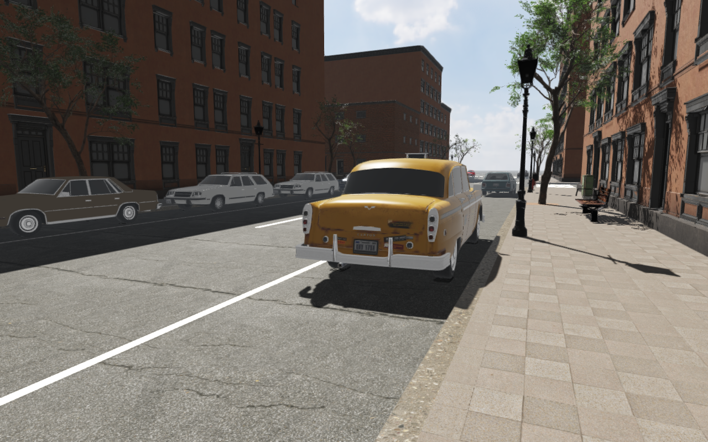
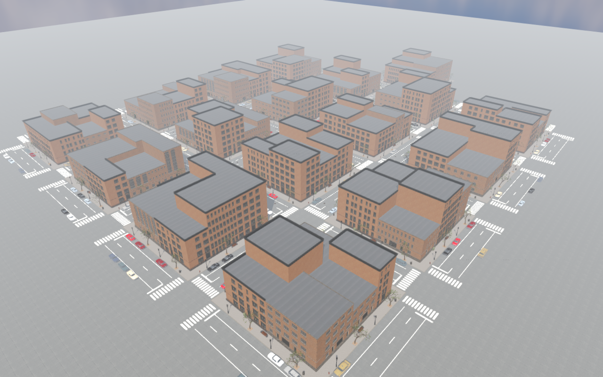

#####################
Rayrai Example: City
#####################

Overview
========
A photoreal city of 17 blocks and 105 buildings, built only from free assets
and stored as a RaiSim Engine scene, ``rsc/city/rayrai_city.rscene``. An
ANYmal C quadruped stands on the street next to roadworks, held by joint PD
control. The example is short:

.. code-block:: cpp

   auto world = std::make_shared<raisim::World>(
     exampleRscPath(argv[0], "city/rayrai_city.rscene"));
   // The .rscene reader creates no articulated systems, so the robot is added here.
   addStandingAnymal(*world, exampleRscPath(argv[0], "anymal_c/urdf/anymal.urdf"));
   raisin::RayraiWindow viewer(world, 1280, 800);
   viewer.setAsyncMeshLoadingEnabled(true);
   raisin::applyRscene(*world->getRscene(), viewer);

``raisim::World(path)`` creates the ground, sidewalk and building colliders,
hidden ``.rasset`` colliders for lamps, trees, hydrants, bins, benches,
utility boxes, barriers and cars, and eleven dynamic traffic cones.
``raisin::applyRscene`` applies the HDR sky, the sun with two shadow
cascades, the render settings, 86 instanced batches (78 facade modules and 8
kinds of street furniture), the 159 parked cars, the baked street and building-shell
meshes, and the street-level camera.

Target
======
CMake target: ``rayrai_city`` (C++20). Source:
``examples/src/rayrai/worlds/rayrai_city.cpp``. Like
:doc:`rayrai_forest_from_rscene`, it needs the ``.rscene`` support of
``raisim::World`` and ``rayrai/RsceneVisuals.hpp``; CMake skips the target
when the installed rayrai lacks it.

Run
===

.. code-block:: bash

   ./build-examples/examples/rayrai_city
   ./build-examples/examples/rayrai_city --screenshot city.png
   ./build-examples/examples/rayrai_city --scene /path/to/rayrai_city.rscene

The example finds the scene in the ``rsc`` folder that CMake copies next to
the executables. ``--scene`` loads another file, for example the checkout's
``rsc/city/rayrai_city.rscene`` after regenerating it. ``--screenshot`` renders
in a hidden window without vsync, waits for the assets, lets the robot and
cones settle for 90 frames, prints the average frame time of those frames,
saves the image and exits. Physics runs eight 2 ms steps per rendered frame
once the meshes are loaded; it costs about 1.2 ms of each frame. On an
RTX 2070 SUPER at 1280 × 800 with 4× MSAA a frame of the default view takes
about 22 ms.

The scene
=========
* **Buildings.** Each block holds two rows of 18 m deep lots, 9 to 18 m wide.
  A lot becomes an apartment (four to six floors) or factory building (three
  to five floors) assembled from 3 m wall modules with matching window and
  door inserts, a base plinth, a dado band, a cornice over the ground floor,
  a crown parapet and L-shaped corner pieces at the block corners. Street
  faces get an entrance (and garages on long factory faces); walls above a
  lower neighbour get blank party-wall modules. Dark shells behind the
  facades read as unlit rooms through the glass, and flat roofs cover them.
* **Streets.** 12 m roads with two lanes and parking, 3.5 m sidewalks with
  curbs, dashed centre lines, parking-lane lines, zebra crossings, stop lines
  for right-hand traffic, manholes, lamps, trees with soil pits, hydrants,
  bins, benches and utility boxes. One block past the last cross street closes
  the camera's view down the street. The street mesh is split into 3 m cells:
  rayrai v2.8.0 drops cascade shadows near the camera on large receiver
  triangles that reach behind it, which a later release fixes.
* **Cars.** 159 parked cars of four fictional-brand models, three of them in
  three paints, facing the direction of travel. Each is a visible ``.rasset``
  object: a regular visual with a hidden box collider. Instanced batches do
  not draw the cars' blended glass or plain-coloured paint correctly.
* **Lighting.** The sky is a Poly Haven pure-sky HDR. Its sun disk is clamped
  and the image turned by 180 degrees so that a shadow-casting directional
  light, at the measured sun direction, lights the street from behind the
  camera without counting the sun twice in image-based lighting.

Assets
======
All assets are free. Poly Haven provides the two facade kits, the street
furniture, the ground textures and the sky; BlendKit the photoscanned traffic
cone (both CC0). The cars are Daniel Zhabotinsky's models on Sketchfab under
CC BY 4.0, credited in ``rsc/city/ATTRIBUTION.md``. The street trees are the
forest example's ``rsc/forest/tree_small_02``. The prepared assets occupy
about 176 MiB; mesh LOD caches that rayrai writes beside them are ignored by
Git.

Three standard-library Python scripts (preparation also needs NumPy, SciPy and
Pillow) rebuild everything:

.. code-block:: bash

   python3 examples/tools/download_city_assets.py /tmp/city
   python3 examples/tools/prepare_city_assets.py /tmp/city rsc/city
   python3 examples/tools/generate_city_rscene.py rsc/city   # layout only

The Sketchfab downloads need the API token of a free account
(https://sketchfab.com/settings/password) in ``SKETCHFAB_API_TOKEN`` or
``~/.sketchfab_api_token``; Poly Haven and BlendKit need none. Preparation
splits each facade kit into Z-up modules that share the kit's buffer and
textures. The kits model each flat wall as a dense grid (a plain 3 m panel
has 4,608 triangles), so flat regions that exactly tile a grid are rebuilt
from a few rectangles with the same texture coordinates; this halves the
modules' triangles and the frame time without changing the image. The
generator lays out the city with a fixed seed and writes the scene, the
street mesh and the building-shell mesh.

See :doc:`../../RsceneFile` for the format and :doc:`rayrai_forest` for the
LOD cache and asynchronous loading.
