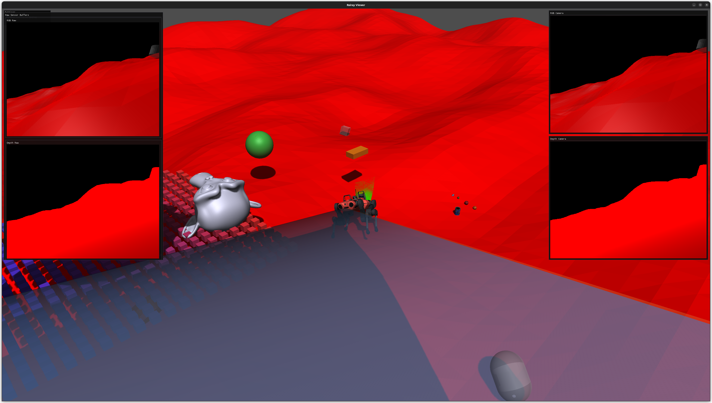

#################################
Rayrai Example: Complete Showcase
#################################

Overview
========
Comprehensive rayrai showcase with Go1, Livox LiDAR, D455 RGB/depth sensors, heightmap terrain, YCB objects, custom visuals, instanced geometry, and a live LiDAR point cloud. Use it as an end-to-end check for rayrai and sensor rendering.

Screenshot
==========

Binary
======
CMake target and executable name: ``rayrai_complete_showcase``.

Run
====
Build and run from your build directory:

.. code-block:: bash

   cmake --build . --target rayrai_complete_showcase
   ./rayrai_complete_showcase

On Windows, run ``rayrai_complete_showcase.exe`` instead.
This example uses the in-process rayrai renderer (no external client required).

Details
=======
- Loads a sensored ANYmal, heightmap terrain, primitives, and YCB objects.
- Updates LiDAR scans into a point cloud and renders RGB/depth sensors.
- Shows camera frustums and raw sensor buffers in ImGui.

Source
======
.. literalinclude:: ../../../../examples/src/rayrai/rayrai_complete_showcase.cpp
   :language: cpp
