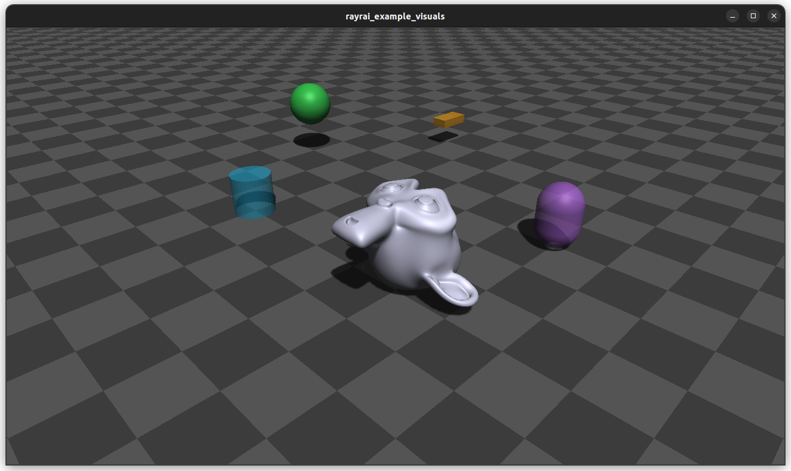

##############################
Rayrai Example: Custom Visuals
##############################

Overview
========
Demonstrates custom visual primitives (sphere, box, cylinder, capsule, mesh) and simple animation of positions and orientations.

Screenshot
==========

Binary
======
CMake target and executable name: ``rayrai_custom_visuals``.

Run
====
Build and run from your build directory:

.. code-block:: bash

   cmake --build . --target rayrai_custom_visuals
   ./rayrai_custom_visuals

On Windows, run ``rayrai_custom_visuals.exe`` instead.
This example uses the in-process rayrai renderer (no external client required).

Details
=======
- Creates custom visuals (sphere/box/cylinder/capsule/mesh) outside the physics world.
- Animates visual positions and orientations each frame.
- Demonstrates detectability for picking (``setDetectable(true)``).

Source
======
.. literalinclude:: ../../../../examples/src/rayrai/rayrai_custom_visuals.cpp
   :language: cpp
