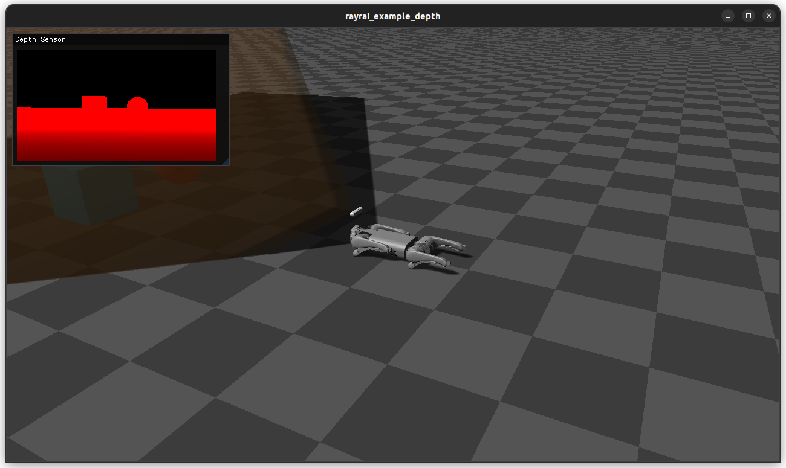

############################
Rayrai Example: Depth Camera
############################

Overview
========
Renders a linear depth texture from the Go1 depth camera and shows it in ImGui with a frustum overlay. This is the reference for depth camera workflows in rayrai.

Screenshot
==========

Binary
======
CMake target and executable name: ``rayrai_depth_camera``.

Run
====
Build and run from your build directory:

.. code-block:: bash

   cmake --build . --target rayrai_depth_camera
   ./rayrai_depth_camera

On Windows, run ``rayrai_depth_camera.exe`` instead.
This example uses the in-process rayrai renderer (no external client required).

Details
=======
- Loads Go1 with the D455 module and fetches the depth sensor.
- Renders a linear depth texture and shows it in an ImGui window.
- Places a sphere and box in front of the camera using its pose.

Source
======
.. literalinclude:: ../../../../examples/src/rayrai/rayrai_depth_camera.cpp
   :language: cpp
