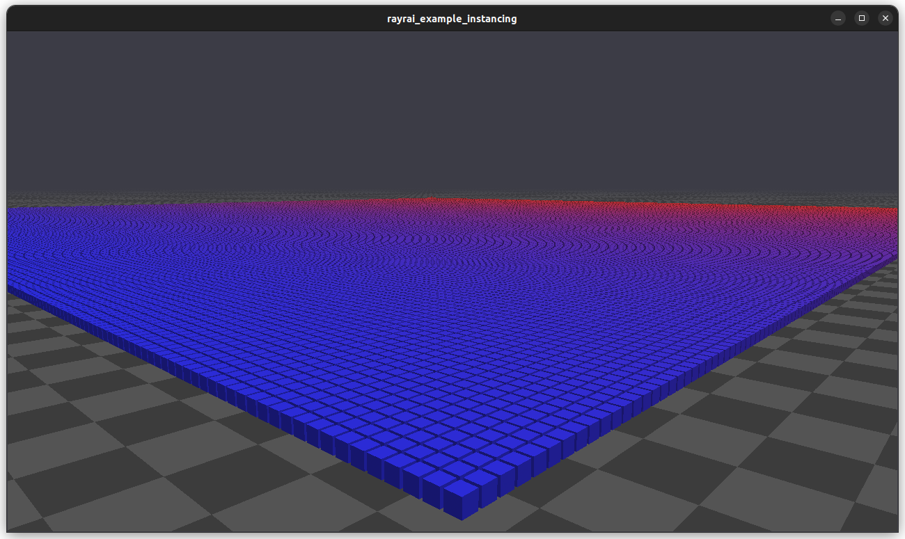

###############################
Rayrai Example: Instancing Grid
###############################

Overview
========
Renders a large grid of instanced boxes to demonstrate instancing performance and per-instance weighting.

Screenshot
==========

Binary
======
CMake target and executable name: ``rayrai_instancing_grid``.

Run
====
Build and run from your build directory:

.. code-block:: bash

   cmake --build . --target rayrai_instancing_grid
   ./rayrai_instancing_grid

On Windows, run ``rayrai_instancing_grid.exe`` instead.
This example uses the in-process rayrai renderer (no external client required).

Details
=======
- Creates a 300x300 grid of instanced boxes with per-instance color weights.
- Animates one instance to demonstrate dynamic updates.
- Uses ``InstancedVisuals`` for efficient bulk rendering.

Source
======
.. literalinclude:: ../../../../examples/src/rayrai/rayrai_instancing_grid.cpp
   :language: cpp
