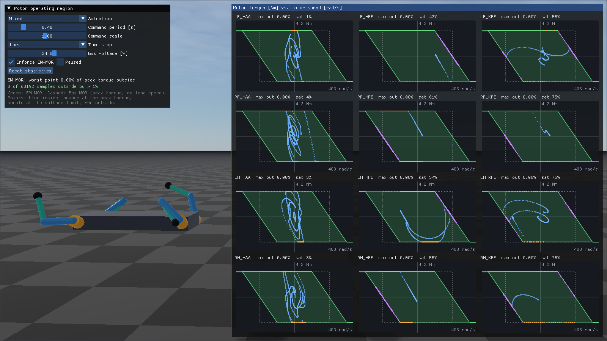
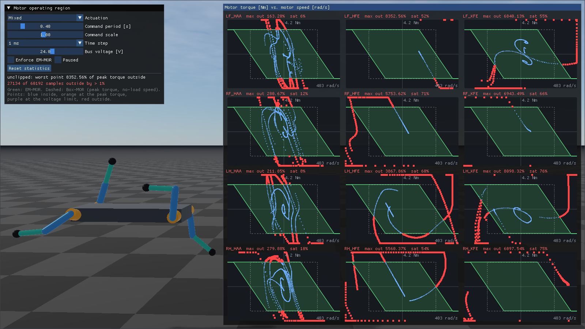

###########################################
Rayrai Example: Motor Operating Region
###########################################

Overview
========
This example drives the twelve actuators of a fixed-base quadruped rig with random commands and
plots, for the motor of every actuator, its operating region and the operating points of the last
second in the motor's torque-speed plane. Use it to check that RaiSim keeps every motor inside its
region (see :doc:`../../Actuators`). The commands are actuator torques from an explicit PD
controller, sent with ``setActuatorTorques()``, so the region clips all of them.

The controller knows nothing about these limits and often commands far more torque than the motors
can produce; RaiSim has to clip it. With **Enforce EM-MOR** unticked, the actuator torques are
applied without MOR clipping. Joint effort limits do not clip actuator torques either, so the same
commands leave the region far behind; the joint velocity limits of the rig keep the run bounded:

Target
======
CMake target: ``rayrai_motor_operating_region``.

Run
===

.. code-block:: bash

   ./build-examples/examples/rayrai_motor_operating_region

On Windows, use ``rayrai_motor_operating_region.exe``. The example uses the in-process rayrai
renderer and does not need a TCP viewer.

The control window sets the random actuation (mixed, position targets, velocity sweeps beyond the
no-load speed, or raw torques), its period and scale, the time step (1, 2.5 or 5 ms) and the bus
voltage. The **Bus voltage** slider (6 to 36 V) calls ``setBusVoltage()`` for all actuators, and the
regions shrink and grow with it. The speed axis never shrinks below the range for the 24 V of the
actuator files, so a lower voltage visibly shrinks the region. **Enforce EM-MOR** calls
``setMotorOperatingRegionEnforced()``, which toggles MOR clipping of the torques sent through
``setActuatorTorques()``; it does not affect the joint effort limits, which apply only to
``setGeneralizedForce()`` and the built-in PD controller (the example uses neither). **Paused**
stops the simulation, and **Reset statistics** clears the counters.

The model
=========
``rsc/motorOperatingRegion/quadruped_rig.urdf`` puts an actuator on every joint. Their models are
in the linked files in ``rsc/motorOperatingRegion/actuators/``:

.. code-block:: xml

   <actuator joint="LF_HAA" file="abduction_actuator.xml"/>
   <actuator joint="LF_HFE" file="hound_leg_actuator.xml"/>
   <actuator joint="LF_KFE" file="hound_leg_actuator.xml">
     <coupling joint="LF_HFE" ratio="1"/>
   </actuator>

All twelve actuators use the same DC motor on a 24 V bus: :math:`R = 0.4\ \Omega`,
:math:`K_t = 0.1` Nm/A, :math:`K_v = 10` rad/s/V and a peak torque of 3 Nm, i.e., a 6 Nm stall
torque, a 120 rad/s corner speed, a 240 rad/s no-load speed and a 360 rad/s overspeed limit. The
actuator files also set the friction and damping of the actuators, measured at the joints; they add
to the 0.02 Nm s/rad joint damping of the URDF. The URDF ``effort`` limits (18 Nm and 30 Nm) apply
only to ``setGeneralizedForce()`` and the built-in PD controller, which the example does not use;
they do not limit actuator torques. The URDF ``velocity`` limits are 1.5 times the no-load speeds at
the joints (60 rad/s for abduction, 36 rad/s for hip and knee). With the operating regions enforced
the motors settle near their no-load speeds; without them, nothing else would stop the commanded
torques from spinning the joints up until the simulation breaks down.

* ``abduction_actuator.xml``: the hip abduction actuator, a motor behind a 6:1 reducer.

  .. code-block:: xml

     <actuator_model name="abduction_6to1" gear_ratio="6" output_damping="0.01" output_friction="0.2">
       <motor resistance="0.4" torque_constant="0.1" velocity_constant="10" bus_voltage="24"
              peak_torque="3"/>
     </actuator_model>

* ``hound_leg_actuator.xml``: the hip and knee actuators, a motor behind a 10:1 reducer. Like in
  KAIST Hound, both motors sit on the body and the knee reducer's ring gear turns with the thigh, so
  the knee motor also turns with the hip, :math:`\omega_{KFE,m} = 10\,u_{KFE} + u_{HFE}`.
  Each knee ``<actuator>`` declares that with its ``<coupling>``.

  .. code-block:: xml

     <actuator_model name="hound_leg" gear_ratio="10" output_damping="0.02" output_friction="0.3">
       <motor resistance="0.4" torque_constant="0.1" velocity_constant="10" bus_voltage="24"
              peak_torque="3"/>
     </actuator_model>

The actuators are named after their joints: ``LF_HAA``, ``LF_HFE``, ``LF_KFE`` and so on (see
``getActuatorNames()``).

What the plots show
===================
* **Green parallelogram:** the operating region (EM-MOR). Its top and bottom edges are the peak
  torque and its slanted edges the bus-voltage limit. It extends beyond the no-load speed in the
  braking quadrants (II and IV), and beyond the overspeed limit it continues as a line at the peak
  braking torque: the region limits the torque, not the speed.
* **Dashed rectangle:** the Box-MOR of the peak torque and the no-load speed.
* **Points:** the operating points of the last second, i.e., the motor speed at the beginning of
  each step, at which RaiSim evaluates the region, and the applied motor torque from
  ``getActuatorStates()``. Blue points are inside the region, orange points
  are at the peak torque, purple points are at the voltage limit, and red points are outside by more
  than 1 % of the peak torque.
* **Title:** the actuator name, the largest distance outside the region since the last reset, as a
  percentage of the peak torque, and the fraction of steps in which the motor saturated. The
  control window sums up all motors.

The region holds at 5 ms as well. The voltage limit is applied explicitly, but the rig's reflected
rotor inertia keeps 5 ms below the stability bound :math:`2\,I R K_v / (G^2 K_t)` of every
actuator (roughly 15 ms for the knee, the lowest; see :doc:`../../Actuators`).

Full source
===========

.. literalinclude:: ../../../../examples/src/rayrai/dynamics/rayrai_motor_operating_region.cpp
   :language: cpp
   :linenos:
