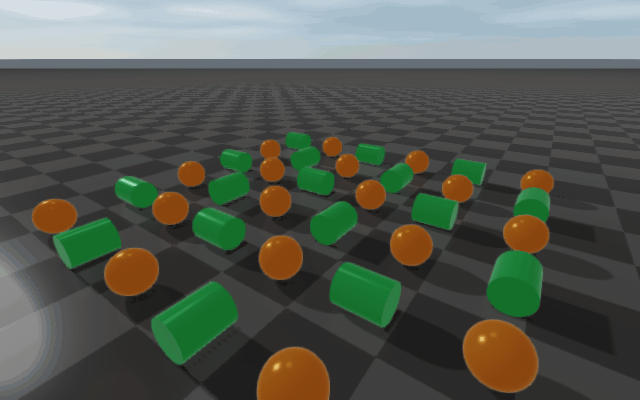

#############################################
Rayrai Example: Rolling And Spinning Friction
#############################################

Overview
========
This example visualizes native rolling and spinning friction on a grid of
spheres and cylinders, all spawned with initial linear and angular
velocity. As the bodies dissipate energy through these friction modes they
slow down, come to rest, and are recolored to indicate sleeping. The demo
restarts on a fixed cadence so the motion and its decay are easy to compare.

The GIF below uses a smaller 6 × 6 grid. A headless image generator rebuilds it
during the documentation build:

Target
======
CMake target: ``rayrai_rolling_spinning_friction``.

Run
====
Run the build-tree executable:

.. code-block:: bash

   ./build-examples/examples/rayrai_rolling_spinning_friction

On Windows, run ``rayrai_rolling_spinning_friction.exe`` instead.
This example renders in process with rayrai and does not need ``rayrai_tcp_viewer``.

Command-line options:

.. code-block:: bash

   ./build-examples/examples/rayrai_rolling_spinning_friction \
     --grid=12             \
     --steps=2500          \
     --steps-per-frame=16  \
     --hold-frames=120

* ``--grid`` — N × N body grid (default ``10``). Larger values exercise the
  solver harder; the GIF on this page uses a 6 × 6 grid for clarity.
* ``--steps`` — physics steps per cycle (default ``2500``). One cycle is
  one full reset → run-until-rest sequence.
* ``--steps-per-frame`` — physics steps per render frame (default ``16``).
  Higher values speed up the visible motion at the cost of frame-to-frame
  smoothness.
* ``--hold-frames`` — frames to wait after each cycle before resetting
  (default ``120``).

How it works
============
The rolling/spinning friction comes from the material-pair property set
up in ``main()``:

.. code-block:: cpp

    world->setMaterialPairProp("ground", "body",
                               1.0,    // dynamic friction
                               0.0,    // restitution
                               0.0,    // restitution threshold
                               1.0,    // static friction
                               1e-3,   // static-friction threshold velocity
                               0.12,   // rolling friction (mu_r)
                               0.08);  // spinning friction (mu_spin)

The last two arguments are the ``rollingFriction`` and ``spinningFriction``
coefficients introduced in v2.3.0. Both are zero in every other
``setMaterialPairProp`` overload, so existing scenes behave exactly as before;
setting them switches the solver onto the extended path for that pair. See
:doc:`../../MaterialSystem` for the full contact-impulse derivation.

The scene is built once at startup:

* A ``checkerboard``-textured ground plane with the ``ground`` material.
* An ``N × N`` grid of unit-mass primitives alternating sphere/cylinder
  by checker pattern, all in the ``body`` material. Cylinders are oriented
  so that the initial angular velocity rolls them along the floor instead
  of spinning in place; spheres receive linear + angular velocity in two
  axes.
* Sleeping is enabled with mild thresholds (``setSleepingParameters(0.012,
  0.03, 25)``), so bodies that come to rest stop integrating and switch
  to a blue appearance.

Each rendered frame integrates ``--steps-per-frame`` physics steps,
updates the sleep appearance, and shows aggregate statistics in an ImGui
overlay. Abridged from the source:

.. code-block:: cpp

    while (!app.quit) {
      app.processEvents();
      if (app.quit) break;

      if (stepInCycle < cycleSteps) {
        for (int i = 0; i < stepsPerFrame; ++i) {
          world->integrate();
          lastContacts = world->getContactProblem()->size();
          contactTotal += lastContacts;
          ++stepInCycle;
        }
      } else if (++heldFrames >= holdFrames) {
        resetDemo(*world, bodies, grid);   // re-fire the cycle
        stepInCycle = 0;
        heldFrames = 0;
      }

      updateSleepingAppearance(*world, bodies);
      computeMeanSpeeds(bodies, meanLinearSpeed, meanAngularSpeed);

      app.beginFrame();
      app.renderViewer(*viewer);
      // ... ImGui overlay with step / contacts / speeds ...
      app.endFrame();
    }

What to look for
================

* **Rolling bodies come to rest.** Sliding friction first turns the initial
  skid into rolling; rolling friction then removes energy from the rolling
  motion, so linear and angular speed decay together. Without rolling
  friction, a body rolling without slipping would keep rolling.
* **Spheres stop spinning about the vertical axis.** Each sphere also starts
  with spin about the contact normal. Spinning friction applies a torque about
  the normal that removes this spin; without it, a sphere would keep spinning
  in place after it stops rolling.
* **Sleeping bodies turn blue.** RaiSim's sleep detector fires when the
  averaged velocity drops below the configured thresholds; sleeping
  bodies skip integration and stay on the cheaper path until the next
  cycle reset.
* **Average contact count and mean speeds** are shown in the ImGui
  overlay so you can watch energy dissipate over the cycle.

Full source
===========
This is the complete source used by the build-tree target:

.. literalinclude:: ../../../../examples/src/rayrai/dynamics/rayrai_rolling_spinning_friction.cpp
   :language: cpp
   :linenos:

Related
=======

* :doc:`../../MaterialSystem` — the friction model and all
  ``setMaterialPairProp`` overloads.
* :doc:`../../Contact` — contact iteration and per-pair body type.
* :doc:`../../changelog/v2.3.0` — release notes that introduce rolling /
  spinning friction.
