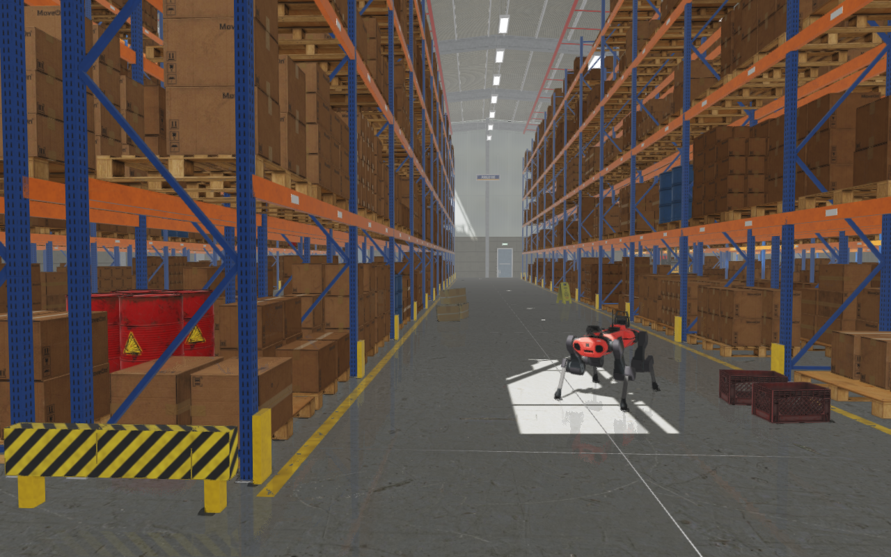
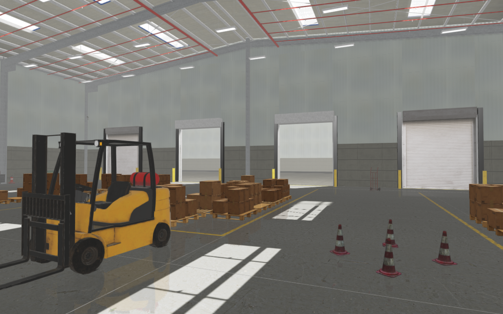
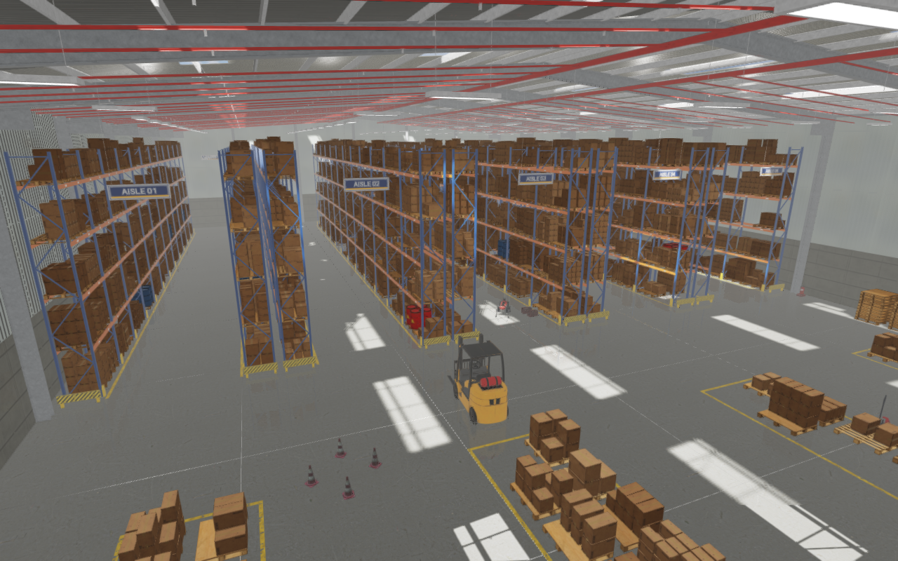

##########################
Rayrai Example: Warehouse
##########################

Overview
========
A photoreal warehouse with pallet racks, forklifts and a loading dock, stored
as a RaiSim Engine scene, ``rsc/warehouse/rayrai_warehouse.rscene``. An ANYmal C
quadruped stands in an aisle. The scene file holds the whole world, so the
example only loads it and adds the robot:

.. code-block:: cpp

   auto world = std::make_shared<raisim::World>(
     exampleRscPath(argv[0], "warehouse/rayrai_warehouse.rscene"));
   // The .rscene reader creates no articulated systems, so the robot is added here.
   addStandingAnymal(*world, exampleRscPath(argv[0], "anymal_c/urdf/anymal.urdf"));
   raisin::RayraiWindow viewer(world, 1280, 800);
   viewer.setAsyncMeshLoadingEnabled(true);
   raisin::applyRscene(*world->getRscene(), viewer);

Run
===

.. code-block:: bash

   ./build-examples/examples/rayrai_warehouse
   ./build-examples/examples/rayrai_warehouse --screenshot warehouse.png

Source: ``examples/src/rayrai/worlds/rayrai_warehouse.cpp`` (CMake target
``rayrai_warehouse``). ``--screenshot`` saves one frame and exits, and
``--scene`` loads another ``.rscene`` file. On an RTX 2070 SUPER a frame takes
about 13 ms at 1280 × 800.

The scene
=========
* A 60 m × 36 m steel-frame hall with skylights and four dock doors, two of
  them open to a sunlit yard.
* Ten rows of pallet racks with four shelf levels, filled with cartons and
  drums on pallets.
* A dock area with staging lanes, two forklifts, a pallet jack, shelves and a
  packing desk.
* Colliders for the walls, racks, floor loads and props. Cartons, crates,
  cones and a wet-floor sign are dynamic, so a robot can push them.

Assets
======
All files are in ``rsc/warehouse``; the scene also uses the sky, asphalt and
traffic cones in ``rsc/city``. The props and textures come from Poly Haven
(CC0). The forklift, pallet jack, pallets and cartons are Sketchfab models
under CC BY 4.0, credited in ``rsc/warehouse/ATTRIBUTION.md``.

See :doc:`../../RsceneFile` for the scene format.
