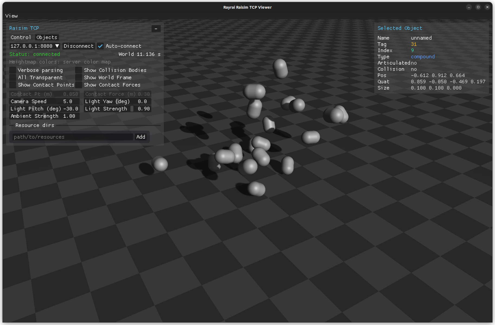

###############################
Server Example: Compound Object
###############################

Overview
========
Builds a compound object from many capsule children with random transforms, then drops it into the scene. It shows how to create and visualize compound shapes.

Screenshot
==========

Binary
======
CMake target and executable name: ``compound_object``.

Run
====
Build and run from your build directory:

.. code-block:: bash

   cmake --build . --target compound_object
   ./compound_object

On Windows, run ``compound_object.exe`` instead.
This example uses RaisimServer. Start a visualizer client (RaisimUnity, RaisimUnreal, or the rayrai TCP viewer) and connect to port 8080.

Details
=======
- Builds a compound object from 20 capsule children with random poses.
- Adds the compound to the world with custom inertia and appearance.
- Shows how to assemble compound shapes programmatically.

Source
======
.. literalinclude:: ../../../../examples/src/server/compound_object.cpp
   :language: cpp
