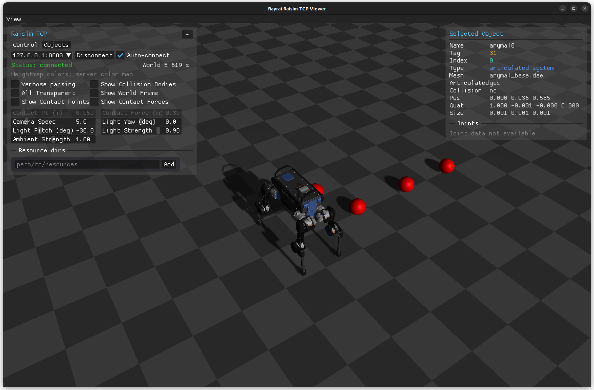

#######################################
Server Example: Dynamic Object Addition
#######################################

Overview
========
Runs an ANYmal with PD control and periodically throws balls into the scene. It shows interaction forces and how to spawn objects during a running simulation.

Screenshot
==========

Binary
======
CMake target and executable name: ``dynamic_object_addition``.

Run
====
Build and run from your build directory:

.. code-block:: bash

   cmake --build . --target dynamic_object_addition
   ./dynamic_object_addition

On Windows, run ``dynamic_object_addition.exe`` instead.
This example uses RaisimServer. Start a visualizer client (RaisimUnity, RaisimUnreal, or the rayrai TCP viewer) and connect to port 8080.

Details
=======
- Spawns ANYmal with PD control and periodically adds spheres at runtime.
- Sets initial velocities for new objects to create a "ball throw" effect.
- Demonstrates safe world mutation while the server is running.

Source
======
.. literalinclude:: ../../../../examples/src/server/dynamic_object_addition.cpp
   :language: cpp
