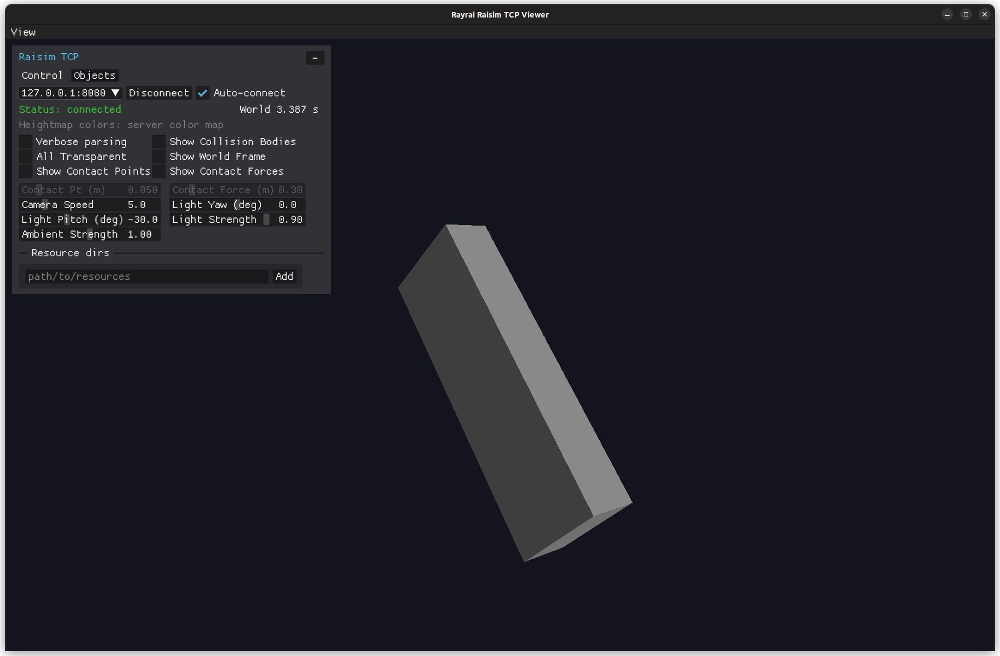

##################################
Server Example: Dzhanibekov Effect
##################################

Overview
========
Demonstrates the Dzhanibekov effect by spinning a box in zero gravity and visualizing the unstable rotation.

Screenshot
==========

Binary
======
CMake target and executable name: ``dzhanibekov_effect``.

Run
====
Build and run from your build directory:

.. code-block:: bash

   cmake --build . --target dzhanibekov_effect
   ./dzhanibekov_effect

On Windows, run ``dzhanibekov_effect.exe`` instead.
This example uses RaisimServer. Start a visualizer client (RaisimUnity, RaisimUnreal, or the rayrai TCP viewer) and connect to port 8080.

Details
=======
- Simulates a freely rotating asymmetric box in zero gravity.
- Shows the intermediate-axis (Dzhanibekov) flipping behavior.
- Focuses the camera on the box for clear visualization.

Source
======
.. literalinclude:: ../../../../examples/src/server/dzhanibekov_effect.cpp
   :language: cpp
