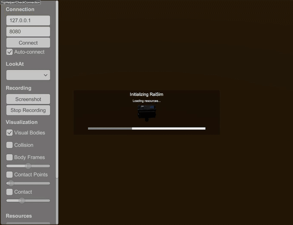

##################################
Server Example: Heightmap From Png
##################################

Overview
========
Loads a PNG heightmap (Zurich dataset) and drops ANYmal on it. This is the reference for heightmap-from-image workflows.

Screenshot
==========

Binary
======
CMake target and executable name: ``heightmap_from_png``.

Run
====
Build and run from your build directory:

.. code-block:: bash

   cmake --build . --target heightmap_from_png
   ./heightmap_from_png

On Windows, run ``heightmap_from_png.exe`` instead.
This example uses RaisimServer. Start a visualizer client (RaisimUnity, RaisimUnreal, or the rayrai TCP viewer) and connect to port 8080.

Details
=======
- Loads a heightmap directly from a PNG file with scale/offset.
- Drops ANYmal onto the terrain and sets a terrain appearance.
- Reference for ``World::addHeightMap`` using images.

Source
======
.. literalinclude:: ../../../../examples/src/server/heightmap_from_png.cpp
   :language: cpp
