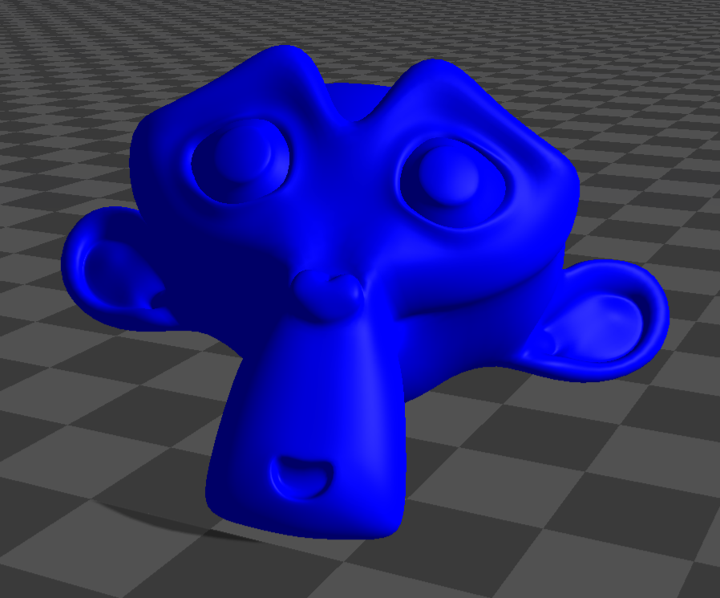

##########################
Server Example: Mesh Stack
##########################

Overview
========
Loads a mesh (the monkey OBJ) multiple times and stacks them in a grid. This demonstrates mesh loading, placement, and appearance settings.

Screenshot
==========

Binary
======
CMake target and executable name: ``mesh_stack``.

Run
====
Build and run from your build directory:

.. code-block:: bash

   cmake --build . --target mesh_stack
   ./mesh_stack

On Windows, run ``mesh_stack.exe`` instead.
This example uses RaisimServer. Start a visualizer client (RaisimUnity, RaisimUnreal, or the rayrai TCP viewer) and connect to port 8080.

Details
=======
- Loads a mesh (monkey.obj) and stacks it in a 3x3 grid.
- Adjusts ERP and timestep for stable stacking.
- Positions the camera for a clear view of the pile.

Source
======
.. literalinclude:: ../../../../examples/src/server/mesh_stack.cpp
   :language: cpp
