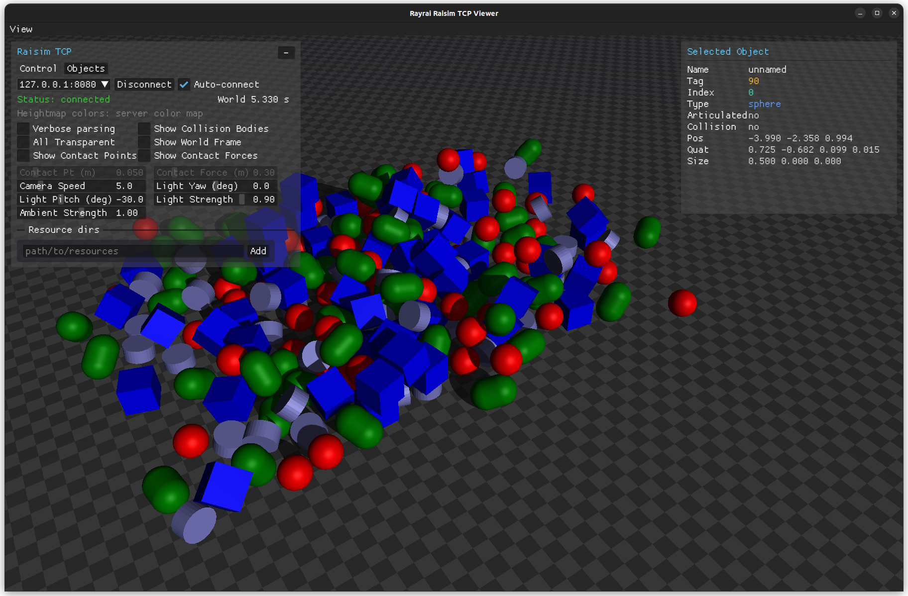

##############################
Server Example: Primitive Grid
##############################

Overview
========
Spawns a grid of boxes, spheres, capsules, and cylinders to show the basic primitive creation APIs. It is a quick visual check for simple shapes and placements.

Screenshot
==========

Binary
======
CMake target and executable name: ``primitive_grid``.

Run
====
Build and run from your build directory:

.. code-block:: bash

   cmake --build . --target primitive_grid
   ./primitive_grid

On Windows, run ``primitive_grid.exe`` instead.
This example uses RaisimServer. Start a visualizer client (RaisimUnity, RaisimUnreal, or the rayrai TCP viewer) and connect to port 8080.

Details
=======
- Creates a 3D lattice of boxes, spheres, capsules, and cylinders.
- Assigns per-shape colors and positions them in a grid.
- Useful for collision/rendering sanity checks.

Source
======
.. literalinclude:: ../../../../examples/src/server/primitive_grid.cpp
   :language: cpp
