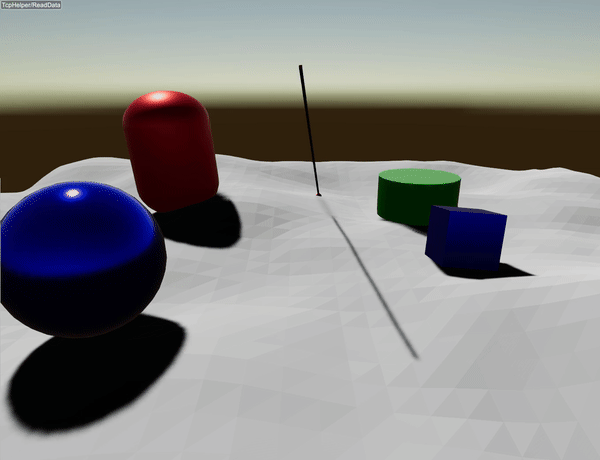

###########################
Server Example: Ray Casting
###########################

Overview
========
Performs a ray test from a fixed origin, then visualizes the hit point with a polyline and a sphere. Use it as the simplest reference for ray casting.

Screenshot
==========

Binary
======
CMake target and executable name: ``ray_casting``.

Run
====
Build and run from your build directory:

.. code-block:: bash

   cmake --build . --target ray_casting
   ./ray_casting

On Windows, run ``ray_casting.exe`` instead.
This example uses RaisimServer. Start a visualizer client (RaisimUnity, RaisimUnreal, or the rayrai TCP viewer) and connect to port 8080.

Details
=======
- Casts a single ray from a fixed origin each frame.
- Visualizes the hit point with a polyline and marker sphere.
- Uses ``World::rayTest`` against terrain and primitives.

Source
======
.. literalinclude:: ../../../../examples/src/server/ray_casting.cpp
   :language: cpp
