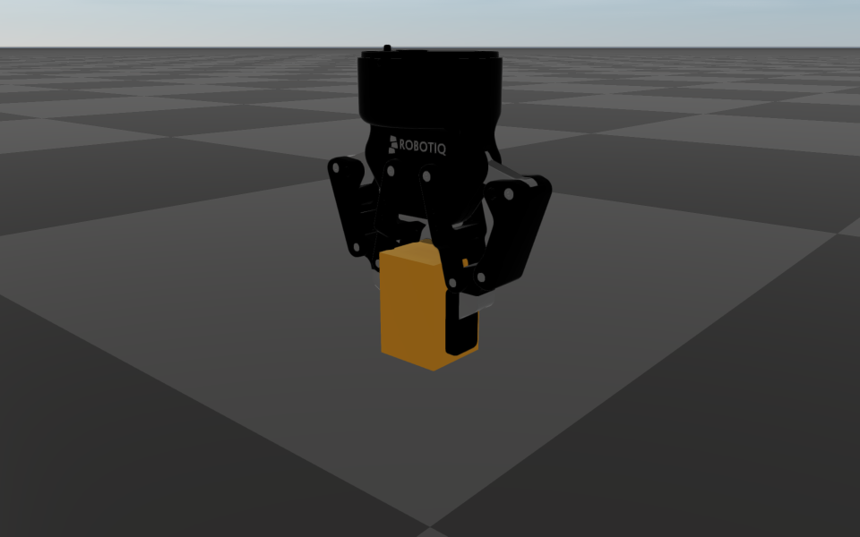

######################################
Server Example: Robotiq Gripper Mimic
######################################

Overview
========
A Robotiq 2F-85 gripper on a vertical lift picks up a box, carries it, and puts it back, in a
12-second cycle. The gripper is driven by a single joint: its five other finger joints follow the
left knuckle through URDF ``<mimic>`` constraints (see :doc:`../../articulated_system/MimicJoints`).

Screenshot
==========

Target
======
CMake target: ``robotiq_gripper_mimic``.

Run
====
Run the build-tree executable:

.. code-block:: bash

   ./build-examples/examples/robotiq_gripper_mimic

On Windows, run ``robotiq_gripper_mimic.exe`` instead.
This example uses RaisimServer. Start ``rayrai_tcp_viewer`` and connect to port 8080.

Details
=======
- Loads ``rsc/robotiq_2f85/robotiq_2f85_mimic.urdf``, converted from the BSD-licensed
  `ros2_robotiq_gripper <https://github.com/PickNikRobotics/ros2_robotiq_gripper>`__ description:
  the gripper hangs fingers-down from a carriage on a prismatic ``lift`` joint, and its fingertip
  pads collide through thin boxes on their gripping faces.
- Only ``lift`` and ``robotiq_85_left_knuckle_joint`` have PD gains. The right knuckle, both inner
  knuckles and both fingertips are mimic joints with multipliers of +1 or -1; the fingertips
  counter-rotate, so the pads stay parallel and open to 85 mm.
- The knuckle target closes past the 40 mm box, so the knuckle PD squeezes it; the mimic
  constraints carry the squeeze to the right finger as an equal and opposite joint torque.
- The script follows the world time, so pausing the simulation in the viewer pauses the cycle.
