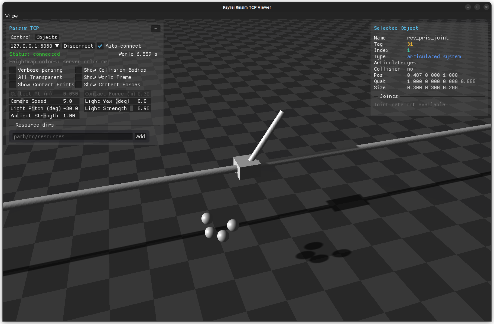

####################################
Server Example: Spring Damper Joints
####################################

Overview
========
Loads URDFs with spring and damper joints (cartpole and chain) to visualize joint compliance. This example focuses on spring-damper behavior.

Screenshot
==========

Binary
======
CMake target and executable name: ``spring_damper_joints``.

Run
====
Build and run from your build directory:

.. code-block:: bash

   cmake --build . --target spring_damper_joints
   ./spring_damper_joints

On Windows, run ``spring_damper_joints.exe`` instead.
This example uses RaisimServer. Start a visualizer client (RaisimUnity, RaisimUnreal, or the rayrai TCP viewer) and connect to port 8080.

Details
=======
- Loads cartpole and chain URDFs with spring/damper joint parameters.
- Demonstrates URDF-based joint spring/damper behavior.
- Focuses on the ball-joint chain for clarity.

Source
======
.. literalinclude:: ../../../../examples/src/server/spring_damper_joints.cpp
   :language: cpp
