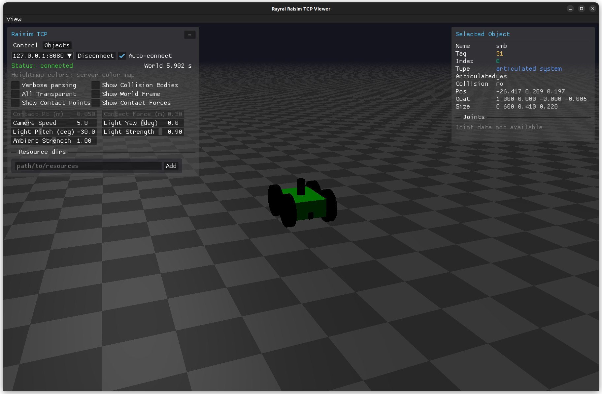

###########################################
Server Example: Wheeled Robot Force Control
###########################################

Overview
========
Loads a wheeled robot (SMB/megabot) and applies wheel forces in force-control mode. Use it to see a basic wheeled robot setup.

Screenshot
==========

Binary
======
CMake target and executable name: ``wheeled_robot_force_control``.

Run
====
Build and run from your build directory:

.. code-block:: bash

   cmake --build . --target wheeled_robot_force_control
   ./wheeled_robot_force_control

On Windows, run ``wheeled_robot_force_control.exe`` instead.
This example uses RaisimServer. Start a visualizer client (RaisimUnity, RaisimUnreal, or the rayrai TCP viewer) and connect to port 8080.

Details
=======
- Loads the SMB wheeled robot and applies constant wheel torques.
- Uses ``FORCE_AND_TORQUE`` control mode with semi-implicit integration.
- Focuses the camera on the robot for rollout.

Source
======
.. literalinclude:: ../../../../examples/src/server/wheeled_robot_force_control.cpp
   :language: cpp
