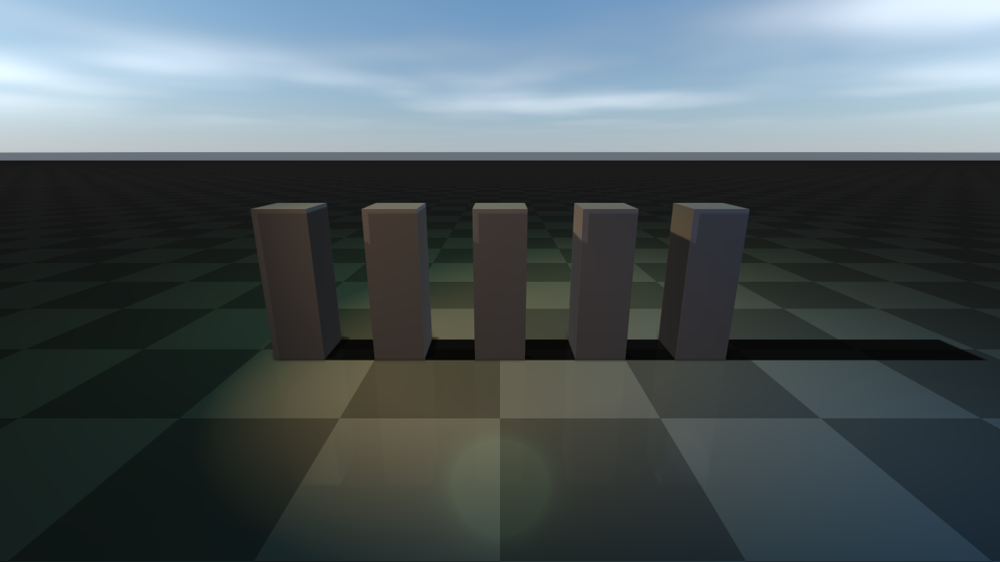

##############################
Lighting, shadows, and HDR/IBL
##############################

This page covers the main directional light, additional spot/point/area lights,
shadow budgets, cascaded and soft sun shadows, HDR/image-based lighting,
reflection probes, and baked indirect lighting. For the overall render-quality
preset that controls shadow defaults, see :doc:`RenderQuality`. For
weather-driven lighting (sun position over time of day, lightning, cloud
shadows) see :doc:`Weather`.

Shadows and lights
==================
rayrai has a fast single-main-light path for robotics workloads and a higher-quality
multi-light path for authored visual scenes. The main light is a directional light and
is always the cheapest shadow-casting source. Imported glTF/Blender scenes can also
use additional directional, point, spot, and area-style lights.

Shadow defaults are tuned so a directional shadow is clearly visible without
any per-application setup. Every preset uses a compact directional shadow
ortho box (``halfSize=12.5``, ``near=0.1``, ``far=55``) and a single
cascade, which keeps each shadow-map texel small enough that the resulting
shadow stays crisp even with bright IBL fill. Balanced and High use brighter
ambient/IBL defaults than older releases so smooth metallic surfaces do not
read black under sky fill; Ultra keeps more contrast through the lowest direct
ambient and environment intensity of the PBR presets and AgX tone mapping (see
the preset reference in :doc:`RenderQuality`). Raise ``mainLightAmbient`` or
lower ``shadowStrength`` for a flatter indoor look; the defaults are aimed at
outdoor daylight.

By default, the main shadow center tracks a point in front of the camera and the shadow
box is fixed in size. You can customize both via ``RayraiWindow``:

.. code-block:: cpp

    // shadow center is N meters ahead of the camera (default: 10.0)
    viewer.setShadowCenterOffset(12.0f);
    // shadow box (default: halfSize=12.5, near=0.1, far=55.0)
    viewer.setShadowOrtho(20.0f, 0.1f, 80.0f);

``setRenderQualitySettings`` re-applies ``shadowCenterOffset``,
``shadowOrthoHalfSize``, ``shadowNear``, and ``shadowFar`` from the settings, so
set those fields instead when you also change quality settings later. The
renderer re-applies the shadow box size and centre every frame, so they can
only be changed through these calls; ``getLight().setShadowPosition(pos)``
additionally pins the position the directional shadow is projected from.

Additional lights are controlled explicitly and capped so the fast path stays fast.
Rayrai currently supports up to ``RayraiWindow::kMaxAdditionalLights`` (16) additional
lights and up to ``RayraiWindow::kMaxAdditionalShadowLights`` (8) additional shadow maps.
``RenderQualitySettings::shadowedLightBudget`` counts the shadowed lights including the
main light, so additional lights get shadow maps only when it is greater than 1 (it is 1
by default and in Fast/Balanced, 2 in High/Ultra). Directional,
spot, and area-style lights use 2D shadow maps. Point lights use cubemap shadow maps.
Shadow framebuffer setup validates the current OpenGL context and recreates stale
framebuffer/texture names when a viewer context is rebuilt; this matters for TCP-viewer
lifetime, offscreen tests, and applications that create/destroy render contexts.
For imported scenes, ``RenderQualitySettings::autoSelectImportedShadowLight`` can promote
the strongest imported light to the main shadow caster, while the remaining shadow budget
is assigned to additional lights.

.. code-block:: cpp

    raisin::RayraiWindow::AdditionalLight fill;
    fill.type = raisin::LightType::DIRECTIONAL;
    fill.direction = glm::normalize(glm::vec3(0.4f, -0.2f, -0.8f));
    fill.diffuse = glm::vec3(0.10f, 0.12f, 0.16f);
    viewer.addAdditionalLight(fill);

    raisin::RayraiWindow::AdditionalLight spot;
    spot.type = raisin::LightType::SPOT;
    spot.position = glm::vec3(1.8f, -1.6f, 2.6f);
    spot.direction = glm::normalize(glm::vec3(-1.4f, 1.0f, -1.8f));
    spot.diffuse = glm::vec3(0.18f, 0.42f, 1.0f);
    spot.spotInnerCos = std::cos(glm::radians(14.0f));
    spot.spotOuterCos = std::cos(glm::radians(28.0f));
    // Optional spotlight projector cookie, color temperature, and distance fade.
    spot.projectorMap = projectorTextureId;
    spot.projectorStrength = 1.0f;  // 0..1; the default 0 disables the cookie
    spot.temperatureEnabled = true;
    spot.temperatureKelvin = 4200.0f;
    spot.distanceFadeEnabled = true;
    spot.distanceFadeBegin = 18.0f;
    spot.distanceFadeLength = 6.0f;
    spot.castsShadows = true;
    viewer.addAdditionalLight(spot);

    raisin::RayraiWindow::AdditionalLight area;
    area.type = raisin::LightType::AREA;
    area.position = glm::vec3(0.0f, 1.8f, 2.1f);
    area.diffuse = glm::vec3(0.55f, 0.65f, 0.42f);
    area.radius = 1.4f;
    area.areaSize = glm::vec2(1.8f, 0.9f);
    viewer.addAdditionalLight(area);

    viewer.clearAdditionalLights();

Each ``AdditionalLight`` supports the basic attenuation/spot/area parameters above plus
optional projector cookie texture, color-temperature override (Kelvin), distance fade for
both lighting and shadow casting, and a per-light shadow toggle. The cookie needs
``projectorStrength > 0`` and is ignored for point lights. ``castsShadows`` defaults to
``true``, so every additional light, including imported ones, competes for the additional
shadow budget. PBR meshes drawn by the compact PBR program receive neither
additional-light shadows nor cookies (see the GPU capability tiers in :doc:`Materials`).
``updateAdditionalLight(index, light)`` replaces one light in place.
Imported scenes can be brought in with ``importSceneLights(sceneFile, intensityScale)``,
and ``promoteDominantAdditionalLightToMainShadowCaster(preferSpotLights = true,
removePromotedAdditionalLight = true)`` moves the dominant shadow-casting
additional light to the main shadow path (spot lights are preferred by default;
point lights are never promoted), so the remaining shadow budget covers the
rest. The main light takes over that light's type, pose, colour, and
attenuation.

The main ``raisin::Light`` returned by ``RayraiWindow::getLight()`` exposes
helpers for spotlight angles and point-light range so callers do not have to set
raw cosine/attenuation fields by hand. The main light is directional, and
``setRenderQualitySettings`` makes it directional again, so these helpers only
matter after its type has been changed, for example by the promotion above:

.. code-block:: cpp

    auto& mainLight = viewer.getLight();
    mainLight.setSpotAngles(/*innerDeg=*/14.0f, /*outerDeg=*/28.0f);
    mainLight.setRange(/*rangeMeters=*/12.0f);  // full intensity at the source, ~1.2% at 12 m

Numeric units used throughout ``raisin::Light``: positions and ``radius`` /
``distanceFade*`` in metres; ``temperatureKelvin`` in Kelvin; ``setSpotAngles``
takes degrees (and stores the cosines internally so the raw
``spotInnerCos`` / ``spotOuterCos`` fields are still meaningful). The
``AdditionalLight`` plain-data struct uses the same field conventions, so
``std::cos(glm::radians(deg))`` is still the manual recipe for those.

Point, spot, and area lights are attenuated by
``1 / (constant + linear * d + quadratic * d²)``, where ``d`` is the distance in
metres from the surface to the light (to the nearest point of an area light's
rectangle) but never less than ``radius``; area lights use a quarter of
``radius``, and at least 0.1 m. ``radius`` is the size of the light source, not
a cutoff: a surface closer than ``radius`` receives the attenuation at
``d = radius`` instead of getting brighter, and the light still reaches surfaces
beyond it. ``radius`` also softens an area light's specular highlights and, for
additional lights, raises their priority for a shadow map. Directional lights
ignore all of these fields.

``setRange(R)`` sets ``constant = 1``, ``linear = 4.5 / R`` and
``quadratic = 75 / R²`` (``R`` is at least 0.01 m): full intensity at the
source, 1/80.5, about 1.2%, at ``d = R``, and a falloff that continues beyond
``R`` (0.3% at ``2R``) without reaching zero. It does not change ``radius``.
The range does not stop a light from shading distant objects; to keep an
additional light from shading them at all, use the range cutoff described in
`Additional-light range cutoff`_, which derives the range from the light's
color and attenuation coefficients.

``setRenderQualitySettings`` and ``setRenderQualityPreset`` rebuild the main light
from the ``mainLight*`` and ``shadow*`` fields (it becomes directional again) and remove
every additional light. Applying an environment sidecar or a reflection-probe sidecar
goes through the same call. Apply quality settings first and add or import lights
afterwards; ``setAdditionalLightContributionThreshold`` and
``setDepthPrepassesEnabled`` change their settings without touching the lights.
Weather (see :doc:`Weather`) is layered on top of the last quality settings: it
can change the main light's direction and colour but keeps the additional lights.

With ``RenderQualitySettings::addViewerFillLights`` (on by default) every
``setRenderQualitySettings`` call also re-adds two viewer lights: a directional fill at
16% of ``mainLightDiffuse`` and a warm point rim light at (-2, -3, 3). They take two
additional-light slots and cast shadows like any other additional light, so turn the flag
off for authored lighting.

Shadow update cost is configurable. Dynamic scenes can update shadows every frame; static
visual scenes can bake shadow maps at startup or refresh them only when light/object
placement changes.

.. code-block:: cpp

    auto quality = raisin::RayraiWindow::defaultRenderQualitySettings(
      raisin::RayraiWindow::RenderQualityPreset::Ultra);
    quality.updateShadowsEveryFrame = false;       // startup/on-demand shadow bake
    quality.maxAdditionalLightsPerFrame = 12;      // light evaluation budget
    quality.shadowedLightBudget = 5;               // main light + 4 additional maps
    quality.maxPointShadowLights = 2;              // cubemap shadow budget
    quality.additionalShadowResolutionScale = 0.5f;
    quality.pointShadowResolutionScale = 0.5f;
    viewer.setRenderQualitySettings(quality);

Use lower budgets for interactive editing or RL throughput. Use higher budgets for
offline screenshots, inspection, or demos where visual fidelity is more important than
frame time.

Instanced foliage and grass patches cast shadows by default, like other instanced
visuals. Call ``InstancedVisuals::setCastsShadows(false)`` to opt a batch out (the choice
survives later wind or grass-patch configuration), and use ``setShadowFoliageLodPolicy``
to bound the shadow-pass cost of dense vegetation.

Cascaded and soft directional shadows
=====================================
Presets render the main directional light into one shadow map. Large outdoor
scenes can split it into up to four cascades, and the sun can use a
blocker-aware penumbra instead of the fixed PCF kernel. Both are off by
default.

.. code-block:: cpp

    auto quality = viewer.getRenderQualitySettings();
    quality.directionalShadowCascadeCount = 3;           // 1..4; 1 = single map
    quality.directionalShadowCascadeMaxDistance = 80.0f; // metres; 0 = shadowFar
    quality.directionalShadowSoftnessDegrees = 0.53f;    // sun diameter; 0 = PCF
    quality.directionalShadowSoftnessMaxRadius = 8.0f;   // cap in shadow-map texels
    viewer.setRenderQualitySettings(quality);

``directionalShadowCascadeLambda`` blends uniform and logarithmic split
distances; ``directionalShadowCascadeSplitOverrides`` sets explicit split
distances in metres. Only the first ``count - 1`` entries are used, and they are
ignored unless they increase and lie between the camera near plane and the
shadowed distance. Each
cascade is padded for the filter footprint and snapped to a world-anchored
texel grid, so it stays stable while the camera moves. Cascades also work on
macOS and other GPUs limited to 16 fragment texture units.

Soft shadows search the shadow map for blockers and widen the filter with the
blocker-to-receiver distance, a bounded approximation of percentage-closer soft
shadows. They apply only to the main directional light, replace
``shadowContactHardening`` for it, never filter narrower than
``shadowPcfRadius``, and are clamped to 0-4 degrees and 1-16 texels. The
physical sun is about 0.53 degrees across; larger values give wider penumbrae.
The extra shadow-map lookups cost GPU time. Point, spot, and area shadows keep
PCF.

Additional-light range cutoff
=============================
Point, spot, and area lights normally shade every object in view. An opt-in
cutoff derives a finite range for each of them from its intensity and
attenuation and fades it out smoothly, so objects outside the range skip that
light:

.. code-block:: cpp

    viewer.setAdditionalLightContributionThreshold(1.0e-4f);  // keeps authored lights
    viewer.setAdditionalLightContributionThreshold(0.0f);     // default: no cutoff

The same value is ``RenderQualitySettings::additionalLightContributionThreshold``
(0 in every preset). The value is a total scene-linear incident-radiance budget
shared by the uploaded lights, not a bound on final pixel error. Directional
lights, lights without distance falloff, lights with an ambient term, and lights
with a projector cookie are never cut off. ``rayrai/LightInfluence.hpp`` provides
``additionalLightInfluenceRange()`` (pass one light's share of the budget) to
inspect the range a light gets. The cutoff saves shading when lights are far
apart; when their ranges overlap it only adds CPU work.

HDR, image-based lighting, and reflections
==========================================
rayrai supports HDR equirectangular environments for real-time PBR preview and
inspection. The HDR path is not a ray tracer; it precomputes cubemap data for
environment background, diffuse irradiance, specular prefiltering, and a split-sum BRDF
lookup table, then samples those textures in the PBR shader.

The simplest setup is the ``PbrEnvironment`` bundle, which packs the four GL
handles (radiance cubemap, diffuse irradiance, prefiltered specular, split-sum
BRDF LUT) plus the mip count and an overall strength scalar into one struct:

.. code-block:: cpp

    auto env = raisin::PbrEnvironment::loadFromHdrFile("/path/to/environment.hdr");
    if (env.isComplete()) {
      visual->setPbrEnvironment(env);
    }

``PbrEnvironment::LoadOptions`` exposes the per-cubemap resolution, sample
count, BRDF LUT size, and a default strength when the defaults are not
appropriate. Optional parallax-corrected box projection is set via
``boxProjection`` / ``probePosition`` / ``boxMin`` / ``boxMax`` on the bundle.

The lower-level static creators are still available when callers want to
manage GL handles individually:

.. code-block:: cpp

    const char* hdr = "/path/to/environment.hdr";
    unsigned int env = raisin::RayraiWindow::loadHdrEquirectangularCubemap(hdr, 128, true);
    unsigned int irradiance = raisin::RayraiWindow::createHdrIrradianceCubemap(hdr, 32, 64);
    unsigned int prefiltered =
      raisin::RayraiWindow::createHdrPrefilteredEnvironmentCubemap(hdr, 128, 5, 64);
    unsigned int brdf = raisin::RayraiWindow::createSplitSumBrdfLut(128, 128);

    visual->setPbrEnvironment(env, irradiance, prefiltered, brdf, 1.0f);

Use HDR environments with visible features when inspecting reflective materials. A
featureless sky or uniform studio HDR can make it hard to tell whether reflections are
working. ``rayrai_pbr_texture_maps`` and ``rayrai_blue_wall_scene`` load HDR
environments so metallic and glossy surfaces show visible reflections while
non-metallic assets remain mostly diffuse.

Materials without an environment cubemap use a procedural daylight fallback: a
neutral sky term tinted by ``RenderQualitySettings::pbrEnvironmentLightingTint``
(default white) over a ground term tinted by ``pbrEnvironmentGroundTint``, plus a
sun highlight from the main light, scaled by ``pbrEnvironmentIntensity`` when
``highFidelityPbr`` is on. It does not follow the visible sky or fog colours;
``pbrEnvironmentSkyTint``, ``pbrEnvironmentHorizonTint``, and
``pbrEnvironmentHorizonStrength`` only tint the procedural background. HDR
environments keep their captured colour. Instanced visuals with PBR materials use
a hemispheric version of the same fallback and never sample environment cubemaps;
``Material::iblStrength`` scales it, and ``environmentMapStrength`` scales only
its specular part.
``RayraiWindow::setEnvironmentBackground`` only draws the background; assign
environment maps to visuals with ``setPbrEnvironment``.

For scene-wide reflections, rayrai also has static reflection probe capture, local
probe selection, reflection-probe sidecars, and planar ground reflection support.
Planar reflections clip the reflected view at the ground plane, so geometry below
the floor does not show up in them.
These are real-time approximation tools: they improve visual fidelity without
enabling path tracing or other slow offline rendering mechanisms. Choose lower
environment resolution, fewer prefilter samples, and fewer reflection updates for
fast interactive runs; increase those values for screenshots or inspection.

.. code-block:: cpp

    raisin::RayraiWindow::ReflectionProbeCaptureSettings capture;
    capture.resolution = 128;
    auto filter = viewer.reflectionProbeFilterSettingsForCurrentQuality();
    auto probe = viewer.captureFilteredReflectionProbe(
      {0.0f, 0.0f, 1.5f}, 6.0f, 1.0f, capture, filter);
    viewer.addReflectionProbe(probe);
    viewer.applyNearestReflectionProbe(*visual, visualPosition);

Use ``captureReflectionProbeCubemapCached``/``captureFilteredReflectionProbeCached``
when the same probe position is recomputed across frames (for example, while authoring
or scrubbing weather). Cache entries are keyed by all arguments (position, radius,
strength, and capture/filter settings), and their textures stay owned by the
renderer. ``clearReflectionProbeCache()`` deletes them, after which probes returned
by the cached calls are dangling. ``selectReflectionProbeBlend(position, blend)``
fills ``blend`` with up to two probes and their normalized weights and returns false
when no probe influences the position; ``applyNearestReflectionProbe`` binds the
primary probe of that blend. The blend is useful for debug overlays.

Authored scene sidecars can ship next to imported assets and describe reflection
probes, environment/background settings, and weather. For a scene file
``scene.glb`` the loaders look for ``scene.glb.rayrai_probes.json`` (or
``.rayrai_environment.json`` / ``.rayrai_weather.json``), then
``scene.rayrai_probes.json`` in the same directory; a path that already ends in
``.json`` is read directly. Each sidecar type has a ``load*`` call that only
parses the file and an ``apply*`` call that loads it and applies it to the
renderer:

.. code-block:: cpp

    // Reflection probe sidecar: probes plus selection/filter quality settings.
    std::string probePath;
    auto probes = raisin::RayraiWindow::loadReflectionProbeSidecar(
        sceneFile, /*settingsOut=*/nullptr, &probePath);
    viewer.applyReflectionProbeSidecarQualitySettings(sceneFile);

    // Environment sidecar: HDR, intensity, rotation, sky tint.
    std::string envPath;
    auto env = raisin::RayraiWindow::loadEnvironmentSidecar(sceneFile, &envPath);
    viewer.applyEnvironmentSidecarSettings(sceneFile);

    // Weather sidecar: preset/settings plus local fog volumes.
    std::string wxPath;
    auto wx = raisin::RayraiWindow::loadWeatherSidecar(sceneFile, &wxPath);
    viewer.applyWeatherSidecarSettings(sceneFile);

    // Authoring helper: serialize a weather setup next to the scene file.
    raisin::RayraiWindow::writeWeatherSidecar(
        "/path/to/scene.rayrai_weather.json", weatherSettings, localFogVolumes);

When the sidecar supplies settings, ``applyEnvironmentSidecarSettings`` and
``applyReflectionProbeSidecarQualitySettings`` go through
``setRenderQualitySettings`` and therefore remove additional lights, so apply
them before adding or importing lights. ``applyWeatherSidecarSettings`` goes
through ``setWeatherSettings`` and keeps them.
``suggestReflectionProbePlacementFromSceneBounds()`` is a non-mutating helper that
proposes probe positions from current scene AABBs; use it as a starting point when
authoring a sidecar by hand.

Reflections, decals, irradiance volumes, and lightmaps
======================================================
Beyond probes and IBL, rayrai supports projected decals for surface detail, and
irradiance volumes and authored lightmaps as cheap indirect-light alternatives:

* **Projected decals** (``addProjectedDecal``) — project a textured box onto
  any surface inside it; supports albedo / emission / normal / ORM slots,
  per-decal UV scaling, and distance fade.
* **Irradiance volumes** (``addIrradianceVolume``) — blanket a region with a
  constant indirect colour for authored interiors that need indirect light
  without a full GI bake.
* **Lightmaps** — populate ``Material::lightmapMap`` from an external bake
  tool and set ``lightmapStrength`` (default 0, which disables the map) to drive
  ``92_lightmap_gi``-style authored interiors. Set ``lightmapUsesUv2`` when the
  bake uses the second UV channel.

Irradiance volumes and lightmaps are evaluated only by the full PBR program;
PBR meshes drawn by the compact program get neither. rayrai picks the program
from the GPU's fragment texture units; see the GPU capability tiers in
:doc:`Materials`. Projected decals are a post-process pass and are not drawn on
macOS or other GPUs limited to 16 fragment texture units; see
:doc:`PostProcess`. Up to eight decals render per frame. Their albedo,
emission, normal and ORM maps share the texture units the post pass has left:
25 maps per frame on the GPUs that report 32 fragment texture units (the
NVIDIA, AMD and Intel OpenGL drivers), all 32 with 39 or more. Maps are
assigned in decal order; a map beyond the limit is not applied, but its decal
still draws with its color.

.. code-block:: cpp

    // Projected sign / poster decal.
    raisin::ProjectedDecal sign;
    sign.center = glm::vec3(2.0f, 0.0f, 1.6f);
    sign.halfExtents = glm::vec3(0.6f, 0.05f, 0.3f);
    sign.color = glm::vec4(1.0f);
    sign.albedoMap = posterTextureId;          // sRGB poster art
    sign.emissionMap = emissiveTextureId;      // optional glow
    sign.emissionEnergy = 1.5f;
    sign.albedoMix = 1.0f;
    sign.distanceFadeEnabled = true;
    sign.distanceFadeBegin = 12.0f;
    sign.distanceFadeLength = 4.0f;
    viewer.addProjectedDecal(sign);

    // Interior indirect light volume covering a room.
    raisin::IrradianceVolume room;
    room.center = glm::vec3(0.0f, 0.0f, 1.5f);
    room.halfExtents = glm::vec3(4.0f, 4.0f, 1.7f);
    room.color = glm::vec3(0.32f, 0.30f, 0.28f);
    room.strength = 0.85f;
    room.edgeFade = 0.22f;
    viewer.addIrradianceVolume(room);

    // Lightmap-driven authored interior.
    auto floor = raisin::Material::pbr("floor", glm::vec4(1.0f),
                                       /*metallic=*/0.0f, /*roughness=*/0.55f);
    floor.albedoMap = floorAlbedoMapId;
    floor.lightmapMap = floorLightmapBakeId;
    floor.lightmapStrength = 1.0f;             // 0 (the default) ignores the map
    floor.lightmapUsesUv2 = true;              // bake uses the second UV channel
    floorVisual->setMaterialOverride(floor);

.. list-table::
   :header-rows: 1
   :widths: 50 50

   * - Reflection probe
     - Projected decals
   * - .. image:: ../../../rsc/docs/image/rayrai/showcase/12_reflection_probe_room.png
          :alt: Room with reflection probe applied to glossy surfaces
     - .. image:: ../../../rsc/docs/image/rayrai/showcase/91_projected_decals.png
          :alt: Decals projected onto multiple surfaces
   * - Irradiance volumes
     - Lightmap GI
   * - .. image:: ../../../rsc/docs/image/rayrai/showcase/93_irradiance_volumes.png
          :alt: Authored irradiance volumes filling indirect light
     - .. image:: ../../../rsc/docs/image/rayrai/showcase/92_lightmap_gi.png
          :alt: Lightmap-driven GI on authored scenes

Sky visibility and baked diffuse light
======================================
Two optional world-space grids add spatial variation to indirect light, for
example under a forest canopy. Both hold static data that the application
bakes offline; rayrai only samples them. Upload them on the rendering thread
with the renderer's GL context current. The data is copied.

.. code-block:: cpp

    // Scalar sky visibility: 1 = open sky, 0 = fully occluded.
    raisin::SkyVisibilityGrid sky;
    sky.dimensions = {41, 51, 21};
    sky.minimum = {-40.0f, -50.0f, -4.0f};  // centres of the outermost samples
    sky.maximum = {40.0f, 50.0f, 36.0f};
    sky.values = visibility;                 // x fastest, then y, then z
    viewer.setSkyVisibilityGrid(sky, /*strength=*/0.65f, /*edgeFadeMeters=*/2.0f);

    // Diffuse irradiance as first-order spherical harmonics per probe.
    raisin::BakedIrradianceGrid bounce;
    bounce.dimensions = {17, 21, 9};
    bounce.minimum = {-40.0f, -50.0f, -4.0f};
    bounce.maximum = {40.0f, 50.0f, 28.0f};
    bounce.probes = probes;                  // one IrradianceProbe per sample
    viewer.setBakedIrradianceGrid(bounce, /*strength=*/1.0f);

    viewer.clearSkyVisibilityGrid();
    viewer.clearBakedIrradianceGrid();

The sky-visibility grid attenuates only environment lighting (the environment
map or the procedural fallback, diffuse and specular) on PBR and instanced PBR
materials. Direct light, the ``mainLightAmbient`` floor, lightmaps, irradiance
volumes, and the baked grid keep their own visibility. It is sampled per
vertex, so coarse meshes interpolate it across each triangle. Its strength
range is 0-1.

The baked grid adds light reflected from surrounding surfaces on top of the
environment term. Each ``IrradianceProbe`` stores, per RGB channel, the
constant and x/y/z coefficients of cosine-convolved irradiance divided by pi,
in linear scene units before exposure; ``raisin::accumulateIrradiance`` and
``raisin::deringIrradiance`` in ``rayrai/BakedIrradiance.hpp`` help build them.
It respects material AO and metallic, scales with ``Material::iblStrength``,
and lights the back of thin foliage through ``foliageTransmissionColor`` and
``foliageTransmissionStrength`` when ``foliageTwoSidedLighting`` is on. Its
strength range is 0-4.

Outside its bounds each grid has no effect; ``edgeFadeMeters`` fades it in at
the boundary. Each axis needs 2-256 samples and a grid holds at most 2,097,152
samples. Unlike the resource-creation calls, the setters throw
``std::invalid_argument`` for invalid data or a grid larger than the GPU
texture limit, and ``std::runtime_error`` when no GL context is current or no
texture unit is free. Moving geometry or changing the lighting requires a new
bake.
