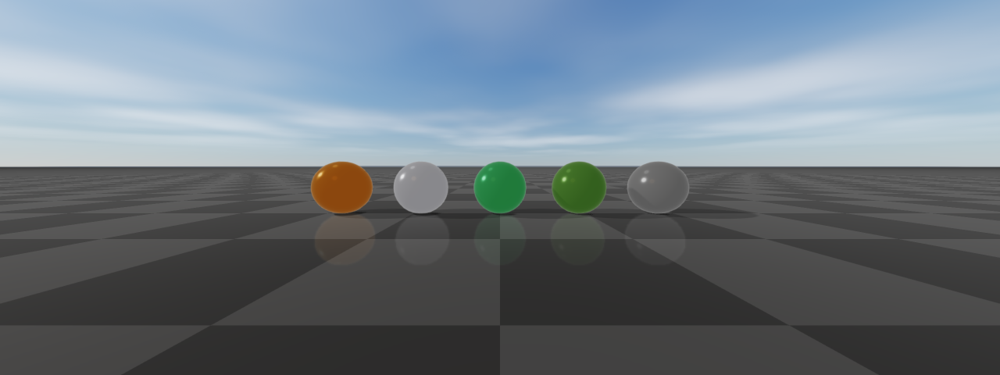

#############
PBR materials
#############

rayrai's PBR materials cover the standard metallic-roughness slots plus
extensions for clearcoat, sheen, transmission, anisotropy, subsurface,
and detail textures. The importer fills these in automatically for glTF
assets; in-process code typically constructs materials with the static
factories described below and applies them via
``Visuals::setMaterialOverride``. Glass and foliage have their own sections
below, and `GPU capability tiers`_ lists which features a given GPU renders.

Visual-level material controls (override, remap, overlay, visibility range,
shadow casting modes) are on the :doc:`Visuals` page. Tone mapping is on
:doc:`RenderQuality`, and post-process effects are on :doc:`PostProcess`.

Supported PBR inputs
====================
rayrai supports a lightweight glTF-style metallic-roughness PBR path in addition to
the existing simple Phong-style renderer. Simple color and legacy textured meshes stay
on the fast path; PBR shader work is used only for meshes whose material requests PBR
features or PBR texture maps.

Supported core inputs include:

* base color factor and base color texture
* metallic and roughness factors
* metallic-roughness texture (or separate metallic + roughness textures, or an
  ``ormMap`` with occlusion, roughness, and metallic in R, G, and B)
* normal texture (with OpenGL or DirectX ``NormalMapConvention``)
* bent-normal texture (for higher-quality AO/indirect occlusion)
* occlusion texture
* emissive factor and emissive texture (Add or Multiply ``EmissionOperator``)

The PBR material model also exposes a wider set of authoring slots used by
imported scenes and authored assets. The full ``raisin::Material::TextureSlot``
list is: ``Albedo``, ``Normal``, ``BentNormal``, ``Metallic``, ``Roughness``,
``MetallicRoughness``, ``Ao``, ``Emissive``, ``Clearcoat`` / ``ClearcoatRoughness``
/ ``ClearcoatNormal``, ``SheenColor`` / ``SheenRoughness``, ``Transmission`` /
``Refraction`` / ``Thickness``, ``Subsurface`` / ``SubsurfaceTransmittance`` /
``Backlight``, ``Anisotropy``, ``WeatherMask``, ``Rim``, ``Height``,
``DetailMask`` / ``DetailAlbedo`` / ``DetailNormal``, ``Lightmap``, and
``TextureBlend``. Each slot has a per-material ``UvTransform`` (offset, scale,
rotation) and an authored flag. Metallic, roughness, AO, and refraction maps read
a configurable ``TextureChannel`` (``metallicTextureChannel``,
``roughnessTextureChannel``, ``aoTextureChannel``, ``refractionTextureChannel``).

Material behavior is controlled by several enums on ``raisin::Material``:

* ``Type``: ``SIMPLE_COLOR``, ``TEXTURED``, ``PBR`` (the default) — user-facing
  type hint. ``PBR`` materials, and any material that sets a PBR feature or
  map, use the PBR shaders; ``forceSimpleShading`` forces the simple shader.
* ``ShadingModel``: ``Standard``, ``Lambert``, ``Toon``, ``Unlit`` —
  ``setShadingModel()`` writes the matching diffuse, specular, and unlit fields.
* ``AlphaMode``: ``Opaque``, ``Mask``, ``Hash``, ``Blend`` — glTF-style alpha
  treatment, with optional ``AlphaAntiAliasing`` (``AlphaToCoverage`` and
  ``AlphaToCoverageAndToOne``) for masked materials.
* ``BlendMode``: ``Mix``, ``Add``, ``Subtract``, ``Multiply``,
  ``PremultipliedAlpha`` — Godot-style transparent compositing.
* ``DistanceFadeMode``: ``Disabled``, ``PixelAlpha``, ``PixelDither``,
  ``ObjectDither`` — distance fade for far-away props and decals.
* ``DiffuseMode``: ``Burley``, ``Lambert``, ``LambertWrap``, ``Toon`` — direct
  diffuse BRDF.
* ``SpecularMode``: ``SchlickGgx``, ``Toon``, ``Disabled`` — direct specular
  BRDF.
* ``DetailBlendMode``: ``SoftMultiply``, ``Mix``, ``Add``, ``Subtract``,
  ``Multiply`` — detail-albedo compositing on top of the base color.
* ``CullMode``: ``Back``, ``Front``, ``Disabled`` — per-material face culling
  override.
* ``DepthState``: ``Inherit``, ``Enabled``, ``Disabled``, ``Inverted`` — opt-in
  depth-state override for decals, overlays, and inspection surfaces.
* ``StencilCompare`` / ``StencilEffectMode`` (``Disabled`` / ``Outline`` /
  ``Xray`` / ``Custom``) — stencil-driven selection overlays.
* ``TextureRepeatMode`` and ``TextureFilter`` — per-material sampler overrides
  (``Inherit`` by default, or ``Repeat`` / ``Mirror`` / ``Disabled`` and
  ``Nearest`` / ``Linear`` with optional mipmaps and anisotropy).
* ``BillboardMode``: ``Disabled``, ``Enabled``, ``FixedZ``, ``Particles`` —
  camera-facing rendering for foliage and sprites.
* ``UvLayer``: ``Uv1`` / ``Uv2`` — UV channel of the detail textures
  (``detailUvLayer``). Lightmap, AO, and emissive maps choose the second UV
  channel with the ``lightmapUsesUv2``, ``aoUsesUv2``, and ``emissiveUsesUv2``
  flags instead.
* ``FoliageType``: ``None``, ``Grass``, ``LeafCard``, ``Bush``, ``Branch``,
  ``TreeTrunk``, ``Crop``, ``Vine`` — foliage classification. Any value other
  than ``None`` enables the fields in `Foliage materials`_; the specific value
  does not change shading or wind.

Most of these knobs are populated automatically by the Assimp/glTF importer
(`Material import details`_ covers its fallback rules). Authored materials can
be constructed directly when in-process code needs a specific shading mode, as
the next section shows.

Material factories
==================
For in-process code, ``raisin::Material`` exposes static factory helpers that
set sensible defaults for the common shading variants. Prefer these over hand-
filling the data members.

(Image produced by ``doc_image_material_factories``.)

.. code-block:: cpp

    using raisin::Material;

    // PBR metallic/roughness material with no texture slots.
    auto orange = Material::pbr("orange", glm::vec4(0.95f, 0.43f, 0.12f, 1.0f),
                                /*metallic=*/0.0f, /*roughness=*/0.45f);

    // Unlit color (ignores scene lighting) — useful for HUDs and decals.
    auto hud = Material::unlitColor("hud", glm::vec4(1.0f, 1.0f, 1.0f, 0.85f));

    // Simple (non-PBR) lit color that uses the cheap mesh shader.
    auto debug = Material::simpleColor("debug", glm::vec4(0.0f, 1.0f, 0.0f, 1.0f));

    // Foliage: double-sided, rough, non-metallic. Wind and leaf transmission
    // stay off until you set them (see "Foliage materials").
    auto leaf = Material::foliage("leaf", Material::FoliageType::LeafCard,
                                  glm::vec4(0.32f, 0.58f, 0.21f, 1.0f));

    // Neutral ground material (mid-grey, rough, non-metallic).
    auto ground = Material::defaultGround();

    // Dielectric glass: thickness 0 is a thin, double-sided pane; a positive
    // thickness is the optical path through a closed solid (world units).
    auto window = Material::glass("window");
    auto block  = Material::glass("green_block", /*thickness=*/0.12f,
                                  /*tint=*/glm::vec3(0.30f, 0.82f, 0.60f),
                                  /*attenuationDistance=*/0.9f);

A material's intended shading path is queried with ``usesPbrShading()``,
``canUseCorePbr()`` and ``canUseFoliageFastPbr()`` (the compact core or
alpha-masked foliage shader can draw it; ``canUseCompactPbr()`` means either),
and ``requiresHighFidelityPbr()`` (transmission or refraction, volume thickness
or attenuation, subsurface, backlight, sheen, anisotropy, or iridescence).
``needsTransparentPass()`` reports sorted transparent drawing, and
``isTransmissive()`` / ``hasTransmissivePass()`` report glass (the second also
checks ``nextPass``). ``forceSimpleShading`` is a per-material
escape hatch to route through the cheap simple shader even when PBR fields are
set; ``RenderQualitySettings::forceSimpleMaterialShading`` is the global
equivalent for high-throughput RL renders that do not need PBR.

Lighting is based on rayrai's main light, optional additional lights, shadow maps,
HDR/image-based lighting when configured, and optional reflection probes. Color textures
are uploaded as sRGB; data maps such as normal, metallic-roughness, and AO remain
linear. Normal maps require tangent data; glTF assets usually provide it, and rayrai
generates or imports tangent data where possible. The PBR path is suitable for preview,
data generation, and asset inspection. It is a rasterizer, not an offline path
tracer; only the opt-in `Geometry-aware refraction`_ mode traces rays, and only
through glass.

Heightmap terrain uses a dedicated rough PBR material in both in-process and TCP
viewer paths. Heightmap color maps are treated as terrain albedo, but the material
keeps metallic at zero, roughness high, and planar reflection disabled even when
``RenderQualitySettings::reflectiveGround`` is enabled. This keeps outdoor terrain
from looking like a mirror while retaining sky/IBL fill and normal PBR lighting.

The shipped PBR examples and tools are:

* ``rayrai_pbr_material_grid``: the Khronos MetalRoughSpheres glTF sample, a
  grid of spheres spanning metallic and roughness values, under the High preset.
* ``rayrai_pbr_texture_maps``: texture-slot coverage for base color, normal,
  metallic-roughness, occlusion, and emissive maps on glTF sample assets, lit
  by an HDR environment.
* ``rayrai_visual_asset_support``: textured URDF visual assets (ANYmal C and
  YCB objects) whose visual and collision geometry stay separate.
* ``rayrai_quality_lighting``: point, spot, and area additional lights on the
  Ultra preset for inspecting PBR materials.

Authored light sources are imported through:

* ``KHR_lights_punctual`` from the glTF/GLB file for directional, point, and
  spot lights.
* ``*.rayrai_lights.json`` for Blender area lights with size, direction,
  color, and energy.

For best results, keep the authored scene in metric scale, keep Z as up, and prefer
glTF/GLB over OBJ. OBJ is useful for simple geometry interchange, but it loses too much
of the scene-level material and light data needed for high-quality rendering.

Glass and transmissive materials
================================
``Material::glass(name, thickness, tint, attenuationDistance, roughness,
indexOfRefraction)`` builds a clear dielectric: white base color, zero metallic,
``transmissionFactor = 1``, and by default roughness 0.04 and IOR 1.5 (clamped
to 1–3). Glass is see-through because of transmission, not coverage: keep the
material and visual alpha at one.

* ``thickness = 0`` (the default) is a thin pane. The factory makes it
  double-sided, the pane does not bend the view, and its tint comes from
  ``baseColorFactor.rgb``. Model a pane as a single quad, not a thin box.
* ``thickness > 0`` sets ``volumeThicknessFactor``, the optical path length
  through a solid in world units. Use a closed mesh with outward-facing
  normals; the factory keeps back-face culling.
* ``tint`` and ``attenuationDistance`` set ``volumeAttenuationColor`` and
  ``volumeAttenuationDistance``. The color is the fraction of light left after
  that distance, so transmittance is ``pow(tint, path / attenuationDistance)``.
* ``roughnessFactor`` blurs the transmitted scene; about 0.5 looks frosted.
* ``transmissionMap`` (red) scales transmission and ``thicknessMap`` (green)
  scales the optical path; both honor per-slot UV transforms.
  ``refractionFactor`` / ``refractionMap`` also make a surface transmissive and
  add an artistic offset scaled by ``screenSpaceRefractionStrength`` ×
  ``screenSpaceRefractionMaxPixels``.
* ``metallicFactor`` scales transmission and refraction by ``1 - metallic``.

A material pass with ``transmissionFactor``, ``refractionFactor``,
``transmissionMap``, or ``refractionMap`` set is drawn in the sorted transparent
pass by a dedicated glass shader that fits in 16 texture units, so glass renders
the same on every GPU tier. To show the scene behind the glass, enable
``highFidelityPbr`` and ``screenSpaceRefraction`` (both on in the ``High`` and
``Ultra`` presets, see :doc:`RenderQuality`); otherwise glass transmits only the
environment. The ``Fast`` preset forces simple shading, which draws glass as an
ordinary surface.

.. code-block:: cpp

    auto glass = raisin::Material::glass("green_block", /*thickness=*/0.12f,
                                         glm::vec3(0.30f, 0.82f, 0.60f),
                                         /*attenuationDistance=*/0.9f);
    blockVisual->setMaterialOverride(glass);
    blockVisual->setPbrEnvironment(environmentCubemap);  // reflections and fallback
    blockVisual->setCastsShadows(false);  // otherwise glass casts an opaque shadow

    auto quality = viewer.getRenderQualitySettings();
    quality.highFidelityPbr = true;
    quality.screenSpaceRefraction = true;
    quality.viewerMsaaSamples = 4;               // resolved before the capture
    viewer.setRenderQualitySettings(quality);
    viewer.setLinearHdrRenderingEnabled(true);   // recommended for glass

With ``screenSpaceRefraction`` on, the renderer copies the opaque scene color
(with mipmaps for rough glass) and depth before drawing transparent surfaces,
and glass samples that copy along the refracted ray. The ray's end point is
projected from the authored thickness rather than traced to the exit surface,
so screen-space glass does not show glass behind glass, nested liquids,
internal reflections, dispersion, caustics, or colored shadows. The glass
shader applies base and vertex color, the albedo, normal, roughness, emissive,
transmission, thickness, and refraction maps, environment reflections, the main
and additional lights, and the main-light shadow. It ignores metallic,
metallic-roughness/ORM, and AO maps (so a roughness packed into a glTF
metallic-roughness texture has no effect; use ``roughnessMap``), clearcoat,
sheen, subsurface, parallax, and additional-light shadows. Views that contain glass
use sorted blending instead of weighted OIT or the transparent depth prepass.
``InstancedVisuals`` ignore transmission; use regular visuals or world meshes
for glass.

Geometry-aware refraction
*************************
``RenderQualitySettings::geometryRefraction`` (off by default and in every
preset) replaces screen-space glass with a hybrid path tracer for dielectrics.
Rays intersect the actual glass triangles, which handles concave and hollow
solids, glass behind glass, intersecting solids, nested liquids and air
cavities, total internal reflection, and multiple internal bounces. Absorption
uses the measured distance inside each volume: a positive
``volumeThicknessFactor`` only marks a closed solid, and zero marks a thin
sheet. Other surfaces are opaque; they take their color from the rasterized
image where it shows them and from their base material values elsewhere.

.. list-table::
   :header-rows: 1
   :widths: 38 14 48

   * - Setting
     - Default
     - Meaning
   * - ``geometryRefraction``
     - ``false``
     - Trace transmissive materials instead of screen-space glass.
   * - ``geometryRefractionBackend``
     - ``Automatic``
     - ``Automatic`` uses Vulkan ray queries when available and the portable
       OpenGL tracer otherwise. ``Portable`` always uses OpenGL.
       ``VulkanRayQuery`` requires Vulkan and fails instead of falling back.
   * - ``geometryRefractionSamples``
     - 4
     - Paths per pixel per frame (1–64).
   * - ``geometryRefractionMaxBounces``
     - 32
     - Scattering events per path (1–128); a path that reaches the limit stops
       contributing.
   * - ``geometryRefractionProgressive``
     - ``true``
     - Accumulate samples while the camera, scene, lights, and settings stay
       unchanged.
   * - ``geometryRefractionMaxSamples``
     - 4096
     - Samples per pixel after which accumulation stops (1–1,048,576).
   * - ``geometryRefractionLowDiscrepancy``
     - ``false``
     - Experimental Sobol sampling.
   * - ``geometryRefractionAdaptive``
     - ``false``
     - Experimental per-pixel early stop. Requires progressive accumulation and
       can bias the image.
   * - ``geometryRefractionMinSamples``
     - 256
     - Samples before a pixel may stop adaptively (at least 16).
   * - ``geometryRefractionRelativeError``, ``geometryRefractionAbsoluteError``
     - 0.02, 0.001
     - Adaptive stopping thresholds.
   * - ``geometryRefractionSeed``
     - 0
     - Sampling seed.
   * - ``geometryRefractionRevision``
     - 0
     - Increment after editing a texture or environment in place to restart
       accumulation.

Author the traced scene as follows:

* Where media overlap, the larger ``dielectricPriority`` (default 0) wins. It
  is unrelated to ``renderPriority``; give different overlapping media
  different priorities. For example, a glass cup at 20 holding water at 10,
  with an air bubble (IOR 1) at 30, resolves the water that overlaps the cup
  wall.
* Each visual (or articulated-system body) is one volume, including all of its
  submeshes. Set the same nonzero ``dielectricVolumeId`` to join several
  visuals into one volume, or different IDs to separate submeshes. All parts of
  one volume must share IOR, attenuation, and priority.
* Solids must be closed, consistently wound meshes whose normals point out of
  the material; the faces of a cavity point into the cavity. Open or
  inconsistent volumes are rejected.
* Glass must be homogeneous: no albedo, normal, roughness, emissive,
  transmission, thickness, or refraction maps, zero metallic, alpha one
  (including the visual color, ``setTransparency``, and visibility-range
  fades), and no vertex displacement, billboarding, ``nextPass``, or
  transmissive material overlay.
* Only regular visuals and rigid world objects are traced. ``InstancedVisuals``
  are not traced, and glass on a deformable object is rejected.
* One environment lights the traced rays: the renderer's background cubemap,
  or otherwise the first glass environment map.

At most 16 media can be active along a ray. Exceeding that, or 512 boundary
crossings on one ray, renders magenta rather than guessing. Invalid setups
throw ``std::runtime_error`` from the render call: for example open volumes,
mapped or deformed glass, a fisheye camera, more than 16 media around the
camera, or a ``VulkanRayQuery`` backend that is unavailable.

.. code-block:: cpp

    auto q = viewer.getRenderQualitySettings();
    q.highFidelityPbr = true;
    q.geometryRefraction = true;
    q.temporalAaEnabled = false;   // let the accumulated samples converge
    viewer.setRenderQualitySettings(q);
    viewer.setLinearHdrRenderingEnabled(true);

    auto cup = raisin::Material::glass("cup", /*thickness=*/1.0f);
    cup.roughnessFactor = 0.0f;
    cup.dielectricPriority = 20;
    auto water = raisin::Material::glass("water", /*thickness=*/1.0f);
    water.ior = 1.333f;
    water.dielectricPriority = 10;

    const auto d = viewer.geometryRefractionDiagnostics();
    // d.active, d.backend, d.backendStatus, d.volumes, d.accumulatedSamples

``geometryRefractionDiagnostics()`` reports whether tracing ran, the backend
actually used and why (``backend``, ``backendStatus``), triangle, volume, and
BVH node counts, scene rebuilds, and the scheduled samples per pixel.
With adaptive sampling, ``geometryRefractionSamplingStatistics()`` reads
per-pixel sample counts back from the GPU and can stall; without it every pixel
holds the scheduled budget and no readback happens.

The Vulkan backend is available in Linux and Windows builds. Vulkan headers
and SPIR-V shaders are checked in, and CMake verifies their source manifest
without Python. A Vulkan SDK and shader compiler are unnecessary for normal
builds. Installing development files later does not add
the backend to an already-built rayrai package; use a package built with it or
rebuild from source. See :ref:`rayrai-vulkan-ray-query-troubleshooting` for
setup and verification. At run time it needs a Vulkan 1.2 GPU that matches
the OpenGL device and supports ray queries, acceleration structures, and
OpenGL memory and semaphore sharing (``GL_EXT_memory_object``, ``GL_EXT_semaphore``);
without them the portable tracer runs. Changing the backend restarts accumulation. While ``geometryRefraction`` is enabled the
renderer's frame caches are bypassed even when no glass is visible, so leave it
off otherwise.

Foliage materials
=================
Setting ``foliageType`` to any value other than ``None`` enables the foliage
fields below; the specific type is a label and does not change shading or
wind. ``Material::foliage`` sets the type, ``doubleSided`` (no culling, normals
flipped toward the viewer), roughness 0.85, and metallic 0. It leaves wind and
leaf transmission off.

.. list-table::
   :header-rows: 1
   :widths: 36 18 46

   * - Field
     - Default
     - Effect
   * - ``foliageWindStrength``
     - 0
     - Wind bending on regular meshes (0–4). Zero disables wind for the
       material even when ``foliageWindEnabled`` is on.
   * - ``foliageRootHeight`` / ``foliageTipHeight``
     - 0 / 1
     - Local Z range over which bending ramps from rooted to full strength.
   * - ``foliageStiffness``
     - 1
     - Divides the bending amplitude (minimum 0.05).
   * - ``foliageFlutterWeight``
     - 1
     - Scales ``foliageWindLeafFlutter`` (0–4).
   * - ``foliageTwoSidedLighting``
     - ``false``
     - Adds diffuse light from behind the leaf; required for leaf transmission.
   * - ``foliageTransmissionStrength``
     - 0
     - Light transmitted through the leaf (0–1): direct light and, with
       high-fidelity lighting, the environment behind the leaf.
   * - ``foliageTransmissionColor``
     - (0.55, 0.95, 0.35)
     - Linear tint multiplied with the base color for transmitted light.
   * - ``foliageWeatherResponse``, ``foliageWetResponse``,
       ``foliageSnowResponse``
     - ``true``, 1, 1
     - Let rain and snow change color, roughness, and wind damping
       (responses 0–2).

``foliageSettings()`` / ``setFoliageSettings()`` read and write these fields as
one ``Material::FoliageSettings`` struct. Thin surfaces that are not foliage,
such as paper or curtains, use ``thinTwoSidedLighting``,
``thinBackDiffuseScale`` (default 0.55), ``thinTransmissionStrength``, and
``thinTransmissionColor`` instead. ``InstancedVisuals`` bend with their own wind
settings rather than ``foliageWindStrength``: call ``configureFoliageWind``
(root height, tip height, wind strength, stiffness, flutter weight) or
``configureGrassPatch``. The global wind field is described in :doc:`Weather`.

.. code-block:: cpp

    auto leaf = raisin::Material::foliage(
      "oak_leaves", raisin::Material::FoliageType::LeafCard,
      glm::vec4(0.32f, 0.55f, 0.21f, 1.0f));
    leaf.foliageWindStrength = 0.8f;           // bend under foliageWindEnabled
    leaf.foliageTipHeight = 1.2f;              // local Z of full bending
    leaf.foliageTwoSidedLighting = true;       // light from behind the leaf
    leaf.foliageTransmissionStrength = 0.45f;  // light through the leaf

glTF and GLB files can mark foliage materials explicitly with material extras.
``type`` is ``"leaf"`` (``LeafCard``) or ``"grass"`` (``Grass``); other values
are ignored. ``twoSidedLighting`` defaults to false, ``transmission`` (0–1) to
0, and ``transmissionColor`` to (0.55, 0.95, 0.35). The material's import report
then contains ``authoredRayraiFoliage``.

.. code-block:: json

    {
      "materials": [{
        "name": "twig",
        "extras": {"rayrai": {"foliage": {
          "type": "leaf", "twoSidedLighting": true,
          "transmission": 0.45, "transmissionColor": [0.65, 0.85, 0.28]}}}
      }]
    }

Material import details
=======================
The Assimp/glTF importer is asset-agnostic: it does not special-case particular
scenes such as the blue-wall example. It follows this priority:

* Use explicit material texture slots from the source asset when present.
* Treat base-color and emissive maps as color textures.
* Treat normal, metallic-roughness, occlusion, masks, and other data maps as linear data.
* Preserve normal-map scale and detect common OpenGL-vs-DirectX normal-map naming.
* Use embedded glTF textures when available.
* Search sibling texture files for common PBR map names when the source material omits
  a slot but the files are packaged next to the asset.
* Keep simple solid-color materials on the simple path unless normal maps or PBR features
  require the PBR shader.
* Apply glTF ``extras.rayrai.foliage`` metadata (see `Foliage materials`_).
* Detect foliage assets by keywords in the asset folder or material name
  (foliage, grass, leaf, leaves, bush, shrub, plant, flower, fern, pine,
  sapling, twig, vegetation). For those, draw an alpha-blended material as
  opaque when its albedo texture has no alpha channel and its base and vertex
  colors are fully opaque (import report ``opaqueRgbFoliage=OPAQUE``), and
  possibly reorder opaque foliage vertices for the GPU vertex cache
  (``foliageVertexCache=optimized``).

This fallback behavior is meant to support real downloadable assets whose Blender,
glTF, FBX, DAE, and OBJ exports often disagree about how texture slots are authored.
If an asset renders white or flat, first check the import report/debug output for which
texture slots were found and whether the file paths exist next to the scene.

Visual assets and collision assets
==================================
rayrai visual meshes are renderer assets. URDF models can define separate
``visual`` and ``collision`` meshes, and standalone rayrai visuals can use glTF
material and texture data for inspection or presentation without becoming
collision geometry in ``raisim::World``. Keep this separation when an asset has
high-detail visual triangles, PBR materials, or texture maps.

Use this pattern when you want realistic visuals with collision meshes tuned for
physics:

.. code-block:: cpp

    auto* robot = world.addArticulatedSystem("anymal_c/urdf/anymal.urdf");
    auto* object = world.addArticulatedSystem("ycb/002_master_chef_can.urdf");

Only call ``World::addMesh`` for collision when the mesh is intentionally part
of the physics model. The current textured glTF and imported scene examples keep
renderer assets separate from collision geometry; the physics model still comes
from the URDF or explicit collision objects.

Subsurface scattering and backlight
===================================
rayrai approximates subsurface scattering with three controls that combine
cheaply for plausible skin, leaves, wax, and thin plastic.

* ``viewerSubsurfaceWrap`` / ``viewerSubsurfaceTint`` (``RenderQualitySettings``)
  wrap the diffuse falloff past 90 degrees and tint the wrapped light (warm
  flesh tones by default). This is a global, cheap wrap term in the PBR
  lighting of every material; a nonzero value selects the high-fidelity PBR
  shader.
* ``Material::subsurfaceScatteringStrength`` (default 0) enables a
  per-material subsurface term; the ``Subsurface`` texture slot scales that
  strength, and the ``SubsurfaceTransmittance`` slot tints the transmitted
  light. ``Material::DiffuseMode::LambertWrap`` forces a fixed, untinted wrap of
  at least 0.5, while ``Toon`` replaces the diffuse falloff with a hard
  terminator.
* The ``Backlight`` slot (added to ``backlightColor``) drives a separate light
  contribution that comes from *behind* the surface — useful for translucent
  leaves, candle wax, and thin fabric in rim lighting.

``DiffuseMode`` values other than ``Lambert`` render only on the full GPU tier,
and the subsurface and backlight maps are not sampled on the limited tier; see
`GPU capability tiers`_.

The two showcase images contrast a wrap-only subsurface response (cheap,
shader-side) against an authored skin material that uses the dedicated SSS
texture slots and tuned wrap. The backlight image shows leaves lit from behind,
so light passes through the leaf toward the camera.

.. code-block:: cpp

    // Global wrap-light approximation — cheapest path.
    auto quality = viewer.getRenderQualitySettings();
    quality.viewerSubsurfaceWrap = 0.45f;
    quality.viewerSubsurfaceTint = glm::vec3(1.0f, 0.78f, 0.66f);  // warm flesh
    viewer.setRenderQualitySettings(quality);

    // Authored skin material driving the SSS texture slots.
    auto skin = raisin::Material::pbr(
      "skin", glm::vec4(0.96f, 0.78f, 0.68f, 1.0f),
      /*metallic=*/0.0f, /*roughness=*/0.55f);
    skin.diffuseMode = raisin::Material::DiffuseMode::LambertWrap;
    skin.subsurfaceScatteringStrength = 1.0f;  // the map below scales this
    skin.subsurfaceMap = subsurfaceMapId;
    skin.subsurfaceTransmittanceMap = transmittanceMapId;

    // Translucent leaf with backlight response (Material::foliage is already
    // double-sided).
    auto leaf = raisin::Material::foliage(
      "leaf", raisin::Material::FoliageType::LeafCard,
      glm::vec4(0.32f, 0.58f, 0.21f, 1.0f));
    leaf.backlightMap = leafBacklightMapId;

.. list-table::
   :header-rows: 1
   :widths: 50 50

   * - viewerSubsurfaceWrap
     - Authored skin (SSS slots)
   * - .. image:: ../../../rsc/docs/image/rayrai/showcase/66_subsurface_wrap.png
          :alt: Wrap-light approximation
     - .. image:: ../../../rsc/docs/image/rayrai/showcase/116_material_subsurface_skin.png
          :alt: Subsurface skin material with thickness map
   * - Backlight slot
     -
   * - .. image:: ../../../rsc/docs/image/rayrai/showcase/100_material_sss_backlight.png
          :alt: Backlight slot adding from-behind translucency
     -

Bloom, HDR, and PBR
===================
Bloom (``bloomEnabled``) blurs a soft-thresholded bright-pass
(``bloomThreshold``, ``bloomKnee``) with strength, source clamp, and optional
anamorphic stretch. ``bloomQuality`` picks the blur: 1 or less is a 12-tap
gather, 2 a 24-tap gather, and 3 or more a 4-level downsample/upsample chain
(the Ultra preset uses 3). ``bloomDirtStrength`` multiplies bloom by a
lens-dirt mask for a stylized lens look, read from ``bloomDirtTexture`` or, when
that is 0, generated procedurally. Emissive surfaces with intensities above the
threshold bloom naturally.

HDR / IBL setup loads a single equirectangular HDR file and integrates the
diffuse irradiance + GGX-prefiltered specular cubemaps plus the split-sum
BRDF lookup. Reflective surfaces sample these instead of a constant ambient
term, which is what makes metals look like metals.

PBR materials with full texture coverage (base colour, normal,
metallic-roughness, AO, emissive, plus the extension slots) are illustrated by
the ``07_pbr_material_maps`` reference image; an authored Poly Haven scene is
included for context.

.. code-block:: cpp

    // Bloom on emissive surfaces above threshold + optional lens-dirt mask.
    auto quality = viewer.getRenderQualitySettings();
    quality.bloomEnabled = true;
    quality.bloomThreshold = 1.20f;        // HDR luminance threshold
    quality.bloomStrength = 0.28f;
    quality.bloomRadius = 4.0f;
    quality.bloomKnee = 0.22f;
    quality.bloomQuality = 3;              // 1=12-tap, 2=24-tap, 3=down/upsample chain
    quality.bloomDirtTexture = lensDirtTextureId;  // optional
    quality.bloomDirtStrength = 0.35f;
    viewer.setRenderQualitySettings(quality);

    // HDR / IBL on a single visual.
    auto env = raisin::PbrEnvironment::loadFromHdrFile("/path/studio.hdr");
    metalSphere->setPbrEnvironment(env);

    // Author a fully-textured PBR material for an imported asset.
    auto floor = raisin::Material::pbr("hardwood",
                                       glm::vec4(0.42f, 0.27f, 0.18f, 1.0f),
                                       /*metallic=*/0.0f, /*roughness=*/0.42f);
    floor.albedoMap = hardwoodAlbedoMapId;
    floor.normalMap = hardwoodNormalMapId;
    floor.metallicRoughnessMap = hardwoodMetallicRoughnessMapId;
    floor.aoMap = hardwoodAoMapId;
    floor.emissiveMap = 0;                 // unused
    floorVisual->setMaterialOverride(floor);

.. list-table::
   :header-rows: 1
   :widths: 50 50

   * - HDR / IBL
     - PBR material maps
   * - .. image:: ../../../rsc/docs/image/rayrai/showcase/08_hdr_ibl.png
          :alt: HDR environment driving IBL on metallic surfaces
     - .. image:: ../../../rsc/docs/image/rayrai/showcase/07_pbr_material_maps.png
          :alt: Spheres with progressive PBR map coverage
   * - Bloom (emissive)
     - Bloom with dirt mask
   * - .. image:: ../../../rsc/docs/image/rayrai/showcase/14_bloom_emissive.png
          :alt: Emissive surfaces blooming above threshold
     - .. image:: ../../../rsc/docs/image/rayrai/showcase/47_bloom_dirt_mask.png
          :alt: Bloom modulated by a lens-dirt texture
   * - Material extensions
     - Authored scene (Poly Haven Blue Wall)
   * - .. image:: ../../../rsc/docs/image/rayrai/showcase/15_material_extensions.png
          :alt: Clearcoat, sheen, anisotropy slots
     - .. image:: ../../../rsc/docs/image/rayrai/showcase/09_blue_wall_scene.png
          :alt: Authored Poly Haven blue wall scene

GPU capability tiers
====================
Which material features render depends on how many fragment texture units the
OpenGL driver reports (``GL_MAX_TEXTURE_IMAGE_UNITS``). rayrai picks one of
three shader tiers when it starts:

.. list-table::
   :header-rows: 1
   :widths: 12 26 62

   * - Tier
     - Used when
     - Materials
   * - Full
     - 64 or more units (not macOS)
     - Every feature on this page.
   * - Compact
     - 17–63 units (not macOS); common desktop drivers report 32
     - Base color, normal, metallic/roughness (separate, packed, or ORM), AO,
       and emissive maps; IBL; clearcoat strength; subsurface and backlight,
       including their maps; height-map parallax; planar reflection. PBR
       meshes do not render sheen, anisotropy, iridescence, non-default
       ``DiffuseMode`` / ``SpecularMode``, detail, rim, lightmap, bent-normal,
       weather-mask, clearcoat, or texture-blend maps, triplanar mapping,
       alpha hash, distance or proximity fade, MSDF albedo, terrain
       splatting, wet/snow weather response, additional-light shadows, or
       light projectors.
   * - Limited
     - 16 units (the minimum rayrai accepts), and every macOS build
     - As compact, minus planar reflection, height-map parallax, and the
       subsurface, subsurface-transmittance, and backlight maps. Simple and
       instanced meshes also lose additional-light shadows and light
       projectors.

Glass uses its own shader on every tier, see
`Glass and transmissive materials`_; the portable geometry-refraction tracer
also runs everywhere.

Maps that do not fit the reported unit count are moved to the unit of a slot
the material leaves empty (bent-normal, refraction, subsurface, subsurface
transmittance, backlight, detail mask/albedo/normal, rim, height, lightmap, and
texture-blend maps). If no unit is free, that map is ignored for the draw. On 16-unit GPUs the lightmap,
sheen, transmission, thickness, anisotropy, weather-mask, and clearcoat-normal
maps are always ignored; glass binds its own transmission, thickness, and
refraction maps and is unaffected.

On the limited tier post-processing uses a reduced program that keeps depth of
field, FXAA, bloom, SSAO, temporal AA, white balance, and saturation, but not
effects such as SSR, projected decals, or color grading (see
:doc:`PostProcess`). On macOS, material textures are also sampled without
mipmaps (``TextureFilter`` modes with mipmaps behave like ``Linear``), and
geometry refraction always uses the portable tracer.

rayrai does not print the tier it picked; compare the
``GL_MAX_TEXTURE_IMAGE_UNITS`` value your driver reports with the table above.
``RAYRAI_FORCE_COMPACT_PBR_SAMPLER_FALLBACK=1`` or
``RAYRAI_FORCE_LIMITED_PBR_SAMPLER_FALLBACK=1``, set before the application
starts, previews a lower tier on a capable GPU.
``RAYRAI_LOG_MATERIAL_BINDINGS=1`` prints the texture unit each map is bound
to; ``RAYRAI_LOG_MATERIAL_BINDINGS_FILTER`` limits it to material names that
match a regular expression.
