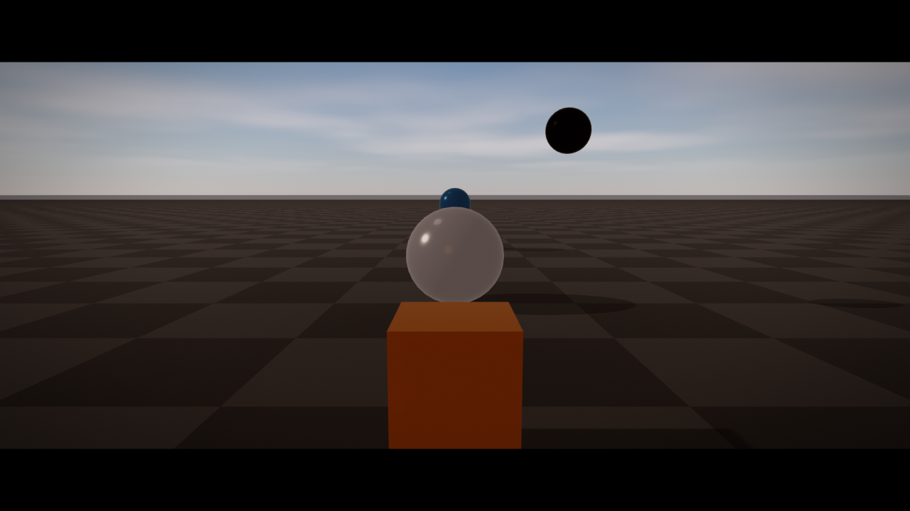
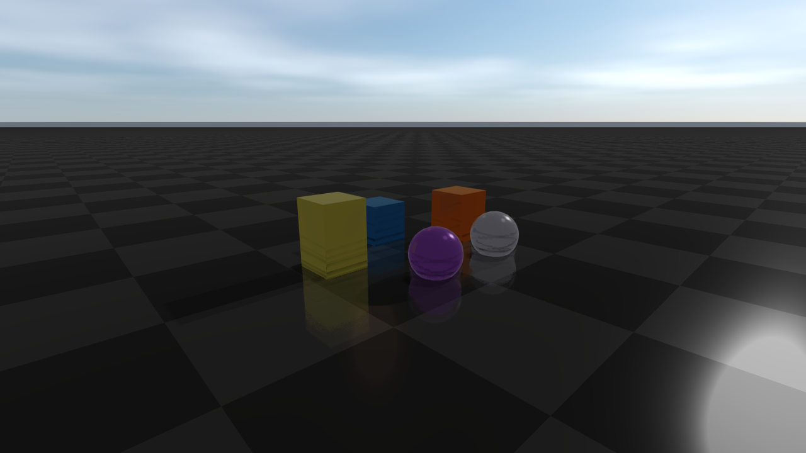

####################
Post-process effects
####################

This page covers cinematic and screen-space effects driven by
``RenderQualitySettings`` — DoF, lens flares, vignette, motion blur, SSR,
SSAO, SSIL, contact shadows, refraction, bloom, temporal AA, linear HDR
output, and stylized looks plus the debug visualisation passes.
``WeatherSettings`` overrides atmospheric state (fog, wetness, sky) and is
documented in :doc:`Weather`. HDR/IBL environments and PBR materials live in
:doc:`Lighting` and :doc:`Materials`. Many effects are not available on
macOS; see `Platform notes`_ below.

Cinematic post-process effects
==============================
``RenderQualitySettings`` exposes a large set of optional screen-space effects.
Each one is off by default, behind an ``*Enabled`` flag or a zero strength, so
the fast frame path stays cheap; turn them on per shot for screenshots, asset
inspection, or demo captures.

Cinematic lens and image effects:

* ``viewerVignetteStrength`` — radial darkening.
* ``viewerChromaticAberrationStrength`` — RGB channel offset.
* ``viewerFilmGrainStrength`` — luma-noise overlay.
* ``lensFlareGhostStrength``, ``lensFlareStreakStrength``, ``lensFlareTint`` —
  lens-flare ghosts and a horizontal streak from bright pixels.
* ``lensDistortionEnabled`` / ``lensDistortionStrength`` /
  ``lensDistortionCenter`` — signed barrel or pincushion distortion.
* ``letterboxEnabled`` / ``letterboxAspect`` / ``letterboxColor`` —
  cinematic letterboxing.
* ``starburstEnabled`` / ``starburstStrength`` / ``starburstSpikes`` /
  ``starburstAngleOffset`` / ``starburstRadius`` / ``starburstTint`` —
  diffraction spikes around the sun's screen position.
* ``zoomBlurEnabled`` / ``zoomBlurStrength`` / ``zoomBlurCenter`` /
  ``zoomBlurInnerRadius`` — radial focus blur for sprint and dash effects.
* ``motionBlurEnabled`` / ``motionBlurDirection`` / ``motionBlurStrength`` —
  directional motion blur.
* ``depthOfFieldEnabled`` / ``depthOfFieldFocusDistance`` /
  ``depthOfFieldFocusRange`` / ``depthOfFieldMaxRadius``.

Stylized and diagnostic looks:

* ``pixelateEnabled`` / ``pixelateBlockSize`` — retro pixelation.
* ``posterizeEnabled`` / ``posterizeLevels`` — color quantization.
* ``scanlineEnabled`` / ``scanlineStrength`` / ``scanlineFrequency`` —
  CRT-style scanlines.
* ``nightVisionEnabled`` / ``nightVisionStrength`` / ``nightVisionGain`` —
  monochrome green amplification.
* ``thermalEnabled`` / ``thermalStrength`` / ``thermalGain`` — heatmap LUT.
* ``ditherEnabled`` / ``ditherStrength`` — banding-control dither.

Atmospheric and water effects:

* ``underwaterEnabled`` / ``underwaterTint`` / ``underwaterCausticStrength`` /
  ``underwaterCausticScale`` / ``underwaterDepthExtinction``.
* ``heatHazeEnabled`` / ``heatHazeStrength`` / ``heatHazeFrequency`` /
  ``heatHazeSpeed`` / ``heatHazeMaxY``.
* ``lightShaftsEnabled`` / ``lightShaftsStrength`` / ``lightShaftsDecay`` /
  ``lightShaftsDensity`` — god rays from the main light.

Screen-space reflections and refraction:

* ``ssrEnabled``, ``ssrStrength``, ``ssrSteps``, ``ssrMaxDistance``,
  ``ssrThickness`` — depth-only screen-space reflections.
* ``screenSpaceRefraction``, ``screenSpaceRefractionStrength``,
  ``screenSpaceRefractionMaxPixels`` — refraction of the opaque scene through
  transmissive (glass) materials. It requires ``highFidelityPbr`` and resolves
  MSAA before sampling; rough glass reads a blurred copy of the scene.
  ``Strength`` and ``MaxPixels`` only scale the artistic screen-space offset.
  Other transparent layers and exit faces are not traced; see :doc:`Materials`
  for glass materials and the ``geometryRefraction`` tracer.

Indirect lighting and contact effects:

* ``screenSpaceAoEnabled``, ``screenSpaceAoRadius``, ``screenSpaceAoStrength``,
  ``screenSpaceAoBias``, ``screenSpaceAoSamples``, ``screenSpaceAoFalloff``,
  ``screenSpaceAoRadiusWorldSpace``, ``screenSpaceAoMaxPixelRadius``,
  ``screenSpaceAoGeometryAware`` — SSAO controls.
* ``screenSpaceAoDenoiseEnabled``, ``screenSpaceAoDenoiseStrength``,
  ``screenSpaceAoDenoiseRadius``, ``screenSpaceAoDenoiseDepthSigma`` —
  geometry-aware AO denoise.
* ``contactShadowsEnabled``, ``contactShadowsLength``, ``contactShadowsStrength``,
  ``contactShadowsThickness`` — short-range raymarched contact shadows.
* ``contactAoRadius`` / ``contactAoStrength`` / ``contactAoSamples`` /
  ``contactAoFalloff`` — tight contact AO on top of SSAO.
* ``screenSpaceIndirectLightingEnabled`` and friends
  (``screenSpaceIndirectLightingRadius``, ``Strength``, ``Samples``,
  ``Falloff``, ``NormalRejection``, ``Saturation``) — single-bounce SSIL.

Specular AA, aerial perspective, and detail normals:

* ``specularAntiAliasing`` / ``specularAntiAliasingStrength`` — geometry-aware
  specular filtering on high-frequency surfaces.
* ``aerialPerspectiveEnabled`` / ``aerialPerspectiveStrength`` — distance-based
  atmospheric tinting driven by the sky LUTs.
* ``detailNormalEnabled`` / ``detailNormalScale`` / ``detailNormalStrength`` —
  high-frequency normal detail for close-up shots.
* ``viewerSubsurfaceWrap`` / ``viewerSubsurfaceTint`` — wrap-light approximation
  for soft subsurface response on skin and foliage.

Bloom controls (``bloomEnabled``, ``bloomThreshold``, ``bloomStrength``,
``bloomRadius``, ``bloomKnee``, ``bloomQuality``, ``bloomSourceClamp``,
``bloomAnamorphic``, ``bloomDirtStrength``, ``bloomDirtScale``,
``bloomDirtTexture``) cover both clean and lens-dirt looks.
``bloomBlendMode`` (``GlowBlendMode``) sets how the glow is composited:
``Additive`` (default), ``Screen``, ``Softlight``, ``Replace`` (glow only), or
``Mix``, which scales the scene by ``1 - bloomMix`` before adding the glow. In
the default pipeline, materials are already tone-mapped and gamma-encoded when
bloom runs; with `Linear HDR rendering`_ ``bloomThreshold`` is compared against
scene-linear radiance.

Diagnostics: ``PostProcessDebugMode`` (``Final``, ``BloomSource``,
``AmbientOcclusion``, ``AmbientOcclusionRaw``, ``FogTransmittance``,
``FogDensity``, ``FogScattering``, ``WorldNormal``, ``DepthHeatmap``,
``ScreenSpaceIndirectLighting``) routes a debug pass to the final image so the
underlying buffers can be inspected without leaving the normal render path.

A full cinematic frame typically enables several of these together. The
snippet below pairs bloom + DoF + vignette + chromatic aberration + film
grain + lens flare + a slight letterbox for a film-shot look:

.. code-block:: cpp

    auto quality = raisin::RayraiWindow::defaultRenderQualitySettings(
      raisin::RayraiWindow::RenderQualityPreset::Ultra);

    quality.colorMode = raisin::ViewerColorMode::AcesApprox;
    quality.pbrToneMapping = true;
    quality.viewerColorGradePreset = raisin::ColorGradePreset::Cinematic;

    quality.bloomEnabled = true;
    quality.bloomThreshold = 1.10f;
    quality.bloomStrength = 0.22f;

    quality.depthOfFieldEnabled = true;
    quality.depthOfFieldFocusDistance = 5.0f;
    quality.depthOfFieldFocusRange = 1.5f;
    quality.depthOfFieldMaxRadius = 1.4f;

    quality.viewerVignetteStrength = 0.40f;
    quality.viewerChromaticAberrationStrength = 0.08f;
    quality.viewerFilmGrainStrength = 0.05f;

    quality.lensFlareGhostStrength = 0.45f;
    quality.lensFlareStreakStrength = 0.30f;
    quality.lensFlareTint = glm::vec3(0.55f, 0.78f, 1.10f);

    quality.letterboxEnabled = true;
    quality.letterboxAspect = 2.35f;

    viewer.setRenderQualitySettings(quality);

For inspection, route a debug mode to the final image:

.. code-block:: cpp

    auto q = viewer.getRenderQualitySettings();
    q.postProcessDebugMode = raisin::PostProcessDebugMode::AmbientOcclusion;
    viewer.setRenderQualitySettings(q);

Screen-space reflections, AO, and indirect lighting
***************************************************
Screen-space reflections (``ssrEnabled``) march the depth buffer along each
reflected ray and sample the colour buffer at the first hit. The result is a
cheap, depth-only approximation that captures puddle reflections, glossy
floors, and glass-like mirror surfaces without authoring a reflection probe.
Tune the trade-off with ``ssrStrength``, ``ssrSteps``, ``ssrMaxDistance``, and
``ssrThickness``.

Screen-space ambient occlusion (``screenSpaceAoEnabled``) darkens crevices,
corners, and tight contacts using ``screenSpaceAoRadius`` (with
``screenSpaceAoRadiusWorldSpace`` to switch from pixel to metres),
``screenSpaceAoSamples``, ``screenSpaceAoFalloff``, and
``screenSpaceAoStrength``. The denoise pass
(``screenSpaceAoDenoiseEnabled``) is geometry-aware and preserves edges.
``contactAoRadius`` / ``contactAoStrength`` add a separate tight contact-AO
pass on top of SSAO for surfaces that touch.

With the denoiser on and temporal AA off (as in the High preset), AO is
computed once per pixel in a prepass and the denoiser reuses it; results can
differ from per-tap evaluation by a few 8-bit levels. With legacy temporal AA
on (Ultra) each denoise tap evaluates AO again, which costs noticeably more. AO
is stable from frame to frame at sky silhouettes, including on Apple GPUs.

Screen-space indirect lighting (``screenSpaceIndirectLightingEnabled``)
gathers one bounce of light from the colour buffer around each pixel to add
coloured fill light from nearby diffuse surfaces; ``Radius``, ``Strength``,
``Samples``, ``Falloff``, ``NormalRejection``, and ``Saturation`` control
quality and bias.

Contact shadows (``contactShadowsEnabled``) ray-march short shadow rays toward
the main light in screen space to recover fine occlusion near grazing geometry
that a shadow map misses. ``Length`` (at most 0.5) and ``Thickness`` are in
metres; ``Strength`` is the darkening, 0–1.

.. code-block:: cpp

    auto quality = raisin::RayraiWindow::defaultRenderQualitySettings(
      raisin::RayraiWindow::RenderQualityPreset::High);

    // Screen-space reflections.
    quality.ssrEnabled = true;
    quality.ssrStrength = 0.85f;
    quality.ssrSteps = 32;
    quality.ssrMaxDistance = 8.0f;
    quality.ssrThickness = 0.35f;

    // SSAO with denoise.
    quality.screenSpaceAoEnabled = true;
    quality.screenSpaceAoRadius = 1.5f;
    quality.screenSpaceAoStrength = 0.65f;
    quality.screenSpaceAoSamples = 16;
    quality.screenSpaceAoRadiusWorldSpace = true;  // radius is metres
    quality.screenSpaceAoDenoiseEnabled = true;
    quality.screenSpaceAoDenoiseStrength = 0.75f;

    // Tight contact AO on top of SSAO.
    quality.contactAoRadius = 0.04f;
    quality.contactAoStrength = 0.55f;

    // Single-bounce screen-space indirect lighting.
    quality.screenSpaceIndirectLightingEnabled = true;
    quality.screenSpaceIndirectLightingStrength = 0.45f;
    quality.screenSpaceIndirectLightingSamples = 12;

    // Short raymarched contact shadows that recover fine creases.
    quality.contactShadowsEnabled = true;
    quality.contactShadowsLength = 0.18f;
    quality.contactShadowsStrength = 0.7f;
    quality.contactShadowsThickness = 0.06f;

    viewer.setRenderQualitySettings(quality);

.. list-table::
   :header-rows: 1
   :widths: 50 50

   * - Screen-space reflections (SSR)
     - Screen-space indirect lighting (SSIL)
   * - .. image:: ../../../rsc/docs/image/rayrai/showcase/72_ssr.png
          :alt: SSR on glossy floor and puddles
     - .. image:: ../../../rsc/docs/image/rayrai/showcase/71_screen_space_indirect_lighting.png
          :alt: SSIL adds coloured bounce light
   * - Contact shadows
     - Screen-space refraction
   * - .. image:: ../../../rsc/docs/image/rayrai/showcase/69_contact_shadows.png
          :alt: Short-range raymarched contact shadows
     - .. image:: ../../../rsc/docs/image/rayrai/showcase/21_screen_space_refraction.png
          :alt: IOR-driven refraction

Depth of field, lens flares, and lens character
***********************************************
Depth of field (``depthOfFieldEnabled``, ``depthOfFieldFocusDistance``,
``depthOfFieldFocusRange``, ``depthOfFieldMaxRadius``) uses a hex-bokeh disk
and a depth-driven circle-of-confusion sample. The hex shape is intentionally
cinematic. Pixels inside ``depthOfFieldFocusRange`` around the focus distance
stay sharp; the blur grows with distance from that band up to
``depthOfFieldMaxRadius`` pixels. ``starburstEnabled`` adds aperture-style
diffraction spikes around the sun's screen position.

Lens flare uses two layers: ghost reflections projected toward the screen
centre (``lensFlareGhostStrength``) and a horizontal (anamorphic) streak through
very bright pixels (``lensFlareStreakStrength``). Both share ``lensFlareTint``
(a cool cinematic blue by default).

``viewerVignetteStrength``, ``viewerChromaticAberrationStrength``, and
``viewerFilmGrainStrength`` add the rest of the standard photographic camera
character. ``lensDistortionEnabled`` applies signed barrel / pincushion
distortion centred at ``lensDistortionCenter``.

.. code-block:: cpp

    auto quality = viewer.getRenderQualitySettings();

    // Depth of field with cinematic hex bokeh.
    quality.depthOfFieldEnabled = true;
    quality.depthOfFieldFocusDistance = 4.5f;   // metres
    quality.depthOfFieldFocusRange = 1.8f;      // metres of in-focus band
    quality.depthOfFieldMaxRadius = 1.6f;       // pixels at far blur

    // Diffraction spikes around the sun.
    quality.starburstEnabled = true;
    quality.starburstStrength = 0.6f;
    quality.starburstSpikes = 6;

    // Lens flare (ghosts and axial streak).
    quality.lensFlareGhostStrength = 0.55f;
    quality.lensFlareStreakStrength = 0.35f;
    quality.lensFlareTint = glm::vec3(0.62f, 0.78f, 1.10f);  // cool cinematic

    // Camera character.
    quality.viewerVignetteStrength = 0.35f;
    quality.viewerChromaticAberrationStrength = 0.08f;
    quality.viewerFilmGrainStrength = 0.04f;

    // Optional barrel distortion.
    quality.lensDistortionEnabled = true;
    quality.lensDistortionStrength = 0.12f;     // > 0 = barrel, < 0 = pincushion

    viewer.setRenderQualitySettings(quality);

.. list-table::
   :header-rows: 1
   :widths: 50 50

   * - Depth of field
     - Hex bokeh detail
   * - .. image:: ../../../rsc/docs/image/rayrai/showcase/02_depth_of_field.png
          :alt: Focus distance with depth-of-field blur
     - .. image:: ../../../rsc/docs/image/rayrai/showcase/68_hex_bokeh.png
          :alt: Hex aperture bokeh on highlights
   * - Lens flare
     - Lens character (vignette + grain + CA)
   * - .. image:: ../../../rsc/docs/image/rayrai/showcase/67_lens_flare.png
          :alt: Lens flare ghost and streak
     - .. image:: ../../../rsc/docs/image/rayrai/showcase/63_lens_character.png
          :alt: Vignette + chromatic aberration + film grain

Motion blur and atmospheric effects
***********************************
Directional motion blur (``motionBlurEnabled``, ``motionBlurDirection``,
``motionBlurStrength``) smears the colour buffer along a constant screen-space
vector: ``motionBlurDirection`` is the blur vector in screen-UV units, scaled by
``motionBlurStrength`` (0–1). It models camera motion only; there is no
per-object velocity buffer. Useful for shutter-style captures and stylized
motion frames.

Heat haze (``heatHazeEnabled``) perturbs UVs with a sinusoidal ripple below
``heatHazeMaxY`` (a screen-UV height, 0 = bottom), fading out toward that line
so the sky above stays sharp, simulating hot-air shimmer. Underwater
(``underwaterEnabled``, ``underwaterTint``, ``underwaterCausticStrength``,
``underwaterCausticScale``, ``underwaterDepthExtinction``) tints the image,
adds animated caustic patterns, and attenuates by depth.

.. code-block:: cpp

    auto q = viewer.getRenderQualitySettings();

    // Directional motion blur — typical "running camera" look.
    q.motionBlurEnabled = true;
    q.motionBlurDirection = glm::vec2(0.18f, 0.0f);  // horizontal pan, screen UV
    q.motionBlurStrength = 1.0f;

    // Hot tarmac shimmer in the lower 60 % of the frame.
    q.heatHazeEnabled = true;
    q.heatHazeStrength = 0.30f;
    q.heatHazeFrequency = 5.0f;
    q.heatHazeSpeed = 1.2f;
    q.heatHazeMaxY = 0.60f;

    // Underwater scene.
    q.underwaterEnabled = true;
    q.underwaterTint = glm::vec3(0.20f, 0.55f, 0.85f);
    q.underwaterCausticStrength = 0.6f;
    q.underwaterCausticScale = 1.0f;
    q.underwaterDepthExtinction = 1.2f;

    // High-frequency detail normals on every PBR surface.
    q.detailNormalEnabled = true;
    q.detailNormalScale = 30.0f;    // cycles per metre
    q.detailNormalStrength = 0.18f;

    viewer.setRenderQualitySettings(q);

.. list-table::
   :header-rows: 1
   :widths: 50 50

   * - Motion blur
     - Heat haze
   * - .. image:: ../../../rsc/docs/image/rayrai/showcase/70_motion_blur.png
          :alt: Directional motion blur
     - .. image:: ../../../rsc/docs/image/rayrai/showcase/73_heat_haze.png
          :alt: Heat haze UV displacement
   * - Underwater
     - Detail normals
   * - .. image:: ../../../rsc/docs/image/rayrai/showcase/78_underwater.png
          :alt: Underwater tint, caustics, extinction
     - .. image:: ../../../rsc/docs/image/rayrai/showcase/64_detail_normal.png
          :alt: High-frequency detail normal layer

Stylized and diagnostic looks
*****************************
The stylized post-process effects on ``RenderQualitySettings`` are useful for
authoring previews and for inspection of specific buffers without leaving the
normal render path. Thermal and night vision are typical operator-camera
looks; the calibration reference is intended to drive
``analyzeRgbaCalibrationPatches`` for capture-pipeline tuning.

.. code-block:: cpp

    auto q = viewer.getRenderQualitySettings();

    // Thermal LUT (monochrome heat-map).
    q.thermalEnabled = true;
    q.thermalStrength = 1.0f;
    q.thermalGain = 1.5f;

    // Night vision (green amplification with noise).
    q.nightVisionEnabled = true;
    q.nightVisionStrength = 1.0f;
    q.nightVisionGain = 2.5f;

    // CRT scanlines + posterize + lens distortion for an arcade look.
    q.scanlineEnabled = true;
    q.scanlineStrength = 0.35f;
    q.scanlineFrequency = 480.0f;
    q.posterizeEnabled = true;
    q.posterizeLevels = 6;
    q.lensDistortionEnabled = true;
    q.lensDistortionStrength = -0.12f;  // pincushion

    viewer.setRenderQualitySettings(q);

    // Pick one debug pass at a time for inspection.
    auto debug = viewer.getRenderQualitySettings();
    debug.postProcessDebugMode = raisin::PostProcessDebugMode::DepthHeatmap;
    viewer.setRenderQualitySettings(debug);

.. list-table::
   :header-rows: 1
   :widths: 50 50

   * - Thermal
     - Night vision
   * - .. image:: ../../../rsc/docs/image/rayrai/showcase/84_thermal.png
          :alt: Thermal LUT
     - .. image:: ../../../rsc/docs/image/rayrai/showcase/80_night_vision.png
          :alt: Night vision gain
   * - Auto exposure
     - Calibration reference
   * - .. image:: ../../../rsc/docs/image/rayrai/showcase/62_auto_exposure.png
          :alt: Auto exposure key/speed driving the loop
     - .. image:: ../../../rsc/docs/image/rayrai/showcase/48_calibration_reference.png
          :alt: Calibration patches for output transform tuning

Linear HDR rendering
********************
By default each material shader applies exposure, the tone curve, and gamma
before writing the scene buffer, so MSAA resolve, fog, bloom, and depth of
field work on display-encoded colour.
``RayraiWindow::setLinearHdrRenderingEnabled(true)`` keeps scene radiance
linear until the final post pass, which then applies ``pbrExposure`` (times
the auto-exposure factor), the ``colorMode`` curve when ``pbrToneMapping`` is
set, and ``gamma`` once. It is a renderer toggle, not a
``RenderQualitySettings`` field, so presets do not change it.

.. code-block:: cpp

    viewer.setLinearHdrRenderingEnabled(true);
    auto q = viewer.getRenderQualitySettings();
    q.bloomEnabled = true;
    q.bloomThreshold = 1.3f;   // scene-linear radiance in this mode
    q.bloomKnee = 0.5f;
    q.bloomStrength = 0.045f;
    viewer.setRenderQualitySettings(q);

Bright highlights keep their energy through MSAA and bloom, FXAA picks edges
on perceptual luminance, and white balance, saturation, and colour grading run
on linear colour before the tone curve. The sky background keeps its own
exposure and goes through the same tone curve. Bloom thresholds tuned for the
default pipeline need to be raised. Frames rendered with a
``RAYRAI_PBR_DEBUG_OUTPUT`` view keep the previous output, and
:doc:`Capture` describes how the mode affects captures and RGB sensor images.
Changing the exposure, tone curve, or gamma resets the legacy temporal-AA
history, which also happens while auto exposure adapts; the reprojected method
keeps its scene-linear history.

Temporal anti-aliasing
**********************
``temporalAaEnabled`` turns temporal AA on, and ``temporalAaMethod`` selects
the algorithm:

* ``TemporalAaMethod::Legacy`` (the default) blends each frame with the
  previous display-encoded result, sampled at the same screen position and
  clamped to the current pixel neighbourhood; ``temporalAaBlend`` (default
  0.08, at most 0.95) is the history weight. There are no motion vectors, so
  moving content relies on that clamp. Ultra uses this method with
  ``temporalAaJitterScale = 0``. Keep the jitter at zero here: the legacy
  resolve does not compensate for it, so a non-zero jitter (the struct default
  is 1) shifts static images every frame.
* ``TemporalAaMethod::Reprojected`` accumulates jittered scene-linear colour
  and reprojects it with the camera motion and foliage wind, with depth
  rejection and variance clipping. ``temporalAaCurrentWeight`` (0.02–1, default
  0.1) is the weight of the new frame, and ``temporalAaSharpness`` (0–1, default
  0.3) sharpens the output only. ``setRenderQualitySettings`` throws
  ``std::invalid_argument`` for values outside these ranges, and forces
  ``viewerMsaaSamples`` to 1 while this method is on. It always uses the
  `Linear HDR rendering`_ output path, and an external render with a custom
  ``post`` shader throws ``std::invalid_argument`` unless its
  ``RenderOverrides::allowTemporalAa`` is false.

``RenderOverrides::allowTemporalAa`` turns temporal AA off for an individual
external render.

Platform notes
**************
On macOS, and on other GPUs that expose 16 or fewer fragment texture units,
rayrai uses a reduced post-process program (see the GPU capability tiers in
:doc:`Materials`). FXAA, additive bloom, SSAO and contact AO with denoising,
temporal AA, depth of field, white balance, saturation, and linear HDR output
work. The rest of this page is not rendered there: colour grading, vignette,
chromatic aberration, film grain, lens flare, starburst, lens distortion,
letterbox, motion and zoom blur, SSR, SSIL, contact shadows, aerial
perspective, volumetric fog and lighting, light shafts, local fog volumes,
projected decals, heat haze, underwater, the stylized looks, non-``Additive``
bloom blend modes, and every ``postProcessDebugMode`` except ``Final``. Lens
droplets and precipitation are separate passes and still render.

Every other GPU runs the full program. With 32 fragment texture units, which
the NVIDIA, AMD and Intel OpenGL drivers report, a frame can use 25
projected-decal maps instead of 32 (see :doc:`Lighting`).

