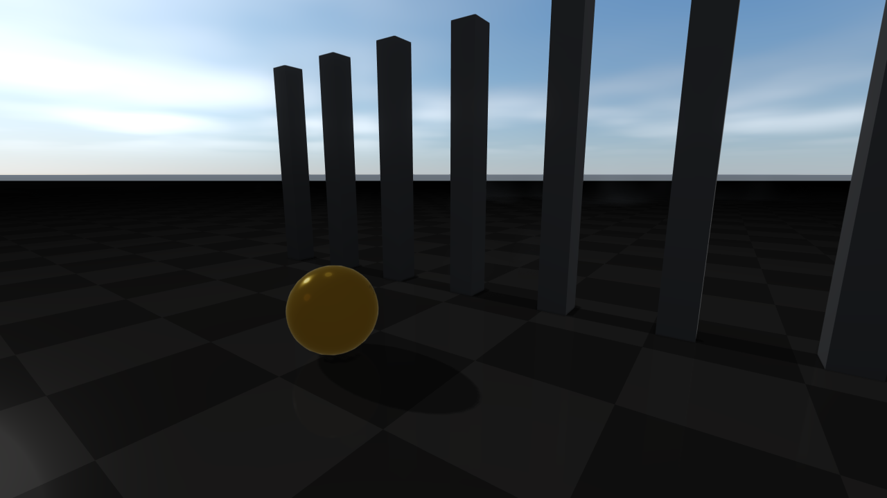
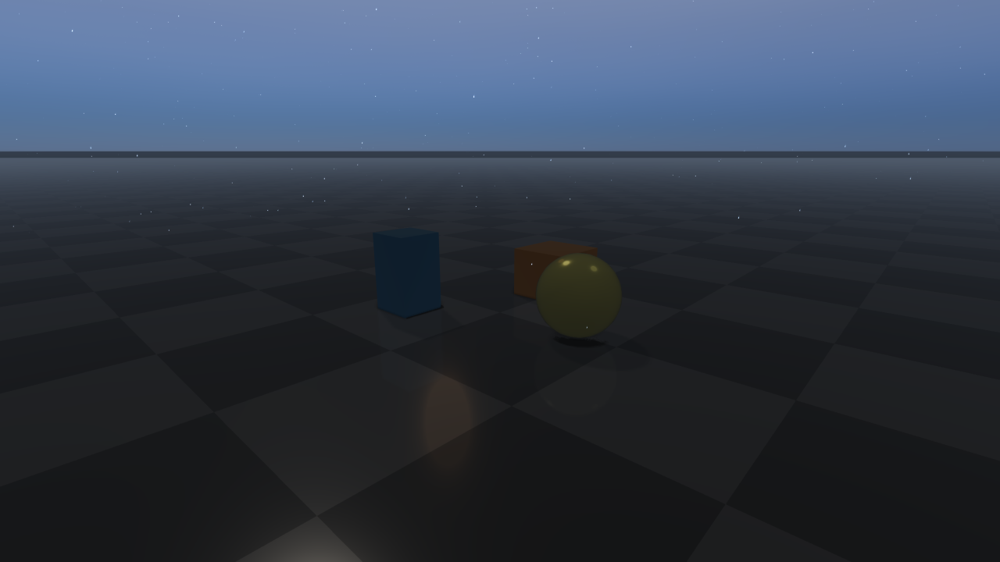

########################
Weather and atmospherics
########################

Weather is preset-driven and exposes both renderer-side state
(``RenderQualitySettings``) and runtime atmospheric overrides
(``WeatherSettings``). While ``WeatherSettings::enabled = true``, applying
weather writes the resolved sun, sky, fog, cloud, and wet/snow state into the
renderer's ``RenderQualitySettings``.

Weather presets
===============
Presets cover ``Clear``, ``Hazy``, ``Overcast``, ``Fog``, ``Rain``,
``HeavyRain``, ``Snow``, ``Storm``, ``NightClear``, ``NightRain``, and
``Custom``; ``defaultWeatherSettings(Custom)`` returns weather disabled.
``WeatherSettings::quality`` (``WeatherQuality::Low``, ``Medium``, ``High``,
``Ultra``) sets the cost of the effects: ``Low`` draws no clouds or
precipitation particles, ``Medium`` adds both, ``High`` (the preset default)
adds cloud shadows, lightning, and lens droplets, and ``Ultra`` adds volumetric
fog and the largest particle budget.

Weather is applied by ``setWeatherSettings``, ``setWeatherPreset``,
``transitionWeather``, and by ``updateWeather`` while a transition or wetness
accumulation is running. Each application starts from the last settings the
application passed to ``setRenderQualitySettings`` (returned by
``getUserRenderQualitySettings``); overrides the main light (direction, color,
ambient); adjusts ``shadowStrength`` and ``shadowPcfRadius``; sets the
environment intensity and tints, the clouds, and the wet/snow fields; scales
``pbrExposure``; re-enables the procedural sky; takes the larger of the user and
weather fog densities and, for foggy or low-visibility weather, enables height
fog (and, at ``Ultra``, volumetric fog); and applies the result. Unlike an application's own ``setRenderQualitySettings``
call (see :doc:`Lighting`), a weather application keeps the additional lights
the application added. Calling ``setRenderQualitySettings`` while weather is
enabled replaces the base that later weather applications start from.
Disabling weather with ``setWeatherSettings`` (``enabled = false``) restores
those user settings.

Units and ranges in ``WeatherSettings`` (``setWeatherSettings`` clamps values
to these ranges): ``timeOfDayHours`` in hours ``[0, 24]``, ``latitude`` /
``longitude`` in degrees, ``windSpeed`` in m/s, ``visibilityMeters`` in metres,
``fogDensity`` in metres⁻¹ (exponential extinction), ``fogAnisotropy`` is the
Henyey-Greenstein ``g`` in ``[-0.85, 0.85]``, ``cloudCoverage`` /
``cloudDensity`` / ``precipitationRate`` / ``rainOcclusionStrength`` /
``humidity`` / ``wetness`` normalized in ``[0, 1]``, ``lightningRate`` in
strikes per minute ``[0, 16]``, and ``wetnessAccumulationRate`` /
``wetnessDryingRate`` per second. ``LocalFogVolume::radius`` and the
``ProjectedDecal`` distance-fade fields are in metres.

.. list-table::
   :header-rows: 1
   :widths: 50 50

   * - Clear
     - Overcast
   * - .. image:: ../../../rsc/docs/image/rayrai/rayrai_weather_clear.png
          :alt: Clear weather preset
     - .. image:: ../../../rsc/docs/image/rayrai/rayrai_weather_overcast.png
          :alt: Overcast weather preset
   * - Rain
     - Snow
   * - .. image:: ../../../rsc/docs/image/rayrai/rayrai_weather_rain.png
          :alt: Rain weather preset
     - .. image:: ../../../rsc/docs/image/rayrai/rayrai_weather_snow.png
          :alt: Snow weather preset
   * - Storm
     - NightClear
   * - .. image:: ../../../rsc/docs/image/rayrai/rayrai_weather_storm.png
          :alt: Storm weather preset
     - .. image:: ../../../rsc/docs/image/rayrai/rayrai_weather_night_clear.png
          :alt: NightClear weather preset

The grid is produced by ``doc_image_weather_presets`` in
``docs/image_generators/``.

Start from ``RayraiWindow::defaultWeatherSettings``, apply it with
``setWeatherSettings`` or ``setWeatherPreset``, and call ``updateWeather(dt)``
once per frame on the render thread. ``updateWeather`` advances transitions,
wetness accumulation and drying, and the thunder callback; it does not advance
the clock. Lightning strikes, cloud drift (``cloudAnimationSpeed``), rain
ripples, and weather-driven volumetric fog follow ``timeOfDayHours``, so
advance that field and apply it with ``setWeatherSettings`` when they should
move (``setWeatherSettings`` cancels a running transition).
``transitionWeather`` blends between presets or settings over a duration;
``weatherDiagnostics`` reports the resolved sun/moon, fog, precipitation,
wetness, snow, lightning, lens-droplet, and generated sky state.
``updateWeather`` calls the function registered with
``setWeatherThunderCallback`` once per new lightning strike, passing that
frame's ``WeatherDiagnostics``, so the application can play thunder audio
(``thunderDelaySeconds``, ``lightningIntensity``) or trigger other reactions.

.. code-block:: cpp

    auto weather = raisin::RayraiWindow::defaultWeatherSettings(
      raisin::RayraiWindow::WeatherPreset::Rain);
    weather.enabled = true;
    weather.affectSensors = false;
    weather.timeOfDayHours = 17.5f;
    weather.windSpeed = 3.0f;
    weather.lensDropletsEnabled = true;
    viewer.setWeatherSettings(weather);

    viewer.setWeatherThunderCallback(
       {
        // Play thunder d.thunderDelaySeconds after the flash, scaled by
        // d.lightningIntensity.
      });

    // Frame loop animation.
    viewer.updateWeather(dt);
    auto diagnostics = viewer.weatherDiagnostics();
    if (diagnostics.lightningActive) {
      // react to the current flash
    }

    // Smooth blend to a new preset over four seconds.
    viewer.transitionWeather(raisin::RayraiWindow::WeatherPreset::Storm, 4.0);

For local effects, use ``addLocalFogVolume`` / ``clearLocalFogVolumes``,
``addProjectedDecal`` / ``clearProjectedDecals``, and
``addIrradianceVolume`` / ``clearIrradianceVolumes``. Each list is capped
(eight local fog volumes, eight projected decals, eight irradiance volumes)
so the fast frame path stays predictable; entries beyond the cap are ignored.
Weather-driven sky maps are created on demand with
``generateWeatherSkyEnvironment(environmentFaceSize, irradianceFaceSize,
setVisibleBackground)``; do this at transition points or setup time, not every
frame. The renderer owns the cubemaps: the next generation,
``clearWeatherSkyEnvironment``, and ``setWeatherSettings`` delete them.

.. code-block:: cpp

    raisin::LocalFogVolume cloud;
    cloud.center = glm::vec3(0.0f, 2.0f, 1.2f);
    cloud.radius = 3.0f;
    cloud.density = 0.18f;
    cloud.edgeFade = 0.45f;
    viewer.addLocalFogVolume(cloud);

    raisin::ProjectedDecal puddle;
    puddle.center = glm::vec3(1.5f, -0.8f, 0.01f);
    puddle.halfExtents = glm::vec3(0.8f, 0.8f, 0.05f);
    puddle.color = glm::vec4(0.0f, 0.0f, 0.0f, 0.8f);
    viewer.addProjectedDecal(puddle);

    raisin::IrradianceVolume ambient;
    ambient.center = glm::vec3(0.0f, 0.0f, 1.5f);
    ambient.halfExtents = glm::vec3(4.0f, 4.0f, 2.0f);
    ambient.color = glm::vec3(0.20f, 0.22f, 0.30f);
    ambient.strength = 0.8f;
    viewer.addIrradianceVolume(ambient);

Enabling the procedural sky and sky IBL
=======================================
The procedural sky is **on by default** in rayrai.
``RenderQualitySettings::proceduralSkyBackgroundEnabled`` defaults to ``true``
and no preset turns it off, so every preset (Fast / Balanced / High / Ultra)
draws the analytic Hillaire sky as the background whenever no environment map
is shown. You do not need to do anything to turn it on; the helpers below are
only needed if a sky should also *light* the scene.

To let a sky light PBR materials, bake it into cubemaps and assign them.
``generateWeatherSkyEnvironment`` evaluates the weather sky model from the
current ``WeatherSettings`` (time of day, location, clouds, turbidity) on the
CPU; it does not sample the procedural background sky. The sun appears in the
bake only while weather is enabled, so apply a weather preset first:

.. code-block:: cpp

    raisin::RayraiWindow viewer(world, 1280, 720);

    // 1) Pick a quality preset and a weather preset. The weather preset
    //    defines the sky that is baked below.
    viewer.setRenderQualityPreset(
        raisin::RayraiWindow::RenderQualityPreset::High);
    viewer.setWeatherPreset(raisin::RayraiWindow::WeatherPreset::Clear);

    // 2) Bake the sky into an environment cubemap plus a diffuse irradiance
    //    cubemap. setVisibleBackground=true also shows the baked map as the
    //    background.
    auto sky = viewer.generateWeatherSkyEnvironment(
        /*environmentFaceSize=*/128,
        /*irradianceFaceSize=*/32,
        /*setVisibleBackground=*/true);

    // 3) Assign the maps to each visual that should receive sky light.
    visual->setPbrEnvironment(sky.environmentMap, sky.irradianceMap,
                              /*prefilteredEnvironmentMap=*/0, /*brdfLut=*/0);

The bake is not applied to materials automatically, and the renderer deletes
the cubemaps on the next bake, on ``clearWeatherSkyEnvironment``, and on
``setWeatherSettings``, so re-assign the new maps after each bake. Materials
without an environment map, and all instanced visuals, use the neutral
procedural daylight fallback tinted by ``pbrEnvironmentLightingTint`` (see
:doc:`Lighting`), not the sky's colors.
``RenderQualitySettings::pbrEnvironmentIntensity`` scales both the fallback
and assigned environment maps. The preset defaults are tuned for outdoor
daylight; lower it for an overcast or indoor feel.

If you want to **turn the sky off** (for a flat color background or to
use an HDR environment instead):

.. code-block:: cpp

    auto q = viewer.getRenderQualitySettings();
    q.proceduralSkyBackgroundEnabled = false;
    q.proceduralCloudLayerEnabled = false;
    viewer.setRenderQualitySettings(q);
    viewer.setBackgroundColorRgb255({20, 22, 32, 255});  // flat fallback

While weather is enabled, each weather application turns the procedural sky
back on.

To use your own HDR environment (the :doc:`PbrEnvironment <Lighting>`
bundle), assign it to visuals for lighting and optionally show it as the
background; ``setEnvironmentBackground`` alone only changes the background:

.. code-block:: cpp

    auto env = raisin::PbrEnvironment::loadFromHdrFile("/path/studio.hdr");
    visual->setPbrEnvironment(env);  // lighting
    viewer.setEnvironmentBackground(env.environmentCubemap, /*exposure=*/1.0f);

The procedural sky is cheap (a few small LUTs); its settings are described in
the next section. ``generateWeatherSkyEnvironment`` evaluates the sky on the
CPU for every cubemap texel, so call it at setup or at weather transitions, not
every frame.

Volumetric fog, sky, and light shafts
=====================================
On top of the standard exponential fog (``fogDensity``,
``fogColorOverrideEnabled``, ``fogColor``), the renderer supports height fog
(``heightFogEnabled``, ``heightFogDensity``, ``heightFogBaseHeight``,
``heightFogFalloff``) and a volumetric fog volume
(``volumetricFogEnabled``, ``volumetricFogDensity``,
``volumetricFogNoiseScale``, ``volumetricFogNoiseStrength``,
``volumetricFogColor``, ``volumetricFogAnisotropy``,
``volumetricFogAnimationTimeSeconds``, ``volumetricFogWindDirection``,
``volumetricFogWindSpeed``, ``volumetricFogTurbulenceSpeed``).
Volumetric lighting (``volumetricLightingEnabled``,
``volumetricLightStrength``, ``volumetricLightDecay``,
``volumetricLightSamples``) scatters the main light through the fog volume.

The procedural sky path uses an analytic Hillaire-style atmosphere LUT with
multi-scatter and aerial-perspective passes. Enable it with
``proceduralSkyBackgroundEnabled`` and tune sun visibility
(``proceduralSkySunStrength``, ``proceduralSkySunSize``). A separate
procedural cloud layer adds ``proceduralCloudLayerEnabled``,
``proceduralCloudCoverage``, ``proceduralCloudDensity``,
``proceduralCloudScale``, ``proceduralCloudSoftness``,
``proceduralCloudOffset``, ``proceduralCloudTint``; cloud shadows
(``cloudShadowProjectionEnabled``, ``cloudShadowStrength``,
``cloudShadowScale``) project that layer back onto the scene. The cloud layer
is drawn only when ``cloudQuality`` is not ``Off``; every preset sets it, but
the struct default is ``Off``. The clouds do not drift by themselves: animate
``proceduralCloudOffset`` to move them.

.. code-block:: cpp

    auto quality = viewer.getRenderQualitySettings();

    // Height fog on top of the standard exponential fog.
    quality.fogDensity = 0.015f;
    quality.heightFogEnabled = true;
    quality.heightFogDensity = 0.04f;
    quality.heightFogBaseHeight = 0.0f;
    quality.heightFogFalloff = 0.35f;

    // Animated volumetric fog with subtle wind.
    quality.volumetricFogEnabled = true;
    quality.volumetricFogDensity = 0.018f;
    quality.volumetricFogColor = glm::vec3(0.74f, 0.82f, 0.92f);
    quality.volumetricFogAnisotropy = 0.30f;
    quality.volumetricFogWindDirection = glm::vec2(1.0f, 0.0f);
    quality.volumetricFogWindSpeed = 0.6f;
    quality.volumetricFogAnimationTimeSeconds = currentTimeSeconds;

    // Light shafts from the main directional light.
    quality.volumetricLightingEnabled = true;
    quality.volumetricLightStrength = 0.6f;
    quality.volumetricLightDecay = 0.94f;
    quality.volumetricLightSamples = 32;
    quality.lightShaftsEnabled = true;
    quality.lightShaftsStrength = 0.8f;

    // Procedural sky + clouds.
    quality.proceduralSkyBackgroundEnabled = true;
    quality.proceduralSkySunStrength = 1.4f;
    quality.proceduralCloudLayerEnabled = true;
    quality.proceduralCloudCoverage = 0.55f;
    quality.cloudShadowProjectionEnabled = true;
    quality.cloudShadowStrength = 0.35f;

    viewer.setRenderQualitySettings(quality);

Weather drives the same height fog, which makes it a cheap way to add
distance haze. With ``WeatherSettings::enabled``, a ``visibilityMeters``
below 5000 (or a ``fogDensity`` above 0.001) enables height fog with an
extinction of ``max(0.85 * fogDensity, 3 / visibilityMeters)`` per metre,
colored by ``WeatherSettings::fogColor``. Weather adds the volumetric fog
pass only at ``WeatherQuality::Ultra`` when that extinction exceeds 0.004 per
metre. ``weatherDiagnostics()`` reports ``heightFogActive``,
``heightFogDensity``, ``visibilityTransmittance100m``, and
``visibilityTransmittance1km``.

.. code-block:: cpp

    raisin::RayraiWindow::WeatherSettings weather;
    weather.enabled = true;
    weather.preset = raisin::RayraiWindow::WeatherPreset::Clear;
    weather.visibilityMeters = 1200.0f;                 // ~78% transmittance at 100 m
    weather.fogColor = glm::vec3(0.65f, 0.70f, 0.75f);  // cool grey haze
    viewer.setWeatherSettings(weather);

.. list-table::
   :header-rows: 1
   :widths: 50 50

   * - Sky and height fog
     - Volumetric fog + light shafts
   * - .. image:: ../../../rsc/docs/image/rayrai/showcase/13_sky_height_fog.png
          :alt: Procedural sky with height fog
     - .. image:: ../../../rsc/docs/image/rayrai/showcase/16_volumetric_fog_lighting.png
          :alt: Volumetric fog and scattering
   * - Cloud shadows
     - Aerial perspective
   * - .. image:: ../../../rsc/docs/image/rayrai/showcase/28_weather_cloud_shadows.png
          :alt: Procedural cloud shadow projection
     - .. image:: ../../../rsc/docs/image/rayrai/showcase/60_aerial_perspective.png
          :alt: Distance-based atmospheric tinting
   * - Local fog volumes
     - Light shafts (god rays)
   * - .. image:: ../../../rsc/docs/image/rayrai/showcase/29_weather_fog_local_volumes.png
          :alt: Spherical local fog volumes
     - .. image:: ../../../rsc/docs/image/rayrai/showcase/65_light_shafts.png
          :alt: Screen-space light shafts

Foliage wind
============
See :doc:`Foliage` for foliage materials, instance LOD and shadows, and the
:doc:`dense forest example <../examples/rayrai/rayrai_forest>` for a complete
terrain-grounded scene with animated vegetation.

Authored foliage and instanced grass deform under a global wind field when
``foliageWindEnabled`` is set. ``foliageWindDirection`` and
``foliageWindSpeed`` drive the base motion; ``foliageWindTimeSeconds`` is
the wind clock the application drives from its frame loop.
``foliageWindGustStrength`` and ``foliageWindGustScale`` add slower gust
noise on top, while ``foliageWindBranchBend`` controls coarse trunk/branch
bend and ``foliageWindLeafFlutter`` controls fine leaf flutter.
``WeatherSettings::windSpeed`` does not move foliage.

Only materials with ``foliageWindStrength > 0`` move. The bend grows from
``foliageRootHeight`` to ``foliageTipHeight`` in mesh-local height and is
divided by ``foliageStiffness``; ``foliageFlutterWeight`` scales the flutter,
and wet or snowy foliage moves less. ``FoliageType`` classifies the material
but does not enable wind by itself. For instanced batches,
``InstancedVisuals::configureFoliageWind`` (and ``configureGrassPatch`` for
grass) sets the same response per batch; see :doc:`Materials` for foliage
materials.

Foliage uses two-sided lighting and weather-driven leaf color shifts.
Grass patches and dense bushes are usually rendered through
``InstancedVisuals`` so thousands of blades share one upload, with
per-instance scale and rotation driving subtle variation.

.. code-block:: cpp

    auto quality = viewer.getRenderQualitySettings();
    quality.foliageWindEnabled = true;
    quality.foliageWindDirection = glm::vec2(0.7f, 0.7f);  // diagonal wind
    quality.foliageWindSpeed = 2.4f;                       // base m/s
    quality.foliageWindGustStrength = 0.6f;                // gust amplitude
    quality.foliageWindGustScale = 1.2f;                   // gust spatial scale
    quality.foliageWindBranchBend = 0.22f;                 // coarse trunk bend
    quality.foliageWindLeafFlutter = 0.10f;                // fine flutter
    viewer.setRenderQualitySettings(quality);

    // Per frame: advance the wind clock. Unlike setRenderQualitySettings,
    // this does not rebuild the lights.
    viewer.advanceFoliageWindTime(dt);   // or setFoliageWindTimeSeconds(t)

    // A foliage material only moves with a positive wind strength.
    auto leaf = raisin::Material::foliage(
      "oak_leaves", raisin::Material::FoliageType::LeafCard,
      glm::vec4(0.32f, 0.55f, 0.21f, 1.0f));
    leaf.foliageWindStrength = 1.0f;
    leaf.foliageRootHeight = 0.0f;   // mesh-local height where bending starts
    leaf.foliageTipHeight = 1.0f;    // full bend at this height

.. list-table::
   :header-rows: 1
   :widths: 50 50

   * - Foliage wind (poster frame)
     - Leaf two-sided lighting
   * - .. image:: ../../../rsc/docs/image/rayrai/showcase/43_foliage_wind_poster.png
          :alt: Trees and grass deform under foliageWindEnabled
     - .. image:: ../../../rsc/docs/image/rayrai/showcase/44_foliage_leaf_lighting.png
          :alt: Translucent leaf shading
   * - Dense grass patch
     - Foliage weather response
   * - .. image:: ../../../rsc/docs/image/rayrai/showcase/45_foliage_grass_patch.png
          :alt: Instanced grass patches
     - .. image:: ../../../rsc/docs/image/rayrai/showcase/46_foliage_weather_response.png
          :alt: Foliage tinting under weather
   * - Dense foliage instancing
     - Poly Haven foliage import
   * - .. image:: ../../../rsc/docs/image/rayrai/showcase/88_dense_foliage_instances.png
          :alt: Many thousands of instanced grass blades
     - .. image:: ../../../rsc/docs/image/rayrai/showcase/53_polyhaven_foliage.png
          :alt: Authored foliage from a Poly Haven scene

Weather wet and snow material response
======================================
Wet and snow surface response is decoupled from precipitation so applications
can ramp it independently of the weather state. Enable
``weatherWetMaterialEnabled`` and drive it through ``weatherWetness``,
``weatherPuddleStrength``, ``weatherRainRippleStrength``,
``weatherRainRippleScale``, ``weatherRainRipplePhase``,
``weatherWetAlbedoDarkening``, ``weatherWetRoughnessScale``, and
``weatherWetSpecularBoost``. Snow response uses
``weatherSnowMaterialEnabled`` plus ``weatherSnowCoverage``,
``weatherSnowAccumulationStrength``, ``weatherSnowAlbedoBlend``,
``weatherSnowRoughness``, ``weatherSnowMetallicScale``, and
``weatherSnowNormalSoftening``. The ``WeatherMask`` texture slot on
``Material`` masks these effects per-asset, so authored awnings or
undersides of overhangs stay dry. PBR meshes show the wet and snow response
only in the full PBR program; see the GPU capability tiers in
:doc:`Materials`.

Wet response darkens albedo, drops roughness, and adds animated rain
ripples on upward-facing surfaces; ``wetnessAccumulationEnabled`` lets the
value ramp up over time during rain and ramp back down during dry intervals,
controlled by ``wetnessAccumulationRate`` and ``wetnessDryingRate``.

.. code-block:: cpp

    auto quality = viewer.getRenderQualitySettings();

    // Wet material response (puddles, rain ripples, darkening).
    quality.weatherWetMaterialEnabled = true;
    quality.weatherWetness = 0.7f;                  // 0..1
    quality.weatherPuddleStrength = 0.5f;
    quality.weatherRainRippleStrength = 0.45f;
    quality.weatherRainRippleScale = 18.0f;
    quality.weatherWetAlbedoDarkening = 0.30f;
    quality.weatherWetRoughnessScale = 0.32f;
    quality.weatherWetSpecularBoost = 0.40f;

    // Snow material response (albedo blend on upward faces).
    quality.weatherSnowMaterialEnabled = true;
    quality.weatherSnowCoverage = 0.65f;             // 0..1
    quality.weatherSnowAccumulationStrength = 0.8f;
    quality.weatherSnowAlbedoBlend = 0.78f;
    quality.weatherSnowRoughness = 0.92f;
    quality.weatherSnowMetallicScale = 0.05f;
    quality.weatherSnowNormalSoftening = 0.62f;

    viewer.setRenderQualitySettings(quality);

    // Optional: drive accumulation/drying from the weather state instead.
    // With weather enabled, weather overwrites the wet/snow fields set above,
    // and wetness changes only while updateWeather(dt) is called.
    auto weather = viewer.getWeatherSettings();
    weather.enabled = true;
    weather.wetnessAccumulationEnabled = true;
    weather.wetnessAccumulationRate = 0.35f;   // per second
    weather.wetnessDryingRate = 0.10f;         // per second
    viewer.setWeatherSettings(weather);

.. list-table::
   :header-rows: 1
   :widths: 50 50

   * - Wet material response
     - Snow material response
   * - .. image:: ../../../rsc/docs/image/rayrai/showcase/30_weather_wet_materials.png
          :alt: Wet darkening, roughness drop, rain ripples
     - .. image:: ../../../rsc/docs/image/rayrai/showcase/31_weather_snow_materials.png
          :alt: Snow albedo blend on upward faces
   * - Wetness accumulation
     - Snow melt transition
   * - .. image:: ../../../rsc/docs/image/rayrai/showcase/41_weather_wetness_accumulation.png
          :alt: Wetness ramp during rain
     - .. image:: ../../../rsc/docs/image/rayrai/showcase/40_weather_snow_melt_transition.png
          :alt: Snow melting between presets

Precipitation, lens droplets, and storm lightning
=================================================
Rain and snow generate animated particle systems on top of the material
response (``Medium`` quality and above). The particle count follows
``precipitationRate`` scaled by ``1 - rainOcclusionStrength``, and
precipitation renders as snow when ``snowCoverage`` is above 0.2. Rain splash
particles are currently disabled; ``WeatherDiagnostics`` keeps the
``rainSplash*`` fields for compatibility and reports them as zero. Lens
droplets render screen-space droplets on the lens during rain at ``High`` or
``Ultra`` quality (controllable via ``lensDropletsEnabled`` and
``lensDropletStrength``). Derived droplet count, maximum pixel size, and alpha
are reported by ``WeatherDiagnostics`` rather than configured independently.
Storms add stochastic lightning controlled by ``lightningRate`` (strikes per
minute, ``High`` or ``Ultra`` quality) and the ``lightningLocalPoint*``
fields; subscribe with ``setWeatherThunderCallback`` to play audio cues.
Solar position uses the configured latitude / longitude / date and shifts the
directional light accordingly throughout ``timeOfDayHours``, which is civil
time at ``utcOffsetHours`` (default 9) or local solar time when
``automaticUtcOffset`` derives the offset from ``longitude / 15``. Set
``useExplicitSunAngles`` with ``sunAzimuthDegrees`` and
``sunElevationDegrees`` (clamped to -8..89) to place the sun directly.

.. code-block:: cpp

    auto weather = raisin::RayraiWindow::defaultWeatherSettings(
      raisin::RayraiWindow::WeatherPreset::Storm);
    weather.enabled = true;
    weather.precipitationRate = 0.9f;            // normalized 0..1
    weather.rainOcclusionStrength = 0.6f;        // 0..1, shelter factor
    weather.cloudCoverage = 0.95f;
    weather.lightningRate = 6.0f;                // strikes per minute, 0..16
    weather.lightningLocalPointLightEnabled = true;
    weather.lensDropletsEnabled = true;
    weather.timeOfDayHours = 17.0f;
    weather.latitude = 37.0f;
    weather.longitude = 127.0f;
    weather.year = 2026; weather.month = 5; weather.day = 23;
    viewer.setWeatherSettings(weather);

    viewer.setWeatherThunderCallback(
      [&audio](const raisin::RayraiWindow::WeatherDiagnostics& d) {
        audio.playThunder(d.thunderDelaySeconds, d.lightningIntensity);
      });

.. list-table::
   :header-rows: 1
   :widths: 50 50

   * - Rain on a wet ground
     - Lens droplets
   * - .. image:: ../../../rsc/docs/image/rayrai/showcase/34_weather_rain_splashes_poster.png
          :alt: Rain scene with a wet, reflective ground
     - .. image:: ../../../rsc/docs/image/rayrai/showcase/35_weather_lens_droplets_poster.png
          :alt: Lens droplet post-process
   * - Snow particles
     - Storm lightning
   * - .. image:: ../../../rsc/docs/image/rayrai/showcase/32_weather_snow_particles_poster.png
          :alt: Snow particle accumulation
     - .. image:: ../../../rsc/docs/image/rayrai/showcase/33_weather_storm_lightning.png
          :alt: Stochastic lightning during storm preset
   * - Rain occlusion
     - Solar position over time of day
   * - .. image:: ../../../rsc/docs/image/rayrai/showcase/42_weather_rain_occlusion.png
          :alt: Rain density modulated by overhangs
     - .. image:: ../../../rsc/docs/image/rayrai/showcase/38_weather_solar_position.png
          :alt: Sun position from latitude/longitude/date
